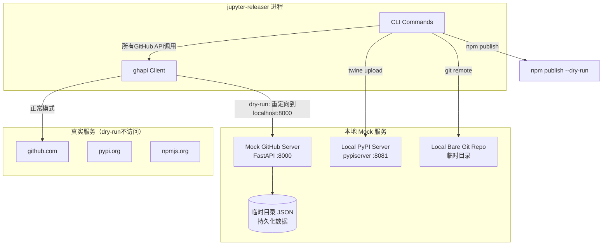

# Dry-Run 与 Mock 机制

Dry-run 模式（`RH_DRY_RUN=true` 或 `--dry-run`）让 jupyter_releaser 在不触碰任何真实服务的情况下，完整运行发布流程。这是通过启动本地 Mock 服务器和重定向所有外部 API 调用来实现的。

## 启用方式

```bash
# CLI 方式
jupyter-releaser --dry-run prep-git

# 环境变量方式
RH_DRY_RUN=true jupyter-releaser prep-git
```

在 GitHub Actions 中，`check-release` workflow 默认使用 dry-run 模式。

## Mock 服务架构



## Mock GitHub Server（mock_github.py）

### 技术栈

- **Web 框架**：FastAPI
- **ASGI 服务器**：uvicorn
- **数据持久化**：JSON 文件存储在临时目录
- **监听地址**：`http://127.0.0.1:8000`

### 启动机制

`ensure_mock_github()` 函数：
1. 检查是否已有 Mock 服务器在运行（端口检测）
2. 如没有，创建临时数据目录
3. 启动 uvicorn 子进程运行 `app`（FastAPI 实例）
4. 等待服务器就绪（health check 轮询）

### 实现的 GitHub API 端点

Mock 服务器不是简单的 stub，它实现了发布流程需要的核心 GitHub API：

| API 端点 | 方法 | 模拟功能 |
|---------|------|---------|
| `/repos/{owner}/{repo}/releases` | POST/GET | 创建/列出 release |
| `/repos/{owner}/{repo}/releases/{id}` | PATCH/DELETE | 更新/删除 release |
| `/repos/{owner}/{repo}/releases/{id}/assets` | GET/POST | 列出/上传 assets |
| `/repos/{owner}/{repo}/releases/tags/{tag}` | GET | 按 tag 获取 release |
| `/repos/{owner}/{repo}/releases/assets/{id}` | DELETE | 删除 asset |
| `/repos/{owner}/{repo}/pulls` | POST/GET | 创建/列出 PR |
| `/repos/{owner}/{repo}/issues/{n}/labels` | POST | 添加标签 |
| `/repos/{owner}/{repo}/git/tags` | POST | 创建 annotated tag |
| `/repos/{owner}/{repo}/git/refs` | POST/DELETE/PATCH | 创建/删除/更新 ref |
| `/repos/{owner}/{repo}/git/ref/{ref}` | GET | 获取 ref |
| `/repos/{owner}/{repo}/git/commits` | POST | 创建 commit |
| `/repos/{owner}/{repo}/git/trees` | POST | 创建 tree |
| `/repos/{owner}/{repo}/contents/{path}` | GET | 获取文件内容（返回固定SHA） |

### 数据持久化

所有数据存储在临时目录的 JSON 文件中：
- `releases.json`：release 对象列表
- `pulls.json`：PR 对象列表
- `assets.json`：asset 对象列表
- `tags.json`：tag 对象列表
- `refs.json`：git refs 字典
- `labels.json`：issue 标签

这使得跨进程状态共享成为可能——多个 CLI 命令调用可以访问同一个 Mock 服务器上的数据。

## Dry-run 下的其他重定向

### Git Remote 重定向

`get_remote_name(dry_run=True)` 返回本地 bare 仓库路径：
1. 创建临时目录
2. `git init --bare` 初始化空仓库
3. git remote 指向这个本地路径而非 github.com

### PyPI 上传重定向

`start_local_pypi()`：
1. 创建临时目录作为包存储
2. 生成 htpasswd 文件（用户名 `demo`，密码 `demo`）
3. 启动 `pypi-server run -p 8081 -P .htpasswd -a . .`
4. twine 命令的 `--repository-url` 替换为 `http://localhost:8081`

### npm 发布重定向

dry-run 模式下 npm publish 自动添加 `--dry-run` 标志，不实际发布。同时跳过 npm token 检查。

### GitHub API 连接重定向

`get_gh_object(dry_run=True)`：
- `gh_host='http://127.0.0.1:8000'`（而非 `https://api.github.com`）
- 使用任意字符串作为 token（Mock 服务器不验证认证）

## 本地端到端测试流程

利用 dry-run 模式，可以在本地完整测试发布流程：

```bash
# 1. 克隆你的项目
git clone https://github.com/your-username/your-project.git
cd your-project

# 2. 设置必要的环境变量
export RH_DRY_RUN=true
export GITHUB_ACCESS_TOKEN=fake-token  # Mock 不验证
export RH_REPOSITORY=your-username/your-project
export RH_BRANCH=main

# 3. 运行 prep 阶段
jupyter-releaser prep-git
jupyter-releaser bump-version --version-spec next
jupyter-releaser build-changelog
jupyter-releaser draft-changelog

# 4. 获取 release_url（从 draft-changelog 输出或 Mock 数据中查看）
export RH_RELEASE_URL=http://127.0.0.1:8000/your-username/your-project/releases/1

# 5. 运行 populate 阶段
jupyter-releaser prep-git
jupyter-releaser build-npm
jupyter-releaser build-python
jupyter-releaser tag-release
jupyter-releaser populate-release

# 6. 运行 finalize 阶段
jupyter-releaser extract-release
jupyter-releaser publish-assets
jupyter-releaser publish-release
```

## Check Release Workflow

在 CI 中，`check-release` workflow（参见示例工作流）自动在 PR 和 push 事件上运行 dry-run 检查：

1. Prep（dry-run）：验证版本提升、changelog 构建逻辑
2. Populate（dry-run）：验证包构建、tag 创建逻辑
3. Finalize（dry-run）：验证资产发布流程

这确保发布配置在每次 PR 时都被验证，不会等到真正发布时才发现问题。

## 调试技巧

### 查看 Mock 服务器数据

Mock 数据存储在临时目录中，可以查看 JSON 文件了解状态：

```python
import tempfile, json, os
tmpdir = os.environ.get("JUPYTER_RELEASER_MOCK_DIR", "")
# 查看 releases
with open(os.path.join(tmpdir, "releases.json")) as f:
    print(json.dumps(json.load(f), indent=2))
```

### 保留临时目录

设置环境变量 `JUPYTER_RELEASER_KEEP_MOCK=1` 可以阻止 Mock 服务器清理临时目录，便于事后排查。

### 单独启动 Mock 服务器

```python
from jupyter_releaser.util import ensure_mock_github, get_mock_github_url
ensure_mock_github()
print(f"Mock server running at {get_mock_github_url()}")
```

## 相关文档

- [Python与npm双生态发布](06-python-npm-dual.md)
- [GitHub Actions集成](09-github-actions.md)
- [示例：Dry-Run本地测试](/examples/03-dry-run-testing.md)
