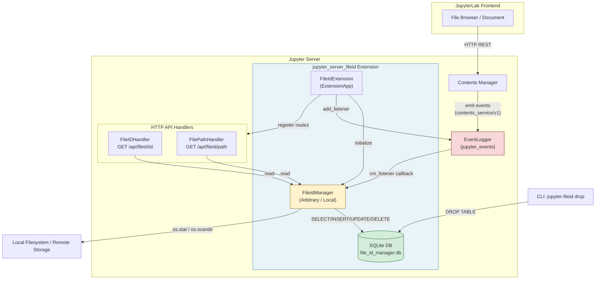

# jupyter_server_fileid Insights

## 洞察一：文件 ID 追踪的核心设计——路径可变身份不可变

### 问题本质

在文件系统中，文件路径是一个不稳定的标识符。当用户在 JupyterLab 中重命名 notebook、移动目录、复制文件时，文件的路径会发生变化，但文件本身的"身份"并未改变——正在编辑的文档、关联的 kernel、协作状态、评论批注等都应该跟随文件移动，而不是因为路径改变而丢失关联。

`jupyter_server_fileid` 的设计目标正是为每个文件分配一个**稳定不变的 UUID 标识符**（file ID），在路径↔ID 之间建立双向映射，并在文件生命周期事件中保持这个映射的一致性。

### 两种实现策略：信任事件 vs. 自我验证

包提供了两种 `BaseFileIdManager` 实现，体现了在不同文件系统场景下的权衡：

| 特性 | ArbitraryFileIdManager | LocalFileIdManager |
|------|----------------------|-------------------|
| 适用场景 | 任意文件系统（包括远程/S3） | 仅本地文件系统 |
| 移动检测方式 | 完全依赖 jupyter_server 事件 | inode + crtime 自我验证 |
| out-of-band 移动 | 无法检测（路径变化后丢失追踪） | 通过 stat 比对自动修正 |
| Files 表字段 | id, path（path UNIQUE） | id, path, ino, crtime, mtime, is_dir（ino UNIQUE） |
| 默认 journal mode | DELETE | WAL |
| save() 操作 | 空操作 | 更新 mtime 等 stat 信息 |
| 初始化行为 | 仅建表，不索引 | 递归索引 root_dir 下所有目录 |

**ArbitraryFileIdManager** 是一个"被动"实现：它完全信任 jupyter_server Contents Manager 发出的事件。当收到 `rename`/`copy`/`delete` 事件时更新数据库；如果文件在 Jupyter 之外被移动（out-of-band），映射就会失效。这种设计简洁高效，适合无法获取文件系统元数据的远程存储场景。

**LocalFileIdManager** 是一个"主动"实现：它利用本地文件系统的 inode（文件系统级唯一标识）和 crtime（创建时间）作为文件身份的"指纹"。当通过 `get_id()` 或 `get_path()` 查询时，它会先进行 stat 系统调用比对 inode+crtime，如果发现路径与记录不匹配（说明文件在 Jupyter 外被移动了），就自动更新数据库中的路径记录——这就是 out-of-band 移动检测。其核心同步算法 `_sync_all()` 采用"脏目录"策略：遍历所有已索引目录，比较 mtime 是否变化，只对变化目录下的文件做 inode 匹配同步，避免全量扫描的性能开销。

`get_path()` 方法采用了一个精巧的**乐观两阶段策略**：第一阶段直接查询并比对 stat，如果 inode+crtime 完全匹配（最佳情况，文件未移动），立即返回；只有在 stat 不匹配时，才触发代价较高的 `_sync_all()` 全量目录同步后重试一次。这保证了正常情况下的查询性能。

### 路径↔ID 双向映射的意义

为什么需要双向映射而不是单向的 path→ID？因为 Jupyter 前端和后端不同场景需要两个方向的查找：

- **path → ID**（`get_id`）：当用户在文件浏览器中点击文件时，前端知道路径，需要获取 ID 来查找协作状态、kernel 映射等。
- **ID → path**（`get_path`）：当 kernel 报告某个文件执行完成、或协作同步需要定位文件时，系统只有 ID，需要反查当前路径。

HTTP API 也因此分为两个端点：`GET /api/fileid/id?path=...` 和 `GET /api/fileid/path?id=...`。

## 洞察二：事件监听机制——jupyter_events 驱动的被动同步

### 架构总览

### 事件驱动的核心链路

`FileIdExtension.initialize_settings()` 在扩展加载时完成两件事：

1. **实例化 Manager**：根据配置创建 `ArbitraryFileIdManager`（默认）或 `LocalFileIdManager`，传入 `root_dir`（来自 ServerApp）和配置对象，并将实例存入 Tornado `settings` 字典，Handler 通过 `self.settings["file_id_manager"]` 访问。

2. **注册事件监听器**：如果 settings 中存在 `event_logger`（即 jupyter_server 2.x 的事件系统可用），则调用 `initialize_event_listeners()` 注册监听。监听器监听 schema ID 为 `https://events.jupyter.org/jupyter_server/contents_service/v1` 的事件——这是 jupyter_server Contents Manager 在执行文件操作时发出的标准事件。

事件分发的关键逻辑在 `cm_listener` 回调中：
- 从事件 data 中取出 `action` 字段（值为 `"get"`/`"save"`/`"rename"`/`"copy"`/`"delete"`）
- 查询 Manager 的 `get_handlers_by_action()` 返回的映射字典
- 如果对应 action 的值为 callable，则调用它并传入事件 data；如果为 None 则忽略该事件

这种设计使得每个 Manager 实现可以自主决定响应哪些事件以及如何响应：
- `ArbitraryFileIdManager` 忽略 `get` 和 `save`（因为它不跟踪文件内容变化，纯路径映射无需 stat 更新），仅处理 `rename`/`copy`/`delete`
- `LocalFileIdManager` 额外处理 `save`（更新 mtime 等 stat 信息）

### 事件 schema 字段约定

从 handler lambda 的参数可以看出，Contents Manager 事件 data 中包含以下关键字段：
- `"action"`: 操作类型
- `"path"`: 当前/目标路径（rename 的新路径、copy 的目标路径、delete 的路径）
- `"source_path"`: 源路径（仅 rename/copy 时存在）

### in-band 与 out-of-band 的双重追踪

LocalFileIdManager 的精妙之处在于它同时维护了两条追踪路径：

1. **In-band（带内）**：通过事件监听器，当用户通过 Jupyter UI 操作文件时立即更新数据库，保证实时一致性。
2. **Out-of-band（带外）**：通过 `_sync_all()` 机制，当用户在 Jupyter 外部（如终端命令 `mv`/`cp`/`rm`）操作文件时，在下次查询时通过 inode 比对自动检测并修正路径映射。

`get_path()` 的乐观重试策略是这两条路径交汇的典型场景：乐观路径命中说明 in-band 追踪足够（文件未移动）；乐观失败时触发 `_sync_all()` 做 out-of-band 修正。`move()` 方法也调用 `_sync_file()` 处理 edge case（issue #62 中记录的：out-of-band 移动后再 in-band 移动的边界情况）。
