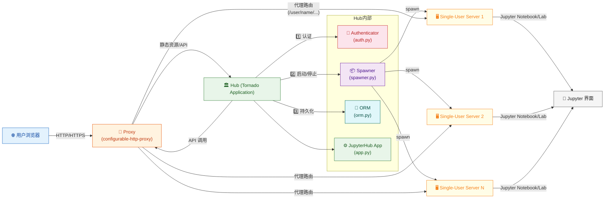
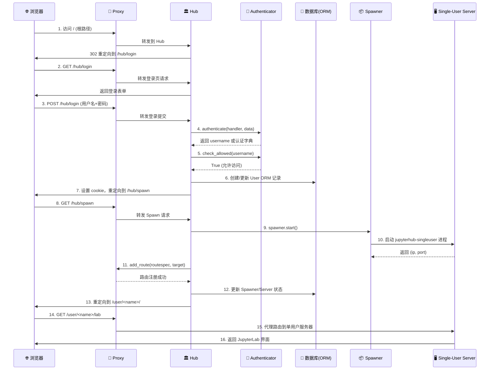

# JupyterHub 架构概览

JupyterHub 是一个多用户 Jupyter Notebook/Lab 服务器管理平台，它为一组用户（班级、研究团队、工作组等）提供 Jupyter 环境的托管服务。Hub 负责用户认证、服务器生命周期管理和请求路由，使每个用户获得独立的 Jupyter 实例而无需手动部署。

一句话概括：**JupyterHub 通过"代理-认证-生成"三层架构，将浏览器请求路由到独立的单用户 Jupyter 服务器，实现多用户共享计算资源的隔离访问**。

## 定位与核心能力

- **多用户管理**：支持成百上千用户同时使用 Jupyter，每个用户拥有独立的服务器进程和工作空间
- **可插拔认证**：通过 Authenticator 插件体系支持 PAM、OAuth、LDAP 等多种认证方式
- **可插拔生成器**：通过 Spawner 插件体系支持本地进程、Docker、Kubernetes 等多种服务器启动方式
- **动态代理路由**：通过 ConfigurableHTTPProxy 动态管理路由表，将用户请求转发到正确的后端服务器
- **持久化状态**：基于 SQLAlchemy ORM 的数据库层持久化用户、服务器、Token、角色等状态

## 核心组件架构



### 数据流方向

1. **入站请求**：浏览器所有请求首先到达 Proxy（默认端口 8000）
2. **Hub 路由**：Proxy 将 `/hub/` 前缀的请求（登录、API、管理界面）转发到 Hub 进程（默认端口 8081）
3. **用户服务器路由**：Proxy 将 `/user/<username>/` 前缀的请求转发到对应用户的单用户服务器
4. **动态路由更新**：Hub 通过 Proxy 的 REST API 动态添加/删除路由，当用户服务器启动或停止时更新路由表

## 五大核心模块

### 1. Hub Application（app.py）

`JupyterHub` 类继承自 `traitlets.config.Application`，是整个系统的主应用入口和编排中心。

**核心职责**：
- 生命周期管理：初始化（`initialize`）→ 启动（`start`）→ 停止（`stop`）
- 组件编排：按顺序初始化数据库、Hub 服务器、Proxy、Spawners、Services、OAuth、角色、路由处理器
- Tornado 路由注册：通过 `init_handlers()` 注册所有 HTTP 请求处理器
- 配置管理：加载 `jupyterhub_config.py`，通过 traitlets 系统统一管理所有组件配置

**关键配置项**：

| 配置项 | 默认值 | 说明 |
|--------|--------|------|
| `bind_url` | `'http://:8000'` | 公共访问地址（Proxy 监听地址） |
| `db_url` | `'sqlite:///jupyterhub.sqlite'` | 数据库连接 URL |
| `authenticator` | `PAMAuthenticator` | 认证器实例 |
| `spawner_class` | `LocalProcessSpawner` | Spawner 类 |
| `proxy_class` | `ConfigurableHTTPProxy` | Proxy 类 |
| `admin_users` | `set()` | 管理员用户集合 |
| `base_url` | `'/'` | Hub 基础 URL 前缀 |

**入口点**：CLI 命令 `jupyterhub` → `jupyterhub.app:main`；单用户命令 `jupyterhub-singleuser` → `jupyterhub.singleuser:main`。

### 2. Authenticator（auth.py）

`Authenticator` 基类继承自 `traitlets.config.LoggingConfigurable`，是认证体系的抽象基类。

**核心职责**：
- 用户身份验证：`authenticate()` 方法验证用户名/密码或第三方认证回调
- 访问控制：`check_allowed()` 检查用户是否在白名单中，`check_blocked_users()` 检查黑名单
- 管理员判定：`is_admin()` 判断用户是否拥有管理员权限
- 认证状态持久化：`enable_auth_state` 启用后加密存储认证信息（如 OAuth token）
- 生命周期钩子：`pre_spawn_start()` / `post_spawn_stop()` 在服务器启停时执行自定义逻辑

**内置认证器**：
- `PAMAuthenticator`：默认认证器，使用操作系统 PAM 进行本地用户认证
- `DummyAuthenticator`：测试用，接受任意用户名密码，不做验证
- `NullAuthenticator`：禁止所有登录，用于完全禁用认证的场景
- `SharedPasswordAuthenticator`：共享密码认证，适用于临时部署

认证器通过 entry points 组 `jupyterhub.authenticators` 注册插件，第三方可通过 `pip install` 扩展。

### 3. Spawner（spawner.py）

`Spawner` 基类继承自 `traitlets.config.LoggingConfigurable`，是单用户服务器生命周期管理的抽象基类。

**核心职责**：
- 服务器启动：`start()` 异步方法启动单用户服务器，返回 `(ip, port)`
- 服务器停止：`stop()` 异步方法终止服务器进程
- 状态轮询：`poll()` 检查进程是否存活，返回退出码或 `None`（运行中）
- 状态持久化：`get_state()` / `load_state()` 序列化/反序列化 Spawner 状态到数据库
- 环境配置：`get_env()` / `get_args()` 构建启动环境变量和命令行参数

**生命周期状态机**：

```
  (stopped)
      │ start()
      ▼
  (starting) ──start_timeout(60s)──→ (failed)
      │
      ▼
  (running) ──poll()──→ (stopped)
      │ stop()
      ▼
  (stopping) → (stopped)
```

**内置 Spawner**：
- `LocalProcessSpawner`：默认实现，以本地子进程方式启动单用户服务器，支持 setuid/setgid 用户切换
- `SimpleLocalProcessSpawner`：简化版，不做用户切换，以 Hub 进程用户身份运行，适用于测试

v6.0 新增 `SpawnException` 异常类，支持策略性阻止 spawn（如容量限制），可携带 `reason`、`message_html`、`status_code` 等结构化信息。

### 4. Proxy（proxy.py）

`Proxy` 基类继承自 `traitlets.config.LoggingConfigurable`，是代理层的抽象基类。默认实现为 `ConfigurableHTTPProxy`，管理 nodejs 的 `configurable-http-proxy` (CHP) 子进程。

**核心职责**：
- 路由管理：`add_route()` / `delete_route()` / `get_all_routes()` 维护路由表
- 路由规范（routespec）：URL 前缀格式 `[host]/path/`，路径必须以 `/` 开头和结尾
- 路由类型：Hub 路由（`{'hub': True}`）、用户路由（`{'user': name, 'server_name': name}`）、服务路由（`{'service': name}`）、额外路由（`{'extra': True}`）
- 路由一致性检查：`check_routes()` 方法通过 `@_one_at_a_time` 装饰器保证并发安全，定期检查代理路由与数据库状态一致性，自动补建/更新/删除路由
- 路由恢复：`restore_routes()` 在代理重启后恢复全部路由（Hub 路由 → 用户路由 → 服务路由）

**ConfigurableHTTPProxy 关键配置**：

| 配置项 | 默认值 | 说明 |
|--------|--------|------|
| `api_url` | `'http://127.0.0.1:8001'` | CHP 管理 API 地址 |
| `auth_token` | 自动生成 | CHP API 认证 Token |
| `should_start` | `True` | Hub 是否管理 CHP 进程生命周期 |
| `concurrency` | `10` | 代理 API 请求并发上限 |
| `check_running_interval` | `5` | 代理存活检查间隔（秒） |

### 5. ORM（orm.py）

ORM 层基于 SQLAlchemy，定义了 JupyterHub 进程星座（constellation of processes）的持久化状态模型，使用 Alembic 进行数据库迁移管理。

**核心数据模型**：

| 模型 | 表名 | 说明 |
|------|------|------|
| `Server` | `servers` | 服务器连接信息（proto/ip/port/base_url/cookie_name） |
| `Role` | `roles` | RBAC 角色定义，包含 scopes 权限列表 |
| `Group` | `groups` | 用户组，支持组级角色分配 |
| `User` | `users` | 核心用户表，包含认证信息、Cookie、API Token、Spawner 关系 |
| `Spawner` | `spawners` | Spawner 持久化状态，支持每个用户多个命名服务器 |
| `Service` | `services` | 托管服务，类似无 Spawner 的 User，可拥有 API Token |

**自定义列类型**：
- `JSONDict`：将 Python 字典序列化为 JSON 存储，支持 bytes 透明编解码
- `JSONList`：继承自 JSONDict，专用于列表类型，set 自动排序序列化

**多对多关联表**：`user_role_map`、`group_role_map`、`service_role_map`（角色关联），`user_group_map`（用户组成员）。

## 请求流程

用户从访问 JupyterHub 到获得 Jupyter 界面的完整请求流程如下：



### 关键步骤说明

1. **访问入口**：用户访问根路径，未认证时重定向到登录页
2. **认证阶段**：Hub 将登录凭据交给 Authenticator 验证，验证通过后检查白名单/黑名单
3. **用户持久化**：认证成功后在数据库中创建或更新 User 记录，设置加密 Cookie
4. **Spawn 阶段**：Hub 调用 Spawner.start() 启动单用户服务器进程，等待服务器就绪
5. **路由注册**：服务器启动后，Hub 通过 Proxy API 添加路由规则，将 `/user/<name>/` 前缀映射到新启动的服务器
6. **代理访问**：后续用户请求由 Proxy 直接转发到单用户服务器，Hub 不再介入数据面流量

## 关键设计模式

### Configurable Traitlets 配置体系

JupyterHub 全面采用 traitlets 框架作为配置系统：

- 所有可配置项均定义为 `traitlets.TraitType` 子类实例（`Unicode`、`Integer`、`Bool`、`Set`、`List`、`Dict` 等）
- 配置文件 `jupyterhub_config.py` 通过 `c.ClassName.trait_name = value` 语法设置
- 支持 `@default`、`@observe`、`@validate` 装饰器实现默认值、变更监听和验证逻辑
- `LoggingConfigurable` 作为所有核心组件的共同基类，提供日志和配置能力

```python
# 配置示例
c.JupyterHub.admin_users = {'admin'}
c.JupyterHub.spawner_class = 'dockerspawner.DockerSpawner'
c.Authenticator.allow_all = True
c.Spawner.start_timeout = 120
```

### 插件化 Authenticator / Spawner / Proxy

三大核心组件均采用**基类抽象 + Entry Points 插件注册**的设计模式：

- **抽象基类**定义接口契约（核心方法为抽象方法，子类必须实现）
- **Entry Points 注册**：通过 `jupyterhub.authenticators`、`jupyterhub.spawners`、`jupyterhub.proxies` 入口点组注册插件
- **配置切换**：用户在配置文件中指定 `c.JupyterHub.authenticator_class` / `spawner_class` / `proxy_class` 即可替换实现
- 社区生态丰富：DockerSpawner、KubeSpawner、OAuthenticator、LDAPAuthenticator 等第三方插件按需安装

### 异步 Tornado 框架

JupyterHub 基于 Tornado 异步 Web 框架构建：

- 所有 I/O 操作（HTTP 请求、进程管理、数据库访问）均使用 `async/await` 异步模式
- Tornado 的 `RequestHandler` 体系处理 HTTP 路由
- `PeriodicCallback` 用于定时任务（如代理存活检查、路由一致性检查）
- aiohttp 用于 Hub 与 Proxy 之间的 REST API 通信
- 单事件循环架构，高并发下无需多线程/多进程即可处理大量用户请求

### Entry Points 扩展机制

JupyterHub 使用 Python entry points 实现零配置插件发现：

| Entry Point Group | 默认注册 | 说明 |
|-------------------|----------|------|
| `jupyterhub.authenticators` | `default`/`pam` → PAMAuthenticator, `dummy` → DummyAuthenticator, `null` → NullAuthenticator, `shared-password` → SharedPasswordAuthenticator | 认证器插件 |
| `jupyterhub.spawners` | `default`/`localprocess` → LocalProcessSpawner, `simple` → SimpleLocalProcessSpawner | Spawner 插件 |
| `jupyterhub.proxies` | `default`/`configurable-http-proxy` → ConfigurableHTTPProxy | 代理插件 |

第三方包只需在 `pyproject.toml` 或 `setup.py` 中声明对应 entry points，安装后即可通过配置使用。

## 源码溯源

本文档的事实依据来源于以下源码参考文档：

- [JupyterHub Application 源码参考](../references/app-source.md)：`JupyterHub` 主应用类的配置项、生命周期方法和 Tornado 路由注册
- [JupyterHub 认证器体系源码参考](../references/auth-source.md)：`Authenticator` 基类及内置认证器的 API 参考
- [JupyterHub Spawner 源码参考](../references/spawner-source.md)：`Spawner` 基类及 `LocalProcessSpawner` 的服务器生命周期管理
- [JupyterHub Proxy 源码参考](../references/proxy-source.md)：`Proxy` 基类与 `ConfigurableHTTPProxy` 的路由管理
- [JupyterHub ORM 源码参考](../references/orm-source.md)：SQLAlchemy ORM 层的数据模型与关系映射
