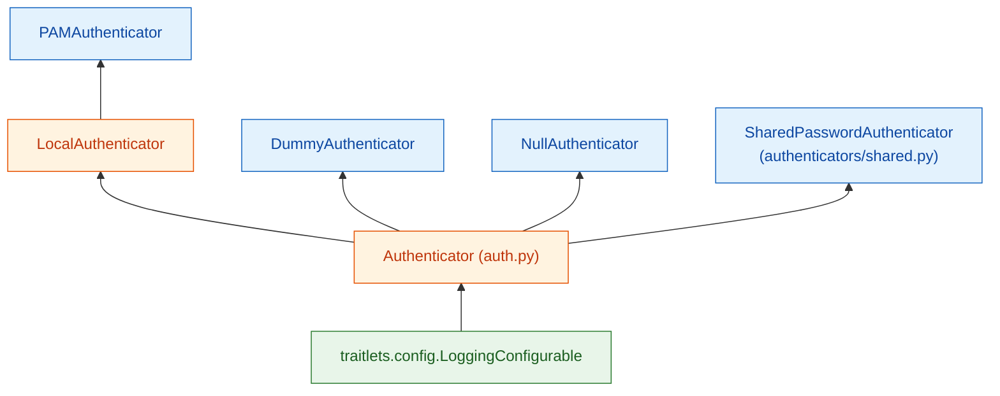
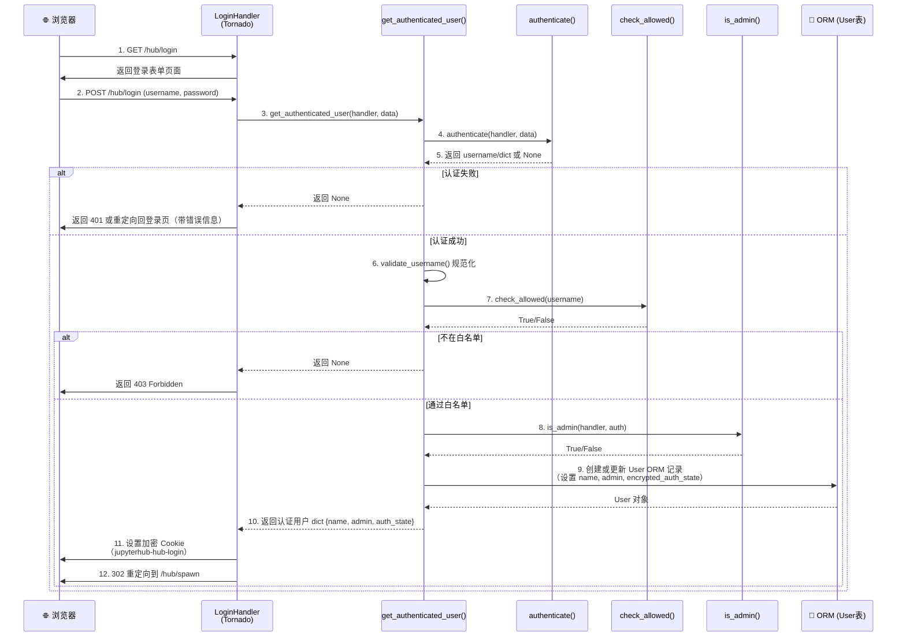
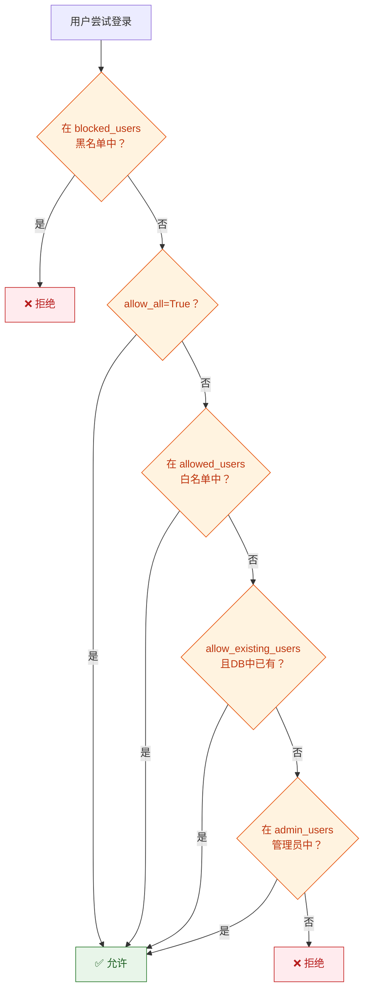

# Authenticator 认证系统

Authenticator 是 JupyterHub 的身份认证子系统，负责验证用户身份、控制访问权限、管理认证状态持久化，并在服务器生命周期中提供钩子机制。所有认证逻辑通过可插拔的 Authenticator 类层次实现，从本地 PAM 认证到第三方 OAuth 均可通过继承基类扩展。

一句话概括：**Authenticator 通过基类定义认证契约（authenticate → check_allowed → is_admin），以 traitlets 配置驱动白名单/管理员/认证状态策略，并通过 entry points 插件机制支持任意认证后端**。

## 类继承体系



### 继承链说明

| 类 | 继承自 | 定位 | 源码位置 |
|----|--------|------|----------|
| `LoggingConfigurable` | `traitlets.config.Configurable` | traitlets 框架提供的配置+日志基类 | traitlets 包 |
| `Authenticator` | `LoggingConfigurable` | 认证器抽象基类，定义核心接口和通用配置 | `jupyterhub/auth.py` |
| `LocalAuthenticator` | `Authenticator` | 本地用户认证中间层，添加系统用户组检查 | `jupyterhub/auth.py` |
| `PAMAuthenticator` | `LocalAuthenticator` | 默认认证器，通过操作系统 PAM 认证 | `jupyterhub/auth.py` |
| `DummyAuthenticator` | `Authenticator` | 测试用认证器，接受任意凭据 | `jupyterhub/auth.py` |
| `NullAuthenticator` | `Authenticator` | 禁止所有登录的空认证器 | `jupyterhub/auth.py` |
| `SharedPasswordAuthenticator` | `Authenticator` | 共享密码认证器（所有用户同一密码） | `jupyterhub/authenticators/shared.py` |

基类 `Authenticator` 是所有认证器的共同祖先，定义了认证流程的模板方法和配置项。`LocalAuthenticator` 为需要检查本地系统用户组的认证器提供通用逻辑。

## 核心方法

Authenticator 基类定义了以下核心方法，构成认证流程的完整生命周期：

### authenticate() — 身份验证

```python
async def authenticate(self, handler, data) -> Union[str, dict, None]
```

**这是子类必须实现的抽象方法**，负责实际的凭据验证。

- **参数**：`handler` 是当前 Tornado RequestHandler（可用于重定向等操作），`data` 是登录表单提交的字典（通常包含 `username` 和 `password`）
- **返回值**：
  - 返回 `str`（用户名）：认证成功，使用该用户名
  - 返回 `dict`：认证成功，字典中可包含 `name`（用户名）、`auth_state`（需持久化的认证状态）等字段
  - 返回 `None`：认证失败
- OAuth 等第三方认证场景中，此方法可能处理回调请求而非直接验证密码

### get_authenticated_user() — 核心认证流程

```python
async def get_authenticated_user(self, handler, data) -> Union[dict, None]
```

这是 Hub 调用的**主要入口方法**，编排了完整的认证流程：

1. 调用 `authenticate(handler, data)` 获取认证结果
2. 若返回 `None`，认证失败，返回 `None`
3. 从结果中提取用户名（字符串或 `dict['name']`）
4. 调用 `validate_username(username)` 规范化用户名
5. 调用 `check_blocked_users(username)` 检查黑名单
6. 调用 `check_allowed(username, authentication)` 检查白名单
7. 调用 `is_admin(handler, authentication)` 判断管理员权限
8. 返回包含 `name`、`admin`、`auth_state` 等字段的字典，或 `None`（失败）

自定义认证器通常**不需要重写此方法**，只需实现 `authenticate()` 即可。

### refresh_user() — 认证信息刷新

```python
async def refresh_user(self, user, handler=None) -> Union[bool, dict]
```

刷新已认证用户的认证信息，用于：

- `auth_refresh_age`（默认 300 秒）到期后自动刷新
- `refresh_pre_spawn = True` 时，每次 Spawn 前强制刷新
- `refresh_pre_stop = True` 时，Stop 前强制刷新
- 返回 `True`：刷新成功但无更新
- 返回 `dict`：刷新成功，需要更新用户信息和 auth_state
- 返回 `False`：刷新失败，用户应被注销

### check_allowed() — 白名单检查

```python
def check_allowed(self, username, authentication=None) -> bool
```

检查用户是否被允许登录，决策逻辑优先级：

1. `blocked_users` 集合中的用户 → 拒绝
2. `allow_all = True` → 允许所有人
3. `allowed_users` 集合中包含该用户 → 允许
4. `allow_existing_users = True` 且数据库中已有该用户 → 允许
5. `admin_users` 集合中包含该用户 → 允许
6. 其他情况 → 拒绝

### is_admin() — 管理员判定

```python
def is_admin(self, handler, authentication) -> bool
```

判断用户是否为管理员。默认实现检查 `admin_users` 集合是否包含用户名。`LocalAuthenticator` 重写此方法增加 PAM 组成员检查。v1.0+ 版本推荐使用 RBAC roles 系统替代简单的 admin 标志。

### 生命周期钩子

| 钩子 | 签名 | 调用时机 |
|------|------|----------|
| `add_user(user)` | `(user)` | 用户首次添加到 Hub 时 |
| `delete_user(user)` | `(user)` | 用户从 Hub 删除时 |
| `pre_spawn_start(user, spawner)` | `async (user, spawner)` | Spawner 启动前，可用于设置环境变量、挂载目录等 |
| `post_spawn_stop(user, spawner)` | `async (user, spawner)` | Spawner 停止后，可用于清理资源 |
| `manage_groups(user)` | `async (user) → dict` | 管理用户组成员关系，返回组名列表 |

## 内置认证器

### PAMAuthenticator（默认）

PAMAuthenticator 是 JupyterHub 的默认认证器，使用操作系统的 Pluggable Authentication Modules (PAM) 进行认证。

**特性**：
- 继承链：`Authenticator → LocalAuthenticator → PAMAuthenticator`
- 使用系统用户数据库（`/etc/passwd`）验证用户名和密码
- 支持 `pam_service` 配置项指定 PAM 服务名称（默认 `'login'`）
- 通过 PAM 组成员判断管理员：将用户添加到 `admin_users` 集合或配置 `admin_groups`
- 适用于单机部署、系统用户与 JupyterHub 用户一一对应的场景
- 服务器进程通过 setuid/setgid 切换到对应系统用户运行

**配置示例**：

```python
c.JupyterHub.authenticator_class = 'pam'
c.Authenticator.admin_users = {'root', 'jupyteradmin'}
```

### DummyAuthenticator（测试用）

DummyAuthenticator 是一个不做任何验证的测试认证器，**仅用于开发和测试环境，严禁用于生产**。

**特性**：
- 直接继承自 `Authenticator`
- `authenticate()` 方法接受任意用户名和密码，直接返回用户名
- 不验证密码正确性
- 适用于快速搭建测试环境、CI 测试、功能演示等场景

**配置示例**：

```python
c.JupyterHub.authenticator_class = 'dummy'
c.Authenticator.allow_all = True  # 允许所有人（测试用）
```

### NullAuthenticator（禁止登录）

NullAuthenticator 完全禁止所有用户登录。

**特性**：
- `auto_login = True`，访问 Hub 时自动触发认证流程
- `authenticate()` 始终返回 `None`，无人能通过认证
- 适用于需要完全禁用 Web 登录、仅通过 API Token 访问的场景

### SharedPasswordAuthenticator（共享密码）

SharedPasswordAuthenticator 位于 `jupyterhub/authenticators/shared.py`，所有用户使用同一个共享密码。

**特性**：
- 所有用户使用同一密码登录，用户名仍需在白名单中
- 适用于简单的临时部署、培训班、短期工作坊
- `password` 配置项设置共享密码

**配置示例**：

```python
c.JupyterHub.authenticator_class = 'shared-password'
c.SharedPasswordAuthenticator.password = 'jupyter123'
c.Authenticator.allowed_users = {'student1', 'student2', 'student3'}
```

## 认证流程详解

用户从访问登录页到完成认证建立会话的完整流程：



### 流程要点

1. **LoginHandler 接收请求**：Tornado 的 LoginHandler（注册在 `/hub/login`）处理登录表单的 GET 和 POST 请求
2. **authenticate() 执行实际验证**：子类实现的 `authenticate()` 方法验证凭据，返回用户名或包含 auth_state 的字典
3. **用户名规范化**：`validate_username()` 按 `username_pattern`（默认 `r'^[a-z][a-z0-9._-]{2,}$'`）校验并转换用户名
4. **白名单/黑名单检查**：`check_allowed()` 和 `check_blocked_users()` 按优先级规则进行访问控制
5. **管理员判定**：`is_admin()` 确定用户权限级别
6. **ORM 持久化**：在数据库中创建 User 记录（若不存在），更新 admin 标志和 auth_state
7. **Cookie 设置**：设置加密的会话 Cookie，后续请求通过 Cookie 识别用户
8. **重定向到 Spawn**：认证成功后重定向到 `/hub/spawn` 触发服务器启动流程

## 关键配置项

### 访问控制配置

| Traitlet | 类型 | 默认值 | 说明 |
|----------|------|--------|------|
| `admin_users` | `Set` | `set()` | 管理员用户名集合 |
| `allowed_users` | `Set` | `set()` | 允许登录的用户名白名单 |
| `blocked_users` | `Set` | `set()` | 禁止登录的用户名黑名单（优先级最高） |
| `allow_all` | `Bool` | `False` | 允许所有用户登录（白名单失效） |
| `allow_existing_users` | `Bool` | `False` | 允许数据库中已有用户登录 |
| `delete_invalid_users` | `Bool` | `False` | 自动删除不在白名单中的已存在用户 |

### 认证行为配置

| Traitlet | 类型 | 默认值 | 说明 |
|----------|------|--------|------|
| `auto_login` | `Bool` | `False` | 自动跳转登录，不显示登录页（用于 OAuth 等） |
| `username_pattern` | `Unicode` | `r'^[a-z][a-z0-9._-]{2,}$'` | 用户名正则校验模式 |
| `minimum_password_length` | `Integer` | `1` | 最小密码长度 |

### 认证状态刷新配置

| Traitlet | 类型 | 默认值 | 说明 |
|----------|------|--------|------|
| `enable_auth_state` | `Bool` | `False` | 启用加密持久化 auth_state |
| `auth_refresh_age` | `Integer` | `300` | 认证信息刷新间隔（秒） |
| `refresh_pre_spawn` | `Bool` | `False` | 每次 Spawn 服务器前强制刷新认证 |
| `refresh_pre_stop` | `Bool` | `False` | 停止服务器前强制刷新认证 |

## 白名单与管理员机制

### 访问控制决策流程

`check_allowed()` 方法按以下优先级顺序判定用户是否可以登录：



- **黑名单最高优先**：`blocked_users` 中的用户无论其他配置如何都被拒绝
- **管理员自动通过**：`admin_users` 中的用户即使不在 `allowed_users` 中也可以登录
- **开放模式**：设置 `allow_all = True` 允许所有人登录（配合认证器自身验证使用）
- **存量用户模式**：`allow_existing_users = True` 允许数据库中已有记录的用户登录（适合迁移场景）

### 管理员机制

- `admin_users` 集合中指定的用户自动获得管理员权限
- `LocalAuthenticator` 子类额外支持通过系统用户组判定管理员（如 `wheel` 组、`sudo` 组）
- v2.0+ 版本引入 RBAC（基于角色的访问控制），推荐使用 roles/scopes 替代简单的 admin 布尔标志
- 管理员可以访问 `/hub/admin` 管理面板，查看/启动/停止用户服务器、管理用户等

## 认证状态（auth_state）持久化

auth_state 是 Authenticator 在认证过程中获取的需要跨请求持久化的敏感信息（如 OAuth access token、刷新令牌等）。

### 工作机制

1. **启用**：设置 `c.Authenticator.enable_auth_state = True`（默认关闭，因需要加密密钥）
2. **加密存储**：auth_state 在 `authenticate()` 返回的字典中通过 `auth_state` 键传递，Hub 使用 `cookie_secret` 对其加密后存储在 User ORM 记录的 `encrypted_auth_state` 字段（`LargeBinary` 类型）
3. **传递给 Spawner**：auth_state 在 Spawn 前通过 `pre_spawn_start()` 钩子传递给 Spawner，可用于设置单用户服务器的环境变量（如 API token）
4. **刷新**：`refresh_user()` 方法可更新 auth_state；`auth_refresh_age` 控制自动刷新间隔
5. **安全考虑**：auth_state 使用对称加密存储，加密密钥为 `cookie_secret`，生产环境应妥善保管

```python
# authenticate() 返回 dict 中包含 auth_state 的示例（OAuthenticator 场景）
async def authenticate(self, handler, data):
    token = await self.exchange_code_for_token(handler)
    user_info = await self.get_user_info(token)
    return {
        'name': user_info['login'],
        'auth_state': {
            'access_token': token['access_token'],
            'refresh_token': token.get('refresh_token'),
            'expires_at': token['expires_at'],
        }
    }
```

## 自定义 Authenticator 扩展点

编写自定义认证器只需继承 `Authenticator` 基类并实现必要方法：

### 最小实现

自定义认证器必须实现 `authenticate()` 方法：

```python
from jupyterhub.auth import Authenticator
from tornado import gen

class MyCustomAuthenticator(Authenticator):
    async def authenticate(self, handler, data):
        username = data.get('username', '')
        password = data.get('password', '')

        # 自定义验证逻辑
        if await self._verify_credentials(username, password):
            return username  # 认证成功
        return None  # 认证失败

    async def _verify_credentials(self, username, password):
        # 实现实际的验证逻辑（LDAP、数据库查询、外部 API 调用等）
        return True
```

### 常用扩展点

| 扩展场景 | 需要重写的方法 | 说明 |
|----------|---------------|------|
| 自定义凭据验证 | `authenticate()` | 验证用户名/密码或第三方回调 |
| 自定义访问控制 | `check_allowed()` | 基于外部系统的用户授权逻辑 |
| 自定义管理员判定 | `is_admin()` | 基于组成员、属性等的动态管理员判定 |
| OAuth/SSO 集成 | `authenticate()` + `auto_login=True` | 处理 OAuth 回调，重定向到授权 URL |
| 用户名规范化 | `validate_username()` | 自定义用户名转换规则（如邮箱前缀提取） |
| Spawn 前准备 | `pre_spawn_start()` | 挂载卷、设置环境变量、注入令牌 |
| Spawn 后清理 | `post_spawn_stop()` | 清理临时资源、撤销令牌 |
| 组成员管理 | `manage_groups()` | 动态同步用户组信息 |
| 用户生命周期 | `add_user()` / `delete_user()` | 用户添加/删除时的自定义逻辑 |
| 认证信息刷新 | `refresh_user()` | 定期刷新过期 token 或用户信息 |

### 注册自定义认证器

通过 Python entry points 注册后可在配置中使用短名称：

```toml
# pyproject.toml
[project.entry-points."jupyterhub.authenticators"]
myauth = "my_package.auth:MyCustomAuthenticator"
```

```python
# jupyterhub_config.py
c.JupyterHub.authenticator_class = 'myauth'
```

或直接指定完整类路径：

```python
c.JupyterHub.authenticator_class = 'my_package.auth.MyCustomAuthenticator'
```

### 自定义登录页面

Authenticator 可通过以下方式定制登录体验：

- `auto_login = True`：跳过登录页，直接跳转到认证 URL（OAuth 场景常用）
- 自定义 HTML 模板：覆盖 `login.html` 模板
- `login_service` 属性：显示在登录按钮上的服务名称（如 "Sign in with GitHub"）
- `options_form` 属性：Spawner 级别的选项表单（属于 Spawner 而非 Authenticator）

## 源码溯源

本文档的事实依据来源于以下源码参考文档：

- [JupyterHub 认证器体系源码参考](../references/auth-source.md)：Authenticator 基类及内置认证器（PAM/Dummy/Null/SharedPassword）的完整 API 参考，包含所有配置 traitlets、核心方法签名和继承关系
