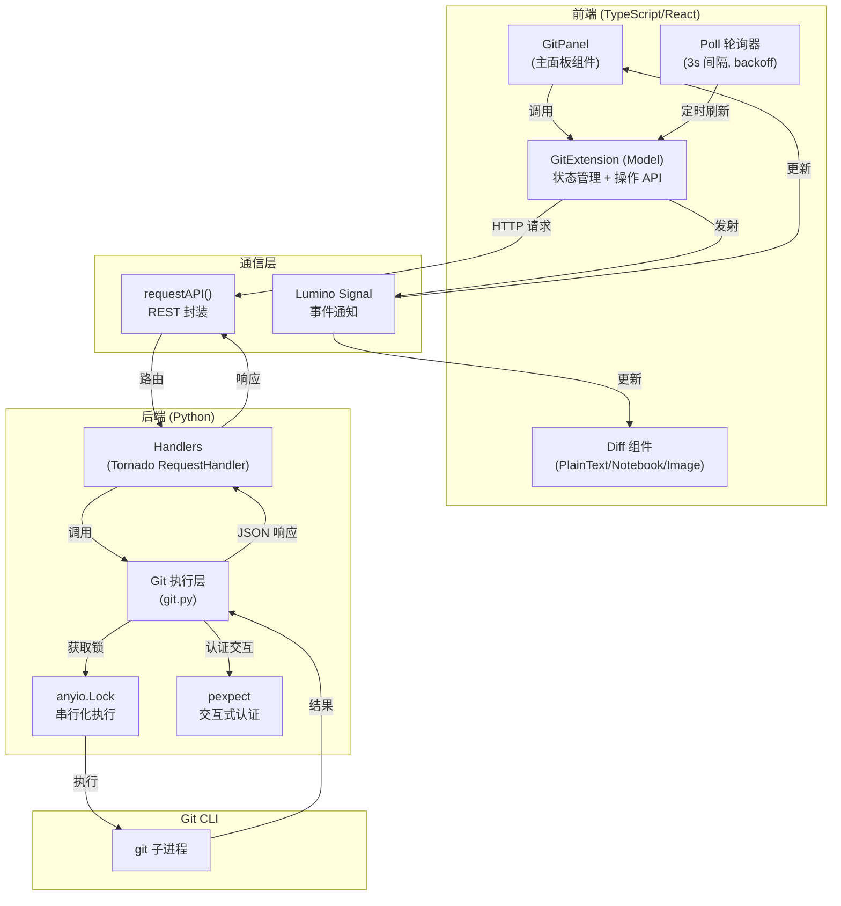

# jupyterlab-git 架构洞察

## 洞察一：前后端分离的 Git 操作模型与 REST API 桥接

jupyterlab-git 采用典型的 JupyterLab 扩展架构——TypeScript 前端通过 REST API 与 Python 后端通信，后端封装真实的 Git CLI 调用。

**关键设计决策：**

1. **进程级锁保证操作安全**：Python 后端使用 `anyio.Lock()` 串行化所有 Git 命令执行，避免并发 Git 操作导致 `.git/index.lock` 冲突。同时实现了 NFS 等网络文件系统的锁等待机制（最多 5 秒）。
2. **轮询而非推送**：前端使用 Lumino Poll 以 3 秒间隔轮询 Git 状态，支持 exponential backoff（最大 300 秒），在页面不可见时进入 standby 模式暂停轮询，平衡实时性和性能。
3. **pexpect 处理交互式认证**：对于 SSH 密码提示等交互式场景，使用 pexpect 库与 Git 子进程交互，而非常用的 subprocess.run。

## 洞察二：可扩展的 Diff 提供者与多格式差异比较

jupyterlab-git 设计了可插拔的 Diff 提供者系统，支持不同文件类型的差异化 diff 展示，并通过 nbdime 深度集成 Notebook 格式的结构化 diff。

- **扩展点注册**：`registerDiffProvider(name, fileExtensions, factory)` 允许第三方扩展为特定文件类型注册自定义 diff widget（如 CSV 表格 diff、图片 diff）。
- **回退机制**：`registerFallbackDiffProvider(factory)` 为所有未注册专门提供者的文本文件提供统一 diff 视图，使用 `diff-match-patch` 库进行行级差异计算。
- **三向合并支持**：`Git.Diff.SpecialRef` 定义了 WORKING、INDEX、BASE 三个特殊引用，支持 merge conflict 场景的三向 diff（base 为共同祖先）。
- **Notebook 原生 diff**：通过 nbdime（可选依赖）实现 `.ipynb` 文件的结构化差异比较，而非简单的文本 diff，能够识别 cell 级别的增删改和输出差异。
- **虚拟滚动性能**：文件列表使用 react-window 实现虚拟滚动，在大型仓库（上千变更文件）中保持流畅的 UI 性能。
