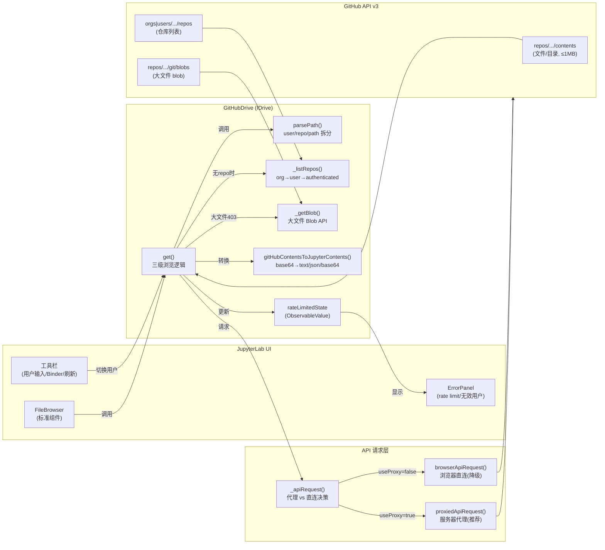

# jupyterlab-github 架构洞察

## 洞察：基于 Contents.IDrive 的 GitHub 虚拟文件系统与双模式 API 桥接

jupyterlab-github 的核心架构是实现 JupyterLab 的 `Contents.IDrive` 接口，将 GitHub 仓库作为一个**只读虚拟驱动器**挂载到 JupyterLab 的文件浏览器中。这种设计使 GitHub 浏览完全融入 JupyterLab 的标准文件浏览器 UI，无需自定义复杂的文件列表组件。

**关键设计决策：**

1. **IDrive 抽象复用**：通过实现 `Contents.IDrive`，扩展完全复用了 JupyterLab 标准的 FileBrowser 组件，包括文件列表、图标、打开器、路径导航等，无需重写文件浏览器 UI。
2. **双模式 API 桥接**：优先使用服务器端代理（`/github` 端点），避免浏览器端 CORS 限制和 API token 暴露；服务器代理不可用时自动降级为浏览器直连 fetch，但会发出 rate limit 警告。
3. **大文件自动降级**：Contents API 对 >1MB 文件返回 403 错误（消息含 "blob"），驱动自动检测此错误并切换到 Git Data Blob API，对用户透明。
4. **严格只读**：所有写操作（create/delete/rename/save/copy/checkpoint）均直接 reject，因为 GitHub 不是实时文件系统，写入需要 commit+push 语义，不在此扩展范围内。
5. **Rate limit 感知**：通过 `ObservableValue` 跟踪 rate limit 状态，触发时显示错误面板，5 分钟的长刷新间隔也减轻了 API 调用频率。
6. **Binder 集成**：在仓库根目录检测 Binder 配置文件存在时自动启用"Launch Binder"按钮，实现从浏览到一键运行的闭环。
