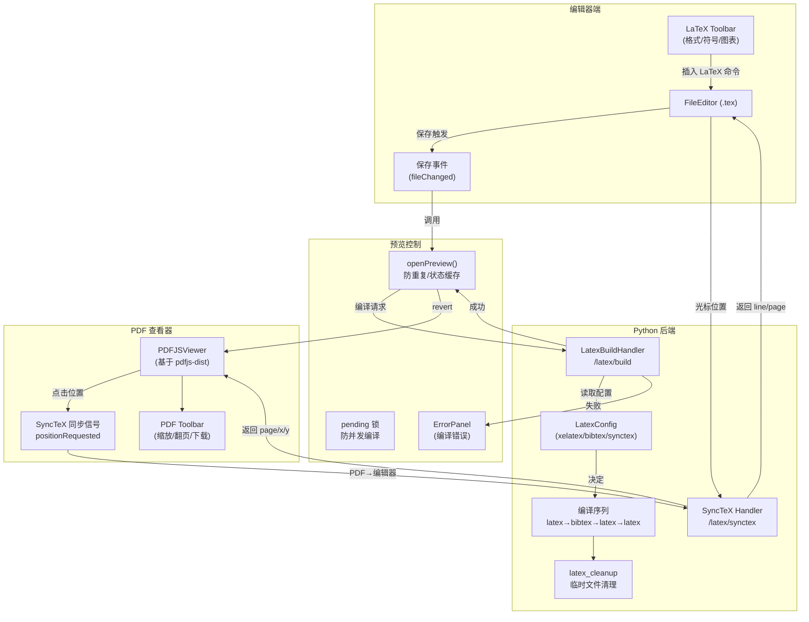

# jupyterlab-latex 架构洞察

## 洞察：保存触发编译+SyncTeX 双向同步的实时 LaTeX 编辑工作流

jupyterlab-latex 构建了一个类似 Overleaf 的实时 LaTeX 编辑体验，核心工作流是"编辑→保存→自动编译→PDF 预览→SyncTeX 双向定位"。架构上通过两个 JupyterLab 插件（LaTeX 编辑器插件 + PDF.js 查看器插件）协同工作，后端通过 Tornado handler 调用系统 LaTeX 引擎编译。

**关键设计决策：**

1. **保存即编译**：不使用文件系统监听（watchdog），而是绑定到编辑器的 `fileChanged` 信号（即保存事件），避免频繁编译；同时使用 `pending` 标志防止快速保存导致并发编译。
2. **左右分栏预览**：PDF 以 `split-right` 模式打开，与编辑器并排显示，错误面板以 `split-bottom` 模式显示在编辑器下方，形成三栏布局。
3. **SyncTeX 实用主义**：SyncTeX 的 x 坐标映射不可靠，代码中显式将 x 强制设为 0，仅同步行/页位置，优先保证可用性而非精度。
4. **多引擎支持**：默认使用 xelatex，同时支持 tectonic（现代 Rust 引擎，单二进制无需 TeX Live 安装），以及自定义命令序列，覆盖不同用户环境。
5. **BibTeX 自动检测**：通过 glob 检测目录下 .bib 文件存在与否决定是否运行 bibtex，避免不必要的编译步骤。
6. **编辑器工具栏注入**：通过 `IWidgetExtension` 为 .tex 文件的编辑器工具栏添加 15+ 个格式按钮，提供类似 WYSIWYG 的 LaTeX 命令插入体验，包括数学符号菜单和 pgfplots 图表模板。
7. **PDF.js 内嵌**：直接将 pdfjs-dist 作为 bundled singleton 打包，而非依赖外部 PDF 查看器，保证跨平台一致性。
