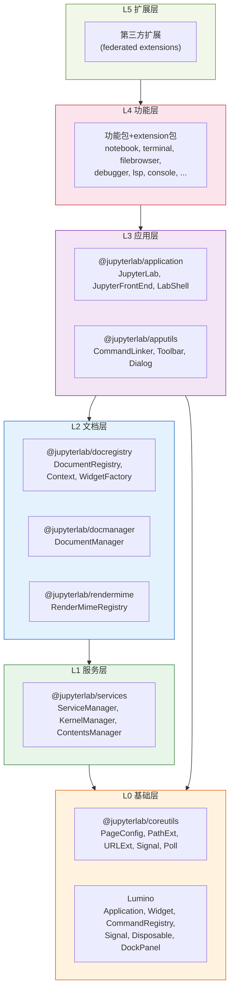
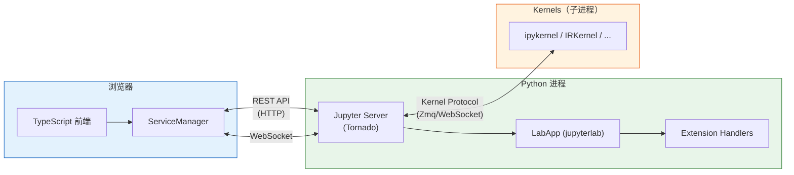
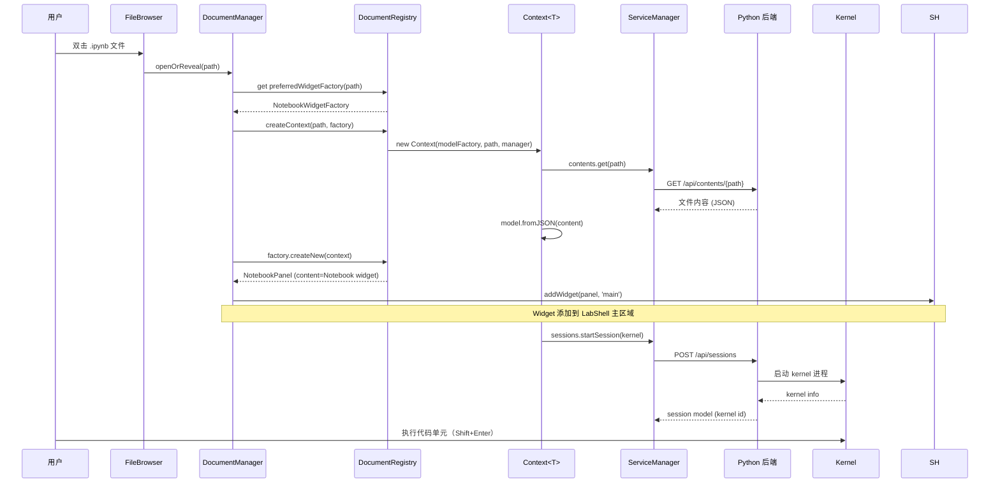

## Monorepo 结构

JupyterLab 使用 **Lerna + Yarn Workspaces** 管理 monorepo（[F-001](/references/source-code-map.md)），所有包共享一个 `yarn.lock` 和 `node_modules`。

根目录 `package.json` 声明的 workspaces 包括：

```
workspaces:
  - dev_mode/              # 开发模式构建
  - examples/*             # 扩展示例
  - examples/federated/*   # Federated 扩展示例
  - packages/*             # 核心前端包（~40个）
  - buildutils/            # 构建工具
  - galata/                # UI 测试框架
  - testutils/             # 测试工具
```

### 包命名规律

JupyterLab 的包遵循统一的命名约定（[F-002](/references/source-code-map.md)）：

- **功能包**：`@jupyterlab/<name>`（如 `@jupyterlab/notebook`）
- **扩展插件包**：`@jupyterlab/<name>-extension`（如 `@jupyterlab/notebook-extension`）
- **元包**：`@jupyterlab/metapackage`，依赖所有 81 个核心包（[F-001](/references/source-code-map.md)）

### 技术栈

| 层次 | 技术 | 版本 |
|------|------|------|
| **前端语言** | TypeScript | — |
| **UI 框架** | React 18 | ^18.2.0（[F-001](/references/source-code-map.md)） |
| **Widget 框架** | Lumino (`@lumino/widgets`, `@lumino/application` 等) | 核心 UI 基础设施 |
| **代码编辑器** | CodeMirror 6 | `@jupyterlab/codemirror` 封装 |
| **构建工具** | Rspack | 2.0.2（[F-001](/references/source-code-map.md)） |
| **包管理** | Yarn 3 (Berry) | 通过 `jlpm` wrapper 调用 |
| **Monorepo 工具** | Lerna | ^7.1.4 |
| **后端语言** | Python | 3.9+ |
| **Web 框架** | Tornado（通过 jupyter-server） | — |
| **配置系统** | Traitlets | — |
| **CRDT 协作** | Yjs | ^13.5.40 |
| **代码检查** | ESLint 9 + Prettier 3 + Stylelint 16 | — |

## 五层架构模型

JupyterLab 前端遵循严格的分层架构，每层只依赖下层（[F-003](/references/source-code-map.md)）：



### 各层职责

- **L0 基础层**：Lumino 提供 Widget/Command/Signal/Disposable/DockPanel 等通用 UI 基础设施；coreutils 提供 URL/路径/时间/文本等工具函数和 PageConfig 全局配置
- **L1 服务层**：services 封装所有后端通信（kernels/sessions/contents/settings/terminals 等），通过 REST API + WebSocket 与 Python 后端交互
- **L2 文档层**：docregistry 定义文档模型/Widget 工厂/文件类型注册系统；docmanager 负责文档的打开/关闭/生命周期管理；rendermime 管理 MIME 类型渲染器
- **L3 应用层**：application 提供应用壳（JupyterLab/JupyterFrontEnd）、Shell 布局、插件注册/激活、路由；apputils 提供命令链接器、工具栏、对话框等通用 UI 组件
- **L4 功能层**：各功能包（notebook/terminal/console 等）实现具体业务功能，对应的 -extension 包将功能注册为插件
- **L5 扩展层**：第三方 federated 扩展独立构建，运行时动态加载

## 前后端通信模型

JupyterLab 采用经典的**客户端-服务器架构**：



### 后端入口

Python 后端的核心入口是 `LabApp` 类（[F-019](/references/source-code-map.md)），它继承自 `jupyterlab_server.LabServerApp` → `jupyter_server.extension.ExtensionApp` → `JupyterApp`。`LabApp` 负责：

1. 确定运行模式（core/dev/app），设置静态资源路径（[labapp.py#L679-L723](file:///d:/spaces/SpecWeave/external/libs/jupyter/jupyterlab/jupyterlab/labapp.py#L679-L723)）
2. 初始化 Tornado handlers（build、extension manager、plugin manager、announcements）（[labapp.py#L738-L932](file:///d:/spaces/SpecWeave/external/libs/jupyter/jupyterlab/jupyterlab/labapp.py#L738-L932)）
3. 向页面注入 `page_config_data`（token、devMode、buildAvailable、extensionManager 等）
4. 作为 Jupyter Server 扩展加载（通过 `_jupyter_server_extension_points()`）

### 前端入口

前端应用的入口是 `JupyterLab` 类（[F-019](/references/source-code-map.md)），它继承自 `JupyterFrontEnd<ILabShell>`（[F-017](/references/source-code-map.md)），构造时：

1. 创建 `LabShell` 作为默认 shell（[F-022](/references/source-code-map.md)）
2. 创建或接收 `ServiceManager` 连接后端
3. 创建 `JupyterLab.Info` 读取页面配置
4. 注册 `Base64ModelFactory`（基础模型工厂）
5. 如果传入 `mimeExtensions`，创建 rendermime 插件
6. Shell 恢复后激活 deferred 插件

### 页面配置传递

后端通过页面 HTML 中的 `<script id="jupyter-config-data" type="application/json">` 标签将配置传递给前端。前端通过 `PageConfig.getOption(name)` 读取（[F-034](/references/source-code-map.md)），包括：
- `baseUrl`, `appUrl`, `staticUrl`, `wsUrl` 等 URL
- `token`, `devMode`, `appName`, `appVersion`
- `frontendUrl`, `hubPrefix`, `hubUser`（JupyterHub 环境）

## 核心包依赖链

核心包之间的依赖关系链（[F-003](/references/source-code-map.md)）：

```
@jupyterlab/application
  ├── @jupyterlab/apputils
  │     ├── @jupyterlab/coreutils
  │     ├── @jupyterlab/ui-components
  │     └── @lumino/*
  ├── @jupyterlab/docregistry
  │     ├── @jupyterlab/services
  │     │     ├── @jupyterlab/coreutils
  │     │     └── @jupyterlab/nbformat
  │     ├── @jupyterlab/rendermime-interfaces
  │     └── @jupyterlab/codeeditor
  ├── @jupyterlab/services
  ├── @jupyterlab/coreutils
  └── @lumino/application
        └── @lumino/widgets
              ├── @lumino/commands
              ├── @lumino/signaling
              ├── @lumino/coreutils
              └── @lumino/disposable
```

依赖方向严格单向：上层包依赖下层包，下层包不依赖上层包。功能包（如 notebook、terminal）依赖 application/apputils/docregistry/services 等核心包。

## 端到端数据流：打开一个 Notebook



## 相关概念

- [00 概述与知识地图](/concepts/00-introduction.md)
- [02 应用框架与 Shell 布局](/concepts/02-application-shell.md)
- [03 插件系统与依赖注入](/concepts/03-plugin-system.md)
- [04 服务层与后端通信](/concepts/04-service-layer.md)
- [源码文件地图](/references/source-code-map.md)
