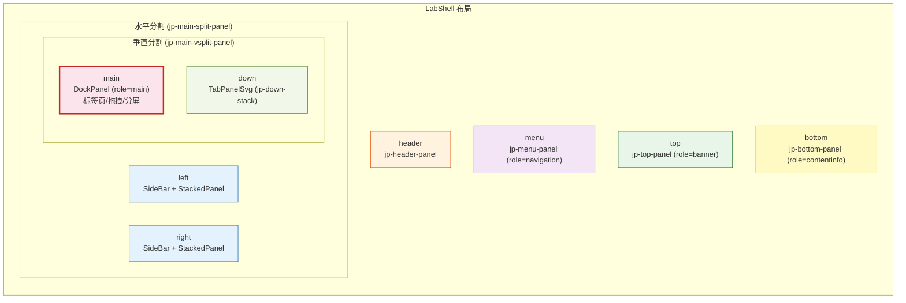
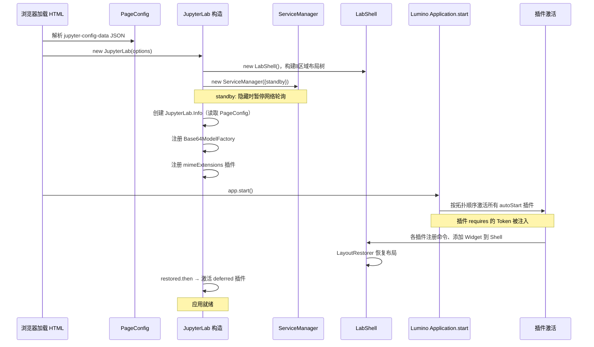

## 应用类层级

JupyterLab 的前端应用类继承自 Lumino 的 `Application` 基类，形成三层类层级（[F-041](/references/source-code-map.md)）：

```
@lumino/application Application<T>
  └── JupyterFrontEnd<T extends IShell, U extends string>  (abstract)
        └── JupyterLab (shell=LabShell, format='desktop'|'mobile')
```

### JupyterFrontEnd（抽象基类）

`JupyterFrontEnd` 是所有 Jupyter 前端应用的抽象基类（[F-017](/references/source-code-map.md)），位于 `packages/application/src/frontend.ts`。它继承 Lumino 的 `Application<T>`，在构造时初始化以下核心组件：

| 属性 | 类型 | 说明 |
|------|------|------|
| `commands` | `CommandRegistry`（继承自 Application） | 命令注册表，管理所有可执行命令和快捷键 |
| `shell` | `T`（泛型，即 IShell） | 应用 Shell（布局容器） |
| `docRegistry` | `DocumentRegistry` | 文档类型与工厂注册中心 |
| `serviceManager` | `ServiceManager.IManager` | 后端服务聚合管理器 |
| `commandLinker` | `CommandLinker` | 命令链接器（将 HTML 元素连接到命令） |
| `contextMenu` | `ContextMenuSvg` | 右键上下文菜单（支持 SVG 图标渲染） |
| `restored` | `Promise<void>` | 应用状态恢复完成的 Promise |

`JupyterFrontEnd` 声明三个抽象属性，由子类实现：
- `name: string` — 应用名称
- `namespace: string` — 插件命名空间前缀
- `version: string` — 应用版本

### JupyterLab（具体应用类）

`JupyterLab` 类继承 `JupyterFrontEnd<ILabShell>`（[F-019](/references/source-code-map.md)），是 JupyterLab 的具体应用类，位于 `packages/application/src/lab.ts`。它：

1. 默认使用 `LabShell` 作为 shell（[F-019](/references/source-code-map.md)）
2. 创建 `JupyterLab.Info` 对象，包含 `devMode`、`deferred/disabled` 插件列表、`mimeExtensions`、`availablePlugins`、`filesCached`、`isConnected` 等信息（[F-019](/references/source-code-map.md)）
3. 处理 deferred 插件激活：shell 恢复后自动激活 `_info.deferred.matches` 中的插件
4. 合并默认路径配置（urls/directories）和用户传入的 `options.paths` 覆盖
5. devMode 时给 shell 添加 `jp-mod-devMode` CSS 类（显示红色条纹）
6. 注册 `Base64ModelFactory`（基础 64 位编码模型工厂）
7. 如果传入 `mimeExtensions`，自动创建 rendermime 插件

### JupyterLab.IInfo 接口

`JupyterLab.IInfo` 接口（[lab.ts#L337-L379](file:///d:/spaces/SpecWeave/external/libs/jupyter/jupyterlab/packages/application/src/lab.ts#L337-L379)）提供应用元数据：

```typescript
interface IInfo {
  readonly devMode: boolean;                                    // 是否开发模式
  readonly deferred: { patterns: string[]; matches: string[] }; // 延迟激活插件
  readonly disabled: { patterns: string[]; matches: string[] }; // 禁用插件
  readonly mimeExtensions: IRenderMime.IExtensionModule[];      // MIME 渲染扩展
  readonly availablePlugins: IPluginInfo[];                      // 可用插件列表
  readonly filesCached: boolean;                                 // 文件是否缓存
  isConnected: boolean;                                          // 网络连接状态
}
```

## LabShell 布局系统

`LabShell` 是 JupyterLab 的核心布局容器（[F-022](/references/source-code-map.md)），位于 `packages/application/src/shell.ts`。它继承 Lumino 的 `Widget`，实现 `JupyterFrontEnd.IShell` 接口。

### 八个布局区域

LabShell 定义了 8 个命名区域（[F-021](/references/source-code-map.md)）：

```typescript
type Area = 'header' | 'menu' | 'top' | 'left' | 'main' | 'right' | 'bottom' | 'down';
```



各区域说明：

| 区域 | Widget 组件 | 典型用途 |
|------|------------|---------|
| `header` | `BoxPanel` | 顶部标题栏 |
| `menu` | 菜单面板 | 主菜单栏（File/Edit/View/Run/Kernel 等） |
| `top` | 顶部面板 | 工具栏、面包屑等 |
| `left` | `SideBarHandler`（SideBar + StackedPanel） | 左侧活动栏：文件浏览器、搜索、TOC、调试器等标签页 |
| **`main`** | **`OptimizedDockPanelSvg`** | **主文档区域**：Notebook、编辑器、终端等标签页，支持拖拽分屏 |
| `right` | `SideBarHandler`（SideBar + StackedPanel） | 右侧面板：属性检查器、调试变量等 |
| `down` | `TabPanelSvg` | 底部面板：日志控制台等 |
| `bottom` | `BoxPanel` | 状态栏 |

### DockPanel 主区域

主区域使用 Lumino 的 `DockPanel`（在 JupyterLab 中是 `OptimizedDockPanelSvg`），支持：
- **标签页**：多个 Widget 在同一区域以标签页形式排列
- **拖拽分屏**：拖拽标签到边缘可以水平/垂直分割
- **标签拖拽排序**：标签可以在标签栏之间拖拽移动
- **单文档模式**：通过 `mode` 属性切换 `'multiple-document'` 和 `'single-document'`

### SideBarHandler 侧栏

左侧和右侧面板使用 `SideBarHandler`，由两部分组成：
1. **SideBar**：窄条上显示图标按钮（TabBar）
2. **StackedPanel**：点击图标切换显示对应的 Widget

侧栏支持折叠/展开，当前展开的侧栏标签高亮。

### 添加 Widget 到 Shell

插件通过 `shell.add(widget, area, options?)` 方法将 Widget 添加到指定区域：

```typescript
// 添加 Notebook 到主区域
app.shell.add(notebookPanel, 'main', {
  mode: 'tab-after',  // 插入方式
  activate: true       // 是否激活
});

// 添加文件浏览器到左侧栏
app.shell.add(fileBrowser, 'left', {
  rank: 100  // 排序权重，越小越靠前
});
```

### ILabShell 接口（Shell 公开 API）

插件通过 `ILabShell` Token（[F-020](/references/source-code-map.md)）注入 shell 实例，可使用的核心 API：

| 方法/属性 | 说明 |
|----------|------|
| `add(widget, area, options?)` | 添加 Widget 到指定区域 |
| `collapseLeft()/expandLeft()` | 折叠/展开左侧栏 |
| `collapseRight()/expandRight()` | 折叠/展开右侧栏 |
| `activateById(id)` | 通过 ID 激活 Widget |
| `currentWidget` | 当前活跃的 Widget |
| `currentChanged` 信号 | 当前 Widget 变化通知 |
| `activeChanged` 信号 | 活动状态变化通知 |
| `layoutModified` 信号 | 布局修改通知 |

## 应用启动流程

JupyterLab 的启动流程如下：



### 启动的三个阶段

1. **构造阶段**：创建 Shell、ServiceManager、Info 等核心对象
2. **插件激活阶段**：Lumino Application 根据 Token 依赖图按拓扑排序激活所有 `autoStart: true` 的插件
3. **延迟激活阶段**：Shell 恢复布局后，激活 deferred 插件（非关键路径插件延迟加载以加快首屏）

## Format（形态因子）

`JupyterFrontEnd` 支持 `format` 属性，JupyterLab 默认支持两种形态：
- `'desktop'`：桌面布局（默认），显示完整的侧栏和 DockPanel
- `'mobile'`：移动端布局

切换 format 时设置 `document.body.dataset['format']`，CSS 可根据此属性做响应式适配。`formatChanged` 信号通知插件形态变化。

## 键盘事件处理：用户输入防护

`JupyterLab` 重写了 `evtKeydown` 方法（[lab.ts#L209-L299](file:///d:/spaces/SpecWeave/external/libs/jupyter/jupyterlab/packages/application/src/lab.ts#L209-L299)），实现了一个巧妙的键盘输入防护机制：

1. 收到 keydown 事件时，先**暂停**命令快捷键执行（通过 `commands.holdKeyBindingExecution`）
2. 监听 `beforeinput` 事件判断是否会导致文本输入
3. 如果会导致文本输入（如在编辑器中输入字符），则**阻止**命令执行
4. 如果不会导致文本输入（如按 Escape、Ctrl+C 等快捷键），则允许命令执行
5. 10ms 超时兜底（`INPUT_GUARD_TIMEOUT = 10`）

这确保了在编辑器中输入时快捷键不会意外触发，同时不延迟用户输入本身。

## 相关概念

- [01 整体架构概览](/concepts/01-architecture-overview.md)
- [03 插件系统与依赖注入](/concepts/03-plugin-system.md)
- [09 关键子系统](/concepts/09-key-subsystems.md)
- [源码文件地图](/references/source-code-map.md)
