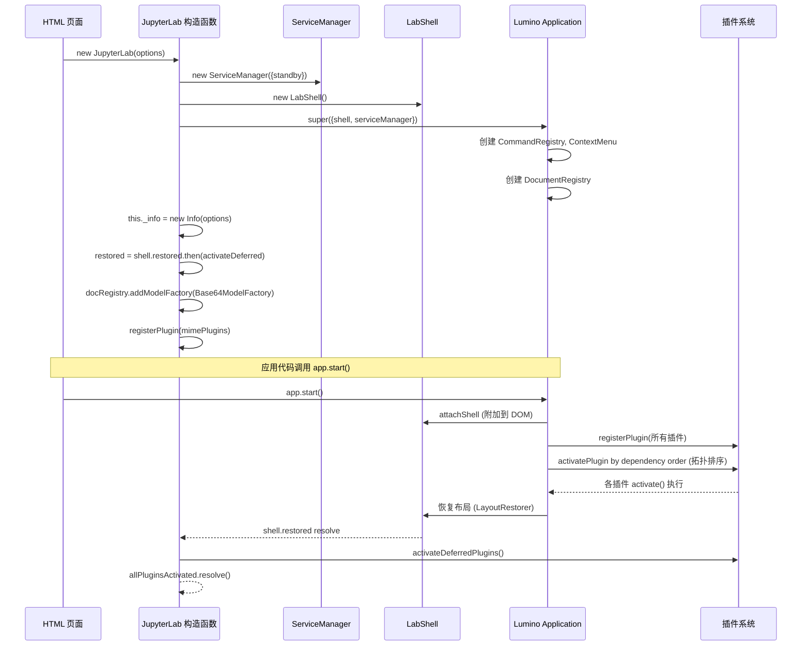

## 概述

JupyterLab 的前端应用框架建立在 Lumino 的 Application/Widget 体系之上。理解应用框架与 Shell 布局，是掌握 JupyterLab 插件开发和 UI 定制的基础。本文档从类层级、Shell 布局、启动流程和 Widget 生命周期四个维度进行解析。

## 应用类层级

JupyterLab 的前端应用类形成三层继承结构：

```
@lumino/application Application<T extends Widget>
  └── JupyterFrontEnd<T extends IShell, U extends string>  (abstract, frontend.ts:42)
        └── JupyterLab extends JupyterFrontEnd<ILabShell>  (lab.ts:21)
```

### JupyterFrontEnd 抽象基类

`JupyterFrontEnd` 定义在 `packages/application/src/frontend.ts:42`，是所有 Jupyter 前端应用的抽象基类，继承自 Lumino 的 `Application<T>`。它声明了子类必须实现的三个抽象属性（frontend.ts:82-92）：

- `abstract readonly name: string` — 应用名称
- `abstract readonly namespace: string` — 插件命名空间前缀
- `abstract readonly version: string` — 应用版本

JupyterFrontEnd 在构造函数中（frontend.ts:49-77）初始化了四大核心属性，这些属性是插件激活时可通过 Token 或直接访问获得的核心服务：

| 属性 | 类型 | 行号 | 说明 |
|------|------|------|------|
| `commands` | `CommandRegistry` | 继承自 Application | 命令注册表，管理所有可执行命令和键盘快捷键 |
| `shell` | `T`（泛型，默认 IShell） | 继承自 Application | 应用 Shell，负责 Widget 布局 |
| `docRegistry` | `DocumentRegistry` | L107 | 文档注册表，管理 ModelFactory/WidgetFactory/WidgetExtension |
| `serviceManager` | `ServiceManager.IManager` | L117 | 服务管理器，聚合所有后端通信客户端 |

此外，JupyterFrontEnd 还创建了 `commandLinker`（L97，命令链接器，用于生成带命令的 HTML 链接）和 `contextMenu`（L102，`ContextMenuSvg` 实例，支持 SVG 图标的右键菜单）。

`restored: Promise<void>`（L112）是一个关键的 Promise，在应用状态首次恢复完成后 resolve。默认实现中，它在 `started` Promise  resolve 后等待一帧 `requestAnimationFrame` 再 resolve（L64-75），子类可以覆盖此行为。

`JupyterFrontEnd.IShell` 接口（frontend.ts:253-310）定义了 Shell 的最小契约：
- `add(widget, area?, options?)` — 将 Widget 添加到 Shell
- `activateById(id)` — 激活指定 Widget
- `currentWidget: Widget | null` — 当前焦点 Widget
- `currentChanged?: ISignal` — 当前 Widget 变化信号（可选）
- `widgets(area?)` — 遍历区域内 Widget

这个接口设计使得不同的 Jupyter 前端应用（如 Notebook 7、RetroLab）可以使用不同的 Shell 实现，而插件可以面向 `JupyterFrontEnd.IShell` 编程。

### JupyterLab 具体类

`JupyterLab` 定义在 `packages/application/src/lab.ts:21`，是 JupyterLab 应用的具体实现类，继承 `JupyterFrontEnd<ILabShell>`。它是一个单例，在整个应用生命周期中只实例化一次。

**构造函数**（lab.ts:25-111）执行以下关键初始化：

1. **创建 Shell 和 ServiceManager**：调用 `super()` 时传入 `shell: options.shell || new LabShell()` 和 `serviceManager: options.serviceManager || new ServiceManager(...)`（lab.ts:26-36）。ServiceManager 配置了 `standby` 回调，在页面隐藏或断开连接时进入待机模式。

2. **初始化应用信息**：`this._info = new JupyterLab.Info(options)`（lab.ts:39），包含 devMode、deferred 插件配置等。

3. **设置 restored Promise 链**（lab.ts:41-67）：
   ```
   shell.restored
     → activateDeferredPlugins()
     → (可选) 激活自定义 deferred 插件列表
     → _allPluginsActivated.resolve()
   ```
   这意味着 JupyterLab 的 `restored` 不仅等待 Shell 布局恢复，还等待所有 deferred 插件激活完成。

4. **初始化路径配置**（lab.ts:69-97）：合并默认路径和用户传入的路径覆盖。

5. **开发模式样式**：如果 `_info.devMode` 为 true，给 Shell 添加 `jp-mod-devMode` CSS 类（lab.ts:99-101），前端据此显示红色条带。

6. **注册初始 ModelFactory**：`this.docRegistry.addModelFactory(new Base64ModelFactory())`（lab.ts:104）。

7. **注册 MIME 渲染插件**：如果 `options.mimeExtensions` 存在，通过 `createRendermimePlugins()` 创建插件并注册（lab.ts:106-110）。

JupyterLab 还暴露了 `allPluginsActivated: Promise<void>`（lab.ts:163-165），在所有插件（包括 deferred）激活完成后 resolve。`status` 属性（lab.ts:139）是 `LabStatus` 实例，管理 busy/dirty 状态。

## ILabShell 接口与八区域布局

### ILabShell Token

`ILabShell` Token 定义在 `packages/application/src/shell.ts:75`：

```typescript
export const ILabShell = new Token<ILabShell>(
  '@jupyterlab/application:ILabShell',
  'A service for interacting with the JupyterLab shell...'
);
```

Token 是 JupyterLab 依赖注入的核心机制。插件可以在 `activate` 函数参数中声明 `ILabShell` 类型的依赖，应用框架会自动注入 LabShell 实例。虽然 `app.shell` 也能访问 Shell，但它的类型是受限的 `JupyterFrontEnd.IShell` 接口；通过 `ILabShell` Token 可以获得完整的 LabShell 能力。

`ILabShell` 接口本身定义为 `interface ILabShell extends LabShell`（shell.ts:83），直接继承 LabShell 类的所有公开成员。

### 八个区域

`ILabShell.Area` 类型（shell.ts:92-100）定义了 Shell 中 Widget 可放置的 8 个区域：

| 区域 | 说明 | 典型 Widget |
|------|------|------------|
| `'main'` | 主工作区，DockPanel 多标签停靠 | NotebookPanel、Console、FileEditor、Viewer |
| `'header'` | 顶部页眉区域（默认隐藏） | 自定义横幅 |
| `'top'` | 顶部面板区域 | 菜单栏、标题栏（单文档模式） |
| `'menu'` | 菜单栏区域 | MainMenu |
| `'left'` | 左侧栏（可折叠） | FileBrowser、TOC、Running Sessions |
| `'right'` | 右侧栏（可折叠） | Property Inspector、调试器侧边栏 |
| `'bottom'` | 底部面板区域（默认隐藏） | 自定义状态栏 |
| `'down'` | 下方面板区域（TabPanel） | Log Console、Terminal |

这些区域在 LabShell 构造函数中通过 Lumino 的 BoxPanel/SplitPanel/TabPanel 组合而成完整的布局树。

## LabShell 实现

`LabShell` 定义在 `packages/application/src/shell.ts:368`。需要注意的是，**LabShell 继承的是 Lumino `Widget`，而非 `DockPanel`**——它通过组合模式在内部持有一个 `OptimizedDockPanelSvg` 实例作为主工作区。

### 构造函数与布局树

LabShell 构造函数（shell.ts:372-540）创建了完整的布局结构：

```
LabShell (Widget, rootLayout=BoxLayout, top-to-bottom)
  ├── skipLinkWrapper (无障碍跳转链接)
  ├── headerPanel (BoxPanel, 默认隐藏)
  ├── topHandler.panel (BoxPanel)
  │     └── menuHandler.panel (菜单栏, rank=100)
  ├── hboxPanel (BoxPanel, left-to-right)
  │     ├── leftHandler.sideBar (左侧 TabBar)
  │     ├── vsplitPanel (SplitPanel, vertical)
  │     │     ├── hsplitPanel (SplitPanel, horizontal)
  │     │     │     ├── leftHandler.area (StackedPanel)
  │     │     │     ├── dockPanel (OptimizedDockPanelSvg, stretch=1)
  │     │     │     └── rightHandler.area (StackedPanel)
  │     │     └── downPanel (TabPanelSvg, 默认隐藏)
  │     └── rightHandler.sideBar (右侧 TabBar)
  └── bottomPanel (BoxPanel, 默认隐藏)
```

关键布局参数：
- `vsplitPanel.setRelativeSizes([3, 1])`（shell.ts:484）— 主工作区与下方面板默认 3:1
- `hsplitPanel.setRelativeSizes([1, 2.5, 1])`（shell.ts:485）— 左栏、主区、右栏默认 1:2.5:1
- `dockPanel` 的 stretch 因子为 1，其他区域为 0，确保主工作区占据剩余空间

构造函数还连接了多个信号监听器（shell.ts:507-529）：
- `_tracker.currentChanged` 和 `_tracker.activeChanged` — 焦点追踪
- `_dockPanel.layoutModified` — 主布局变化
- `_vsplitPanel.updated`、`_hsplitPanel.updated` — 分栏变化
- `_downPanel.currentChanged`、`tabBar.tabMoved`、`stackedPanel.widgetRemoved` — 下方面板变化
- `_leftHandler.updated`、`_rightHandler.updated` — 侧栏变化

所有这些变化都触发 `_onLayoutModified`，通过 Debouncer 防抖后保存布局状态。

### add 方法

`add(widget, area, options)` 方法定义在 shell.ts:1014，是将 Widget 添加到 Shell 的入口：

1. 如果布局尚未恢复（`!this._userLayout`），将 Widget 暂存到 `_delayedWidget` 数组，待恢复后添加
2. 检查 `options.type` 和 widget.id 在用户布局中的位置配置
3. 根据 area 分发到对应的私有方法：
   - `'main'` → `_addToMainArea(widget, options)` — 添加到 DockPanel
   - `'left'` → `_addToLeftArea(widget, options)` — 添加到左侧 StackedPanel 和 TabBar
   - `'right'` → `_addToRightArea(widget, options)`
   - `'down'` → `_addToDownArea(widget, options)` — 添加到 TabPanelSvg
   - `'header'` → `_addToHeaderArea(widget, options)`
   - `'top'` → `_addToTopArea(widget, options)`
   - `'menu'` → `_addToMenuArea(widget, options)`
   - `'bottom'` → `_addToBottomArea(widget, options)`

`options.rank` 控制侧栏标签和顶部面板项的排序（值越小越靠前，默认 `DEFAULT_RANK = 900`，shell.ts:63）。

### 折叠与展开

LabShell 提供了三个区域的折叠/展开方法：

| 方法 | 行号 | 说明 |
|------|------|------|
| `collapseLeft()` | L1132 | 折叠左侧栏 |
| `collapseRight()` | L1140 | 折叠右侧栏 |
| `collapseDown()` | L1148 | 隐藏下方面板 |
| `expandLeft()` | L1173 | 展开左侧栏，打开最近使用的标签 |
| `expandRight()` | L1185 | 展开右侧栏 |
| `expandDown()` | L1193 | 显示下方面板并激活当前 Widget |

### 焦点追踪与信号

LabShell 内部使用 `FocusTracker<Widget>`（shell.ts:2058）追踪 main area 和 down area 中 Widget 的焦点状态，暴露两个关键信号：

- **`currentChanged: ISignal<this, ILabShell.IChangedArgs>`**（shell.ts:609）— 当前 Widget 变化时发射。`currentWidget`（shell.ts:633）是 FocusTracker 认为"当前"的 Widget，通常是最后被激活或点击的主区 Widget。
- **`activeChanged: ISignal<this, ILabShell.IChangedArgs>`**（shell.ts:578）— 活跃 Widget 变化时发射。`activeWidget`（shell.ts:585）是当前持有 DOM 焦点的 Widget。

`ILabShell.IChangedArgs`（shell.ts:123）等价于 `FocusTracker.IChangedArgs<Widget>`，包含 `newValue` 和 `oldValue`。

插件常通过 `app.shell.currentChanged.connect(...)` 监听当前 Widget 变化，以更新 UI 状态（如菜单项启用/禁用、工具栏按钮切换）。

## 启动流程

JupyterLab 的启动流程跨越 Lumino 框架和 JupyterLab 自定义逻辑：



关键阶段说明：

1. **构造阶段**：`new JupyterLab()` 创建 Shell、ServiceManager，初始化 restored Promise 链，注册 MIME 插件。此时插件尚未激活。

2. **start() 阶段**：Lumino `Application.start()` 方法将 Shell 附加到 DOM（`attachShell`），然后根据插件的 `requires`/`optional`/`provides` 声明进行拓扑排序，按依赖顺序激活所有非 deferred 插件。每个插件的 `activate(app, ...args)` 函数被调用，参数由 Token 依赖注入解析。

3. **布局恢复阶段**：`LayoutRestorer`（在 application-extension 中注册）从工作区数据恢复 DockPanel 布局、打开的文件、侧栏状态等。`shell.restored` Promise 在此阶段完成后 resolve。

4. **Deferred 插件激活**：JupyterLab 在 `shell.restored` 完成后激活 `deferred` 插件（lab.ts:44-60）。标记为 deferred 的插件会延迟到布局恢复后才激活，避免阻塞首次渲染。`allPluginsActivated` Promise 在所有插件激活后 resolve。

JupyterFrontEnd 的 `started` Promise（继承自 Lumino Application）在 start() 完成时 resolve，而 `restored` Promise 在布局和状态恢复后 resolve。插件应在 `activate` 函数中根据需要选择等待哪个 Promise。

## Widget 生命周期

JupyterLab 中的所有 UI 组件都是 Lumino Widget，遵循 Lumino 的消息机制和生命周期。

### 创建到关闭的完整流程

1. **创建**：插件或工厂函数实例化 Widget（如 `new NotebookPanel(context, translator)`）
2. **添加到 Shell**：调用 `app.shell.add(widget, 'main', { type: 'Notebook', rank: 100 })`，Shell 将其添加到对应区域的布局中
3. **附加到 DOM**：Lumino 发送 `after-attach` 消息，触发 Widget 的 `onAfterAttach(msg)` 方法。LabShell 在此阶段（shell.ts:1613）将 Widget 添加到 FocusTracker
4. **激活**：调用 `app.shell.activateById(widget.id)` 或用户点击标签页，Lumino 发送 `activate-request` 消息，触发 `onActivateRequest(msg)`，Widget 获取焦点
5. **更新**：状态变化时发送 `update-request` 消息，触发 `onUpdateRequest(msg)` 进行重绘
6. **关闭**：Widget 被关闭时，Lumino 发送 `close-request`，触发 `onCloseRequest(msg)`，默认调用 `dispose()`
7. **分离**：Widget 从 DOM 移除时发送 `after-detach`，LabShell 从 FocusTracker 移除该 Widget

### 消息机制

Lumino 使用消息循环而非直接调用生命周期方法：

- `MessageLoop.sendMessage(widget, msg)` 发送消息
- `Widget.onBeforeAttach(msg)` / `onAfterAttach(msg)` — DOM 附加前后
- `Widget.onBeforeDetach(msg)` / `onAfterDetach(msg)` — DOM 分离前后
- `Widget.onUpdateRequest(msg)` — 更新请求（合并多次请求为一次）
- `Widget.onActivateRequest(msg)` — 激活请求
- `Widget.onResize(msg)` — 尺寸变化
- `Widget.onCloseRequest(msg)` — 关闭请求

LabShell 重写了 `onAfterAttach`（shell.ts:1613），在附加后启动 FocusTracker 对子 Widget 的追踪。内部类也重写了 `onUpdateRequest`（shell.ts:2890）和 `onAfterAttach`（shell.ts:2741, 2783）以处理特定的布局逻辑。

### FocusTracker 的作用

`FocusTracker`（shell.ts:2058）是 LabShell 管理 Widget 焦点的核心。它通过监听 Widget 的 `focus`/`blur` 事件，自动维护 `currentWidget` 和 `activeWidget` 的状态：

- 当用户点击 DockPanel 中的标签页时，对应 Widget 被激活，FocusTracker 更新
- `currentChanged` 信号驱动标题栏更新、菜单项状态刷新、上下文感知功能
- 插件通过 `ILabShell.currentWidget` 获取当前活动文档，实现上下文相关操作

## 相关概念

- [00 概述与知识地图](/concepts/00-introduction.md)
- [01 整体架构概览](/concepts/01-architecture-overview.md)
- [03 插件系统与依赖注入](/concepts/03-plugin-system.md)
- [04 服务层与后端通信](/concepts/04-service-layer.md)
- [05 文档注册与 Widget 工厂](/concepts/05-document-widget-system.md)
- [源码文件地图](/references/source-code-map.md)
