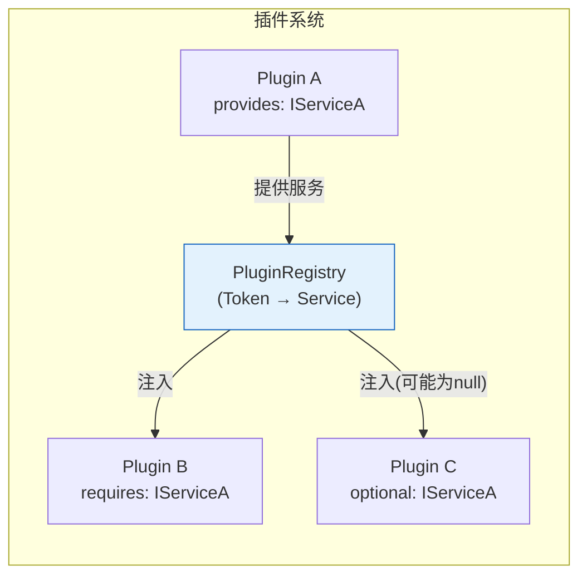
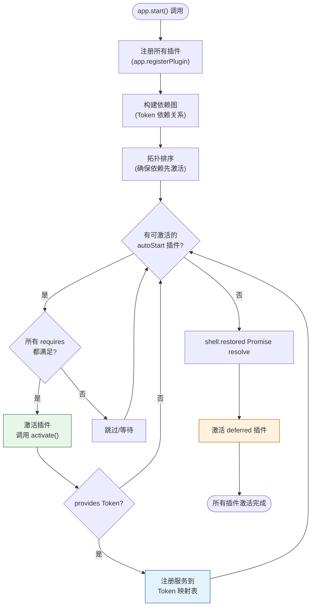

## 插件即一切

JupyterLab 的核心架构哲学是"插件即一切"（[F-005](/references/source-code-map.md)）。文件浏览器、Notebook、菜单、命令面板、终端、状态栏——所有功能都以插件形式实现。核心框架（`@jupyterlab/application`）只提供：

1. 应用壳（`JupyterFrontEnd`/`JupyterLab`）
2. Shell 布局（`LabShell`）
3. 插件注册与激活机制
4. Token 依赖注入
5. 基础工具（CommandLinker、ContextMenu 等）

## 插件类型定义：JupyterFrontEndPlugin

JupyterLab 插件基于 Lumino 的插件系统。插件是一个对象，实现 `JupyterFrontEndPlugin` 接口（[F-007](/references/source-code-map.md)），核心字段：

```typescript
interface IPlugin<Service, Requires, Optional> {
  id: string;                               // 唯一标识符（通常为 npm包名:插件名）
  autoStart?: boolean;                      // 是否自动启动（默认 true）
  requires?: Token<any>[];                  // 必需依赖（必须满足才能激活）
  optional?: Token<any>[];                  // 可选依赖（不满足则传 null）
  provides?: Token<Service>;                // 本插件提供的服务（通过 activate 返回值）
  activate: (app: JupyterFrontEnd, ...services: any[]) => Service | Promise<Service> | void;
  deactivate?: (app: JupyterFrontEnd, service: Service) => void | Promise<void>;
}

type JupyterFrontEndPlugin<T> = IPlugin<T, any, any>;
```

### 插件示例

```typescript
import { JupyterFrontEnd, JupyterFrontEndPlugin } from '@jupyterlab/application';
import { ICommandPalette } from '@jupyterlab/apputils';
import { INotebookTracker } from '@jupyterlab/notebook';

const myPlugin: JupyterFrontEndPlugin<void> = {
  id: 'my-extension:plugin',
  autoStart: true,
  requires: [INotebookTracker],           // 需要 NotebookTracker
  optional: [ICommandPalette],             // 可选需要命令面板
  activate: (
    app: JupyterFrontEnd,
    notebooks: INotebookTracker,           // requires 的服务按顺序注入
    palette: ICommandPalette | null        // optional 的服务可能为 null
  ) => {
    console.log('JupyterLab 扩展已激活!');
    console.log('Notebook 数量:', notebooks.currentWidget);

    if (palette) {
      // 注册命令到命令面板
      app.commands.addCommand('my-extension:hello', {
        label: 'Hello',
        execute: () => alert('Hello from extension!')
      });
      palette.addItem({ command: 'my-extension:hello', category: 'My Extension' });
    }
  }
};

export default myPlugin;
```

## Token：依赖注入的键

Token 是依赖注入系统的核心。Token 是一个带有唯一标识符的对象，用作服务的"键"（key）。插件通过声明 `requires: [IToken]` 来请求服务，框架会在插件激活时将对应的服务实例注入。

### 核心 Token 列表

| Token | 所在包 | 提供的服务 |
|-------|--------|-----------|
| `ILabShell` | `@jupyterlab/application` | LabShell 布局容器 |
| `IRouter` | `@jupyterlab/application` | 路由系统（URL 管理） |
| `ILauncher` | `@jupyterlab/launcher` | 启动器面板 |
| `ICommandPalette` | `@jupyterlab/apputils` | 命令面板 |
| `IMainMenu` | `@jupyterlab/mainmenu` | 主菜单栏 |
| `IStatusBar` | `@jupyterlab/statusbar` | 状态栏 |
| `INotebookTracker` | `@jupyterlab/notebook` | Notebook 面板追踪器 |
| `IFileBrowserFactory` | `@jupyterlab/filebrowser` | 文件浏览器工厂 |
| `IDocumentManager` | `@jupyterlab/docmanager` | 文档管理器 |
| `ISettingRegistry` | `@jupyterlab/settingregistry` | 设置注册表 |
| `IStateDB` | `@jupyterlab/statedb` | 状态数据库 |
| `IDebugger` | `@jupyterlab/debugger` | 调试器 |
| `ILSPDocumentConnectionManager` | `@jupyterlab/lsp` | LSP 连接管理器 |
| `ITerminalTracker` | `@jupyterlab/terminal` | 终端追踪器 |
| `IConsoleTracker` | `@jupyterlab/console` | 控制台追踪器 |
| `IRenderMimeRegistry` | `@jupyterlab/rendermime` | MIME 渲染注册表 |

Token 定义在每个包的 `tokens.ts` 文件中（[F-010](/references/source-code-map.md)），每个功能包通常有对应的 tokens 文件。

### Token 的工作原理



1. 当插件 `activate` 函数返回一个值且声明了 `provides` Token 时，框架将该值注册到 Token 映射表
2. 其他插件通过 `requires`/`optional` 声明依赖同一 Token
3. 框架按**拓扑排序**激活插件：被依赖的插件先激活，依赖方后激活
4. 如果 `requires` 中的 Token 没有提供者（对应插件未激活或加载失败），插件不会被激活
5. 如果 `optional` 中的 Token 没有提供者，对应位置传入 `null`

### 定义自己的 Token

扩展可以定义自己的 Token，供其他扩展使用：

```typescript
import { Token } from '@lumino/coreutils';

// 定义 Token
export interface IMyService {
  greet(name: string): string;
}

export const IMyService = new Token<IMyService>('my-extension:IMyService');

// 提供服务的插件
const servicePlugin: JupyterFrontEndPlugin<IMyService> = {
  id: 'my-extension:service',
  provides: IMyService,
  autoStart: true,
  activate: (app): IMyService => {
    return {
      greet: (name: string) => `Hello, ${name}!`
    };
  }
};

// 消费服务的插件
const consumerPlugin: JupyterFrontEndPlugin<void> = {
  id: 'my-extension:consumer',
  requires: [IMyService],
  autoStart: true,
  activate: (app, myService: IMyService) => {
    console.log(myService.greet('World'));  // "Hello, World!"
  }
};
```

## 插件激活流程

插件系统由 Lumino 的 `Application` 基类管理。`app.start()` 触发插件激活流程（[F-006](/references/source-code-map.md)）：



### 插件注册方式

插件有三种注册方式：

1. **内置插件**：在 `JupyterLab` 构造时传入，核心功能包通过这种方式注册
2. **MIME 渲染插件**：通过 `mimeExtensions` 参数传入，自动创建为 rendermime 插件（[F-023](/references/source-code-map.md)）
3. **Federated 扩展**：运行时从 `labextensions/` 目录动态加载（第三方扩展）
4. **Deferred 插件**：首屏加载后延迟激活（非关键路径插件）

### Deferred 插件

为了优化首屏加载时间，JupyterLab 支持 deferred 插件机制（[F-019](/references/source-code-map.md)）：

- 通过 `page_config_data.deferred` 中的 `patterns` 数组配置延迟激活的插件 ID 模式
- 匹配这些模式的插件在首屏加载时不会激活
- Shell 恢复布局后（`shell.restored`），再批量激活这些插件
- `JupyterLab.IInfo.deferred.matches` 列出了所有匹配 deferred 模式的插件 ID

### Disabled 插件

类似地，`page_config_data.disabled` 中的 `patterns` 数组配置要禁用的插件 ID 模式。`JupyterLab.IInfo.disabled.matches` 列出了所有被禁用的插件 ID。

## 插件间通信模式

插件之间通过以下方式通信：

### 1. Token 注入（主要方式）
最常用的方式——通过 `requires`/`optional` 注入其他插件提供的服务对象。

### 2. Command 系统
插件可以注册命令（`app.commands.addCommand()`），其他插件通过 `app.commands.execute(commandId, args)` 调用，实现松耦合通信。

```typescript
// 插件 A 注册命令
app.commands.addCommand('my-ext:do-something', {
  label: 'Do Something',
  execute: (args) => { console.log('doing', args); }
});

// 插件 B 执行命令
app.commands.execute('my-ext:do-something', { data: 'hello' });
```

### 3. Signal 信号
Lumino 的 Signal 机制提供事件订阅模式。服务对象可以暴露 Signal，其他插件可以 connect 监听。

```typescript
import { ISignal, Signal } from '@lumino/signaling';

class MyService {
  private _changed = new Signal<this, string>(this);
  get changed(): ISignal<this, string> { return this._changed; }
  
  doSomething() {
    // ... 操作后发射信号
    this._changed.emit('done');
  }
}

// 其他插件监听
service.changed.connect((sender, msg) => {
  console.log('Service changed:', msg);
});
```

### 4. Tracker 追踪器
`WidgetTracker<T>` 是 JupyterLab 常用模式，用于追踪特定类型的 Widget 实例。如 `INotebookTracker` 追踪所有打开的 NotebookPanel 实例，提供 `currentWidget`、`widgetAdded`、`widgetUpdated`、`forEach()` 等 API。

## 插件 ID 命名约定

插件 ID 遵循以下格式：

```
<package-name>:<plugin-name>
```

例如：
- `@jupyterlab/notebook-extension:plugin` — Notebook 主插件
- `@jupyterlab/notebook-extension:widgetFactory` — Notebook Widget 工厂插件
- `@jupyterlab/apputils-extension:themes` — 主题管理插件
- `my-custom-extension:plugin` — 第三方扩展

同一 npm 包可以包含多个插件（多个导出的 `JupyterFrontEndPlugin` 对象），通过冒号后的名称区分。

## 相关概念

- [02 应用框架与 Shell 布局](/concepts/02-application-shell.md)
- [07 扩展生态系统](/concepts/07-extension-ecosystem.md)
- [09 关键子系统](/concepts/09-key-subsystems.md)
- [最小扩展示例](/examples/01-minimal-extension.md)
