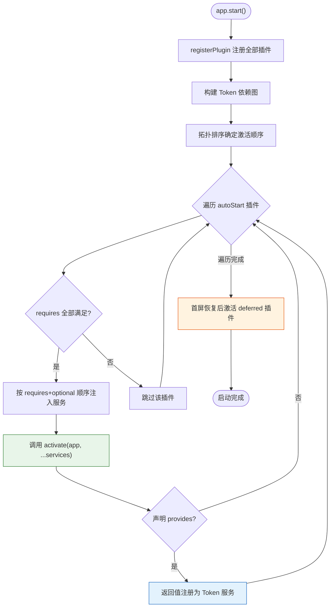

## 插件即一切

JupyterLab 最重要的架构决策是"插件即一切"。文件浏览器、Notebook、菜单、命令面板、终端、状态栏、主题——所有功能都以插件形式实现。核心框架 `@jupyterlab/application` 只提供应用壳（`JupyterFrontEnd`/`JupyterLab`）、Shell 布局、插件注册/激活机制和 Token 依赖注入（F-043）。`@jupyterlab/application-extension` 则作为核心应用扩展插件，注册默认命令、布局恢复和前端路由（F-044）。

## Token：运行时类型标识

Token 是依赖注入系统的核心，来自 `@lumino/coreutils` 的 `Token<T>` 类（`packages/application/src/frontend.ts:11`）。Token 是一个带有唯一字符串标识符的对象，在运行时充当服务的"键"。TypeScript 的类型信息在编译后会被擦除，Token 提供了一种在运行时定位服务实例的机制。

每个核心服务都有对应的 Token，定义在各自包的 `tokens.ts` 中。`@jupyterlab/application` 包定义了以下核心 Token：

| Token | 定义位置 | 提供的服务 |
|-------|---------|-----------|
| `ILabShell` | `shell.ts:75` | LabShell 布局容器，继承 `LabShell` 接口 |
| `IRouter` | `tokens.ts:89` | URL 路由系统，支持 `register`/`navigate`/`route` |
| `ILabStatus` | `tokens.ts:40` | 应用 busy/dirty 状态管理 |
| `IConnectionLost` | `tokens.ts:16` | 服务器连接丢失时的对话框处理函数 |
| `IPaths` | `frontend.ts:331` | 应用 URL 和服务器目录路径信息 |
| `ITreeResolver` | `frontend.ts:396` | tree 路由路径解析器 |

其他功能包也通过 Token 暴露服务，例如 `INotebookTracker`（`@jupyterlab/notebook`）、`ICommandPalette`（`@jupyterlab/apputils`）、`ISettingRegistry`（`@jupyterlab/settingregistry`）、`IStateDB`（`@jupyterlab/statedb`）、`IDocumentManager`（`@jupyterlab/docmanager`）等（F-047、F-049、F-051、F-053、F-067）。

## JupyterFrontEndPlugin 接口

插件是一个实现 `JupyterFrontEndPlugin` 接口的对象。该类型定义在 `packages/application/src/frontend.ts:25-29`：

```typescript
export type JupyterFrontEndPlugin<
  T,
  U extends JupyterFrontEnd.IShell = JupyterFrontEnd.IShell,
  V extends string = 'desktop' | 'mobile'
> = IPlugin<JupyterFrontEnd<U, V>, T>;
```

它本质上是 Lumino `IPlugin` 接口的特化，将应用类型固定为 `JupyterFrontEnd`。插件对象包含以下字段：

| 字段 | 类型 | 说明 |
|------|------|------|
| `id` | `string` | 唯一标识符，格式为 `npm包名:插件名`，如 `@jupyterlab/notebook-extension:tracker` |
| `description` | `string` | 插件描述（可选），供插件管理器 UI 展示 |
| `autoStart` | `boolean` | 是否在应用启动时自动激活，默认 `true` |
| `requires` | `Token<any>[]` | 必需依赖的 Token 列表，必须全部满足才能激活 |
| `optional` | `Token<any>[]` | 可选依赖的 Token 列表，不满足时注入 `null` |
| `provides` | `Token<T>` | 本插件激活后提供的服务 Token，对应 `activate` 返回值 |
| `activate` | `(app, ...services) => T \| Promise<T> \| void` | 激活函数，参数按 `requires` + `optional` 声明顺序注入 |

以 `@jupyterlab/notebook-extension` 的 widget-factory 插件为例（`packages/notebook-extension/src/index.ts:1006-1025`）：

```typescript
const widgetFactoryPlugin: JupyterFrontEndPlugin<NotebookWidgetFactory.IFactory> = {
  id: '@jupyterlab/notebook-extension:widget-factory',
  description: 'Provides the notebook widget factory.',
  provides: INotebookWidgetFactory,
  requires: [NotebookPanel.IContentFactory, IEditorServices, IRenderMimeRegistry, IToolbarWidgetRegistry],
  optional: [ISettingRegistry, ISessionContextDialogs, ITranslator, IPageHandler],
  activate: activateWidgetFactory,
  autoStart: true
};
```

## 插件注册与激活

`JupyterFrontEnd` 继承自 Lumino 的 `Application<T>` 基类（`frontend.ts:42-45`），后者提供了完整的插件生命周期管理方法：

- **`registerPlugin(plugin)`**：注册插件到应用，将其加入内部插件表。`JupyterLab` 类在 `lab.ts:108` 调用此方法注册每个插件。
- **`hasPlugin(id)`**：检查指定 ID 的插件是否已注册。
- **`getPluginDescription(id)`**：获取插件的描述文本。
- **`activatePlugin(id)`**：手动激活指定插件。在 `lab.ts:51` 中，deferred 插件通过此方法在首屏恢复后批量激活。
- **`registerPluginModule(mod)`**：`JupyterLab` 扩展的方法（`lab.ts:173`），从一个模块对象中注册所有导出的插件。

应用启动时（`app.start()`），框架执行以下激活流程：

1. 所有已注册插件根据 `requires` 和 `optional` 声明构建依赖图
2. 框架按**拓扑排序**确定激活顺序：被依赖的插件（`provides` 匹配其他插件的 `requires`）先激活
3. 遍历 `autoStart: true` 的插件，检查其 `requires` 中的 Token 是否都有提供者
4. 满足条件的插件调用 `activate(app, ...services)`，框架自动将 `requires` 和 `optional` 声明的服务按顺序注入
5. 若插件声明了 `provides`，`activate` 的返回值被注册到 Token 映射表，供后续插件使用
6. `requires` 未满足的插件跳过（不激活）；`optional` 未满足时对应参数传入 `null`



JupyterLab 还支持通过 `page_config_data` 中的 `deferred` 和 `disabled` 模式配置插件延迟激活或禁用（F-167）。核心扩展包共有 46 个 extensions 和 5 个 mimeExtensions（F-074、F-138）。

## 依赖注入模式

插件的 `activate` 函数参数由框架自动注入，注入规则严格遵循声明顺序：先是 `requires` 数组中的 Token 对应服务，然后是 `optional` 数组中的 Token 对应服务（可能为 `null`）。第一个参数始终是 `JupyterFrontEnd` 应用实例。

```typescript
// activate 函数参数与 requires/optional 的对应关系
requires: [A, B],        // → 第 2、3 个参数
optional: [C, D]         // → 第 4、5 个参数（可能为 null）
activate: (app, a, b, c, d) => { ... }
```

提供服务的插件通过 `provides` Token + `activate` 返回值注册服务。服务可以是任何对象——一个 API 接口、一个 Widget 追踪器、一个工厂实例。例如 `@jupyterlab/notebook-extension:tracker` 插件提供 `INotebookTracker`，其 `activate` 函数返回一个 `NotebookTracker` 实例，其他插件通过 `requires: [INotebookTracker]` 即可获取该追踪器（F-047）。

## 插件间通信模式

JupyterLab 插件之间有三种主要通信方式：

**1. Token 服务注入（主要方式）**：最常用的解耦通信方式。插件通过 `requires`/`optional` 注入其他插件提供的服务对象，直接调用其方法或访问其属性。

**2. CommandRegistry 命令**：插件通过 `app.commands.addCommand(id, options)` 注册命令，其他插件通过 `app.commands.execute(id, args)` 调用。命令系统支持标签、图标、快捷键绑定，是跨插件功能调用的松耦合方式。`@jupyterlab/application-extension:commands` 插件就注册了大量核心命令如 `application:reset-layout`、`tab-close`、`activate-next-tab` 等（F-044）。

**3. Signal/Slot 事件**：Lumino 的 `@lumino/signaling` 提供发布-订阅模式（F-145）。服务对象暴露 `ISignal`，其他插件通过 `signal.connect(slot)` 监听事件。例如 `INotebookTracker.currentChanged` 在当前 Notebook 切换时发射信号，`ILabStatus.busySignal` 在应用忙闲状态变化时发射。

此外，`WidgetTracker<T>` 是一种常用的服务模式，用于追踪特定类型的 Widget 实例，提供 `currentWidget`、`widgetAdded`、`forEach()` 等 API（F-047）。追踪器本身通常作为 `provides` 的返回值暴露为 Token 服务，使其他插件能够响应当前活动文档的切换。

## 插件 ID 命名与多插件包

插件 ID 遵循 `<package-name>:<plugin-name>` 格式。同一个 npm 包可以导出多个 `JupyterFrontEndPlugin` 对象，通过冒号后的名称区分。例如 `@jupyterlab/notebook-extension` 包导出了 `tracker`、`factory`、`widget-factory`、`tools`、`kernel-status`、`code-console`、`cloned-outputs`、`copy-output`、`cell-executor`、`log-output`、`page-handler` 等十余个插件（F-074），每个插件负责一个独立的功能切片。这种细粒度的插件拆分使得各功能之间通过 Token 解耦，单个插件的禁用不会影响其他功能。核心功能扩展包共有 36 个（F-074），加上 6 个 MIME 渲染扩展包（F-073），构成了 JupyterLab 的完整前端功能集。

## 核心扩展示例

**application-extension**（F-044）注册了多个插件：`commands` 插件注册 Shell 相关命令（关闭标签页、切换标签页、重置布局等）；`top-bar` 插件注册顶部工具栏；路由插件通过 `IRouter.register()` 注册 URL 路由规则。

**notebook-extension**（F-047、F-074）注册了十余个插件：`factory` 插件提供 `NotebookPanel.IContentFactory`；`widget-factory` 插件创建 `NotebookWidgetFactory` 并通过 `app.docRegistry.addWidgetFactory(factory)` 注册到 DocumentRegistry（`index.ts:1729`）；`tracker` 插件提供 `INotebookTracker`，追踪所有打开的 NotebookPanel 实例；另外还有 `tools`、`kernel-status`、`code-console`、`cloned-outputs` 等插件分别注册工具面板、内核状态、控制台、输出克隆等功能。

## 相关概念

- [00 概述与知识地图](/concepts/00-introduction.md)
- [01 整体架构概览](/concepts/01-architecture-overview.md)
- [02 应用框架与 Shell 布局](/concepts/02-application-shell.md)
- [04 服务层与后端通信](/concepts/04-service-layer.md)
- [05 文档注册与 Widget 工厂](/concepts/05-document-widget-system.md)
- [06 Notebook 与 Cell 架构](/concepts/06-notebook-cells.md)
- [07 扩展生态系统](/concepts/07-extension-ecosystem.md)
- [08 构建系统与运行模式](/concepts/08-build-and-modes.md)
- [09 关键子系统](/concepts/09-key-subsystems.md)
