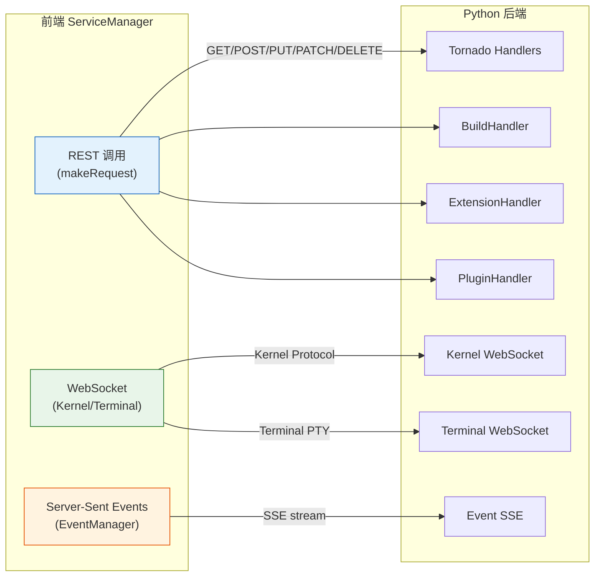

## ServiceManager：后端服务的统一入口

`ServiceManager` 是 JupyterLab 前端与 Python 后端通信的核心聚合类（[F-009](/references/source-code-map.md)），位于 `packages/services/src/manager.ts`。它实现 `IServiceManager` 接口，聚合了 12 个子管理器实例（[F-009](/references/source-code-map.md)）：

```mermaid
flowchart TB
    SM["ServiceManager"] --> SRV["serverSettings<br/>ServerConnection.ISettings"]
    SM --> SES["sessions<br/>SessionManager"]
    SM --> KM["kernels<br/>KernelManager"]
    SM --> KSM["kernelspecs<br/>KernelspecManager"]
    SM --> SETM["settings<br/>SettingManager"]
    SM --> TM["terminals<br/>TerminalManager"]
    SM --> BM["builder<br/>BuildManager"]
    SM --> CM["contents<br/>ContentsManager"]
    SM --> EM["events<br/>EventManager"]
    SM --> WM["workspaces<br/>WorkspaceManager"]
    SM --> NBM["nbconvert<br/>NbConvertManager"]
    SM --> UM["user<br/>UserManager"]

    style SM fill:#e3f2fd,stroke:#1565c0,stroke-width:2px
    style CM fill:#e8f5e9,stroke:#2e7d32
    style KM fill:#fff3e0,stroke:#e65100
    style SES fill:#fff3e0,stroke:#e65100
```



### ServiceManager 构造与初始化

`ServiceManager` 通过 options 构造（[manager.ts#L97-L156](file:///d:/spaces/SpecWeave/external/libs/jupyter/jupyterlab/packages/services/src/manager.ts#L97-L156)），关键参数：

```typescript
interface IOptions {
  serverSettings?: ServerConnection.ISettings;  // 服务器连接配置
  standby?: 'when-hidden' | 'never' | 'always'; // 轮询策略（默认 when-hidden）
  wsUrl?: string;                               // WebSocket URL
  kernels?: Kernel.IManager;                    // 自定义 kernel 管理器
  contents?: Contents.IManager;                 // 自定义 contents 管理器
  // ... 其他子管理器可自定义注入
}
```

构造后，`ready` Promise 在所有子管理器完成首次 fetch 后 resolve。`isReady` 标志指示服务管理器是否就绪。

### Standby 模式（性能优化）

`standby` 选项控制网络轮询行为（[F-012](/references/source-code-map.md)）：

| 模式 | 行为 |
|------|------|
| `'when-hidden'`（默认） | 页面不可见时暂停轮询（节省资源） |
| `'never'` | 始终轮询（适合后台计算场景） |
| `'always'` | 始终维持连接（旧模式，已 deprecated） |

通过 Page Visibility API（`document.visibilityState`）检测页面可见性，在 `visibilitychange` 事件中切换轮询状态。

## 子管理器详解

### ContentsManager（文件内容管理）

`ContentsManager` 负责文件/目录的 CRUD 操作（[F-011](/references/source-code-map.md)），对应后端 `/api/contents/` REST API：

| 方法 | HTTP | API 路径 | 说明 |
|------|------|---------|------|
| `get(path, options)` | GET | `/api/contents/{path}` | 获取文件/目录内容 |
| `save(path, options)` | PUT | `/api/contents/{path}` | 保存文件 |
| `newUntitled(options)` | POST | `/api/contents/` | 创建新文件/目录 |
| `delete(path)` | DELETE | `/api/contents/{path}` | 删除文件/目录 |
| `rename(path, newPath)` | PATCH | `/api/contents/{path}` | 重命名/移动文件 |
| `copy(path, toDir)` | POST | `/api/contents/{toDir}` | 复制文件 |
| `createCheckpoint(path)` | POST | `/api/contents/{path}/checkpoints` | 创建检查点 |
| `listCheckpoints(path)` | GET | `/api/contents/{path}/checkpoints` | 列出检查点 |
| `restoreCheckpoint(path, id)` | POST | `/api/contents/{path}/checkpoints/{id}` | 恢复到检查点 |

`ContentsManager` 还暴露 `fileChanged` 信号，在文件创建/保存/删除/重命名时发射。

文件模型 `Contents.IModel` 包含：`name`, `path`, `type`（'file'|'directory'|'notebook'）, `content`, `format`, `mimetype`, `size`, `writable`, `created`, `last_modified`。

### SessionManager（会话管理）

`SessionManager` 管理内核会话（[F-013](/references/source-code-map.md)），对应 `/api/sessions/` API。会话（session）将一个文档（通常是 Notebook 或 Console）绑定到一个 Kernel 实例。

| 方法 | 说明 |
|------|------|
| `startNew(options)` | 启动新会话（创建内核+连接文档） |
| `refreshRunning()` | 刷新运行中会话列表 |
| `stopIfNeeded(path)` | 如果路径不再需要内核，停止对应会话 |
| `running()` 迭代器 | 遍历当前运行中的会话 |

关键信号：`runningChanged`（会话列表变化）、`connectionStatusChanged`（连接状态变化）。

### KernelManager（内核管理）

`KernelManager` 直接管理 Kernel 实例的生命周期（[F-011](/references/source-code-map.md)）：

| 方法 | 说明 |
|------|------|
| `startNew(options)` | 启动新内核进程 |
| `refreshRunning()` | 刷新运行中内核列表 |
| `interruptKernel(id)` | 中断内核（发送 SIGINT） |
| `restartKernel(id)` | 重启内核 |
| `shutdown(id)` | 关闭内核 |
| `connectTo(options)` | 连接到已有内核（WebSocket 连接） |

`KernelManager` 管理的 `IKernelConnection` 接口提供：
- **Shell channel**：发送代码执行请求（`execute()`），接收执行结果
- **IOPub channel**：接收内核输出（stdout、stderr、display_data、error 等）
- **Stdin channel**：内核请求输入（如 Python 的 `input()`）
- **Control channel**：控制命令（中断、重启、调试等）
- **HB channel**：心跳检测（判断内核是否存活）

### KernelspecManager（内核规格管理）

获取可用内核的规格信息（名称、显示名、语言、资源文件路径等），对应 `/api/kernelspecs` API。

### TerminalManager（终端管理）

管理终端会话，对应 `/api/terminals/` API：
- `startNew()` 创建新终端
- `connectTo(name)` 连接到已有终端（WebSocket 连接到终端 PTY）
- `refreshRunning()` 刷新运行中终端列表
- `runningChanged` 信号通知终端列表变化

### SettingManager（设置管理）

管理前端扩展的用户设置（JSON Schema 驱动），对应 `/api/settings/` API：
- `fetch(id)` 获取某个插件的设置
- `save(id, raw)` 保存设置
- `upload()/download()` 批量导入/导出设置
- `changed` 信号通知设置变化

### EventManager（事件管理）

通过 Server-Sent Events（SSE）监听后端事件（如内核启动完成、文件变化等），对应 `/api/events` 端点。`EventManager` 维护一个 `EventStream`，支持订阅事件。

### WorkspaceManager（工作区管理）

管理工作区布局状态（哪个文件打开在哪个位置），对应 `/api/workspaces/` API。工作区可以保存/加载/列出/删除。

### BuildManager（构建管理）

管理前端资源构建（仅在开发模式下使用），提供 `build()`、`shouldCheck`、`isAvailable` 等属性和方法，通过 `/lab/api/build` WebSocket 端点与后端的 Builder handler 通信。

### NbConvertManager（导出管理）

管理通过 nbconvert 导出 Notebook 为其他格式（HTML、PDF、Markdown、Python 脚本等），对应 `/api/nbconvert/` API：
- `getExportFormats()` 获取可用导出格式列表
- `getExportUrl(path, format)` 获取导出文件 URL

### UserManager（用户管理）

获取当前用户信息（在 JupyterHub 等多用户环境下使用），对应 `/api/me` API。

## ServerConnection：通信基础设施

所有子管理器的底层通信都通过 `ServerConnection` 模块（[F-014](/references/source-code-map.md)），位于 `packages/services/src/serverconnection.ts`。它提供：

### 配置对象 ServerConnection.ISettings

```typescript
interface ISettings {
  readonly baseUrl: string;          // 后端基础 URL（如 http://localhost:8888/）
  readonly wsUrl: string;            // WebSocket URL（如 ws://localhost:8888/）
  readonly token: string;            // 认证 token
  readonly init: RequestInit;        // fetch 默认参数（headers 等）
  readonly ajaxSettings: ISettings;  // 兼容旧版
  readonly fetch: (input: RequestInfo, init?: RequestInit) => Promise<Response>;
  readonly Headers: typeof Headers;
  readonly Request: typeof Request;
  readonly WebSocket: typeof WebSocket;
}
```

默认配置通过 `PageConfig` 获取（`baseUrl`, `wsUrl`, `token` 等），使用浏览器原生 `fetch` 和 `WebSocket`。

### makeRequest：统一 HTTP 请求

`ServerConnection.makeRequest(url, init, settings)` 是所有 REST API 调用的统一入口：

1. 自动添加 `Authorization: token <token>` 头
2. 处理 `X-XSRFToken` 防跨站请求伪造
3. 统一错误处理：将 HTTP 错误响应封装为 `ServerConnection.ResponseError`
4. 支持自定义 fetch 实现（便于测试和代理）

### WebSocket 连接

内核和终端的实时通信使用 WebSocket。`ServerConnection` 提供 `makeSettings()` 来获取正确的 WebSocket URL 和 token，自动处理：
- 将 `http://` 替换为 `ws://`，`https://` 替换为 `wss://`
- 在 URL 参数中添加 `token=<token>` 用于认证
- 支持通过 `WIDGETS_WS_URL` 等环境变量配置代理

## 通信协议总结



| 通信方式 | 协议 | 使用场景 |
|---------|------|---------|
| REST API | HTTP (fetch) | 文件操作、会话管理、设置、内核规格、用户信息、nbconvert |
| WebSocket | ws/wss | 内核通信（execute/iopub）、终端 PTY、构建进度 |
| SSE | HTTP text/event-stream | 后端事件流（EventManager） |

## Kernel Protocol（内核协议）

前端与 Kernel 之间通过 WebSocket 传递 Jupyter Kernel Protocol 消息。消息是 JSON 对象，格式如下：

```json
{
  "channel": "shell" | "iopub" | "stdin" | "control" | "hb",
  "header": {
    "msg_id": "uuid",
    "msg_type": "execute_request" | "execute_reply" | "stream" | "display_data" | ...,
    "username": "username",
    "session": "session-uuid",
    "date": "ISO8601 timestamp",
    "version": "5.5"
  },
  "parent_header": { ... },
  "metadata": { ... },
  "content": { ... },
  "buffers": [ ... ]
}
```

核心消息类型：
- **Shell channel**：`execute_request` → `execute_reply`（执行代码，返回执行计数和状态）
- **IOPub channel**：`stream`（stdout/stderr输出）、`display_data`（富媒体输出）、`execute_result`（执行结果）、`error`（错误 traceback）、`status`（busy/idle/starting 状态变化）
- **Stdin channel**：`input_request` → `input_reply`（内核请求用户输入）
- **Control channel**：`interrupt_request`、`shutdown_request`、`debug_request` 等控制命令
- **HB channel**：心跳包（ping/pong），检测内核存活

## 相关概念

- [01 整体架构概览](/concepts/01-architecture-overview.md)
- [03 插件系统与依赖注入](/concepts/03-plugin-system.md)
- [05 文档注册与 Widget 工厂](/concepts/05-document-widget-system.md)
- [09 关键子系统 - PageConfig](/concepts/09-key-subsystems.md)
- [源码文件地图](/references/source-code-map.md)
