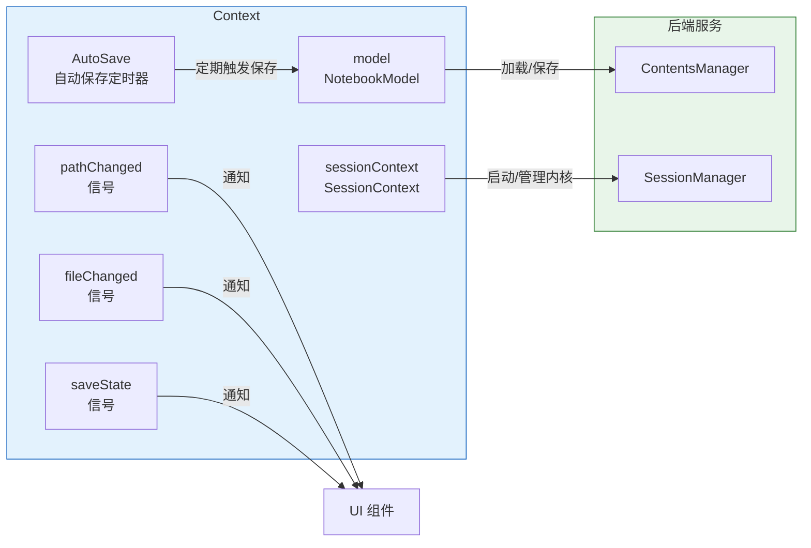
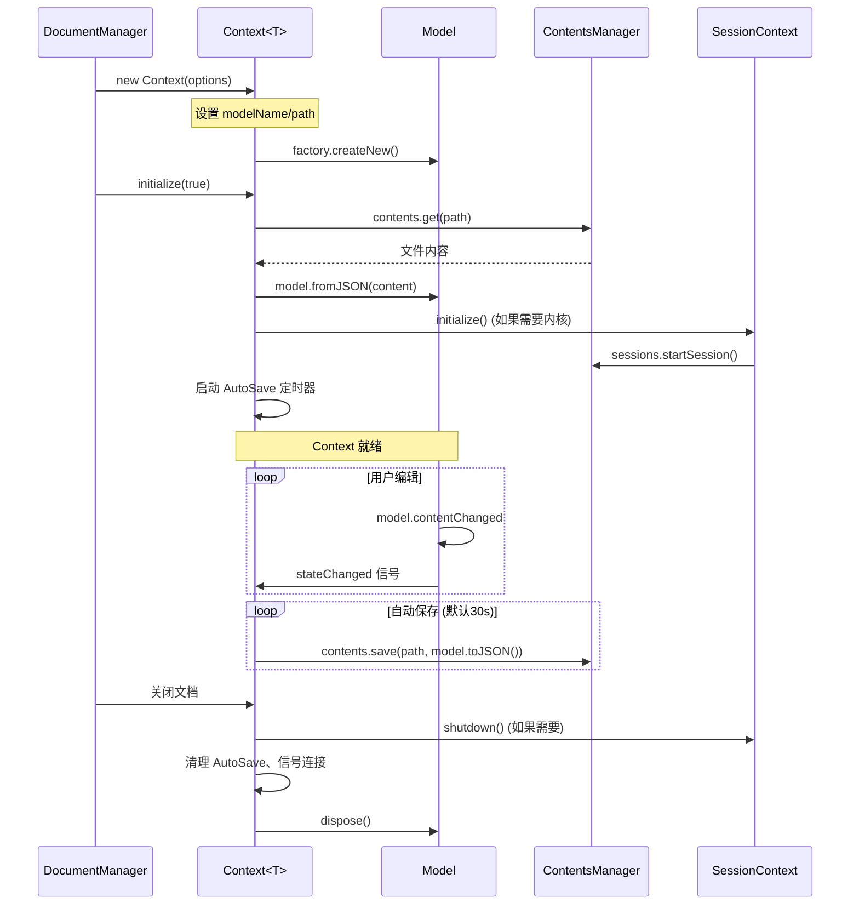
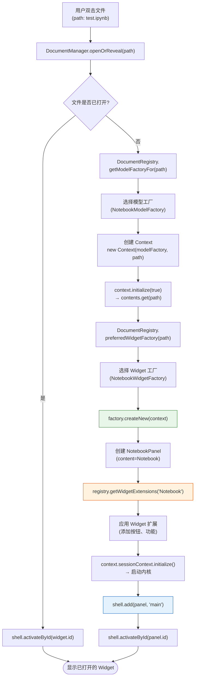

## DocumentRegistry：文档系统的注册中心

`DocumentRegistry` 是 JupyterLab 文档系统的核心（[F-008](/references/source-code-map.md)），位于 `packages/docregistry/src/registry.ts`。它维护了文件类型→模型工厂→Widget 工厂的映射关系，决定了不同类型的文件如何被打开、编辑和显示。

### DocumentRegistry 维护的 9 个私有映射表（[F-008](/references/source-code-map.md)）

| 映射表 | 类型 | 用途 |
|--------|------|------|
| `_modelFactories` | `Map<string, IModelFactory>` | 模型工厂注册表（模型名 → 工厂） |
| `_widgetFactories` | `Map<string, IWidgetFactory>` | Widget 工厂注册表（工厂名 → 工厂） |
| `_defaultWidgetFactory` | `string` | 默认 Widget 工厂名 |
| `_defaultWidgetFactoryOverrides` | `Map<string, string>` | 特定文件类型的默认 Widget 工厂覆盖 |
| `_defaultWidgetFactories` | `Map<string, string>` | 文件类型 → 默认 Widget 工厂映射 |
| `_defaultRenderedWidgetFactories` | `Map<string, string>` | 文件类型 → 默认渲染 Widget 工厂映射 |
| `_widgetFactoriesForFileType` | `MultiDict<string, string>` | 文件类型 → 可用 Widget 工厂列表（一对多） |
| `_fileTypes` | `FileType[]` + `Map<string, number>` | 文件类型定义列表和名称索引 |
| `_extenders` | `MultiDict<string, IWidgetExtension>` | Widget 扩展注册表（工厂名 → 扩展列表） |

### 核心接口

#### IModelFactory（模型工厂）

模型工厂负责为特定文档类型创建数据模型：

```typescript
interface IModelFactory<T extends IModel = IModel> {
  readonly name: string;                          // 工厂名称（唯一标识）
  readonly contentType: ContentType;              // 'notebook' | 'file' | 'string'
  readonly fileFormat: FileFormat;                // 'json' | 'text' | 'base64'
  createNew(options?: IModelOptions): T;          // 创建新模型
  preferredPath(path: string): string;            // 计算偏好的文件路径
}
```

JupyterLab 内置的模型工厂：
- **`Base64ModelFactory`**：二进制文件模型（图片、PDF 等）
- **`TextModelFactory`**：纯文本文件模型
- Notebook 包提供 **`NotebookModelFactory`**

#### IWidgetFactoryOptions

Widget 工厂选项定义了工厂的行为特征：

```typescript
interface IWidgetFactoryOptions<T extends IDocumentWidget> {
  readonly name: string;                          // 工厂名称（唯一标识，如 'Notebook'）
  readonly label: string;                         // 显示名称（如 'Notebook'）
  readonly fileTypes: string[];                   // 支持的文件类型（如 ['notebook']）
  readonly defaultFor?: string[];                 // 作为哪些类型的默认打开方式
  readonly defaultRendered?: string[];             // 作为哪些类型的默认渲染方式
  readonly modelName?: string;                    // 使用的模型名称（默认 'text'）
  readonly preferKernel?: boolean;                // 是否偏好关联内核
  readonly canStartKernel?: boolean;               // 是否可以启动内核
  readonly readOnly?: boolean;                    // 是否只读
  readonly toolbarFactory?: (widget: T) => IToolbarItem[];  // 工具栏工厂
  readonly shutdownOnClose?: boolean;              // 关闭时是否关闭内核
}
```

#### IWidgetFactory<T>（Widget 工厂）

Widget 工厂负责创建和管理文档 Widget 实例：

```typescript
interface IWidgetFactory<T extends IDocumentWidget = IDocumentWidget>
  extends IWidgetFactoryOptions<T>, IDisposable {
  createNew(context: IContext<T>, source?: T): T;  // 创建新 Widget
  widgetCreated: ISignal<IWidgetFactory<T>, T>;    // Widget 创建信号
}
```

关键实现：
- **`NotebookWidgetFactory`**：创建 NotebookPanel
- **`EditorWidgetFactory`**（fileeditor 包）：创建文件编辑器 Widget

### 文件类型注册：addFileType

```typescript
registry.addFileType({
  name: 'notebook',                               // 文件类型唯一名称
  displayName: 'Notebook',                        // 显示名
  extensions: ['.ipynb'],                         // 扩展名列表
  mimeTypes: ['application/x-ipynb+json'],       // MIME 类型
  contentType: 'notebook',                        // 内容类型
  fileFormat: 'json',                             // 文件格式
  icon: 'ui-components:notebook-icon',            // 图标
});
```

`addFileType()` 注册文件类型后，还会自动建立文件类型到模型工厂的映射（根据 `fileFormat` 选择默认模型）。

### Widget 工厂注册：addWidgetFactory

```typescript
registry.addWidgetFactory(
  new NotebookWidgetFactory({
    name: 'Notebook',
    fileTypes: ['notebook'],
    defaultFor: ['notebook'],
    // ...
  }),
  ['default-notebook-widget-factory']             // 激活顺序的 Token
);
```

### Widget 扩展（WidgetExtension）

Widget 扩展是一个重要概念——它允许插件为其他工厂创建的 Widget 添加额外功能（[F-008](/references/source-code-map.md)）：

```typescript
interface IWidgetExtension<T extends IDocumentWidget> {
  createNew(widget: T): IDisposable;              // 为 Widget 添加功能，返回清理资源的 disposable
}

// 注册扩展
registry.addWidgetExtension('Notebook', {
  createNew: (widget: NotebookPanel) => {
    // 为每个 Notebook 面板添加自定义按钮
    const button = new ToolbarButton({ label: 'Custom', onClick: () => {} });
    widget.toolbar.insertItem(10, 'custom', button);
    return new DisposableDelegate(() => button.dispose());
  }
});
```

WidgetExtension 机制使得插件可以在不修改原始工厂代码的情况下，为 Notebook、Editor 等文档 Widget 注入额外功能。

## Context：文档上下文

`Context<T extends IModel>` 是一个文档的运行时上下文（[F-029](/references/source-code-map.md)），位于 `packages/docregistry/src/context.ts`。它封装了：

1. **数据模型**（`model: T`）：当前文档的数据模型
2. **文件路径**（`path: string`）：在服务器上的路径
3. **会话上下文**（`sessionContext: ISessionContext`）：关联的 Kernel 会话（如果需要）
4. **保存状态**（`saveState: Signal<Context<T>, SaveState>`）：started/completed/failed
5. **文件内容管理**：与 ContentsManager 交互，负责加载/保存/自动保存/重命名/撤销/恢复检查点

### Context 的核心职责



### Context 的生命周期



### SaveState 状态机

Context 的保存状态有三种：
- `'started'`：开始保存
- `'completed'`：保存成功
- `'failed'`：保存失败

## DocumentWidget：文档 Widget 基类

`DocumentWidget<T extends Widget, U extends IModel>` 是所有文档 Widget 的基类（[F-028](/references/source-code-map.md)），继承自 Lumino 的 `Widget`：

```typescript
class DocumentWidget<T extends Widget, U extends IModel> extends Widget {
  readonly content: T;                             // 文档内容 Widget（如 Notebook）
  readonly context: IContext<U>;                   // 文档上下文
  readonly toolbar: Toolbar<Widget>;               // 工具栏
  readonly revealed: Promise<void>;                // 内容首次显示的 Promise
  // ...
}
```

`NotebookPanel` 继承自 `DocumentWidget<Notebook, INotebookModel>`（[F-027](/references/source-code-map.md)），content 是 `Notebook` widget。

## 文档打开全流程

当用户双击文件浏览器中的文件时，完整流程如下：



### 文件类型链：扩展名 → 文件类型 → 工厂

文件打开时的工厂选择遵循"文件类型链"：

```
文件路径 (test.ipynb)
  → 根据扩展名匹配文件类型 (.ipynb → 'notebook')
    → 根据文件类型选择模型工厂 (fileFormat='json' → NotebookModelFactory)
    → 根据文件类型选择 Widget 工厂
      → defaultWidgetFactoryOverrides 是否有覆盖？
      → defaultWidgetFactories 是否有映射？
      → defaultRenderedWidgetFactories 是否有渲染工厂？
      → 默认工厂 _defaultWidgetFactory
```

### "Open With" 菜单

一个文件类型可以注册多个 Widget 工厂（`_widgetFactoriesForFileType`），这就是 JupyterLab "Open With" 子菜单的实现基础。例如 Markdown 文件可以用编辑器打开，也可以用 Markdown 预览打开。

## 文档系统三层扩展点

JupyterLab 的文档系统提供了三个扩展层次：

| 扩展点 | 接口 | 作用 | 示例 |
|--------|------|------|------|
| **L1 模型工厂** | `IModelFactory` | 定义新的文档数据模型 | 自定义 JSON 模型 |
| **L2 Widget 工厂** | `IWidgetFactory` | 定义文档如何渲染和交互 | Notebook、编辑器、CSV 查看器 |
| **L3 Widget 扩展** | `IWidgetExtension` | 为已有 Widget 添加功能 | 为 Notebook 添加按钮/菜单项 |

这三个层次遵循开闭原则：通过 L3 扩展可以增强现有文档类型而不修改原有代码。

## DocumentManager vs DocumentRegistry

两者职责不同（[F-015](/references/source-code-map.md)）：
- **DocumentRegistry**：静态注册中心，只管理"什么类型用什么工厂"的映射关系，不管理 Widget 生命周期
- **DocumentManager**（`@jupyterlab/docmanager`）：运行时管理器，负责创建/查找/关闭 Context 和 Widget，管理 Widget 生命周期，与 Shell 交互

## 相关概念

- [04 服务层与后端通信](/concepts/04-service-layer.md)
- [06 Notebook 与 Cell 架构](/concepts/06-notebook-cells.md)
- [03 插件系统与依赖注入](/concepts/03-plugin-system.md)
- [自定义文件类型示例](/examples/02-custom-file-type.md)
- [源码文件地图](/references/source-code-map.md)
