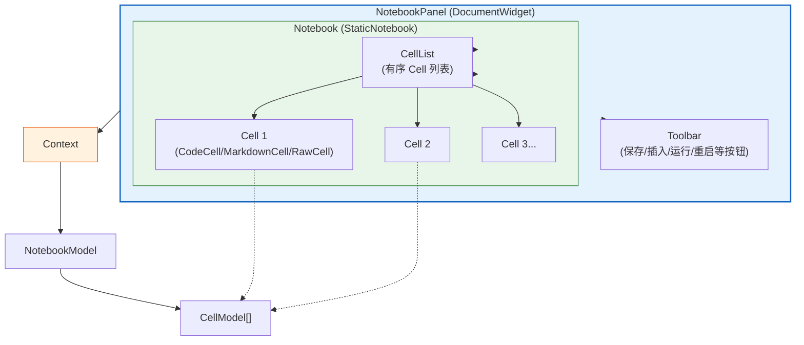
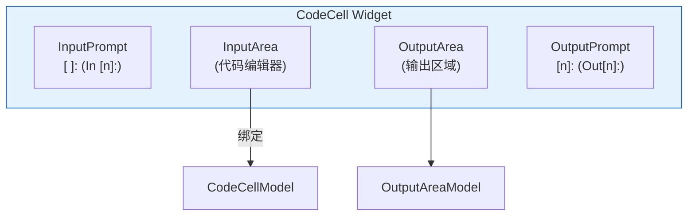
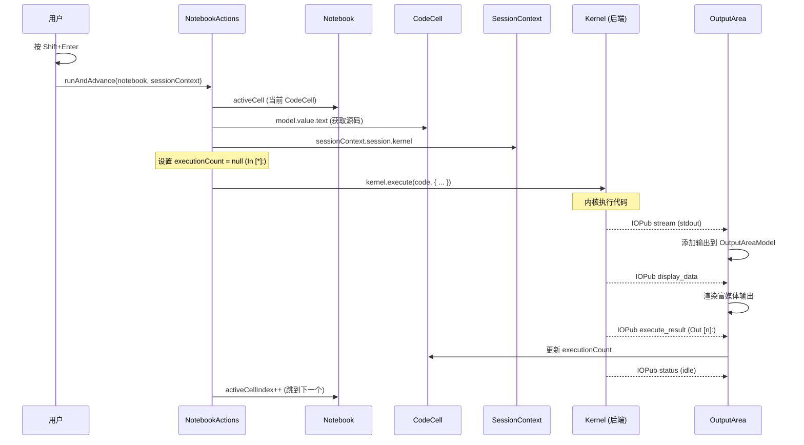

## Notebook 三层 Widget 结构

JupyterLab 的 Notebook UI 采用三层嵌套 Widget 结构（[F-027](/references/source-code-map.md)）：



### 第一层：NotebookPanel

`NotebookPanel` 继承自 `DocumentWidget<Notebook, INotebookModel>`（[F-027](/references/source-code-map.md)），位于 `packages/notebook/src/panel.ts`：

```typescript
class NotebookPanel extends DocumentWidget<Notebook, INotebookModel> {
  readonly content: Notebook;                // Notebook Widget
  readonly sessionContext: ISessionContext;  // 内核会话上下文
  readonly toolbar: Toolbar;                 // 工具栏
  readonly revealed: Promise<void>;          // 首次渲染完成

  // 信号
  kernelChanged: Signal<this, IKernelConnection>;
  sessionChanged: Signal<this, ISessionModel>;
  saveState: Signal<NotebookPanel, SaveState>;
}
```

NotebookPanel 在构造时：
1. 创建 `Notebook` widget 作为 content
2. 创建 `SessionContext`（连接内核）
3. 监听 `sessionContext.kernelChanged` 和 `sessionContext.statusChanged`，转发信号
4. 监听 `context.saveState` 转发保存状态
5. 连接模型变化：当 context 的 model 切换时，更新 Notebook 的 model
6. 工具栏按钮通过 `NotebookPanel.createToolbar(panel)` 静态方法创建（[F-027](/references/source-code-map.md)）

### 第二层：Notebook（StaticNotebook）

`Notebook` 类继承自 `StaticNotebook`（[F-026](/references/source-code-map.md)），位于 `packages/notebook/src/widget.ts`。它是 Notebook 的核心 Widget：

| 属性/方法 | 说明 |
|----------|------|
| `model: INotebookModel` | 数据模型（cells、metadata、nbformat 等） |
| `activeCellIndex: number` | 当前活跃 Cell 的索引 |
| `activeCell: Cell` | 当前活跃 Cell Widget |
| `widgets: readonly Cell[]` | 所有 Cell Widget 只读列表 |
| `mode: 'edit' \| 'command'` | 编辑模式/命令模式 |
| `addCell(index, cell)` | 插入 Cell |
| `moveCell(fromIndex, toIndex)` | 移动 Cell |
| `deleteCell(index)` | 删除 Cell |
| `select(index)` | 选中 Cell |
| `deselect(index)` | 取消选中 |
| `extendSelectionTo(index)` | 扩展选区 |
| `scrollToItem(index)` | 滚动到指定 Cell |
| `activeCellChanged` 信号 | 活跃 Cell 变化 |
| `stateChanged` 信号 | 状态变化 |
| `modelChanged` 信号 | 模型变化 |
| `selectionChanged` 信号 | 选区变化 |

`StaticNotebook` 包含编辑器无关的 Notebook 逻辑，`Notebook` 类添加了与 CodeMirror 编辑器的集成。

Notebook 在编辑/命令两种模式间切换：
- **Command 模式**：键盘快捷键生效（如按 B 插入下方 Cell），蓝色边框标记
- **Edit 模式**：焦点在 Cell 编辑器内，绿色边框标记，可直接输入代码/文本

### 第三层：Cell

`Cell` 类继承自 Lumino 的 `Widget`（[F-026](/references/source-code-map.md)），位于 `packages/cells/src/widget.ts`。它是所有 Cell 类型的抽象基类：

```typescript
class Cell<T extends ICellModel = ICellModel> extends Widget {
  readonly model: T;                          // Cell 数据模型
  readonly editor: CodeEditor.IEditor;        // 代码编辑器
  readonly readOnly: boolean;
  readonly inputArea: InputArea;              // 输入区域
  readonly editorWidget: Widget;              // 编辑器 Widget
  readonly node: HTMLElement;                 // DOM 节点

  // 状态
  isSelected: boolean;
  activeCell: boolean;
  mode: 'edit' | 'command';
  placeholder: boolean;
  scrollItemIntoView: boolean;
}
```

## 三种 Cell 类型

Cell 类层级如下（[F-026](/references/source-code-map.md)）：

```
Widget
  └── Cell<T>
        ├── CodeCell        (代码单元：执行代码+显示输出)
        ├── RawCell         (原始单元：不渲染、不执行)
        └── AttachmentsCell (附件单元：带附件的单元)
              └── MarkdownCell (Markdown单元：编辑/预览双模式)
```

### CodeCell（代码单元）

`CodeCell` 是最常用的 Cell 类型，包含三部分：



核心属性：
- `outputArea: OutputArea` — 输出区域 Widget，显示执行结果
- `model: ICodeCellModel` — 代码 Cell 模型（包含 `executionCount`、`outputs`）
- `executeCount: number | null` — 执行计数（In [n]/Out [n]）
- `outputs: IOuputAreaModel` — 输出模型（stdout、display_data、error 等）

执行代码时的行为：
1. 用户按 Shift+Enter
2. `NotebookActions.run(cell, sessionContext)` 被调用
3. 获取 Cell 源码文本
4. 通过 `sessionContext.session.kernel.execute()` 发送 execute_request 到内核
5. 内核返回的消息流（stream、execute_result、display_data、error）被追加到 OutputAreaModel
6. OutputArea Widget 监听模型变化，实时渲染输出

### MarkdownCell（Markdown 单元）

`MarkdownCell` 继承自 `AttachmentsCell`（[F-026](/references/source-code-map.md)），支持两种模式：

- **编辑模式**：显示 Markdown 源码编辑器（CodeMirror）
- **渲染模式**：渲染后的 Markdown（标题、列表、代码块、Mermaid 图表、数学公式等）

双击渲染的 Markdown Cell 切换到编辑模式，Ctrl+Enter 或 Shift+Enter 运行（渲染）。

MarkdownCell 支持附件（图片等内嵌资源），由 `AttachmentsCell` 基类处理。

### RawCell（原始单元）

`RawCell` 不渲染、不执行，内容原样显示。主要用于在导出（nbconvert）时保留原始文本。

## NotebookModel：Notebook 数据模型

`NotebookModel` 实现 `INotebookModel` 接口（[F-030](/references/source-code-map.md)），位于 `packages/notebook/src/model.ts`，管理 Notebook 的 JSON 数据：

```typescript
interface INotebookModel extends IModel {
  readonly cells: IObservableList<ICellModel>;  // Cell 模型列表（可观察）
  readonly metadata: IObservableJSON;            // Notebook 元数据
  readonly nbformat: number;                     // nbformat 版本（4）
  readonly nbformatMinor: number;                // nbformat 次版本（5）
  readonly defaultKernelLanguage: string;        // 默认内核语言
  readonly defaultKernelName: string;            // 默认内核名称
  activeCellIndex: number;                       // 活跃 Cell 索引
  readOnly: boolean;
}
```

### Cell 模型层级

```
ICellModel
  ├── IRawCellModel (RawCell)
  ├── IAttachmentsCellModel
  │     └── IMarkdownCellModel (MarkdownCell)
  └── ICodeCellModel (CodeCell)
        ├── executionCount: number | null
        ├── outputs: IOutputAreaModel
        ├── clearOnNextExecution: boolean
```

所有 Cell 模型都继承自 `ICellModel`：
```typescript
interface ICellModel extends ICodeEditor.IModel {
  type: 'code' | 'markdown' | 'raw';
  id: string;
  contentChanged: ISignal<this, void>;
  stateChanged: ISignal<this, IChangedArgs>;
  metadata: IObservableJSON;
  trusted: boolean;
  // from ICodeEditor.IModel:
  // value: IObservableString (Cell 文本内容)
  // mimeType: string
  // selections: IObservableMap
}
```

### 模型与 Widget 的绑定

Notebook Widget 通过 CellList（[F-031](/references/source-code-map.md)）维护 Widget 列表与模型列表的同步：

1. Notebook 构造时，监听 `model.cells.changed` 信号
2. 当模型列表变化（添加/删除/移动 Cell）时，自动创建/销毁/移动对应的 Cell Widget
3. Cell Widget 的 `model` 属性指向对应的 CellModel
4. Cell Widget 监听模型的 `contentChanged` 和 `stateChanged`，自动更新 UI

这是经典的 MVVM/MVC 模式——模型是 JSON 数据，Widget 是视图，Notebook 类充当控制器。

## NotebookActions：Notebook 操作集

`NotebookActions` 命名空间（位于 `packages/notebook/src/actions.tsx`）封装了所有 Notebook 级别的操作（[F-026](/references/source-code-map.md)）：

| 方法 | 功能 |
|------|------|
| `run(notebook, sessionContext)` | 运行当前 Cell |
| `runAll(notebook, sessionContext)` | 运行所有 Cell |
| `runAndAdvance(notebook, sessionContext)` | 运行并跳到下一个 Cell |
| `runAndInsert(notebook, sessionContext)` | 运行并插入新 Cell |
| `runSelected(notebook, sessionContext)` | 运行选中的 Cell |
| `insertAbove(notebook)` | 在上方插入 Cell |
| `insertBelow(notebook)` | 在下方插入 Cell |
| `deleteCells(notebook)` | 删除选中 Cell |
| `selectAbove(notebook)` | 选中上方 Cell |
| `selectBelow(notebook)` | 选中下方 Cell |
| `moveCellUp(notebook)` | 上移 Cell |
| `moveCellDown(notebook)` | 下移 Cell |
| `cut(notebook)` | 剪切 Cell |
| `copy(notebook)` | 复制 Cell |
| `paste(notebook)` | 粘贴 Cell |
| `changeCellType(notebook, type)` | 切换 Cell 类型（code/markdown/raw） |
| `splitCell(notebook)` | 分割 Cell |
| `mergeCells(notebook)` | 合并 Cell |
| `undo(notebook)` | 撤销 |
| `redo(notebook)` | 重做 |
| `toggleAllLineNumbers(notebook)` | 切换行号显示 |
| `clearAllOutputs(notebook)` | 清除所有输出 |
| `restartRunAll(notebook, sessionContext)` | 重启内核并运行所有 |

每个操作都是一个静态方法，接收 notebook widget 和 sessionContext 作为参数，修改 notebook model，Widget 自动响应模型变化。

## Cell 执行流程



## 工具栏默认按钮

`NotebookPanel.createToolbar()` 创建以下工具栏按钮（[F-027](/references/source-code-map.md)）：
- **保存**（Save）：保存 Notebook
- **插入**（Insert）：在下方插入 Cell
- **剪切/复制/粘贴**：Cell 编辑操作
- **运行**（Run）：运行当前 Cell
- **中断**（Stop）：中断内核
- **重启**（Restart）：重启内核
- **Cell 类型选择器**：切换 code/markdown/raw
- **命令面板**：打开命令面板
- **Kernel 指示器**：显示内核状态

## 相关概念

- [05 文档注册与 Widget 工厂模式](/concepts/05-document-widget-system.md)
- [04 服务层与后端通信](/concepts/04-service-layer.md)
- [03 插件系统与依赖注入](/concepts/03-plugin-system.md)
- [源码文件地图](/references/source-code-map.md)
