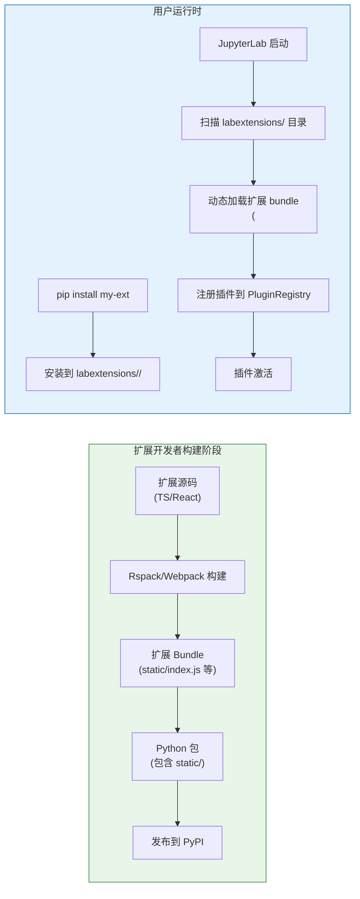
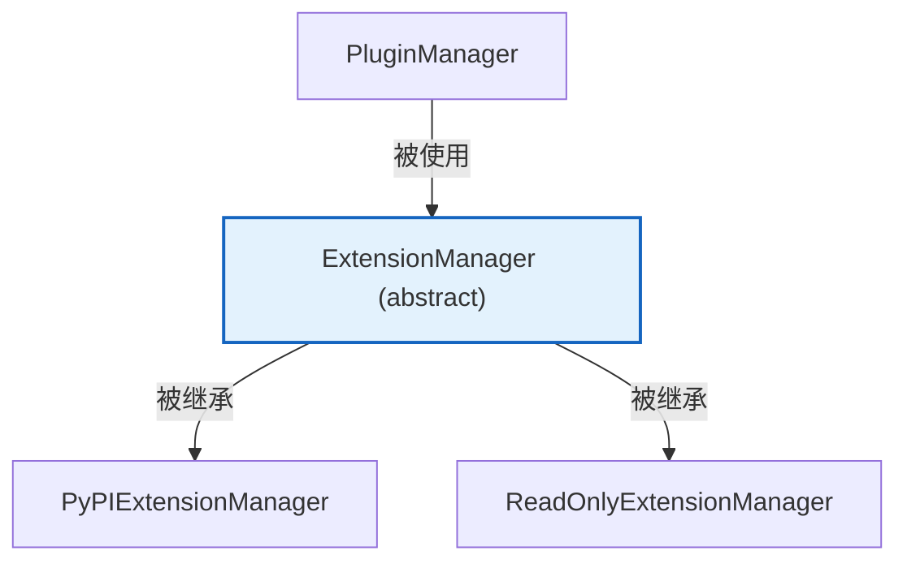
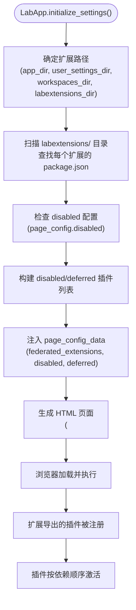

## 扩展类型演进

JupyterLab 的扩展系统经历了重要演进：

| 类型 | JupyterLab 版本 | 构建方式 | 安装方式 | 是否需要 node |
|------|----------------|---------|---------|--------------|
| **Source 扩展** | 1.x - 3.x | 与 JupyterLab 一起构建（webpack） | `jupyter labextension install <npm-pkg>` | ✅ 需要 |
| **Prebuilt (Federated) 扩展** | 3.0+ | 独立构建，运行时动态加载 | `pip install <python-pkg>` | ❌ 不需要 |

从 JupyterLab 3.0 开始，**prebuilt (federated) 扩展成为主流**。第三方扩展以独立 Python 包形式分发，通过 `pip install` 安装，包含预构建的 JS bundle，JupyterLab 启动时从 `labextensions/` 目录动态加载。这大大降低了扩展安装门槛——用户不再需要 Node.js 环境。

## Federated Extension（Prebuilt 扩展）

### 工作原理

Federated 扩展的核心思想是：扩展**独立于 JupyterLab 核心进行构建**，生成的 bundle 在运行时被 JupyterLab 动态加载。



### 扩展目录结构

一个标准的 prebuilt 扩展包含：

```
my-jupyterlab-extension/
├── package.json              # npm 包配置（含 jupyterlab._buildConfig）
├── pyproject.toml            # Python 包配置
├── setup.py                  # 或 setup.cfg
├── jupyter-config/
│   └── server-config/        # Jupyter Server 配置
│       └── my-ext.json
├── src/
│   └── index.ts              # 插件入口（导出 JupyterFrontEndPlugin[]）
└── my_ext/                   # Python 包
    ├── __init__.py
    └── labextension/         # 构建后的静态资源（安装到 share/jupyter/labextensions/）
        └── static/
            ├── index.js
            ├── index.js.map
            └── package.json
```

### _buildConfig 配置

扩展的 `package.json` 中的 `jupyterlab._buildConfig` 字段是 federated 构建的关键配置：

```json
{
  "name": "my-extension",
  "version": "1.0.0",
  "jupyterlab": {
    "extension": true,
    "outputDir": "my_ext/labextension",
    "_buildConfig": {
      "federated_extensions": [],
      "sharedPackages": {
        "@jupyterlab/application": {
          "singleton": true,
          "bundled": false,
          "requiredVersion": "^4.0.0"
        },
        "@jupyterlab/apputils": {
          "singleton": true,
          "bundled": false
        },
        "@lumino/widgets": {
          "singleton": true,
          "bundled": false
        },
        "react": {
          "singleton": true,
          "bundled": false
        },
        "react-dom": {
          "singleton": true,
          "bundled": false
        }
      }
    }
  }
}
```

关键概念：
- **sharedPackages**：声明共享依赖，这些包不会被打包进扩展 bundle，而是使用 JupyterLab 核心提供的实例。`singleton: true` 确保全局唯一实例，`bundled: false` 表示不打包到 bundle 中
- **federated_extensions**：声明依赖的其他 federated 扩展
- **outputDir**：构建输出目录（Python 包内的 labextension 目录）

### 扩展入口模块

扩展的 `src/index.ts` 导出插件数组：

```typescript
import { JupyterFrontEndPlugin } from '@jupyterlab/application';

const plugin1: JupyterFrontEndPlugin<void> = {
  id: 'my-extension:plugin1',
  autoStart: true,
  activate: (app) => {
    console.log('my-extension plugin1 activated!');
  }
};

const plugin2: JupyterFrontEndPlugin<void> = {
  id: 'my-extension:plugin2',
  autoStart: true,
  requires: [INotebookTracker],
  activate: (app, notebooks) => {
    // ...
  }
};

export default [plugin1, plugin2];
```

## Python 扩展管理器

Python 后端提供了扩展管理 API，位于 `jupyterlab/extensions/` 目录（[F-044](/references/source-code-map.md)）。

### 扩展管理器类层级



### ExtensionManager（抽象基类）

`ExtensionManager`（`jupyterlab/extensions/manager.py`）定义扩展管理的抽象接口（[F-044](/references/source-code-map.md)）：

| 方法/属性 | 说明 |
|----------|------|
| `metadata_latest(symlink)` | 获取扩展元数据列表（名称、版本、描述、是否安装等） |
| `install(name, version, pin)` | 安装扩展（抽象方法） |
| `uninstall(name)` | 卸载扩展（抽象方法） |
| `disable(extension_name)` | 禁用扩展 |
| `enable(extension_name)` | 启用扩展 |
| `validate()` | 验证已安装的扩展 |

### ExtensionPackage 数据类

```python
@dataclass
class ExtensionPackage:
    name: str                     # 包名
    description: str              # 描述
    homepage_url: str             # 主页 URL
    pkg_type: ExtensionPackageType  # 'prebuilt', 'source' 或 'prebuilt'
    latest_version: str           # 最新版本
    installed_version: Optional[str]  # 已安装版本
    status: ExtensionPackageStatus   # 'installed', 'warning', 'error', 'deprecated'
    installed: ExtensionPackageMetadata  # 已安装版本的元数据
    pkg_info: Dict                # PyPI 包信息
```

### PluginManager（插件管理器）

`PluginManager`（也在 `manager.py` 中）管理插件级别的启用/禁用（[F-044](/references/source-code-map.md)），与 `ExtensionManager` 的区别是：Extension 是 npm 包级别，Plugin 是插件级别（一个 Extension 可以包含多个 Plugin）。

### PyPIExtensionManager

`PyPIExtensionManager`（`jupyterlab/extensions/pypi.py`）通过 PyPI 安装扩展（[F-044](/references/source-code-map.md)）：
- 使用 `pip install <package-name>` 命令安装 Python 包
- 安装后自动发现 labextensions
- 支持从 PyPI 搜索可安装的 JupyterLab 扩展

### ReadOnlyExtensionManager

`ReadOnlyExtensionManager`（`jupyterlab/extensions/readonly.py`）用于受限环境（[F-044](/references/source-code-map.md)）：
- `install()` 和 `uninstall()` 抛出 `NotImplementedError`
- 只允许查看和启用/禁用已安装的扩展
- 通常在容器化/只读文件系统环境中使用

### 扩展管理器注册

`jupyterlab/extensions/__init__.py` 中的 `MANAGERS` 字典注册可用的扩展管理器（[F-044](/references/source-code-map.md)）：

```python
MANAGERS = {
    "pypi": PyPIExtensionManager,
    "readonly": ReadOnlyExtensionManager,
}
```

通过 `page_config_data.extensionManager` 配置启用哪个管理器。前端的 ExtensionHandler 调用对应的管理器。

## HTTP API：ExtensionHandler

前端通过 `/lab/api/extensions` 端点与扩展管理器交互（[labapp.py#L811-L831](file:///d:/spaces/SpecWeave/external/libs/jupyter/jupyterlab/jupyterlab/labapp.py#L811-L831)）：

| 方法 | 路径 | 功能 |
|------|------|------|
| GET | `/lab/api/extensions` | 获取已安装扩展列表 |
| POST | `/lab/api/extensions` | 安装扩展（body: `{name, version?}`）|
| DELETE | `/lab/api/extensions/<name>` | 卸载扩展 |
| POST | `/lab/api/extensions/<name>/enable` | 启用扩展 |
| POST | `/lab/api/extensions/<name>/disable` | 禁用扩展 |

类似地，`/lab/api/plugins` 端点管理插件级别操作。

## jupyter labextension 命令

JupyterLab 提供了 CLI 命令管理扩展：

```bash
# 列出已安装扩展
jupyter labextension list

# 安装扩展（source 扩展，需要 node）
jupyter labextension install <npm-package>

# 卸载扩展
jupyter labextension uninstall <extension-name>

# 启用/禁用扩展
jupyter labextension enable <extension-name>
jupyter labextension disable <extension-name>

# 检查扩展状态
jupyter labextension check <extension-name>

# 构建（source 扩展安装后需要构建）
jupyter lab build
jupyter lab build --dev-build  # 开发构建（source maps）
jupyter lab build --minimize=False  # 不压缩（更快构建）

# 清理构建
jupyter lab clean

# 查看扩展安装路径
jupyter lab path
```

## 扩展发现与加载机制

JupyterLab 启动时如何找到扩展：



### labextensions 目录位置

federated 扩展安装到以下目录：
- **系统级**：`<sys-prefix>/share/jupyter/labextensions/`
- **用户级**：`~/.local/share/jupyter/labextensions/`（Linux）或 `%APPDATA%/jupyter/labextensions/`（Windows）
- **环境级**：`<env-prefix>/share/jupyter/labextensions/`

每个扩展是一个子目录，包含 `package.json` 和 `static/` 目录。

## 前端扩展管理器 UI

JupyterLab 提供了内置的 Extension Manager UI（默认禁用，需在 Settings → Extension Manager 中启用）。启用后，用户可以在左侧面板搜索、安装、卸载扩展，无需使用命令行。前端 UI 通过 `ExtensionHandler` HTTP API 与后端交互。

## 扩展开发要点

### 共享依赖的重要性

Federated 扩展必须正确声明 sharedPackages，否则会导致：
- **多实例问题**：如果 React/Lumino 被打包进扩展 bundle，会有两个 React 实例导致 hooks 错误、Context 失效
- **版本冲突**：使用不同版本的 @jupyterlab/* 包可能导致 API 不兼容
- **包体积膨胀**：重复打包核心库增加 bundle 大小

### 扩展兼容性

- JupyterLab 使用 semver 版本管理。扩展的 `requiredVersion` 声明兼容的 JupyterLab 版本范围
- JupyterLab 4.x 扩展不能在 3.x 上运行（Breaking changes）
- 扩展可以通过 `package.json.jupyterlab.mimeExtension` 声明为 MIME 渲染扩展（不需要 Shell 访问权限）

### 常见扩展模式

| 模式 | 说明 | 示例 |
|------|------|------|
| **命令扩展** | 添加新命令和菜单项 | 添加自定义操作 |
| **Widget 扩展** | 添加新 Widget/面板 | 文件浏览器、自定义面板 |
| **MIME 渲染扩展** | 注册新文件类型渲染器 | 自定义文件预览 |
| **Widget 工厂扩展** | 注册新文档类型 | 自定义编辑器 |
| **Widget Extension** | 为已有 Widget 添加功能 | 为 Notebook 添加按钮 |
| **服务提供扩展** | 通过 Token 提供服务 | LSP、调试器适配器 |

## 相关概念

- [03 插件系统与依赖注入](/concepts/03-plugin-system.md)
- [08 构建系统与运行模式](/concepts/08-build-and-modes.md)
- [最小扩展示例](/examples/01-minimal-extension.md)
- [源码文件地图](/references/source-code-map.md)
