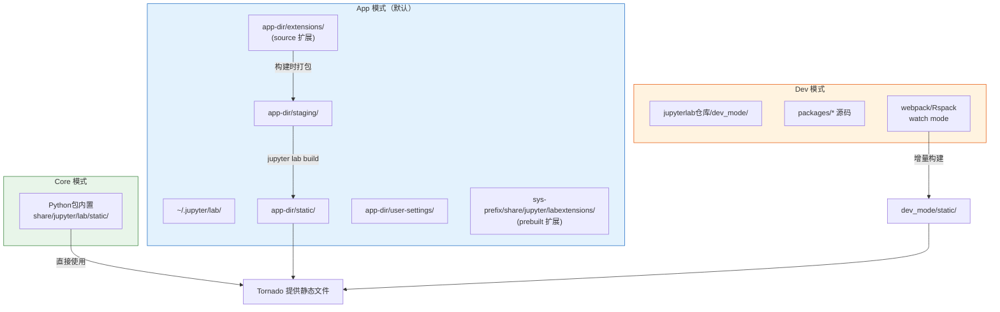
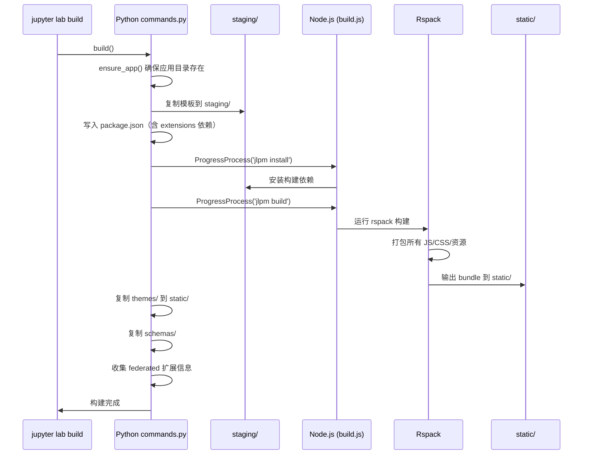

## 三种运行模式

JupyterLab 有三种运行模式（[F-042](/references/source-code-map.md)），由 `jupyter lab --dev-mode` / `--core-mode` / `--app-dir` 参数控制：

### Core 模式（`--core-mode`）

- **用途**：使用 JupyterLab Python 包内置的预构建静态资源
- **静态资源路径**：`<sys-prefix>/share/jupyter/lab/static/`（Python 包安装目录下的预构建产物）
- **特点**：最快启动，无需构建，用于生产环境
- **扩展加载**：从 labextensions 目录动态加载 federated 扩展

### App 模式（默认模式，无标志）

- **用途**：用户自定义的 JupyterLab 应用，支持 source 扩展
- **静态资源路径**：`<app-dir>/static/`，其中 `app-dir` 默认为 `~/.jupyter/lab/`
- **特点**：source 扩展安装后需要运行 `jupyter lab build` 来重新构建应用
- **staging 目录**：`<app-dir>/staging/` 存放构建配置和临时文件
- **settings 目录**：`<app-dir>/user-settings/` 存放用户设置
- **schemas 目录**：`<app-dir>/schemas/` 存放插件 JSON Schema
- **themes 目录**：`<app-dir>/themes/` 存放用户主题

### Dev 模式（`--dev-mode`）

- **用途**：JupyterLab 源码开发
- **静态资源路径**：JupyterLab 仓库根目录下的 `dev_mode/` 目录
- **特点**：从源码实时构建，支持热重载，用于开发和贡献 JupyterLab 本身
- **devMode 标志**：`pageConfig['devMode']` 为 `true`，shell 添加 `jp-mod-devMode` CSS 类（红色条纹标记开发模式）



## 构建工具链

### jlpm：JupyterLab 包管理器

`jlpm` 是一个 Python 脚本（位于 `jupyterlab/jlpm.py`），作为 Yarn 包管理器的 wrapper（[F-039](/references/source-code-map.md)）：

```bash
# jlpm 等价于 yarn，但会自动处理版本和路径
jlpm install          # 安装依赖
jlpm add <package>    # 添加依赖
jlpm build            # 构建
jlpm watch            # 监听模式构建
jlpm run build:src    # 运行脚本
```

在 Windows 上，`jlpm` 调用 Node.js 运行 Yarn 3 (Berry)。它确保使用与 JupyterLab 兼容的 Yarn 版本，而不需要用户全局安装 Yarn。

### Rspack：构建打包器

JupyterLab 从 4.x 开始使用 **Rspack**（Rust 实现的 webpack 兼容打包器）替代 Webpack（[F-039](/references/source-code-map.md)）：

- 配置文件：`dev_mode/rspack.config.js`（dev 模式）和 staging 中的构建配置
- Rspack 版本：2.0.2（[F-001](/references/source-code-map.md)）
- 构建速度：比 webpack 快 10-20 倍
- 兼容性：Rspack 与 webpack API 高度兼容，loader/plugin 生态大部分可复用

### 构建命令

```bash
# 从源码构建（开发模式）
cd jupyterlab-repo
jlpm install
jlpm build            # 构建所有包
jlpm build:src        # 只构建 TypeScript 源码（不打包）

# 监听模式（开发时）
jlpm watch            # 监听所有包的变化，增量构建

# Python 端构建命令
jupyter lab build              # 构建应用（app 模式）
jupyter lab build --dev-build  # 包含 source maps 的开发构建
jupyter lab build --minimize=False  # 不压缩，更快构建
jupyter lab build --debug      # 调试模式构建
jupyter lab clean              # 清理构建产物
jupyter lab watch              # 监听模式（自动构建）
```

## staging 目录结构

当 JupyterLab 处于 app 模式时，staging 目录（`<app-dir>/staging/`）是构建的核心。它在首次运行或执行 `jupyter lab build` 时从 Python 包模板创建（[F-040](/references/source-code-map.md)）：

```
staging/
├── package.json          # 构建依赖（指向本地包）
├── yarn.lock             # 锁定版本
├── webpack.config.js     # 或 rspack.config.js
├── index.js              # 应用入口（注册所有插件）
├── index.html            # HTML 模板
├── build.js              # 构建脚本（Node.js）
├── templates/            # 各种模板文件
├── node_modules/         # 构建依赖
└── static/               # 构建输出目录（→ symlink 到 app-dir/static/）
    ├── index.html
    ├── bundle.js         # 主 JS bundle
    ├── 0.bundle.js       # 代码分割 chunk
    ├── *.js.map          # Source maps
    ├── style.js
    ├── themes/
    │   ├── @jupyterlab/theme-light-extension/
    │   └── @jupyterlab/theme-dark-extension/
    └── federated/        # 复制的 federated 扩展清单
```

### 构建过程（jupyter lab build）



## 开发模式（dev_mode/）

`dev_mode/` 目录是 JupyterLab 源码开发时使用的构建配置：

```
dev_mode/
├── package.json         # dev 模式的 workspace 配置
├── rspack.config.js     # Rspack 配置
├── index.js             # 入口文件（注册所有包的插件）
├── index.html           # HTML 模板
├── build.js             # 构建脚本
└── static/              # 构建输出
```

`dev_mode/package.json` 中通过 `workspaces` 引用 `../packages/*`，这样 Rspack 可以直接从源码构建，不需要预编译。

### 启动开发环境

```bash
# 方法 1：jlpm watch + jupyter lab --dev-mode
cd jupyterlab-repo
jlpm install
jlpm watch             # 终端1：启动增量构建监听
jupyter lab --dev-mode  # 终端2：启动 dev 模式服务器

# 方法 2：使用 jupyter lab watch（自动重建）
jupyter lab watch
```

开发模式下：
- 代码修改后 jlpm watch 自动增量编译 TypeScript
- Rspack 可以配置为 watch 模式自动重新打包
- 页面支持热更新或自动刷新
- `devMode` 页面配置为 `true`，可用于调试判断

## BuildHandler：构建进度推送

`BuildHandler`（`jupyterlab/handlers/build_handler.py`）通过 WebSocket 向浏览器推送构建进度（[F-020](/references/source-code-map.md)）：

1. 前端通过 WebSocket 连接到 `/lab/api/build`
2. 后端运行构建进程，将 stdout/stderr 实时推送到前端
3. 前端在"Build Recommended"对话框中显示构建进度
4. 构建完成后，前端提示刷新页面

`Builder` 类（`build_handler.py`）封装了构建过程的管理：
- `isAvailable`：构建是否可用
- `isBuilding`：是否正在构建
- `needsBuild`：是否需要构建（检测到扩展变更）
- `build()`：启动构建
- `cancel()`：取消构建

## 应用目录关键路径

`commands.py` 定义了关键目录的获取函数（[F-040](/references/source-code-map.md)）：

| 函数 | 返回路径 | 说明 |
|------|---------|------|
| `get_app_dir()` | `~/.jupyter/lab/`（默认） | 应用目录根 |
| `get_user_settings_dir()` | `<app_dir>/user-settings/` | 用户设置目录 |
| `get_workspaces_dir()` | `<app_dir>/workspaces/` | 工作区目录 |
| `get_labextension_dir()` | `<sys-prefix>/share/jupyter/labextensions/` | 系统 prebuilt 扩展目录 |
| `DEV_DIR` | `<repo>/dev_mode/` | Dev 模式目录常量 |
| `REPO_ROOT` | `<repo>/` | 仓库根目录常量 |
| `HERE` | `<repo>/jupyterlab/` | Python 包目录常量 |

## 相关概念

- [07 扩展生态系统](/concepts/07-extension-ecosystem.md)
- [02 应用框架与 Shell 布局](/concepts/02-application-shell.md)
- [09 关键子系统 - PageConfig](/concepts/09-key-subsystems.md)
- [源码文件地图](/references/source-code-map.md)
