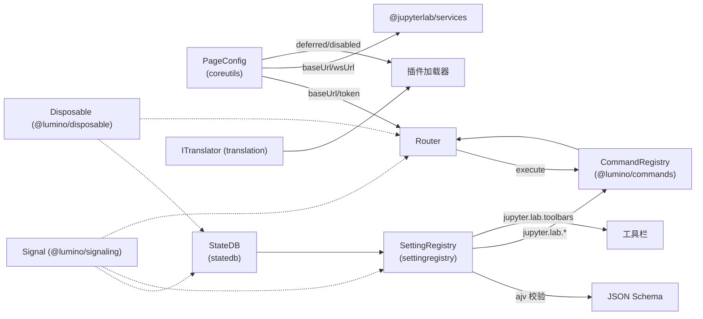

# 09 关键子系统

JupyterLab 之所以能支撑起一个完整的 IDE 式交互环境，不仅依赖 Shell 布局和插件系统，还依赖一组横切所有功能包的基础子系统。本章逐个剖析这些"地基设施"：服务端渲染的全局配置、统一命令入口、客户端状态数据库、带 Schema 校验的设置系统、前端 URL 路由、贯穿全框架的 Signal/Disposable 模式，以及 gettext 国际化体系。理解它们，是读懂任意一个核心扩展源码的前提。

## PageConfig：服务端渲染的全局配置

`PageConfig` 是 `@jupyterlab/coreutils` 导出的命名空间，定义在 `packages/coreutils/src/pageconfig.ts`。它是前端读取后端配置的唯一入口，所有运行期参数——基础 URL、WebSocket URL、认证 token、静态资源路径、工作区名、是否 devMode 等——都通过它获取（F-167）。

### 配置注入方式

PageConfig 的核心方法是 `getOption(name: string): string`。它按以下优先级查找配置：

1. **HTML `<script>` 标签**：后端用 Jinja2 渲染页面时，将 JSON 内联到 `<script id="jupyter-config-data" type="application/json">` 中。`getOption` 首次调用时通过 `document.getElementById('jupyter-config-data')` 读取并 `JSON.parse`，结果缓存到模块级变量 `configData`。
2. **`body.dataset` 回退**：为兼容经典 Notebook，若 script 标签中找不到，则读取 `document.body.dataset[key]`（经 `decodeURIComponent` 解码）。
3. **Node 端 CLI/环境变量**：在测试或 SSR 场景下，若没有 `document`，则解析 `process.argv` 中的 `--jupyter-config-data` 指向的 JSON 文件，或读取 `JUPYTER_CONFIG_DATA` 环境变量。

所有值都被强制序列化为字符串；非字符串值会在加载时 `JSON.stringify`。后端 `LabApp.initialize_handlers()` 设置的 `page_config_data`（F-167）正是通过这套机制到达前端，其中包含 `devMode`、`token`、`exposeAppInBrowser`、`quitButton`、`allow_hidden_files`、`delete_to_trash`、`notebookVersion`、`buildAvailable`、`buildCheck`、`extensionManager`、`news`、JupyterHub 相关字段等。

### 核心 API

```typescript
namespace PageConfig {
  function getOption(name: string): string;
  setOption(name: string, value: string): string;
  getBaseUrl(): string;
  getWsUrl(baseUrl?: string): string;
  getToken(): string;
  getTreeUrl(): string;
  getShareUrl(): string;
  getNotebookVersion(): [number, number, number];
  getUrl(options: IGetUrlOptions): string;
  namespace Extension {
    const deferred: string[];
    const disabled: string[];
    function isDeferred(id: string): boolean;
    function isDisabled(id: string): boolean;
  }
}
```

- `getBaseUrl()` 读取 `baseUrl` 并做 `URLExt.normalize`，默认 `/`。
- `getWsUrl()` 优先读 `wsUrl`，否则把 `http(s)://` 前缀替换成 `ws(s)://` 自动推导，Kernel/WebSocket 客户端依赖它（F-164）。
- `getToken()` 读取 `token`，回退到 body 的 `jupyterApiToken`。
- `PageConfig.Extension` 子命名空间解析 `deferredExtensions` 和 `disabledExtensions` 两个 JSON 数组，`isDeferred`/`isDisabled` 支持按完整插件 id 或扩展名（冒号前部分）匹配，供插件加载器决定跳过或延迟加载哪些插件。

## CommandRegistry：统一的用户操作入口

命令注册表来自 `@lumino/commands`（F-145、F-148），不是 `@jupyterlab/*` 包，但它是 JupyterLab 所有用户操作的中枢。菜单项点击、快捷键、命令面板搜索、工具栏按钮、路由命令——最终都汇聚到 `CommandRegistry.execute(id, args)`。

### 核心 API

```typescript
class CommandRegistry {
  addCommand(id: string, options: ICommandOptions): IDisposable;
  execute(id: string, args?: ReadonlyJSONObject): Promise<any>;
  addKeyBinding(options: IKeyBindingOptions): IDisposable;
  notifyCommandChanged(id: string): void;
}
```

`addCommand` 的 `ICommandOptions` 包含：
- `label: string`（或返回字符串的函数）：命令显示名，命令面板据此搜索。
- `execute: (args) => void | Promise<any>`：命令实际逻辑。
- `isEnabled?` / `isToggled?` / `isVisible?`：动态状态回调，控制菜单项是否可用、是否勾选。
- `icon?` / `iconClass?` / `caption?`：图标与提示。

`addKeyBinding` 把一个 CSS `selector`、一组按键序列 `keys` 和一个 `command` id 绑定起来。JupyterLab 在 document 上监听 `keydown` 并调用 `commands.processKeydownEvent(event)`（见 `examples/cell/src/index.ts:115-121` 的用法），只有焦点元素匹配 selector 时快捷键才触发。快捷键本身也可以通过 SettingRegistry 的 `jupyter.lab.shortcuts` 字段由用户自定义（F-049）。

命令 id 约定使用 `namespace:action` 格式，如 `notebook:run-cell`、`filebrowser:create-new-directory`，与 StateDB 的 id 命名约定一致。

## StateDB：客户端状态持久化

`@jupyterlab/statedb` 提供 `StateDB` 类（`packages/statedb/src/statedb.ts`），是一个基于 `IDataConnector` 抽象的键值数据库，默认使用浏览器 LocalStorage 作为后端（F-067、F-144）。

### DataConnector 抽象模式

StateDB 不直接读写 LocalStorage，而是委托给一个 `IDataConnector<string>` 连接器。构造时可传入自定义 connector，不传则使用内存版 `StateDB.Connector`。SettingRegistry 通过自己的 `SettingConnector`（访问服务端 settings API）替换这个 connector，从而把同一份 StateDB 接口复用于远程数据。这就是"DataConnector 抽象模式"：同一套 fetch/save/remove/list 语义可对接 LocalStorage、REST API、内存对象等任意后端。

### 核心 API

```typescript
class StateDB<T extends ReadonlyPartialJSONValue = ReadonlyPartialJSONValue> {
  constructor(options?: StateDB.IOptions<T>);
  readonly changed: ISignal<this, StateDB.Change>;
  fetch(id: string): Promise<T | undefined>;
  save(id: string, value: T): Promise<void>;
  remove(id: string): Promise<void>;
  list(namespace: string): Promise<{ ids: string[]; values: T[] }>;
  clear(): Promise<void>;
  toJSON(): Promise<{ readonly [id: string]: T }>;
}
```

- id 约定为 `namespace:identifier` 格式。`list(namespace)` 会按冒号前缀过滤，只返回该命名空间下的条目。
- 写入时内部用 `{ v: value }` 信封序列化，读取时解包，避免与原始值冲突。
- `changed` 信号在 save/remove/clear 时发射，类型为 `{ id: string | null; type: 'clear' | 'remove' | 'save' }`。
- 构造函数支持 `transform: Promise<DataTransform<T>>`，可在数据库就绪前执行 `cancel`/`clear`/`merge`/`overwrite` 四种数据迁移操作，用于版本升级时的状态结构调整。

StateDB 被 SettingRegistry 直接依赖（F-144），并经 services 被 workspaces 间接使用，是设置和工作区在客户端的状态缓存基础。

## SettingRegistry：带 Schema 校验的插件设置

`@jupyterlab/settingregistry`（`packages/settingregistry/src/`）提供 `SettingRegistry` 类和 `ISettingRegistry` Token（F-049、F-165）。它在 StateDB 之上增加了三层能力：

1. **JSON Schema 校验**：每个插件可携带一个 schema（JSON Schema draft），用户设置通过 `ajv`（^8.12.0）校验，非法值被拒绝并返回 `ISchemaValidator.IError[]`。
2. **默认值合并**：加载时把 schema 中的 `default` 与用户覆盖值合并为 `composite`，插件通过 `settings.get(key)` 同时拿到 `composite` 和 `user` 两份值。
3. **声明式 UI 扩展点**：schema 中的 `jupyter.lab.menus`、`jupyter.lab.shortcuts`、`jupyter.lab.toolbars`、`jupyter.lab.metadataforms` 等字段由对应核心扩展读取，自动生成菜单、快捷键、工具栏、元数据表单，无需插件手写代码。表单 UI 由 `@rjsf/utils`（^5.13.4）驱动的 React JSON Schema Form 渲染。

### 核心接口

```typescript
interface ISettingRegistry {
  readonly connector: IDataConnector<IPlugin, string, string>;
  readonly plugins: { [name: string]: IPlugin | undefined };
  readonly pluginChanged: ISignal<this, string>;
  load(plugin: string): Promise<ISettingRegistry.ISettings>;
  reload(plugin: string): Promise<ISettingRegistry.ISettings>;
  get(plugin: string, key: string): Promise<{ composite; user }>;
  set(plugin: string, key: string, value: PartialJSONValue): Promise<void>;
  remove(plugin: string, key: string): Promise<void>;
  transform(plugin: string, transforms: { compose?; fetch? }): IDisposable;
  upload(plugin: string, raw: string): Promise<void>;
}
```

`IPlugin` 包含 `id`、`data`（`{ composite, user }`）、`raw`（带注释的 JSON 字符串，由 json5 解析）、`schema`、`version`。`ISettings` 是单个插件的设置句柄，提供 `changed` 信号、`composite`/`user` 对象、`get/set/remove/save/validate` 方法。插件在 activate 中 `await settingRegistry.load(pluginId)` 拿到 ISettings 后，监听 `changed` 信号响应配置变更。

## Router：前端 URL 路由

`Router` 类位于 `@jupyterlab/application`（`packages/application/src/router.ts`），实现 `IRouter` 接口，负责把浏览器 URL 路径映射到命令执行（F-154）。

### 工作机制

Router 内部维护一个 `Map<RegExp, { command: string; rank: number }>`。`register(options)` 注册一条规则：

```typescript
router.register({
  pattern: /\/lab\/tree\/(.+)/,
  command: 'filebrowser:open-path',
  rank: 100
});
```

`navigate(path, options)` 更新 URL：
- 用 `history.pushState` 改变地址栏（不刷新页面）。
- 若 `options.hard === true`，则调用 `window.location.reload()` 做硬刷新。
- 若 `options.skipRouting !== true`，则在下一帧通过 `requestAnimationFrame` 调用 `route()`。

`route()` 收集所有匹配当前 `request`（path + search + hash）的规则，按 `rank` 降序排序后**依次执行**对应命令，命令参数为 `IRouter.ILocation`（含 hash/path/request/search）。如果某个命令返回 `router.stop` 这个特殊 Token，则短路，后续规则不再执行。命令执行异常被捕获并打印警告，不会阻断后续路由。路由完成后发射 `routed` 信号。

`current` getter 实时解析 `window.location.href`，去掉 base 前缀得到应用内路径。Router 构造时需要 `base` 和 `commands` 两个参数，base 通常来自 `PageConfig.getBaseUrl()`。

## Signal/Disposable 模式

这两个模式来自 `@lumino/signaling` 和 `@lumino/disposable`（F-145、F-148），是整个 JupyterLab 组件通信和资源管理的基石，重要性甚至高于 React 状态模型。

### Signal：发布-订阅

```typescript
import { Signal, ISignal } from '@lumino/signaling';

class Model {
  private _changed = new Signal<this, string>(this);
  get changed(): ISignal<this, string> { return this._changed; }
  doSomething() { this._changed.emit('value'); }
}

model.changed.connect((sender, value) => {
  console.log(value);
});
```

`Signal<TSender, TArgs>` 是强类型的事件源。`connect(slot, thisArg?)` 返回 `boolean`（是否已连接），`disconnect` 解绑。`Signal.clearData(someObject)` 可以一次性清理某对象持有的所有信号连接，避免内存泄漏。StateDB 的 `changed`、SettingRegistry 的 `pluginChanged`、Router 的 `routed`、DocumentRegistry 的 `changed`、Widget Factory 的 `widgetCreated`——所有跨组件通知都用 Signal。

### Disposable：确定性资源释放

```typescript
import { IDisposable, DisposableDelegate } from '@lumino/disposable';

const d: IDisposable = someRegistry.register(...);
d.dispose();
```

`IDisposable` 只有一个 `dispose(): void` 方法和一个 `isDisposed` 属性。`DisposableDelegate(fn)` 把一个函数包装成 disposable，调用 dispose 时执行该函数，常用于"反注册"逻辑（如 `Router.register` 返回的 DisposableDelegate 删除规则，`DocumentRegistry.addWidgetFactory` 返回的 disposable 移除工厂）。`DisposableSet` 可以聚合多个 disposable 统一释放。Widget 基类本身实现了 IDisposable，Widget 销毁时级联释放子 Widget 和信号连接。

## 翻译系统

`@jupyterlab/translation`（`packages/translation/`，F-069）提供基于 gettext 的国际化能力。后端使用 `jupyterlab_server.translation_utils` 的 gettext 翻译器（F-143），前端由 `TranslationManager` 实现 `ITranslator` 接口。

核心抽象是 `ITranslator`，通过 `translator.load(domain)` 返回一个 language bundle，bundle 提供 `__(msgid, ...args)`、`_n(singular, plural, n, ...args)`、`_p(context, msgid, ...args)` 等方法。`nullTranslator` 是默认的空实现，直接返回原字符串。

插件通过 Token `ITranslator` 注入翻译器，所有面向用户的字符串都应包裹：

```typescript
const trans = translator.load('my-domain');
app.commands.addCommand('my:cmd', {
  label: trans.__('My Command'),
  execute: () => showDialog({ title: trans.__('Hello') })
});
```

设置 schema 中的 `title`/`description` 也会被自动提取翻译。翻译资源在构建时从源码提取 .po 文件，运行时按需加载。

## 子系统协作关系



这些子系统并非孤立存在：PageConfig 为 Router 和 services 提供 URL 基础；Router 把 URL 分发给 CommandRegistry；SettingRegistry 在 StateDB 之上叠加 Schema 校验，并通过 `jupyter.lab.shortcuts`/`jupyter.lab.menus` 反向配置 CommandRegistry；Signal 和 Disposable 贯穿所有对象的生命周期管理。掌握这张协作网，就能在阅读任意扩展源码时快速定位"它从哪里读配置、把操作注册到哪、把状态存到哪、如何响应变化、如何清理资源"。

## 相关概念

- [02 应用框架与 Shell 布局](/concepts/02-application-shell.md)
- [03 插件系统与依赖注入](/concepts/03-plugin-system.md)
- [04 服务层与后端通信](/concepts/04-service-layer.md)
- [07 扩展生态系统](/concepts/07-extension-ecosystem.md)

## 相关示例

- [01 最小扩展：Hello World 插件](/examples/01-minimal-extension.md)
- [02 自定义文件类型查看器](/examples/02-custom-file-type.md)
