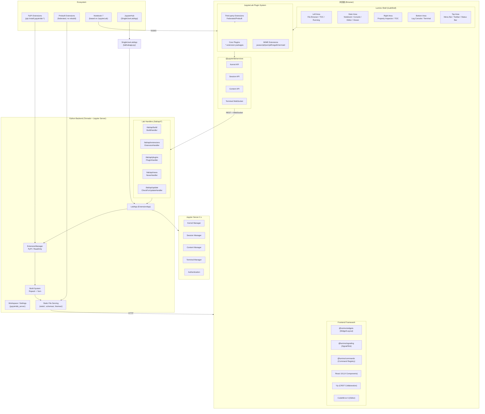

# JupyterLab 架构洞察

## 架构总览

JupyterLab 采用经典的前后端分离架构：Python/Tornado 后端提供静态资源服务、REST API 和 WebSocket 通信，TypeScript/React/Lumino 前端构建完整的 IDE 式用户界面。两者通过 Jupyter Server 的 page_config 机制桥接配置信息，通过 REST API 和 WebSocket（Kernel通信、Yjs CRDT 协作）实现实时交互。

---

## 洞察一：Lumino 组件框架是 JupyterLab 的"操作系统内核"

### 陈述
JupyterLab 前端并非直接基于 React 构建整个 UI，而是以 **Lumino**（前身为 PhosphorJS）为核心组件框架。Lumino 提供了 Widget、Layout、Signal/Slot、Command Registry、Dock Panel 等桌面级 GUI 工具包原语，React 仅用于局部 UI 渲染（对话框、工具栏按钮、设置编辑器等）。这一分层使 JupyterLab 能够实现类似 VS Code 的多标签页停靠、拖拽分栏、命令系统等复杂交互。

### 证据
- F-145: @jupyterlab/application 依赖全套 @lumino/* 包（algorithm/application/commands/coreutils/disposable/messaging/polling/properties/signaling/widgets），以及 apputils/docregistry/rendermime/services/statedb/translation/ui-components 等核心包。
- F-148: staging/package.json 中锁定了 15 个 @lumino/* 包为 singletonPackages，确保整个应用只有一套 Lumino 实例。
- F-154: packages/application/src/ 包含 shell.ts（ILabShell 布局/LabShell DockPanel）、lab.ts（JupyterLab 主类）、router.ts（前端路由）、tokens.ts（IToken 依赖注入令牌）。
- F-139: singletonPackages 列表同时确保 React/Lumino/CodeMirror/Yjs 等框架包只有一个实例，防止多实例冲突。
- F-068: ui-components 为共享 React UI 组件库，React 用于对话框、工具栏等局部 UI 渲染而非主框架。
- F-147: 前端框架层明确 React 18、Yjs CRDT、CodeMirror 6 等技术栈，其中 React 18 作为 UI 组件渲染库存在。

### 反常识
1. **React 不是主导框架**：尽管 React 生态丰富，JupyterLab 的主布局（dock panel、tab bar、split panel）完全由 Lumino 控制，React 只在 Lumino Widget 的 render 方法中被挂载到 DOM 节点上。这意味着理解 JupyterLab 扩展开发必须先掌握 Lumino 的 Widget/Signal/Command 模式，而非 React 组件模式。
2. **Signal/Slot 比 React 状态更基础**：Lumino 的 Signal/Slot 机制（类似 Qt 的信号槽）是组件通信的底层机制，React 的 props/state 是上层封装。即使在纯 React 组件中，跨组件通信也常通过 Signal 或 Token 注入的服务对象完成，而非 Context API。

### 行动建议
- 学习 JupyterLab 扩展开发应从 `@lumino/widgets` 和 `@lumino/commands` 入手，而非直接从 React 组件入手。
- 新建 UI 功能时，优先判断是需要一个 Lumino Widget（可停靠、可追踪、可参与布局）还是一个 React 组件（嵌入在现有 Widget 中）。
- Token（`I*Token` 接口）是依赖注入的核心，所有核心服务通过 Token 暴露给扩展，理解 Token 模式比理解 React 组件树更重要。

---

## 洞察二：双扩展模型——npm 包 + Python Server Extension 的前后端双轨插件机制

### 陈述
JupyterLab 的扩展系统采用**双轨模型**：前端扩展是 npm 包（通过 `jupyterlab` 字段声明为 extension、mimeExtension 或 singleton），后端扩展是 Python 包（通过 `_jupyter_server_extension_points()` 或 entry points 注册）。prebuilt/federated 扩展将前端资源预编译为独立 bundle，安装后无需重新构建 JupyterLab 即可使用；source 扩展则需要 `jupyter lab build` 重新打包。Python 侧通过 entry point `jupyterlab.extension_manager_v1` 支持可插拔的扩展管理器实现（默认 pypi、readonly）。

### 证据
- F-138: staging/package.json 的 jupyterlab 字段定义了 46 个核心 extensions、5 个 mimeExtensions、约 70 个 singletonPackages，前端扩展通过此机制注册。
- F-139: singletonPackages 列表确保 React/Lumino/CodeMirror/Yjs 等框架包只有一个实例，防止多版本冲突导致扩展崩溃。
- F-113: MANAGERS 字典从 importlib.metadata.entry_points(group="jupyterlab.extension_manager_v1") 动态加载，支持第三方注册新的扩展管理器。
- F-114: 内置两个工厂函数 get_readonly_manager() 和 get_pypi_manager()，对应 readonly 和 pypi 两种扩展管理模式。
- F-115: ExtensionPackage frozen dataclass 定义了扩展的标准数据结构（name/version/status/enabled/core 等字段）。
- F-116: ActionResult frozen dataclass 定义了扩展操作结果（status/message/needs_restart），作为前后端通信协议。
- F-118: PluginManager 类管理插件启用/禁用/锁定，支持 sys_prefix/user/system 三个级别，锁定规则支持插件名或扩展名（冒号格式 extension:plugin）。
- F-029: federated_labextensions.py 中的联合扩展包装函数已委托给 jupyter_builder.federated_extensions，prebuilt/federated 扩展成为主流分发方式。
- F-013: CLI 入口点 jupyter-lab（启动）、jupyter-labextension（扩展管理）、jupyter-labhub（JupyterHub 集成）。
- F-014: pyproject.toml 注册了两个 extension_manager_v1 entry point：readonly 和 pypi。
- F-155: __init__.py 暴露旧版 _jupyter_server_extension_paths() 返回 [{"module": "jupyterlab"}]。
- F-156: __init__.py 同时暴露新版 _jupyter_server_extension_points() 返回 [{"module": "jupyterlab", "app": LabApp}]。

### 反常识
1. **扩展不需要 Python 代码即可工作**：纯前端 MIME 扩展（如 @jupyterlab/json-extension、@jupyterlab/pdf-extension）只需要 npm 包即可渲染特定 MIME 类型，不需要 Python 后端。但如果扩展需要自定义 REST API 或 Kernel 通信，则需要同时提供 Python server extension。
2. **扩展管理器本身也是可扩展的**：ExtensionManager 是抽象基类（F-119），通过 entry point 注册新的实现（如 conda、企业内部 npm registry），而非硬编码只有 pip install。这意味着企业可以实现自己的扩展商店。

### 行动建议
- 开发扩展时优先使用 prebuilt/federated 模式（pip install 后立即可用，无需终端用户运行 jupyter lab build）。
- 需要后端 API 的扩展应同时注册 Python server extension 和 JupyterLab frontend plugin，使用 notebook_shim 兼容经典 Notebook。
- 企业环境可实现自定义 ExtensionManager（继承 ExtensionManager 并注册 entry point）以对接内部包仓库。

---

## 洞察三：LabApp 作为 jupyter_server ExtensionApp 的设计——多模式运行与渐进式加载

### 陈述
LabApp 继承自 jupyterlab_server.LabServerApp 和 notebook_shim.NotebookConfigShimMixin，是 jupyter_server 的 ExtensionApp。它设计了三种运行模式（core/dev/app），通过不同的 static_paths、labextensions_path 和 page_config 实现渐进式功能加载。core 模式不加载任何第三方扩展、不提供构建/扩展管理 API，用于最小化部署；dev 模式用于源码开发；app 模式用于正常使用。构建检查（ensure_app/ensure_core/ensure_dev）在启动时惰性执行。

### 证据
- F-076: LabApp 继承自 NotebookConfigShimMixin 和 LabServerApp（来自 jupyterlab_server），NotebookConfigShimMixin 提供经典 Notebook 配置项兼容。
- F-080: 三种运行模式：Core mode（--core-mode，包内置资源，无扩展）、Dev mode（--dev-mode，dev_mode/ 本地构建）、App mode（--app-dir，用户自定义扩展集）。
- F-081: core_mode 布尔配置项，True 时禁用第三方扩展，使用 pip 包内预构建 JS 资源。
- F-082: dev_mode 布尔配置项，使用 dev_mode/ 目录下未发布的本地 JS 包，页面顶部显示红色条带。
- F-088: initialize_templates() 根据运行模式设置 static_paths、template_paths、labextensions_path；core_mode 下 labextensions_path 为空。
- F-090: buildAvailable 和 buildCheck 在 core_mode 和 dev_mode 下为 False，前端不显示构建 UI。
- F-091: page_config 中设置 devMode 标志，前端据此显示开发模式红色条带。
- F-089: initialize_handlers() 设置 page_config、注册 BuildHandler/ExtensionHandler/PluginHandler/公告 Handler、处理 JupyterHub 元数据。
- F-092: 扩展管理器通过 entry point 动态加载，实例化失败时回退到 ReadOnlyExtensionManager，保证服务可用性。
- F-133: ensure_dev()/ensure_core() 分别确保开发模式和核心模式的静态资源存在，首次启动时惰性检查。
- F-158: 核心依赖 jupyterlab_server>=2.28.0,<3，LabServerApp 提供页面配置、工作区、许可证等通用功能基类。
- F-160: 依赖 notebook_shim>=0.2，NotebookConfigShimMixin 使经典 Notebook 的配置项能自动映射到 ServerApp。
- F-107: ErrorHandler 返回简单 HTML 错误页面，构建失败时显示错误提示而非退出进程。

### 反常识
1. **core 模式不是"开发模式"而是"最小依赖模式"**：core 模式使用 pip 包内预构建的静态文件，不加载任何第三方扩展，反而最接近"生产最小化部署"。dev 模式才是给 JupyterLab 开发者使用的源码构建模式。
2. **构建失败不阻止服务器启动**：当 app 模式下静态资源不存在时，LabApp 注册 ErrorHandler 显示错误页面而非直接退出进程（F-107），服务器仍在运行，只是 UI 显示构建错误提示。这允许用户在不重启服务器的情况下通过其他方式修复构建。

### 行动建议
- 生产环境部署（如 Docker 镜像、JupyterHub）应预构建静态资源（在镜像构建阶段运行 `jupyter lab build`），启动时使用 app 模式，避免首次请求触发构建。
- 受限环境（禁用外部网络、禁用扩展安装）应使用 core 模式或 readonly 扩展管理器（F-120），减少攻击面。
- 开发 JupyterLab 本身时使用 `pip install -e .` + `jupyter lab --dev-mode --watch`，利用 watch 模式实现 TS 增量编译 + Rspack 热重载。

---

## 洞察四：工作区/布局系统——服务端持久化的前端布局状态

### 陈述
JupyterLab 的工作区（Workspace）系统实现了前端布局状态的服务端持久化。前端 @jupyterlab/workspaces 包通过 @jupyterlab/services 与后端通信，保存/恢复 Dock Panel 布局、打开的文件列表、侧边栏状态等。后端工作区管理由 jupyterlab_server 包提供（WorkspaceExportApp/ImportApp/ListApp），工作区数据默认存储在 `JUPYTERLAB_WORKSPACES_DIR` 目录下。页面配置（page_config）在服务器端渲染 HTML 模板时注入，传递 token、版本、可用功能标志等。

### 证据
- F-142: LabWorkspaceExportApp/ImportApp/ListApp 继承 jupyterlab_server 对应类，重写 workspaces_dir 默认值；LabWorkspaceApp 聚合为子命令。
- F-050: @jupyterlab/workspaces v4.7.0-alpha.1 提供工作区管理（保存/恢复布局状态），依赖 services 和 @lumino/signaling。
- F-127: get_workspaces_dir() 读取 JUPYTERLAB_WORKSPACES_DIR 环境变量，默认在 <jupyter_config_dir>/lab/workspaces 下。
- F-049: @jupyterlab/settingregistry 使用 JSON Schema（ajv）验证插件设置，支持设置持久化。
- F-165: JSON Schema 验证使用 ajv ^8.12.0，设置表单渲染使用 @rjsf/utils ^5.13.4。
- F-067: @jupyterlab/statedb 提供状态数据库，基于 LocalStorage 后端和数据连接器（DataConnector）模式。
- F-144: statedb 被 settingregistry 直接依赖，提供 LocalStorage 状态持久化和 DataConnector 抽象模式，作为工作区和设置的客户端缓存基础。
- F-167: page_config_data 在 initialize_handlers 中设置，传递 devMode/token/exposeAppInBrowser/quitButton/allow_hidden_files/delete_to_trash/notebookVersion/buildAvailable/buildCheck/extensionManager/news/hub* 等配置给前端。

### 反常识
1. **工作区不是"项目目录"而是"UI 布局快照"**：JupyterLab 的 workspace 概念不同于 VS Code 的 workspace（项目根目录），它更像是浏览器会话恢复——记录哪些文件打开了、面板怎么排列的、每个标签页的滚动位置等。多个 workspace 可以对应同一个文件目录的不同布局配置。
2. **页面配置是服务端渲染的全局变量，而非 API 响应**：page_config 通过 Jinja2 模板直接内联在 HTML 页面中（`<script id="jupyter-config-data" type="application/json">`），而非页面加载后通过 API 获取。这减少了首次加载的 API 请求数，但也意味着修改配置需要刷新页面。

### 行动建议
- 扩展可以通过在 page_config 中注入自定义键值对（在 LabApp 的 initialize_handlers 中设置 page_config）来传递服务器端配置到前端。
- 多用户环境（JupyterHub）下应注意工作区目录的权限隔离，每个用户应有独立的工作区目录。
- 开发需要持久化状态的功能时，优先使用 settingregistry（基于 JSON Schema 的用户设置）或 statedb（键值存储/DataConnector 模式），而非自行操作 LocalStorage。

---

## 洞察五：与经典 Notebook 的关系——Notebook 7 站在 JupyterLab 的肩膀上

### 陈述
JupyterLab 是经典 Jupyter Notebook 的下一代 Web UI，但两者并非简单替代关系。Notebook 7（经典 Notebook 的最新版本）实际上基于 JupyterLab 的前端包构建，复用 @jupyterlab/notebook、@jupyterlab/cells、@jupyterlab/outputarea 等核心组件。notebook_shim 包提供配置兼容层，使经典 Notebook 的配置项能映射到 Jupyter Server。LabApp 通过 NotebookConfigShimMixin 继承链实现向后兼容，同时 serverextension.py 中的 load_jupyter_server_extension 提供旧版 Notebook Server 的加载 shim。

### 证据
- F-076: LabApp 继承 NotebookConfigShimMixin（来自 notebook_shim）和 LabServerApp，使 c.NotebookApp.* 配置自动映射到 ServerApp。
- F-024: serverextension.py 是旧版 Notebook Server 兼容的扩展加载 shim，创建 LabApp 实例并设置 favicon/logo 重定向。
- F-160: notebook_shim>=0.2 是核心依赖，提供经典 Notebook 配置兼容层。
- F-155: __init__.py 实现旧版 _jupyter_server_extension_paths() 返回 [{"module": "jupyterlab"}]。
- F-156: __init__.py 同时实现新版 _jupyter_server_extension_points() 返回 [{"module": "jupyterlab", "app": LabApp}]，双协议并存。
- F-040: jupyter-config/jupyter_server_config.d/jupyterlab.json 为 Jupyter Server 2.x 自动启用 jupyterlab server extension。
- F-041: jupyter-config/jupyter_notebook_config.d/jupyterlab.json 为旧版 Notebook App 提供自动启用配置。
- F-157: SingleUserLabApp 设置 JUPYTERHUB_SINGLEUSER_APP 环境变量避免导入旧 notebook 包，继承 make_singleuser_app(ServerApp)，默认 URL /lab。
- F-047: @jupyterlab/notebook v4.7.0-alpha.1 提供 Notebook 面板/Widget，含 widget/model/panel/actions/windowing/toc 等完整实现。
- F-153: Notebook 包源码结构包含 widget.ts（Notebook Widget）、model.ts（NotebookModel）、panel.ts（NotebookPanel）、actions.tsx（NotebookActions）、windowing.ts（窗口化渲染）、toc.ts（目录项）等，是 Notebook 7 复用的核心基础。

### 反常识
1. **"Notebook" vs "JupyterLab" 不再是两套代码**：经典 Notebook 7 的 UI 实际上是 JupyterLab 组件的简化封装，底层共享相同的 @jupyterlab/notebook 组件和 @jupyterlab/services 客户端 API。区别主要在布局（经典单文档 vs JupyterLab IDE 多面板）和默认扩展集。
2. **JupyterLab 的后端是"薄"层**：大量后端功能（工作区、设置、页面配置、静态资源处理）委托给 jupyterlab_server 包，内核/会话/文件管理委托给 jupyter_server 包，jupyterlab 包自身主要负责：前端构建系统、扩展管理器、LabApp 编排、少量 API Handler。这是一种"内核最小化、周边可扩展"的设计。

### 行动建议
- 从经典 Notebook 迁移到 JupyterLab 时，notebook_shim 已自动处理大部分配置兼容，但自定义 server extension 需要检查是否使用了旧 API。
- 为 JupyterLab 开发的 notebook-related 扩展（如新的 cell 类型、输出渲染器）天然兼容 Notebook 7。
- 如果只需要 Notebook 7 的简洁界面但想使用 JupyterLab 扩展生态，可以直接安装 Notebook 7 而非 JupyterLab。

---

## 核心模式提炼

| 模式 | 描述 | 关键实现 |
|------|------|----------|
| **Token 依赖注入** | 所有核心服务通过 `IToken<T>` 接口暴露，扩展在 activate 函数参数中声明依赖，由 JupyterLab 应用框架自动注入 | packages/application/src/tokens.ts（F-154），各包的 tokens.ts |
| **Plugin 注册** | 每个扩展包导出一个或多个 JupyterFrontEndPlugin，包含 id、autoStart、requires/optional/provides 声明和 activate 函数 | packages/*-extension/src/index.ts（F-044, F-051-F-074） |
| **Signal/Slot 通信** | Lumino 的 ISignal 实现发布-订阅模式，用于模型变化通知、事件传播，比回调更解耦 | @lumino/signaling（F-145, F-148） |
| **Singleton 包约束** | 构建时通过 singletonPackages 确保 React、Lumino、CodeMirror 等框架只有一个实例，防止多实例冲突 | staging/package.json jupyterlab.singletonPackages（F-139） |
| **Dataclass 通信协议** | 前后端通信使用 frozen dataclass（ExtensionPackage、ActionResult、Notification）定义标准数据结构，序列化为 JSON | extensions/manager.py（F-115, F-116）, handlers/announcements.py（F-102） |
| **Entry Point 扩展点** | 后端扩展管理器通过 importlib.metadata.entry_points 实现可插拔，第三方可注册新的扩展源 | extensions/__init__.py（F-113）, pyproject.toml（F-014） |
| **Traitlets 配置** | 后端所有可配置项使用 traitlets 的 Bool/Unicode/Instance/Type 等类型声明，支持配置文件和命令行双重设置 | labapp.py（F-081-F-086）, commands.py AppOptions（F-129） |
| **Core/Dev/App 三模式** | 通过文件路径切换（HERE/DEV_DIR/app_dir）实现不同部署场景的运行模式，无需条件编译 | labapp.py（F-080, F-088） |
| **Prebuilt/Source 双扩展格式** | prebuilt 扩展预编译为独立 bundle（pip install 即用），source 扩展需要参与构建（lab build），前者为推荐方式 | federated_labextensions.py（F-029）, staging Rspack 配置（F-137） |
| **Rspack 模块打包** | 构建从 Webpack 迁移到 Rspack（Rust 编写，性能更高），通过 module federation 支持扩展动态加载 | staging/package.json（F-137, F-150） |
