# jupyterlab_server 架构洞察

> 基于 v2.28.0 源码分析。本版本中 `tokens.py` 和 `snapshots.py` 尚不存在（为后续版本新增模块），listings 功能以单文件 `listings_handler.py` 实现。

---

## 洞察一：jupyterlab_server 是 Jupyter 生态的"服务端抽象层"——不含 UI 的共享基座

### 陈述

jupyterlab_server 定位为 **Jupyter Server 与前端应用之间的中间层**，它本身不包含任何 UI 代码（无 JS/CSS/bundle），仅提供一组 REST API handlers 和工具类。其核心价值在于：将 JupyterLab 与 Notebook v7（及未来的 JupyterLab-like 应用）共同依赖的服务端逻辑——工作区持久化、设置管理、扩展 listing、主题服务、国际化、许可证报告——抽取为独立包，避免下游重复实现。

README 原文明确表述："JupyterLab Server sits between JupyterLab and Jupyter Server... It is a separate project in order to accommodate creating JupyterLab-like applications from a more limited scope."

### 证据

- **F000**：包描述为 "A set of server components for JupyterLab and JupyterLab like applications"；依赖仅有 babel/jinja2/json5/jsonschema/jupyter_server/requests 等纯 Python 库，无任何前端构建工具依赖
- **F002**：`LabServerApp` 继承链为 `ExtensionAppJinjaMixin → LabConfig → ExtensionApp`（来自 jupyter_server），`extension_url = "/lab"` 但 `static_dir` 和 `templates_dir` 默认指向包内极简模板
- **F021**：`templates/index.html` 是一个仅含 `<script id="jupyter-config-data">` + `bundle.js` 引用的空壳 HTML，真正的前端 bundle 由下游应用（jupyterlab 包）提供
- **F004**：`add_handlers()` 中 labextensions 静态文件服务指向 `labextensions_path`（由 pip 安装的联邦扩展目录），而非包自身的 static 目录
- **F022**：公共 API 导出 `add_handlers`、`LabConfig`、`LabHandler`、`LabServerApp`、`slugify`、`translator`、`WorkspacesManager` 相关类——全部是服务端组件
- **pyproject.toml**：`Framework :: Jupyter :: JupyterLab` classifier，但无任何 npm/Node.js 相关配置

### 反常识

尽管包名含 "jupyterlab"，但它 **不能独立运行出一个可用的 JupyterLab 界面**。直接启动 `LabServerApp` 只会得到一个空壳页面（因为 `static_dir` 默认不包含 bundle.js）。真正的 JupyterLab 体验需要下游的 `jupyterlab` 包提供静态资源并继承 `LabServerApp` 设置 `static_dir`、`app_settings_dir`、`schemas_dir` 等路径。这是一个刻意的架构设计——"我搭骨架，你填血肉"。

### 行动建议

1. **理解分层**：将 jupyterlab_server 视为"服务端 SDK"而非独立应用。定制 JupyterLab-like 应用时，应继承 `LabServerApp` 而非修改其源码
2. **Handler 复用**：如果构建 JupyterLab-like 应用，`SettingsHandler`、`WorkspacesHandler`、`ThemesHandler`、`ListingsHandler`、`TranslationsHandler`、`LicensesHandler` 可以直接通过 `add_handlers()` 注册使用，无需重写
3. **静态资源分离**：部署时注意 jupyterlab_server 的 static 目录（仅模板）和实际前端静态资源（由下游 jupyterlab 包提供）是两个不同路径

---

## 洞察二：工作区与设置采用"文件系统即数据库"的极简持久化架构

### 陈述

Workspaces（工作区）和 Settings（用户设置）的持久化层采用 **纯文件系统存储**——无数据库、无 ORM、无迁移系统。数据以 JSON（或 json5）文件形式直接存储在磁盘目录中，通过文件扩展名区分（`.jupyterlab-workspace` / `.jupyterlab-settings`），使用 JSON Schema Draft-7 做写入前校验。文件名从逻辑 ID 通过 `slugify()` 函数映射为文件系统安全名称。

### 证据

- **F007 / settings_utils.py**：
  - `SETTINGS_EXTENSION = ".jupyterlab-settings"`
  - `_path()` 函数将 `@scope/package:plugin` 格式的 schema_name 映射为 `{settings_dir}/@scope/package/plugin.jupyterlab-settings` 路径
  - `save_settings()` 使用 `json5.loads()` 解析原始输入（保留注释和尾随逗号），`Draft7Validator.validate()` 校验后将**原始文本**写入文件（非重新序列化，保留用户注释格式）
  - `_get_user_settings()` 读取时若校验失败，**静默重置**为 `{}` 并返回 warning，而非抛出错误
  - Overrides 分层：`overrides.d/*.json` (sorted) → `overrides.json(5)` → `ConfigManager default_setting_overrides`，使用 `recursive_update` 合并
- **F008 / workspaces_handler.py**：
  - `WORKSPACE_EXTENSION = ".jupyterlab-workspace"`
  - `WorkspacesManager` 直接操作 `Path` 对象：`load()` 读取 JSON + 注入文件 stat 的 `created`/`last_modified`；`save()` 验证 `metadata.id` 匹配后写入
  - 不存在的工作区返回空结构 `{data: {}, metadata: {id: ...}}` 而非 404
- **F008 slugify()**：NFKC 规范化 → ASCII 编码 → 去除特殊字符 → 连字符化 → 添加 4 字符 SHA256 短哈希后缀防碰撞；支持 URL 路径公共前缀压缩（base 参数）
- **F004**：Handlers 的启用/禁用完全基于目录是否存在（`if extension_app.schemas_dir:` / `if extension_app.workspaces_dir:`），这是一种"目录驱动功能开关"模式

### 反常识

1. **json5 用于用户设置，JSON 用于 schema**：用户设置文件使用 json5 格式（支持注释、尾随逗号、单引号），这在 Jupyter 生态中不常见——大多数 Jupyter 配置文件使用 `.py` 或严格 JSON。这是因为设置文件由前端 IDE 式界面编辑，用户可能手动添加注释。
2. **保存的是原始文本而非规范化 JSON**：`save_settings()` 将 `raw_settings` 原样写入文件，而非 `json.dumps()` 重新序列化。这意味着用户的格式（缩进、注释、键顺序）得以保留——这更像是文本编辑器的"保存"语义，而非典型的 REST API 资源更新。
3. **slugify 的 URL 前缀压缩**：`slugify(raw, base)` 会计算 raw 和 base 的公共前缀并压缩，这是专门为 `/lab/workspaces/foo/bar` 这种嵌套路径场景设计的，避免生成过深的目录结构。
4. **校验失败的容错策略不对称**：GET settings 时用户数据校验失败会静默回退到 `{}`（返回 warning）；但 PUT settings 时校验失败返回 HTTP 400。读宽容、写严格。

### 行动建议

1. **备份策略简单**：工作区和设置文件就是普通 JSON 文件，备份/迁移只需复制目录（`workspaces_dir` / `user_settings_dir`）
2. **不要直接依赖文件格式**：虽然当前使用文件存储，但应通过 REST API 而非直接文件操作来读写，未来版本可能替换存储后端
3. **Overrides 适合管理员配置**：`overrides.d/` 目录机制（支持多个 json/json5 文件按字母序合并）适合系统管理员批量部署默认设置
4. **工作区 ID 约束**：`metadata.id` 必须与 URL 路径匹配（`/workspace_name`），导入时需注意这一约束

---

## 洞察三：扩展 listing 是远程拉取的安全策略执行点——黑白名单互斥、类级别状态共享

### 陈述

jupyterlab_server 内置了一套 **npm 扩展黑白名单机制**（listings），允许管理员配置远程 URI 来动态获取允许/屏蔽的扩展列表，前端 Extension Manager 根据此列表决定哪些扩展可安装。该机制使用类级别（class-level）字段存储状态，通过 Tornado 的 `PeriodicCallback` 定时刷新。

### 证据

- **F002 / app.py**：
  - `blocked_extensions_uris` / `allowed_extensions_uris`：逗号分隔的 URI 列表，支持 HTTP(S) 远程获取
  - `listings_refresh_seconds = 3600`（默认 1 小时刷新）
  - `listings_request_options`：透传给 `requests.request()` 的 kwargs（支持超时、认证头、代理等）
  - 弃用别名：`blacklist_uris` → `blocked_extensions_uris`，`whitelist_uris` → `allowed_extensions_uris`（v2.0 重命名）
- **F011 / listings_handler.py**：
  - `ListingsHandler` 的所有状态字段都是**类级别**（非实例级别）：`blocked_extensions_uris: set`、`allowed_extensions_uris: set`、`blocked_extensions: list`、`allowed_extensions: list`、`listings`（预序列化 JSON 字符串）
  - `fetch_listings()` 函数遍历所有 URI，使用 `requests.get()` 获取 JSON，提取 `blocked_extensions`/`allowed_extensions` 数组
  - 最终数据序列化为 JSON 字符串存储在 `ListingsHandler.listings` 类属性上
  - GET 端点固定为 `@jupyterlab/extensionmanager-extension/listings.json`
- **F004 / handlers.py add_handlers()**：
  - **互斥校验**：同时配置 blocked 和 allowed URIs 时 `warnings.warn()` + `sys.exit(-1)`——这是一个硬错误，不是警告降级
  - 初始化时调用 `fetch_listings(None)` 立即拉取一次
  - 仅当配置了至少一个 URI 时才启动 `PeriodicCallback`（`jitter=0.1` 避免惊群）
  - listings 路由始终注册（无论是否配置 URI），未配置时返回空列表

### 反常识

1. **黑白名单互斥并硬退出**：同时配置 `blocked_extensions_uris` 和 `allowed_extensions_uris` 会导致服务器直接 `sys.exit(-1)`，而非仅发出警告或取交集。这意味着管理员必须明确选择策略模式——要么"默认允许，屏蔽指定"（blocklist），要么"默认屏蔽，仅允许指定"（allowlist），没有混合模式。
2. **类级别状态而非实例级别**：ListingsHandler 的 listings 数据存在类属性上，这意味着：(a) 所有 handler 实例共享同一份数据（避免重复请求）；(b) 数据在 `add_handlers()` 初始化时就设置好，而非在 handler 实例化时；(c) `fetch_listings()` 是模块级函数而非类方法，直接操作类属性。这是一种有意的"单例缓存"模式。
3. **预序列化 JSON 存储**：`listings` 属性存储的是 `json.dumps()` 后的字符串而非 dict，GET 时直接 `self.write(ListingsHandler.listings)`——零序列化开销，但也意味着运行时无法修改返回内容。
4. **仅 HTTP GET，无认证内置**：`listings_request_options` 允许透传 headers，但没有内置的认证机制（如 token 刷新、签名验证）。URI 端点的安全性完全依赖网络层。

### 行动建议

1. **企业部署选 allowlist**：在受控环境中使用 `allowed_extensions_uris` 维护内部审核通过的扩展白名单，比 blocklist 更安全（新扩展默认不可安装）
2. **listings 端点设计**：自建 listing 服务时，返回 JSON 需包含 `blocked_extensions` 或 `allowed_extensions` 数组（npm 包名字符串列表），支持多个 URI 合并
3. **注意 jitter 参数**：PeriodicCallback 的 `jitter=0.1` 意味着实际刷新间隔在 `3600s ± 10%`（3240s-3960s）范围内随机，避免多个实例同时请求 listing 服务
4. **弃用名称迁移**：旧配置中的 `blacklist_uris`/`whitelist_uris` 仍可工作（通过 `@observe` 自动转发），但应迁移到新名称以避免未来版本移除

---

## 架构总览

```mermaid
graph TB
    subgraph "下游应用层"
        JL["JupyterLab (jupyterlab 包)"]
        NB["Notebook v7+"]
        CUSTOM["自定义 Lab-like 应用"]
    end

    subgraph "jupyterlab_server 服务层"
        LSA["LabServerApp<br/>(ExtensionApp 子类)"]
        LC["LabConfig<br/>(HasTraits 配置基类)"]
        AH["add_handlers()<br/>(路由注册)"]

        subgraph "页面渲染"
            LH["LabHandler<br/>GET /lab/* → index.html"]
            NFH["NotFoundHandler<br/>SPA fallback"]
        end

        subgraph "REST API Handlers"
            SH["SettingsHandler<br/>/api/settings/*"]
            WH["WorkspacesHandler<br/>/api/workspaces/*"]
            LH2["ListingsHandler<br/>/api/listings/*"]
            TH["ThemesHandler<br/>/api/themes/*"]
            TrH["TranslationsHandler<br/>/api/translations/*"]
            LiH["LicensesHandler<br/>/api/licenses/*"]
        end

        subgraph "管理器与工具"
            WM["WorkspacesManager<br/>(.jupyterlab-workspace)"]
            LM["LicensesManager<br/>(ThreadPoolExecutor)"]
            SU["settings_utils<br/>(JSON Schema + json5)"]
            TU["translation_utils<br/>(gettext + babel)"]
            SLU["slugify()<br/>(SHA256 防碰撞)"]
        end

        subgraph "CLI 工具"
            WLA["WorkspaceListApp"]
            WEA["WorkspaceExportApp"]
            WIA["WorkspaceImportApp"]
            LA["LicensesApp"]
        end
    end

    subgraph "Jupyter Server 基座"
        JS["Jupyter Server<br/>(ExtensionApp/APIHandler)"]
        JCM["ConfigManager<br/>(6 级配置)"]
        FFH["FileFindHandler<br/>(静态文件)"]
    end

    subgraph "文件系统持久化"
        SD["schemas_dir<br/>(JSON Schema)"]
        USD["user_settings_dir<br/>(.jupyterlab-settings)"]
        WD["workspaces_dir<br/>(.jupyterlab-workspace)"]
        ASD["app_settings_dir<br/>(page_config + overrides)"]
        TD["themes_dir<br/>(CSS + 静态资源)"]
        LP["labextensions_path<br/>(联邦扩展)"]
    end

    subgraph "远程服务"
        BLURI["blocked_extensions_uris<br/>(HTTP JSON)"]
        ALURI["allowed_extensions_uris<br/>(HTTP JSON)"]
        CDN["MathJax CDN"]
    end

    JL -->|"继承 + 设置 static_dir"| LSA
    NB -->|"继承 + 设置 static_dir"| LSA
    CUSTOM -->|"继承"| LSA

    LSA -->|"继承配置 traitlets"| LC
    LSA -->|"初始化时调用"| AH
    LSA --> LH
    LSA --> NFH

    AH --> SH
    AH --> WH
    AH --> LH2
    AH --> TH
    AH --> TrH
    AH --> LiH
    AH --> FFH

    SH --> SU
    WH --> WM
    LH2 -->|"PeriodicCallback 定时刷新"| BLURI
    LH2 --> ALURI
    TrH --> TU
    LiH --> LM
    LH -->|"lru_cache page_config"| LC

    SU --> SD
    SU --> USD
    SU --> ASD
    WM --> WD
    TH --> TD
    TH --> LP
    SH --> LP

    JS --> LSA
    JS --> JCM
    FFH --> JS

    LH --> CDN

    WLA --> WM
    WEA --> WM
    WIA --> WM
    LA --> LM

    style LSA fill:#4a90d9,color:#fff
    style LC fill:#4a90d9,color:#fff
    style AH fill:#4a90d9,color:#fff
    style JL fill:#f39c12,color:#fff
    style NB fill:#f39c12,color:#fff
    style JS fill:#27ae60,color:#fff
```

---

## 核心模式提炼

| 模式 | 实现位置 | 说明 |
|------|---------|------|
| **ExtensionApp 插件模式** | F002, F022 | 继承 jupyter_server 的 `ExtensionApp`，通过 `_jupyter_server_extension_points()` 入口点自动发现注册 |
| **Traitlets 配置系统** | F003 | 所有配置项使用 `Unicode/Integer/Bool/List/Dict` trait 类型，支持配置文件、命令行、环境变量三级覆盖 |
| **Handler 依赖注入** | F004, F006, F008 | `initialize()` 方法接收配置字典（`schemas_dir`, `manager`, `overrides` 等），不从 app 全局读取，便于单元测试 |
| **目录驱动功能开关** | F004 add_handlers() | schemas_dir/workspaces_dir/themes_dir 等目录存在才注册对应路由，缺目录即缺功能 |
| **文件系统即数据库** | F007, F008 | JSON 文件 + 文件扩展名 + slugify 路径映射，零外部依赖持久化 |
| **JSON Schema 验证管道** | F007 | Draft7Validator 双重验证：schema 本身合法性 + 用户数据合规性；读宽容（静默回退）、写严格（400 错误） |
| **Overrides 分层合并** | F007 `_get_overrides()` | `overrides.d/*.json(sorted)` → `overrides.json(5)` → `ConfigManager` 默认值，`recursive_update` 递归合并 |
| **slugify 防碰撞命名** | F008 | NFKC 规范化 + ASCII 降级 + SHA256 4 字符后缀，将任意 Unicode 路径名映射为安全文件名 |
| **类级别状态单例** | F011 ListingsHandler | listings 数据、刷新定时器等存在类属性上，所有实例共享，避免重复 HTTP 请求 |
| **PeriodicCallback 定时刷新** | F004, F011 | Tornado IOLoop 的 PeriodicCallback + jitter 抖动，定期拉取远程黑白名单 |
| **CSS URL 动态重写** | F010 ThemesHandler | 服务 CSS 时正则替换相对 `url()` 为绝对 URL，使扩展主题资源可正确加载 |
| **@lru_cache 页面配置** | F005 LabHandler | `get_page_config()` 使用 `@lru_cache` 缓存，避免每次请求重复扫描扩展目录和配置文件 |
| **Mixin 多继承组合** | F002, F005 | `ExtensionAppJinjaMixin + LabConfig + ExtensionApp` 三继承组合功能，遵循 C3 MRO |
| **异步包装同步 IO** | F012 LicensesManager | `ThreadPoolExecutor(max_workers=1)` 将同步文件 IO 包装为 tornado async |
| **弱引用进程追踪** | F016 Process | `weakref.WeakSet` 跟踪子进程 + `atexit` 注册清理，防止孤儿进程 |
