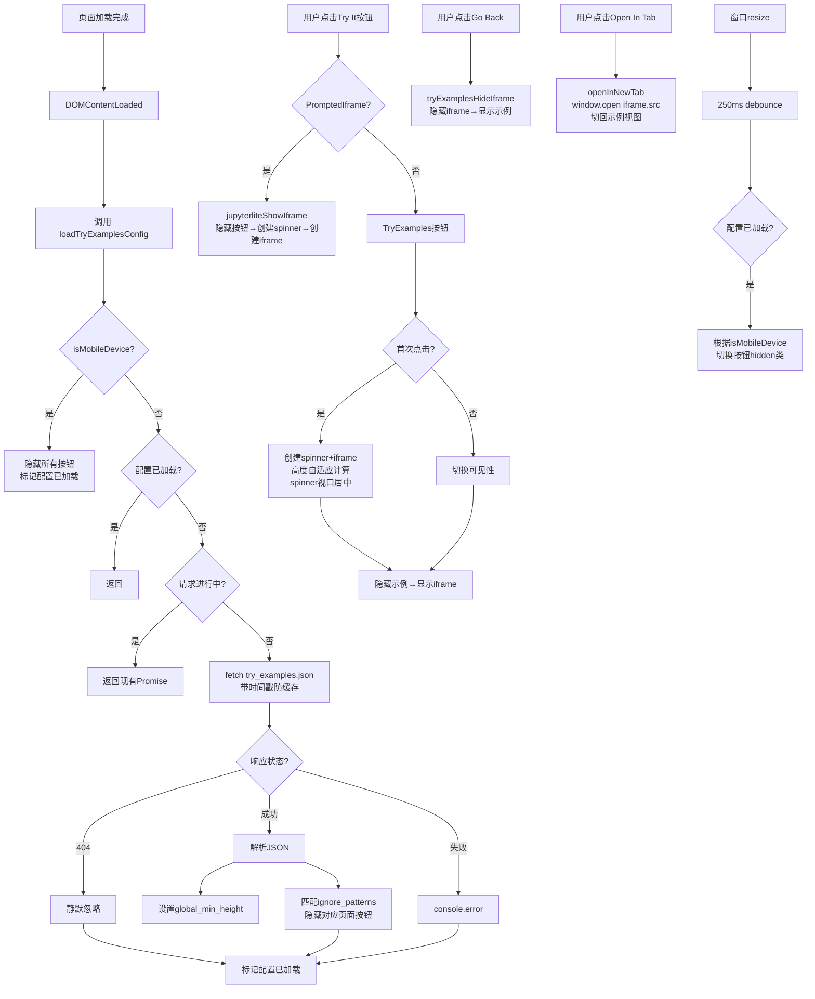

`jupyterlite_sphinx.js` 是 jupyterlite-sphinx 扩展注入到 HTML 页面的前端交互脚本，通过在 `window` 全局对象上挂载一组函数，实现了 iframe 懒加载、搜索参数传递、TryExamples 视图切换、移动端自适应检测、运行时配置热加载等核心交互能力。该脚本无任何外部依赖（不依赖 jQuery、React 等框架），使用原生 DOM API 编写，体积小巧且兼容性好。

本文逐一剖析脚本中各全局函数和 IIFE（立即调用函数表达式）模块的实现细节、调用关系和设计意图，帮助理解用户与文档中嵌入的 JupyterLite 环境交互时前端发生的全部行为。

## 脚本加载与全局函数概览

脚本通过 Sphinx 的 `app.add_js_file("jupyterlite_sphinx.js")` 注册，随 HTML 页面加载自动执行。所有对外接口均挂载在 `window` 对象上，可被 HTML 元素的 `onclick` 属性或浏览器控制台直接调用。

| 全局函数/变量 | 类型 | 核心功能 |
|--------------|------|---------|
| `jupyterliteShowIframe` | 函数 | PromptedIframe 按钮点击后的懒加载处理 |
| `jupyterliteConcatSearchParams` | 函数 | 将页面 URL 搜索参数合并到 iframe URL |
| `tryExamplesShowIframe` | 函数 | TryExamples 切换到 iframe 嵌入视图 |
| `tryExamplesHideIframe` | 函数 | TryExamples 切回示例代码视图 |
| `openInNewTab` | 函数 | 在新标签页打开当前 iframe 的 Notebook |
| `isMobileDevice` | 函数 | 检测是否为移动设备（IIFE 单例） |
| `loadTryExamplesConfig` | 函数 | 加载 try_examples.json 运行时配置 |
| `toggleTryExamplesButtons` | 函数 | 调试用：切换按钮可见性 |
| `tryExamplesGlobalMinHeight` | 变量 | iframe 全局最小高度（默认 0） |
| `tryExamplesConfigLoaded` | 变量 | 配置是否已加载（防重复请求标志） |

## jupyterliteShowIframe：PromptedIframe 懒加载

`jupyterliteShowIframe(tryItButtonId, iframeSrc)` 是 `_PromptedIframe` 节点在 `prompt=True` 模式下的点击回调，负责实现"点击按钮→显示加载动画→加载 iframe"的懒加载交互流程。

### 执行步骤

1. **获取按钮元素**：通过 `document.getElementById(tryItButtonId)` 获取被点击的按钮 DOM 元素。
2. **创建 iframe**：动态创建 `<iframe>` 元素，设置 `src`、`width="100%"`、`height="100%"`，添加 CSS 类 `jupyterlite_sphinx_iframe`。
3. **创建 spinner**：创建 50×50 像素的加载指示器 `<div>`，添加 CSS 类 `jupyterlite_sphinx_spinner`。spinner 通过负 margin（`marginTop: -25px`, `marginLeft: -25px`）实现居中定位。初始 `display: none`，在按钮隐藏后设为 `display: block`。
4. **切换可见性**：将按钮设为 `display: none`，spinner 设为 `display: block`。
5. **追加到 DOM**：将 spinner 和 iframe 依次追加到按钮的父节点（即 `jupyterlite_sphinx_iframe_container` div）。

### 设计要点

- **懒加载优势**：页面初始加载时不创建 iframe，避免同时加载多个 JupyterLite 内核实例导致浏览器内存和带宽压力。
- **spinner 尺寸硬编码**：50×50 px 的 spinner 尺寸与 CSS 中的定义必须保持一致，源码注释中特别标注了这一约束。
- **按钮仅隐藏不删除**：按钮元素保留在 DOM 中（`display: none`），为后续可能的状态恢复预留可能。

## jupyterliteConcatSearchParams：搜索参数合并

`jupyterliteConcatSearchParams(iframeSrc, params)` 函数将当前页面的 URL 搜索参数（query string）合并到 iframe 的源 URL 中，实现主页面与嵌入环境之间的参数传递。

### 参数处理逻辑

函数根据 `params` 参数的类型执行不同策略：

| `params` 值 | 行为 |
|------------|------|
| `true` | 传递当前页面所有搜索参数 |
| `false` | 不传递任何参数（返回原始 URL） |
| 数组（如 `["kernel", "theme"]`） | 仅传递数组中指定名称的参数 |
| 其他类型 | 通过 `console.error()` 输出错误信息 |

### 实现细节

```javascript
const pageParams = new URLSearchParams(window.location.search);
if (params === true) {
  params = Array.from(pageParams.keys());
} else if (params === false) {
  params = [];
}
params.forEach((param) => {
  const value = pageParams.get(param);
  if (value !== null) {
    iframeUrl.searchParams.append(param, value);
  }
});
```

函数使用 `URL` 对象解析和构造 URL，确保参数正确编码。返回值处理了 URL 中是否已有查询参数的情况：若合并后有参数则拼接为 `?key=value` 形式，否则返回原始 URL。

这个函数在 `_PromptedIframe.html()` 生成的 onclick 代码中被调用，支持指令中通过 `:search_params:` 选项控制参数传递行为。

## TryExamples 三核心函数

TryExamples 功能提供了三个紧密协作的函数，实现"示例代码视图 ↔ 交互式 Notebook 视图"之间的切换。

### tryExamplesShowIframe：切换到 Notebook 视图

`tryExamplesShowIframe(examplesContainerId, iframeContainerId, iframeParentContainerId, iframeSrc, iframeHeight)` 在用户点击 "Try it with JupyterLite!" 按钮时触发。

**首次调用（iframe 尚未创建）时**：

1. 创建 50×50 spinner 并追加到 iframe 容器。
2. 获取示例内容区域（`.try_examples_content`）的高度。
3. 创建 iframe 元素，宽度设为 100%，高度按以下优先级确定：
   - 若指令指定了 `:height:` 选项（`iframeHeight !== "None"`），使用指定高度。
   - 否则，取 `Math.max(tryExamplesGlobalMinHeight, examples.offsetHeight)`，即全局最小高度和示例内容实际高度的较大值，确保 iframe 不会过小或比原始代码示例更矮。
4. **Spinner 位置计算**：spinner 不简单居中，而是计算视口可见区域内的居中位置——`0.5 × min(viewportBottom - examplesTop, height)`。这确保当 iframe 区域超出视口底部时，spinner 仍然在可见区域内居中，提升用户体验。
5. 为示例容器添加 `hidden` 类（隐藏原始代码），为 iframe 设置高度和 CSS 类。
6. 将 iframe 追加到容器，移除 iframe 父容器的 `hidden` 类（显示 iframe）。

**后续调用（iframe 已存在）时**：仅切换可见性——隐藏示例容器，显示 iframe 容器，不重新创建 iframe，避免重新加载 JupyterLite 环境。

### tryExamplesHideIframe：切回示例视图

`tryExamplesHideIframe(examplesContainerId, iframeParentContainerId)` 执行与 show 相反的操作：给 iframe 父容器添加 `hidden` 类，从示例容器移除 `hidden` 类。iframe 及其状态被保留，用户再次点击"Try it"按钮时可以回到之前的 Notebook 状态（已执行的代码和输出不会丢失）。

### openInNewTab：新标签页打开

`openInNewTab(examplesContainerId, iframeParentContainerId)` 获取当前 iframe 的 `src` 属性，通过 `window.open()` 在新标签页打开完整的 JupyterLite 环境，然后调用 `tryExamplesHideIframe()` 切回示例视图。这允许用户在独立标签页中获得更大的工作空间，同时保持文档页面的整洁。

函数假设 iframe 容器中只有一个 iframe 元素（通过 `getElementsByTagName("iframe")[0]` 获取），这在当前 TryExamples 实现中始终成立。

## isMobileDevice：移动端检测

`isMobileDevice` 是一个使用 IIFE 模式实现的单例检测函数，结合 User-Agent 正则匹配和屏幕尺寸判断，识别移动设备以自动禁用交互式按钮（节省带宽和优化移动端体验）。

### 实现结构

IIFE 创建了一个闭包，维护两个私有变量：

- `cachedUAResult`：缓存首次 UA 检测结果，避免重复执行正则匹配。
- `hasLogged`：确保移动端检测日志仅输出一次。

内部函数 `checkUserAgent()` 执行 14 种移动设备 UA 模式匹配：

| 序号 | 正则模式 | 匹配设备 |
|------|---------|---------|
| 1 | `/Android/i` | Android 设备 |
| 2 | `/webOS/i` | webOS 设备 |
| 3 | `/iPhone/i` | iPhone |
| 4 | `/iPad/i` | iPad |
| 5 | `/iPod/i` | iPod Touch |
| 6 | `/BlackBerry/i` | 黑莓设备 |
| 7 | `/IEMobile/i` | Windows Mobile/IE Mobile |
| 8 | `/Windows Phone/i` | Windows Phone |
| 9 | `/Opera Mini/i` | Opera Mini 浏览器 |
| 10 | `/SamsungBrowser/i` | 三星浏览器 |
| 11 | `/UC.*Browser\|UCWEB/i` | UC 浏览器 |
| 12 | `/MiuiBrowser/i` | MIUI 浏览器 |
| 13 | `/Mobile/i` | 通用移动设备标识 |
| 14 | `/Tablet/i` | 平板设备标识 |

### 屏幕尺寸兜底

返回的函数在 UA 检测之外，还检查屏幕尺寸：`window.innerWidth <= 480 || window.innerHeight <= 480`。任一维度 ≤480px 即判定为移动设备。这个尺寸检查作为 UA 检测的补充，覆盖某些 UA 字符串无法识别的小屏设备。

### 检测结果行为

首次检测到移动设备时，输出 `console.log` 提示信息（"Either a mobile device detected or the screen was resized. Disabling interactive example buttons to conserve bandwidth."），并将所有 `.try_examples_button` 按钮添加 `hidden` 类隐藏。

## ConfigLoader：运行时配置加载器

`ConfigLoader` 是一个 IIFE 模块，负责加载 `try_examples.json` 运行时配置文件。该配置文件允许在**不重新构建文档**的情况下调整 TryExamples 的行为，是前端热配置的核心机制。

### 请求去重机制

模块维护 `configLoadPromise` 变量实现 Promise 级别的请求去重。当页面上存在多个 try_examples 指令时，每个指令都会在 `DOMContentLoaded` 事件中调用 `loadTryExamplesConfig()`，但只有第一次调用会发起实际的 HTTP 请求，后续调用直接返回同一个 Promise，避免重复请求。

### loadConfig 执行流程

1. **移动端预检**：首先调用 `isMobileDevice()`，若检测到移动设备，直接隐藏所有按钮并将 `tryExamplesConfigLoaded` 设为 `true`，返回（不发起配置请求）。
2. **加载状态检查**：若 `tryExamplesConfigLoaded` 为 `true`，直接返回。
3. **去重检查**：若 `configLoadPromise` 已存在（请求进行中），返回该 Promise。
4. **发起请求**：创建新的异步 Promise：
   - 在配置文件 URL 后追加时间戳查询参数 `?cb=<timestamp>`，防止浏览器缓存旧配置。
   - 通过 `fetch()` 请求配置文件。
   - **404 处理**：若响应状态码为 404，仅输出 `console.log` 提示"Optional try_examples config file not found."，不抛出错误——配置文件是完全可选的。
   - **解析配置**：
     - `global_min_height`：设置全局变量 `tryExamplesGlobalMinHeight`（使用 `parseInt()` 转为像素数值）。
     - `ignore_patterns`：遍历正则模式列表，对当前页面 URL 的 `pathname` 进行匹配测试。匹配成功时隐藏该页面所有 `.try_examples_button` 按钮。
   - **finally 块**：无论请求成功或失败，都将 `tryExamplesConfigLoaded` 设为 `true`，确保不会重复请求。

### resetState()：调试重置

`resetState()` 方法将 `tryExamplesConfigLoaded` 重置为 `false`、`configLoadPromise` 重置为 `null`，供开发调试时使用（例如在浏览器控制台修改配置文件后重新加载）。源码注释标注其用途为"for testing/debugging only"。

## resize 事件监听：响应式按钮可见性

脚本注册了 `resize` 事件监听器，实现窗口大小变化时的按钮可见性响应：

```javascript
let resizeTimeout;
window.addEventListener("resize", () => {
  clearTimeout(resizeTimeout);
  resizeTimeout = setTimeout(() => {
    if (!tryExamplesConfigLoaded) return;
    const buttons = document.getElementsByClassName("try_examples_button");
    const shouldHide = window.isMobileDevice();
    for (let i = 0; i < buttons.length; i++) {
      if (shouldHide) {
        buttons[i].classList.add("hidden");
      } else {
        buttons[i].classList.remove("hidden");
      }
    }
  }, 250);
});
```

关键设计：

- **250ms 防抖（debounce）**：resize 事件高频触发，通过 `setTimeout` 延迟 250ms 执行，避免频繁 DOM 操作。
- **配置加载前置检查**：若配置尚未加载（`!tryExamplesConfigLoaded`），跳过处理，避免在 ConfigLoader 之前执行冲突操作。
- **双向切换**：窗口从小屏拖到大屏时，按钮自动重新显示；从大屏缩到小屏时，按钮自动隐藏。这支持桌面用户调整浏览器窗口大小或平板设备横竖屏切换的场景。

## toggleTryExamplesButtons：调试工具

`toggleTryExamplesButtons()` 是一个便捷的调试函数，遍历所有 `.try_examples_button` 按钮并通过 `classList.toggle("hidden")` 切换其可见性。可在浏览器开发者工具控制台中直接调用，用于测试按钮隐藏/显示逻辑。

## CSS 类名清单

脚本中引用的 CSS 类名及其用途如下：

| CSS 类名 | 应用元素 | 用途 |
|---------|---------|------|
| `jupyterlite_sphinx_spinner` | spinner `<div>` | 加载动画指示器样式 |
| `jupyterlite_sphinx_iframe` | `<iframe>` | 嵌入的 JupyterLite iframe 样式 |
| `jupyterlite_sphinx_iframe_container` | 容器 `<div>` | PromptedIframe 的点击区域容器 |
| `jupyterlite_sphinx_raw_iframe` | `<iframe>` | 无 prompt 模式直接嵌入的 iframe |
| `jupyterlite_sphinx_try_it_button` | 按钮 `<div>` | "Try It Live!" 按钮基本样式 |
| `jupyterlite_sphinx_try_it_button_unclicked` | 按钮 `<div>` | 未点击状态按钮样式 |
| `try_examples_button` | `<button>` | TryExamples 操作按钮（Try it/Go Back/Open In Tab） |
| `try_examples_button_container` | `<div>` | 按钮组容器 |
| `try_examples_outer_container` | `<div>` | TryExamples 外部包装容器 |
| `try_examples_content` | `<div>` | 原始示例代码展示区域 |
| `try_examples_outer_iframe` | `<div>` | iframe 外部容器（初始 hidden） |
| `hidden` | 通用 | 标准隐藏类（`display: none`） |

## try_examples.json 运行时配置

`try_examples.json` 放置在 Sphinx 源目录根下，由扩展在构建时自动复制到输出目录。前端 JavaScript 在页面加载时通过 fetch 请求读取该文件，支持的配置项：

| 字段 | 类型 | 说明 |
|------|------|------|
| `global_min_height` | 字符串（如 `"400px"`） | 所有 try_examples iframe 的全局最小高度，parseInt 后作用于未指定 `:height:` 的 iframe |
| `ignore_patterns` | 字符串数组 | JavaScript 正则表达式列表，匹配 `window.location.pathname`，匹配页面的按钮自动隐藏 |

与 `conf.py` 中的构建时配置不同，`try_examples.json` 的修改在部署后直接生效（刷新页面即可），无需重新运行 Sphinx 构建。配置请求带有时间戳防缓存参数，但由于 `tryExamplesConfigLoaded` 标志在页面生命周期内不会重置（除非手动调用 `resetState()`），同一页面内配置只加载一次。

## 交互流程全景图

以下流程图展示了用户从页面加载到与 JupyterLite 环境交互的完整前端事件链：



## 相关概念

- [构建流程详解](/concepts/10-build-process.md)
- [自定义节点类层次](/concepts/11-node-hierarchy.md)
- [try_examples 指令——交互式文档示例](/concepts/08-try-examples-directive.md)
- [配置参考](/concepts/09-configuration.md)
- [前端JS源码](/references/js-source.md)
