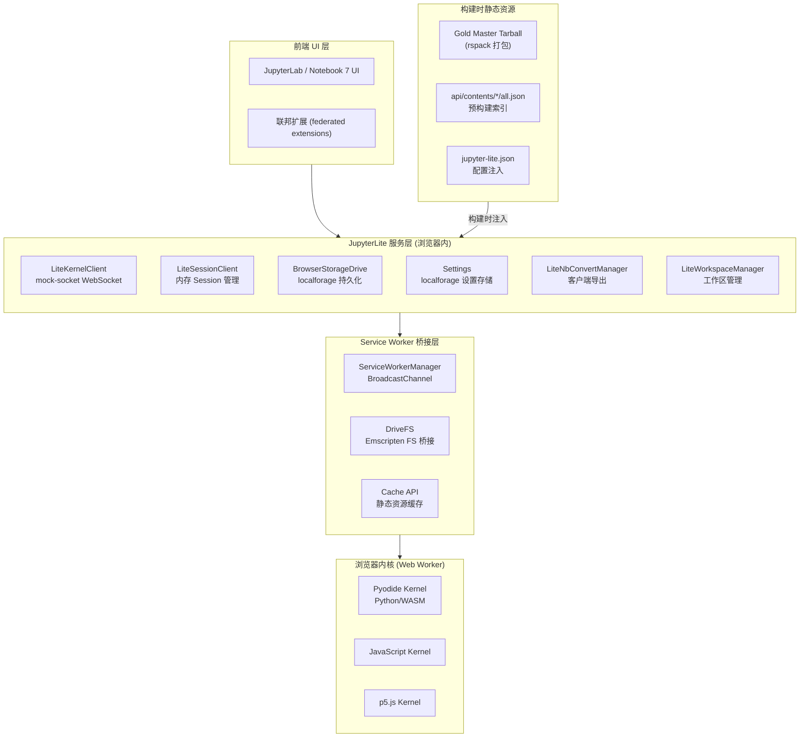

# JupyterLite 架构洞察

## I-001: 浏览器内 Jupyter 全栈——"Server in the Browser" 架构模式

JupyterLite 的核心架构创新在于将 Jupyter 的完整服务端栈（Kernel/Session/Contents/Settings/NbConvert）在浏览器中重新实现，消除了对传统 Jupyter Server 的依赖。这一架构通过以下分层实现：

**关键设计决策**：

1. **mock-socket 模拟 WebSocket**：LiteKernelClient 使用 `mock-socket` 库在浏览器中创建本地 WebSocketServer，使得 JupyterLab 的标准 Kernel WebSocket 客户端无需修改即可连接到浏览器内内核。WebSocket URL 从 http(s) 转换为 ws(s)，协议路径遵循 `/api/kernels/{id}/channels` 标准。

2. **doit-based 构建管线**：Python 端构建系统使用 doit 任务引擎，通过 entry-points 插件体系（`jupyterlite.addon.v0`）将构建步骤分解为独立 addon。每个 addon 声明 `__all__` 钩子方法，LiteManager 在 pre_/"" /post_ 三个阶段 × 6 个钩子（status/init/build/check/serve/archive）的矩阵中调度任务，使用 `doit.create_after` 保证执行顺序。

3. **双层存储模型**：BrowserStorageDrive 实现了"本地覆盖+静态回退"的双层内容模型。用户修改存储在 IndexedDB（通过 localforage），静态文件从预构建的 `api/contents/*/all.json` 索引和 `/files/` 路径提供。localforage 使用三个独立 store 分别管理 files/counters/checkpoints。

4. **Service Worker 作为内核桥**：Service Worker 拦截 `/api/drive*` 和 `/api/stdin/*` 的 fetch 请求，通过 BroadcastChannel 将请求转发给主线程的 DriveContentsProcessor 处理。这使得 Pyodide 内核的 Emscripten 文件系统（DriveFS）能够通过标准 HTTP 请求访问浏览器存储，实现了 WASM 内核与浏览器存储的桥接。

## I-002: Addon 插件体系——可扩展的构建时插件架构

JupyterLite 的 Python 端构建系统采用了基于 entry-points 的插件架构，这是一种在构建时而非运行时生效的可扩展模式：

| 组件 | 职责 | 关键钩子 |
|------|------|----------|
| StaticAddon | 解包 gold master tarball，裁剪不需要的 app 和 chunk | pre_init, init, post_init |
| ContentsAddon | 复制用户文件到 /files/，生成 Contents API all.json | build, post_build, check, status |
| LiteAddon | 合并 jupyter-lite.json/ipynb 配置，schema 验证 | build, check, status |
| LiteBuildConfig | traitlets 配置基类，所有 addon 共享配置 | — |
| BaseAddon | 文件操作、配置合并、JSON 验证、时间戳处理等工具 | — |
| ServeAddon | tornado/stdlib HTTP 服务器，用于本地预览 | status, serve |
| ArchiveAddon | 打包输出为 tgz 归档 | archive |
| SettingsAddon | 处理 settings overrides | build, post_build |
| FederatedExtensionAddon | 处理 JupyterLab 联邦扩展 | build, post_build |
| IconsAddon | 处理图标资源 | build |
| MimetypesAddon | 配置 MIME 类型 | build |
| TranslationAddon | 处理国际化翻译 | build, post_build |
| WorkspacesAddon | 处理工作区配置 | build, post_build |
| ReportAddon | 生成构建报告 | build, post_build |

**架构特征**：

- **发现机制**：通过 `importlib.metadata.entry_points(group="jupyterlite.addon.v0")` 自动发现已安装的 addon，使用 `@lru_cache(1)` 缓存。
- **CLI 扩展**：addon 可定义 `aliases` 和 `flags` 属性，在启动时动态合并到主 CLI。
- **任务生成**：每个 addon 的钩子方法是 doit task generator，yield 任务字典（含 name/actions/file_dep/targets 等）。
- **生命周期**：pre_init → init → post_init → pre_build → build → post_build → pre_check → check → post_check → serve/archive，前置阶段的输出作为后置阶段的依赖。

## I-003: 前端 monorepo 包迁移——从分包到统一 services 的收敛

源码中观察到一个显著的架构演变趋势：`@jupyterlite/server`、`@jupyterlite/kernel`、`@jupyterlite/contents` 三个包均标记为 deprecated（计划 0.8.0 移除），全部重新导出到 `@jupyterlite/services` 和 `@jupyterlite/apputils`。这表明项目经历了从细粒度分包到更粗粒度聚合包的收敛，减少了包间依赖复杂度。

核心包职责映射：

| 包 | 状态 | 核心职责 |
|----|------|----------|
| @jupyterlite/services | 活跃 | Kernel/Session/Contents/Settings/NbConvert 全部服务层实现 |
| @jupyterlite/apputils | 活跃 | ServiceWorker/StateDB/Workspaces/Translation/Licenses/PluginManager |
| @jupyterlite/application | 活跃 | LiteRouter/SingleWidgetApp/SingleWidgetShell |
| @jupyterlite/application-extension | 活跃 | 14 个 JupyterLab 插件的注册入口 |
| @jupyterlite/localforage | 活跃 | localforage 封装与内存存储 |
| @jupyterlite/types | 活跃 | 共享类型定义和 tokens |
| @jupyterlite/ui-components | 活跃 | Lite 图标和品牌组件 |
| @jupyterlite/server | deprecated → apputils | SW manager shim |
| @jupyterlite/kernel | deprecated → services | Kernel shim |
| @jupyterlite/contents | deprecated → services | Contents/Drive shim |

## I-004: 离线优先与 PWA 能力

JupyterLite 通过 Service Worker 实现离线能力，但设计上保持了灵活性：

1. **缓存可选**：`enableServiceWorkerCache` 通过 PageConfig 控制，默认为 `false`，不强制缓存所有资源。
2. **版本感知 SW 更新**：ServiceWorkerManager 在注册时比较 localStorage 中的版本号与当前 VERSION，版本变更时注销所有旧 SW 并重新注册。
3. **心跳保活**：主线程每 20 秒 ping `/api/service-worker-heartbeat` 防止 SW 被浏览器回收。
4. **多标签页隔离**：每个 browsingContext 使用 UUID 标识，BroadcastChannel 消息携带 browsingContextId 和 requestId 确保消息路由到正确的标签页。
5. **stdin 桥接**：SW 的 stdin 处理器允许 kernel（运行在 Worker 中）通过 SW→BroadcastChannel→主线程的路径请求用户输入，解决了 Worker 无法直接访问 UI 线程的问题。
