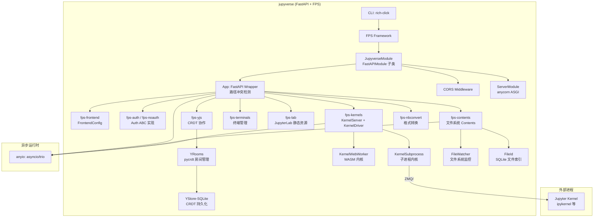

# jupyverse 架构洞察

## 洞察一：FPS 插件框架的完全可插拔设计——从"继承扩展"到"组合即应用"

jupyverse 最根本的架构决策是将整个 Jupyter 服务器重构为一组 FPS（FastAPI Pluggable System）插件的**组合体**。这与 jupyter_server 的 ExtensionApp 模型形成了鲜明对比：

| 维度 | jupyter_server (ExtensionApp) | jupyverse (FPS Modules) |
|------|-------------------------------|--------------------------|
| 扩展机制 | 继承 `ExtensionApp`，通过 `initialize()` 钩子注册 handler | 实现 FPS `Module`，通过 `prepare()` 生命周期方法向容器 put/get 对象 |
| 核心应用 | `ServerApp` 是 God Object，所有功能内聚 | 不存在核心应用对象，JupyverseModule 仅做 CORS/服务器启动配置 |
| 依赖注入 | 通过 `self.serverapp` 引用父应用，隐式耦合 | 通过 FPS 容器的 `get(Type)`/`put(obj, Type)` 显式声明依赖，依赖抽象而非具体 |
| 可选功能 | 通过 `--ServerApp.disable` 或 traitlets 配置关闭 | 通过 entry points 发现 + `--disable` 排除，未安装的包天然不加载 |
| 认证替换 | 自定义 `IdentityProvider` 需继承特定基类，耦合 Tornado | `Auth` 是 ABC 抽象基类，fps-noauth/fps-auth/fps-auth-fief/fps-auth-jupyterhub 四种实现可互换 |
| 内核后端 | 内置 `MappingKernelManager`，替换需继承重写 | `DefaultKernelFactory` 可被 fps-kernel-subprocess/fps-kernel-web-worker 替换，运行时注入 |

关键模式：**抽象 API 层（`jupyverse_*` 包）与具体实现层（`fps_*` 包）的严格分离**。`jupyverse-contents` 定义 Contents ABC 和 REST 路由结构，`fps-contents` 提供基于文件系统的实现。这种分层意味着：

1. 插件之间通过抽象接口交互（如 `await self.get(Auth)` 获取的是 ABC 类型）
2. 同一抽象可有多个互斥实现（如认证：noauth/auth/fief/jupyterhub 四选一；文件监控：file_watcher vs file_watcher_poll）
3. 第三方可以不修改核心代码就替换任意组件——只需实现 ABC 并通过 entry point 注册

根包 `jupyverse` 本身只有 3 行代码（读取版本号），这是"薄壳组合"理念的极端体现：jupyverse 不是一个服务器程序，而是一组 FPS 插件的**精选依赖列表**。

## 洞察二：API 层定义路由、实现层填充逻辑——FastAPI 路由声明的"模板方法模式"

jupyverse 采用了一种独特的路由组织模式：**抽象基类在构造函数中声明所有 FastAPI 路由，路由处理器调用抽象方法，子类实现抽象方法**。这相当于将 Template Method 模式应用到了 HTTP API 设计中。

以 Contents API 为例：

```
jupyverse_contents.Contents (ABC, Router)
├── __init__: 定义所有 /api/contents/* 路由，绑定权限
│   ├── @router.post("/api/contents/{path}/checkpoints") → self.create_checkpoint() [抽象]
│   ├── @router.get("/api/contents/{path}")             → self.get_content() [抽象]
│   ├── @router.put("/api/contents/{path}")             → self.save_content() [抽象]
│   └── ... 共 7 个路由端点
└── 抽象方法: read_content, write_content, create_checkpoint, ...

fps_contents._Contents (具体实现)
└── 实现 8 个抽象方法，使用 anyio.Path + anyio.to_thread 做异步文件 IO
```

这种设计带来了几个重要后果：

1. **API 契约在抽象层固化**：所有 Jupyter REST API 的路径、方法、权限模型都在 `jupyverse_*` API 包中定义，不会因实现替换而漂移
2. **路径冲突检测成为可能**：App 包装器在 `_include_router` 时通过 `_router_paths` 字典追踪每个插件注册的路径，若两个插件注册同一路径则立即抛出 RuntimeError——这解决了多插件环境下路由覆盖的静默错误
3. **实现层极简**：fps-contents 的 `routes.py` 只需关注文件系统操作逻辑，无需关心路由声明、权限校验、请求解析
4. **替代实现成为可能**：理论上可以编写 `fps-contents-s3` 或 `fps-contents-webdav`，只要实现 Contents ABC 的 8 个抽象方法，就能复用完整的 REST API 层

Router 类委托给 App 类进行路由注册，而 App 类维护每个 Router 注册的路径集合，形成了"声明-冲突检测-注册"的三层结构。这是多插件 FastAPI 应用中防止路由冲突的优雅方案。

## 洞察三：FastAPI + anyio 生态对 Tornado 的替代——异步原生与微服务友好

jupyverse 选择 FastAPI 替代 jupyter_server 的 Tornado 基础，这不仅是框架替换，更带来了架构层面的连锁变化：



核心变化包括：

1. **ASGI 原生**：使用 anycorn（ASGI 服务器）替代 Tornado 的 HTTPServer，天然适配 ASGI 中间件生态（CORS、GZip 等即插即用）
2. **anyio 抽象**：全面使用 anyio 而非 asyncio 直接 API，支持 asyncio 和 trio 两种事件循环后端切换（通过 `--backend` CLI 参数）。文件 IO 使用 `anyio.Path` 和 `anyio.to_thread.run_sync` 实现真正的非阻塞
3. **Pydantic v2 配置**：所有配置类继承自 `Config(BaseModel)` 并设置 `extra = "forbid"`，配置验证由 Pydantic 完成，替代 jupyter_server 的 traitlets 系统。配置可通过 CLI `--set` 参数或 JSON 配置文件传递
4. **structlog 结构化日志**：全链路使用 structlog，日志输出包含 `type`（插件名）、`path`（路由路径）、`kernel_id` 等结构化字段，便于微服务环境下的日志聚合
5. **子进程内核管理**：KernelServer 通过 anyio 管理内核子进程的生命周期，支持外部内核（通过监控连接文件目录发现）和内部内核（直接启动子进程），kernel_channels WebSocket 端点实现 Jupyter Wire Protocol 代理
6. **jupyter_server 兼容桥**：fps-jupyter-server 插件甚至可以启动一个真正的 jupyter_server 子进程并通过 httpx2 代理 HTTP/WebSocket 请求，提供迁移过渡路径

FastAPI 的选型也带来了现代 Python 生态的红利：自动 OpenAPI 文档（`/openapi.json` 默认开启）、类型驱动的请求校验、`Depends()` 依赖注入与 FPS 容器的自然配合。但值得注意的是，jupyverse 并未直接使用 FastAPI 的 `Depends()` 做跨插件依赖——它通过 FPS 容器的 `get()/put()` 实现更灵活的依赖注入，`Depends()` 仅用于路由端点级别的认证依赖。
