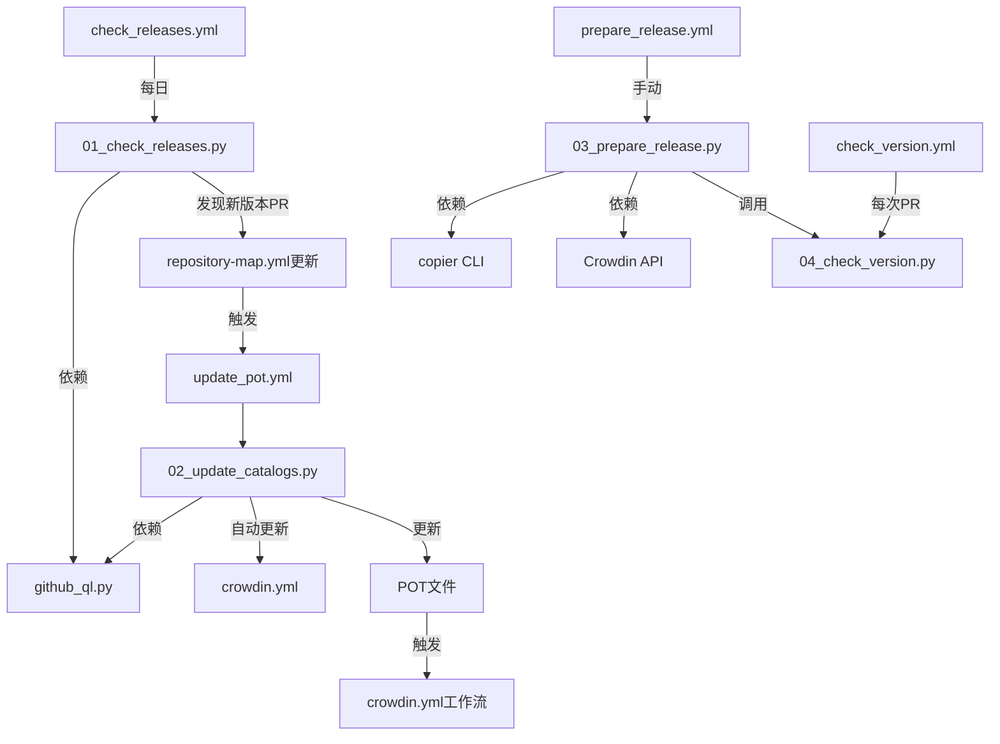

# 自动化脚本体系

`scripts/` 目录包含 4 个核心 Python 脚本（编号 01-04），加上 1 个工具模块 `github_ql.py`，构成 language-packs 自动化流水线的核心逻辑。所有脚本通过 GitHub Actions 工作流调用，以 Bot 身份执行 Git 操作。

## 脚本总览

| 脚本 | 功能 | 触发时机 | 调用工作流 |
|------|------|---------|-----------|
| `01_check_releases.py` | 检测上游新版本并更新 repository-map.yml | 每日 UTC 0:00 | `check_releases.yml` |
| `02_update_catalogs.py` | 克隆上游仓库、提取POT、更新crowdin.yml | 配置/POT变更时 | `update_pot.yml` |
| `03_prepare_release.py` | 版本提升+贡献者更新+Copier同步 | 手动触发 | `prepare_release.yml` |
| `04_check_version.py` | 检查所有语言包版本一致性 | PR提交时 | `check_version.yml` |
| `github_ql.py` | GitHub GraphQL API 封装工具 | 被其他脚本调用 | — |

## Bot 身份认证

所有脚本使用 GitHub App Bot 身份执行 Git 操作：

```python
os.environ["GH_TOKEN"] = os.environ["BOT_TOKEN"]
actor = "github-actions[bot]"
email = "41898282+github-actions[bot]@users.noreply.github.com"
```

- 使用 `BOT_TOKEN` 环境变量（GitHub App token）认证
- commit author/committer 统一设置为 `github-actions[bot]`
- push 时使用 `--no-verify` 跳过本地 hooks
- 工作流中使用 `actions/checkout` 的 `persist-credentials: true`

## 01_check_releases.py — 版本检测

### 功能
定期检查每个上游扩展是否有新版本，自动更新 repository-map.yml 的 `current-version-tag`。

### 核心逻辑
1. 调用 GitHub GraphQL API 查询各仓库最近 100 个 tag
2. 过滤掉 dev 版本和 prerelease 版本
3. 解析版本号，比较是否大于当前 `current-version-tag`
4. 对 jupyterlab 包，按主版本号前缀过滤（避免 v3.x 的最后patch版本比v4.0.0新）
5. 检查新版本是否在 `supported-versions` 范围内
6. 若有更新：写回 repository-map.yml，自动提交并创建 PR
7. 若新 tag 不在 supported-versions 范围内：输出警告信息提醒维护者更新

### 关键约束
- 仅检测非 dev 非 prerelease 版本
- 支持分支名作为 current-version-tag（不推荐）
- 超出 supported-versions 范围时不自动更新，需要人工处理

## 02_update_catalogs.py — POT 更新

### 功能
从上游仓库提取可翻译字符串，更新 POT 模板文件，自动维护 crowdin.yml。

### 核心流程

```python
# 1. 自动生成 crowdin.yml 文件映射
update_crowdin_config()

# 2. 遍历 repository-map.yml 中的每个包
for package_name, package_info in repo_map.items():
    # 3. 收集需要合并的版本
    versions = _get_releases(package_name, package_info)
    
    # 4. clone并提取每个版本的字符串
    for version in versions:
        update_catalog(package_name, version, merge=True)
    
    # 5. 最后处理当前版本（确保包含最新字符串）
    update_catalog(package_name, current_version, merge=True)

# 6. 提交变更并创建PR
subprocess.run(["git", "push", "origin", branch_name])
pr = gh_repo.create_git_ref(...)
gh_repo.create_pull(...)
```

### 版本合并策略

对每个包，脚本：
1. 使用 GitHub GraphQL 获取最近 100 个 tag（按提交日期降序）
2. 过滤出符合条件的版本：非dev、非prerelease、semver可解析、在 supported-versions 范围内
3. 对每个符合条件的版本：浅克隆（`--depth=1`）→ 提取语言包 → merge到POT
4. 最后确保 current-version-tag 的版本也被处理
5. 对于分支名（非tag）：仅从当前分支HEAD提取，不merge

### 关键参数
- `repos/`：临时克隆目录（.gitignore排除）
- `depth=1`：浅克隆，减少下载
- `source_repo = repos/{package_name}`：克隆目标路径
- `output_dir = extensions/{snake_name}/locale/` 或 `jupyterlab/locale/`
- `merge = True`：merge到已有POT而非替换

### crowdin.yml 自动维护
`update_crowdin_config()` 函数根据 repository-map.yml 自动重新生成 crowdin.yml 的 files 列表：
- jupyterlab 核心 POT 固定在首位
- 扩展包按字母顺序排列
- 包名自动转换 kebab-case → snake_case
- 路径模板使用 `%locale%` 和 `%locale_with_underscore%` 占位符

## 03_prepare_release.py — 发布准备

### 功能
在发布前执行三项准备工作：
1. 更新所有语言包的版本号
2. 更新 CONTRIBUTORS.md 贡献者列表
3. 使用 Copier 更新模板

### 执行顺序
脚本严格按以下顺序执行，每项完成后单独提交：

1. **版本更新**：解析 `--version-tag` 参数（默认最新），更新所有 `__init__.py` 中的 `__version__`
2. **贡献者更新**：调用 Crowdin API (`api.crowdin.com/api/v2/projects/409874/members?limit=500`) 获取译者列表，重写所有 CONTRIBUTORS.md
3. **Copier更新**：对每个语言包目录执行 `copier --defaults update`，同步 cookiecutter 模板变更
4. **最后检查**：调用 `04_check_version.py` 验证所有版本一致

### 调用方式
通过 `prepare_release.yml` 工作流手动触发（workflow_dispatch），可指定 version-tag 参数。

## 04_check_version.py — 版本一致性检查

### 功能
确保所有语言包的 `__version__` 完全一致。这是 CI 门禁，防止部分语言包漏更新。

### 核心逻辑
1. 遍历 `language-packs/` 目录下所有语言包
2. 读取每个包 `__init__.py` 中的 `__version__`
3. 检查是否所有版本号相同
4. 有不一致则退出码为 1，阻断 PR 合并

### 调用时机
- 每次 PR 提交时（`check_version.yml` 工作流）
- 发布准备完成后（03脚本内部调用）

## github_ql.py — GraphQL 工具模块

封装了 GitHub GraphQL API 查询，主要功能：

1. **`_github_ql(query)`**：执行 GraphQL 查询，自动处理分页
2. **`get_tags(owner, repo)`**：获取仓库最近 100 个 tag，返回 tag 名和提交日期
3. **`create_pull_request_with_labels`**：创建带标签的 PR（01脚本使用）

认证通过环境变量 `GH_TOKEN`（脚本内部设置为 BOT_TOKEN）。

## 脚本间调用关系



## 环境变量要求

所有脚本依赖以下环境变量：

| 变量 | 用途 | 配置位置 |
|------|------|---------|
| `BOT_TOKEN` | GitHub App Bot token | GitHub Secrets |
| `GH_TOKEN` | GitHub API token（脚本内部设为BOT_TOKEN） | 脚本自动设置 |
| `GIT_EMAIL` | Bot 提交邮箱 | 脚本自动设置 |
| `GIT_USERNAME` | Bot 用户名 | 脚本自动设置 |
| `CROWDIN_API_KEY` | Crowdin API 密钥（仅03脚本） | GitHub Secrets |

## 相关概念

- [整体架构概览](01-architecture-overview.md)
- [repository-map.yml 配置详解](03-repository-map-config.md)
- [CI/CD 流水线](08-cicd-pipeline.md)
- [发布流程](09-release-workflow.md)
