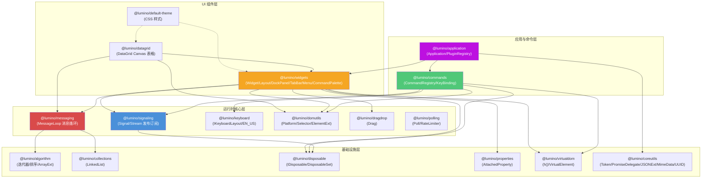

# Lumino 架构洞察

## 架构总览

---

## 洞察一：Signal-Message 双轨事件模型——弱耦合同步与异步消息的分离设计

### 陈述

Lumino 设计了两套相互独立但协同工作的事件机制：**Signal（信号）** 用于松耦合的发布-订阅通信，**Message（消息）** 用于 Widget 生命周期和命令式调度。两者的核心区别在于调度语义：Signal 的 emit 是**同步、立即、不可合并**的，所有 slot 按连接顺序在当前调用栈中执行（F-056）；而 Message 通过 MessageLoop 支持**同步发送（sendMessage）和异步投递（postMessage）**两种模式，且异步消息支持 conflation（合并）（F-041, F-036）。

Signal 的连接管理使用双向 WeakMap（receiversForSender + sendersForReceiver）（F-055），当 sender 或 receiver 被 GC 回收时连接自动清除，无需手动 dispose。disconnect 时采用"标记为 null + 异步清理"策略（F-058），避免在 emit 遍历过程中修改数组导致的迭代器失效问题。

MessageLoop 的异步调度基于 Promise.resolve().then() 微任务（F-045），使用 LinkedList 作为队列，并通过**哨兵值（sentinel）** 机制保证每轮循环只处理入队时已存在的消息（F-044）——运行中新增的消息推迟到下一轮处理，防止消息风暴导致的饥饿。消息钩子（IMessageHook）支持拦截，最新安装的钩子最先执行（LIFO 顺序）（F-040）。

### 证据

- Signal 双向 WeakMap：F-055（receiversForSender/sendersForReceiver）
- Signal 同步 emit：F-056（for 循环快照长度，同步调用 slot）
- Signal 异步清理：F-058（null 标记 + scheduleCleanup + requestAnimationFrame/setImmediate）
- Message 同步发送：F-040（sendMessage 立即执行 hooks + handler）
- Message 异步投递与合并：F-041（postMessage 尝试 conflate，未合并入队）
- Message 哨兵机制：F-044（sentinel 标记队列边界，新消息下轮处理）
- Message 微任务调度：F-045（Promise.resolve 链）
- ConflatableMessage：F-036（isConflatable=true，conflate 始终返回 true）
- Widget 生命周期消息：F-067（15 种消息类型的 processMessage 分派）

### 反常识

1. **Widget 的 update()/fit()/activate() 不是立即执行，而是 post 异步消息**（F-069）。这意味着连续多次调用 update() 只会产生一次实际的 onUpdateRequest 处理——但这不是因为 conflation（UpdateRequest 本身不是 ConflatableMessage），而是因为消息循环的哨兵机制保证了同一轮内多次 post 会在下一轮依次处理。然而实际上，由于每次 post 都调度一次微任务，如果在同一个同步代码块内多次调用 update()，它们会在同一个微任务中被批量处理。

2. **Signal 的 connect 去重不是基于 sender+signal+slot 的三元组，而是 signal+slot+thisArg**（F-050）。这意味着同一个 slot 函数如果绑定不同的 thisArg，会被视为不同的连接。这与常见的事件监听器（addEventListener）语义不同，后者不区分 thisArg。

3. **MessageHook 的执行顺序是"后进先出"（LIFO）**（F-042, F-040）：hooks 数组 push 添加，但执行时通过 retro() 反向遍历。这与中间件管道（通常是先进先出或洋葱模型）不同，后安装的 hook 有最高优先级。

### 行动建议

- **避免在 Signal slot 中执行重计算**：slot 是同步调用的，会阻塞 emit 调用方。高频事件（如鼠标移动）应使用 postMessage 或 Stream 的 async iterator 模式（F-054）将工作推迟到微任务。
- **利用 ConflatableMessage 优化渲染**：对于 resize、scroll 等高频事件，自定义 ConflatableMessage 子类实现 conflate() 方法合并多次更新为一次处理，避免重复布局计算。
- **使用 MessageHook 实现横切关注点**：如日志记录、权限检查、快捷键抑制等可以通过 installMessageHook 实现，无需子类化 Widget。
- **Stream 用于异步迭代场景**：Stream 的 async iterator 模式（F-054）天然适合 for-await-of 消费事件流，且 stop() 方法可优雅终止迭代，避免内存泄漏。

---

## 洞察二：Token-Plugin 依赖注入系统——编译时类型安全的运行时服务定位器

### 陈述

Lumino 的插件系统通过 `Token<T>` 类实现了一种独特的**编译时类型信息擦除后的运行时类型安全依赖注入**。Token 类通过一个私有字段 `_tokenStructuralPropertyT: T`（F-093）在编译时携带类型参数 T，但在运行时这个字段始终为 null——它的唯一作用是让 TypeScript 编译器进行类型推断。这使得 Token 实例可以在运行时作为服务的唯一标识符，同时在编译时提供完整的类型检查。

PluginRegistry 维护两个 Map：`_plugins: Map<string, IPluginData>`（插件 ID→插件数据）和 `_services: Map<Token<any>, string>`（Token→提供该服务的插件 ID）（F-094）。服务解析是**惰性且自动递归的**：resolveRequiredService 查找 Token 对应的插件 ID，若该插件未激活则自动调用 activatePlugin（F-097）。activatePlugin 内部通过 Promise.all 并行解析所有 required 和 optional 依赖（F-095），天然支持异步 activate 函数。

插件激活顺序通过**拓扑排序**保证：注册时使用 DFS 检测循环依赖（F-099），启动时通过 topologicSort 确定激活顺序。停用（deactivate）则需要反向拓扑序——先停用依赖者，再停用被依赖者（F-096）。

autoStart 支持三种模式：false（默认，仅在被依赖时激活）、true（启动时激活）、'defer'（start 完成后激活）（F-092, F-086）。startup 插件失败不阻塞其他插件（F-101），这是一种容错设计。

### 证据

- Token 类型标记：F-093（私有字段 _tokenStructuralPropertyT 携带编译时类型）
- IPlugin 接口：F-092（id/requires/optional/provides/activate/deactivate/autoStart）
- 双向映射：F-094（plugins Map + services Map）
- 惰性递归激活：F-097（resolveRequiredService 自动激活未激活的 provider）
- 并行依赖解析：F-095（Promise.all 并行获取 required + optional）
- 循环检测：F-099（DFS 遍历依赖图，trace 路径记录）
- 拓扑排序：F-100（topologicSort 用于激活/停用排序）
- 停用逆序：F-096（findDependents 找到所有下游依赖，拓扑排序后逐一 deactivate）
- 容错启动：F-101（startup 插件失败仅 console.error，不抛异常）
- Application.start 流程：F-085（activatePlugins('startUp')→attachShell→addEventListeners）

### 反常识

1. **optional 依赖的解析失败会被静默吞掉**。resolveOptionalService 中 activatePlugin 失败时 catch 错误并返回 null（F-098），而不是向调用方报告错误。这意味着插件声明的 optional 依赖如果因为配置错误或网络问题激活失败，插件会收到 null 而不知道失败原因。插件代码必须对 optional 服务做 null 检查，否则会出现运行时空指针。

2. **服务是单例但可以被覆盖**。registerPlugin 时如果新插件 provides 的 Token 已有 provider，新服务会覆盖旧服务（F-091 注释说明）。这与大多数 DI 容器（如 Angular、InversifyJS）的"重复注册抛错"策略不同，允许后注册的插件"装饰"或替换已有服务，但也可能导致难以调试的优先级问题。

3. **PluginRegistry 的 application 属性只能设置一次**（F-146-153），设置后再赋值会 throw Error。这是因为插件 activate 函数的第一个参数是 application 引用，如果 application 被替换，已激活插件持有的引用会失效。

### 行动建议

- **使用 optional 依赖时始终做 null 检查**：optional 服务解析失败不会抛错，而是返回 null（F-098）。
- **避免在 provides 中重复提供同一 Token**：后注册的插件会静默覆盖先注册的服务，建议在插件文档中明确标注 provides 的 Token。
- **利用 autoStart: 'defer' 优化启动时间**：非关键路径的插件（如帮助面板、设置界面）设为 defer，在 shell 挂载后再激活，减少首屏等待时间。
- **deactivate 需谨慎**：deactivatePlugin 要求所有下游依赖插件也支持 deactivate（F-096），任何一个缺失 deactivate 方法都会抛错，这在实践中意味着大多数插件不支持热停用。

---

## 洞察三：Widget 生命周期与 DOM 分离——消息驱动的虚拟 DOM 宿主模型

### 陈述

Lumino 的 Widget 系统采用了一种**消息驱动的生命周期模型**，将 DOM 操作从业务逻辑中彻底分离。Widget 本身是一个消息处理器（实现 IMessageHandler），所有状态变更（显示/隐藏/挂载/卸载/尺寸变化/父子关系变更）都通过消息传递，而非直接的方法调用。Widget 定义了 15 种标准消息类型（F-067），形成了完整的生命周期钩子体系：

**挂载周期**：before-attach → after-attach（设置 IsAttached 标志，可能设置 IsVisible）
**显示周期**：before-show → after-show（设置 IsVisible 标志）
**隐藏周期**：before-hide → after-hide（清除 IsVisible 标志）
**卸载周期**：before-detach → after-detach（清除 IsAttached 和 IsVisible 标志）
**更新周期**：update-request / fit-request / resize（布局计算与重绘）
**子组件**：child-added / child-removed / child-shown / child-hidden

关键设计是**Layout 作为 Widget 的组合对象而非继承层次**。Widget 通过 set layout 注入 Layout 策略（F-066），Layout 接收父消息（processParentMessage）并负责管理子 Widget 的排列。Lumino 提供了丰富的 Layout 实现：BoxLayout（弹性盒）、DockLayout（停靠）、StackedLayout（堆叠）、GridLayout（网格）、SplitLayout（分割面板）、PanelLayout（简单列表）、AccordionLayout（手风琴）。

isVisible 的计算在 2.7.0 后改为**递归检查祖先链**（F-063），而非依赖位标志，解决了祖先隐藏后子组件 IsVisible 标志不准确的 bug。HiddenMode 支持三种模式（F-064），其中 ContentVisibility 利用 CSS `content-visibility: hidden` 实现跳过渲染，性能最优但兼容性要求高。

CommandPalette 是 Widget 与 CommandRegistry 解耦的典范：Palette 监听 Registry 的 commandChanged 和 keyBindingChanged 信号（F-120）自动刷新列表，通过 VirtualDOM 渲染搜索结果，但自身设置了 DisallowLayout 标志——它是一个叶子组件，不管理子 Widget。

### 证据

- Widget 基类接口：F-060（IMessageHandler + IObservableDisposable，默认创建 div 节点）
- dispose 完整流程：F-061（标记→信号→移除→dispose layout/title→清理三大数据系统）
- 15 种生命周期消息：F-067（processMessage switch-case 全部分派）
- isVisible 递归计算：F-063（do-while 遍历 parent 链，检查 isHidden 和 isAttached）
- HiddenMode 三种模式：F-064（Display CSS 类 / Scale transform / ContentVisibility）
- parent setter 消息通知：F-065（child-removed→child-added→ParentChanged 三消息）
- layout 单次赋值：F-066（设置后不可更改，DisallowLayout 阻止设置）
- onCloseRequest 默认行为：F-068（有 parent 则 unparent，已挂载则 detach）
- DockPanel 组合 DockLayout：F-107（构造时创建 DockLayout，注入 renderer）
- DataGrid Canvas 渲染：F-112-F-114（三 Canvas + ScrollBar 组合，非子类化设计）
- CommandPalette 信号监听：F-120（commandChanged/keyBindingChanged 自动刷新）

### 反常识

1. **layout 是一次性设置，不能中途更改**（F-066）。一旦 Widget 有了 layout，再次 set layout 会直接 throw Error。这意味着动态切换布局需要 dispose 旧 Widget 并创建新 Widget，而非在现有 Widget 上换 layout。这是因为 Layout 在初始化时会建立与 parent Widget 的双向引用（layout.parent = widget），且 Layout 管理的子 Widget 集合无法安全迁移。

2. **Widget.show()/hide() 不直接操作 DOM 的 display 属性**。默认 HiddenMode.Display 是通过添加/移除 `lm-mod-hidden` CSS 类实现的（F-064），实际的显示/隐藏 CSS 规则由主题决定。Scale 模式使用 transform: scale(0)，元素仍占据布局空间但视觉不可见且 aria-hidden=true。ContentVisibility 模式使用 CSS content-visibility: hidden，浏览器跳过其渲染但保留布局尺寸。

3. **dispose() 不等同于 close()**。close() 发送 close-request 消息，默认行为是从父移除或 detach（F-068），但**不调用 dispose**。dispose() 才是真正的资源释放。这意味着一个 Widget 被 close（关闭面板）后仍然存在于内存中，可以被重新 show；但 dispose 后不能再使用。

4. **isVisible 不是简单的属性读取，而是遍历整个祖先链**（F-063），每次访问都是 O(depth) 操作。在深层嵌套的 Widget 树中频繁访问 isVisible 可能有性能开销。

### 行动建议

- **始终通过消息生命周期钩子而非构造函数执行 DOM 操作**：DOM 节点在构造时创建，但 onBeforeAttach/onAfterAttach 才是添加事件监听器的正确时机；onBeforeDetach 用于移除监听器防止内存泄漏。
- **使用 update() 而非直接重绘**：连续多次修改状态后调用一次 update()，MessageLoop 会在下一个微任务中批量处理 onUpdateRequest。
- **对于频繁显隐的 Widget 使用 Scale 模式**：Scale 模式避免了 display:none 导致的布局重算，配合 will-change: transform 可以实现 GPU 加速的显隐切换（F-064 注释说明）。
- **ContentVisibility 模式需注意 z-index**：该模式设置 z-index:-1（F-064），确保隐藏的 Widget 不阻挡其他元素的交互，但在复杂的层叠上下文中可能导致 z-index 问题。
- **TabBar 上的 addButtonEnabled 和 tabsMovable 选项**（F-107 引用）允许配置 DockPanel 的标签行为，在 IDE 类应用中常用 tabsMovable=true 支持拖拽重排。

---

## 洞察四：DataGrid 的多 Canvas 分层渲染架构——高性能表格的离屏缓冲策略

### 陈述

DataGrid 不使用 DOM 元素渲染单元格，而是采用**三层 Canvas 架构**实现高性能表格渲染：主 Canvas（_canvas）显示当前视口内容、缓冲 Canvas（_buffer）用于预渲染区域、叠加 Canvas（_overlay）绘制选区/光标等交互反馈（F-113）。三个 Canvas 叠放在 viewport Widget 内，使用绝对定位（top:0; left:0）。

尺寸管理通过四个 SectionList 实例分别管理：行高（_rowSections）、列宽（_columnSections）、行表头宽（_rowHeaderSections）、列表头高（_columnHeaderSections）（F-114）。SectionList 支持默认尺寸和最小尺寸，是虚拟滚动的基础——只渲染视口可见的行和列。

DataGrid 使用**组合而非继承**的方式构建：内部组合了 viewport、垂直 ScrollBar、水平 ScrollBar、scrollCorner 四个 Widget（F-114），而非继承自某个复合面板。文档明确标注"This class is not designed to be subclassed"（F-112），扩展通过 CellRenderer、DataModel、SelectionModel 等组合点实现。

单元格渲染通过 RendererMap 管理不同区域的渲染器映射（F-074, F-078），渲染器变化时通过 changed 信号通知 DataGrid 重绘。CellEditorController 管理单元格编辑的生命周期（F-114），支持异步单元格渲染器（AsyncCellRenderer）。

DockPanel 的 Overlay 拖放指示器也是分层设计的体现：Overlay 节点作为 DockPanel 的子节点挂载（F-107），拖拽时显示在内容上层指示停靠位置，隐藏时通过 overlay.hide(0) 立即隐藏。

### 证据

- 三 Canvas 架构：F-113（_canvas 主屏 + _buffer 缓冲 + _overlay 叠加层）
- GraphicsContext：F-114（每个 Canvas 获取 2D 上下文 _canvasGC/_bufferGC/_overlayGC）
- 四 SectionList：F-114（行/列/行头/列头独立尺寸管理）
- 内部 Widget 组合：F-114（viewport + vScrollBar + hScrollBar + scrollCorner）
- MessageHook 安装：F-149（为 viewport 和 scrollBar 安装 MessageHook 拦截消息）
- CellRenderer 扩展点：F-115（RendererMap + AsyncCellRenderer + TextRenderer）
- DockPanel Overlay：F-107（overlay 节点 appendChild 到 dock panel node）
- DockPanel layoutModified 信号：F-108（异步合并触发，多次修改只发一次信号）

### 反常识

1. **DataGrid 不是 Widget 容器**。虽然它内部组合了 4 个 Widget（viewport + 2 scrollbars + corner），但这些子 Widget 是实现细节（F-112 明确标注"Manipulating the child widgets of a data grid directly is undefined behavior"）。这与 DockPanel/TabPanel 等容器 Widget 不同——后者的 addWidget/removeWidget 是公开 API。DataGrid 的"内容"完全通过 DataModel 抽象提供，用户代码不应直接操作其子 Widget。

2. **DataGrid 不使用 CSS 布局**。所有行/列/表头的尺寸和位置都通过 SectionList 计算后直接绘制到 Canvas 上，ScrollBar 是唯一使用 DOM 定位的子组件。这使得 DataGrid 可以渲染百万行数据而不创建 DOM 节点，但也意味着无法使用浏览器原生的文本选择、查找、无障碍访问等功能，需要自行实现。

3. **缓冲 Canvas（_buffer）存在的意义不是"双缓冲消除闪烁"**（现代浏览器 Canvas 双缓冲已由浏览器自动处理），而是用于预渲染视口外区域，在滚动时通过 drawImage 将缓冲内容快速 blit 到主屏 Canvas，减少滚动时的全量重绘。

### 行动建议

- **大数据集必须使用 DataGrid 而非 DOM 表格**：当行数超过 1000 时，DOM-based 表格会出现明显的性能问题，DataGrid 的 Canvas 虚拟滚动可流畅处理十万级行数据。
- **自定义单元格外观通过 CellRenderer 而非子类化 DataGrid**：TextRenderer 提供基础文本渲染，可通过继承 CellRenderer 实现自定义绘制（如图标、进度条、按钮等）。
- **AsyncCellRenderer 用于异步加载内容**：如图标、图片等需要异步获取的数据应使用 AsyncCellRenderer，避免阻塞渲染管线。
- **headerVisibility 选项**（F-073 引用）可控制 'all'/'row'/'column'/'none'，在不需要表头时关闭以增加可视区域。
