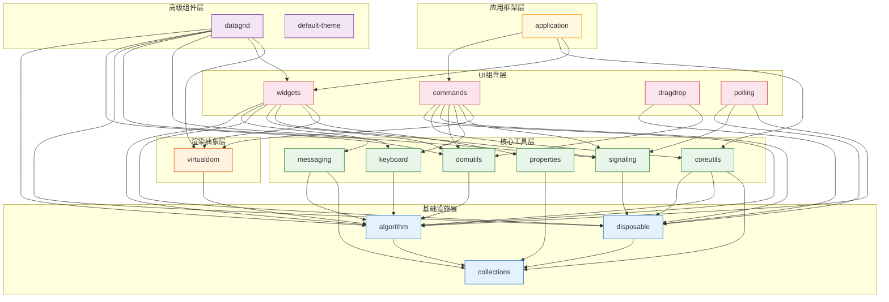

# Lumino 包依赖关系与 API 速查

## 包依赖关系图

Lumino 的包遵循严格的分层依赖，无循环依赖：



## 核心接口签名速查

### IDisposable（disposable 包）

```typescript
interface IDisposable {
  readonly isDisposed: boolean;
  dispose(): void;
}

class DisposableDelegate implements IDisposable {
  constructor(fn: () => void);
  readonly isDisposed: boolean;
  dispose(): void;  // 调用一次后 fn 置 null，幂等安全
}
```

### Signal（signaling 包）

```typescript
class Signal<T, U> implements ISignal<T, U> {
  constructor(sender: T);
  readonly sender: T;
  connect(slot: Slot<T, U>, thisArg?: any): boolean;
  disconnect(slot: Slot<T, U>, thisArg?: any): boolean;
  emit(args: U): void;
}

type Slot<T, U> = (sender: T, args: U) => void;
```

### Message / MessageLoop（messaging 包）

```typescript
class Message {
  constructor(type: string);
  readonly type: string;
  readonly isConflatable: boolean;  // 默认 false
  conflate(other: Message): boolean;  // 默认 false
}

class ConflatableMessage extends Message {
  readonly isConflatable: boolean;  // 始终 true
  conflate(other: ConflatableMessage): boolean;  // 始终 true
}

interface IMessageHandler {
  processMessage(msg: Message): void;
}

namespace MessageLoop {
  function sendMessage(handler: IMessageHandler, msg: Message): void;    // 同步立即
  function postMessage(handler: IMessageHandler, msg: Message): void;    // 异步排队
  function installMessageHook(handler, hook: MessageHook): void;
  function removeMessageHook(handler, hook: MessageHook): void;
  function flush(): void;
  function clearData(handler: IMessageHandler): void;
}
```

### Widget（widgets 包）

```typescript
class Widget implements IMessageHandler, IObservableDisposable {
  constructor(options?: Widget.IOptions);
  readonly node: HTMLElement;
  readonly disposed: ISignal<this, void>;
  readonly isDisposed: boolean;
  readonly isAttached: boolean;
  readonly isHidden: boolean;
  readonly isVisible: boolean;
  readonly title: Title<Widget>;
  id: string;
  dataset: DOMStringMap;
  hiddenMode: Widget.HiddenMode;
  parent: Widget | null;
  layout: Layout | null;

  dispose(): void;
  show(): void;
  hide(): void;
  setFlag(flag: Widget.Flag): void;
  clearFlag(flag: Widget.Flag): void;
  testFlag(flag: Widget.Flag): boolean;
  update(): void;       // 发送 update-request 消息
  fit(): void;          // 发送 fit-request 消息
  activate(): void;     // 发送 activate-request 消息
  close(): void;        // 发送 close-request 消息
  addClass(name: string): void;
  removeClass(name: string): void;
  toggleClass(name: string, force?: boolean): boolean;

  // 静态方法
  static attach(widget: Widget, host: HTMLElement): void;
  static detach(widget: Widget): void;

  // 生命周期消息类型
  // 'before-attach' → 'after-attach' → 'before-show' → 'after-show' →
  // 'resize' / 'update-request' →
  // 'before-hide' → 'after-hide' → 'before-detach' → 'after-detach'
}
```

### Layout（widgets 包）

```typescript
abstract class Layout implements Iterable<Widget>, IDisposable {
  constructor(options?: Layout.IOptions);
  parent: Widget | null;
  fitPolicy: Layout.FitPolicy;  // 'set-no-constraint' | 'set-min-size'
  abstract [Symbol.iterator](): IterableIterator<Widget>;
  abstract removeWidget(widget: Widget): void;
  processParentMessage(msg: Message): void;
  protected init(): void;
  protected onResize(msg: Widget.ResizeMessage): void;
  protected onUpdateRequest(msg: Message): void;
  // ... 其他生命周期钩子
}

class LayoutItem implements IDisposable {
  constructor(widget: Widget);
  readonly widget: Widget;
  readonly minWidth: number;
  readonly minHeight: number;
  readonly maxWidth: number;
  readonly maxHeight: number;
  fit(): void;
  update(left, top, width, height): void;
}
```

### CommandRegistry（commands 包）

```typescript
class CommandRegistry {
  readonly commandChanged: ISignal<this, ICommandChangedArgs>;
  readonly commandExecuted: ISignal<this, ICommandExecutedArgs>;
  readonly keyBindingChanged: ISignal<this, IKeyBindingChangedArgs>;
  readonly keyBindings: ReadonlyArray<IKeyBinding>;

  addCommand(id: string, options: ICommandOptions): IDisposable;
  addKeyBinding(options: IKeyBindingOptions): IDisposable;
  execute(id: string, args?: ReadonlyPartialJSONObject): Promise<any>;
  hasCommand(id: string): boolean;
  listCommands(): string[];
  label(id: string, args?): string;
  icon(id: string, args?): VirtualElement.IRenderer | undefined;
  isEnabled(id: string, args?): boolean;
  isToggled(id: string, args?): boolean;
  isVisible(id: string, args?): boolean;
  notifyCommandChanged(id?: string): void;
  processKeydownEvent(event: KeyboardEvent): boolean;
}
```

### Application（application 包）

```typescript
class Application<T extends Widget = Widget> {
  constructor(options: Application.IOptions<T>);
  readonly commands: CommandRegistry;
  readonly contextMenu: ContextMenu;
  readonly shell: T;
  readonly started: Promise<void>;
  readonly deferredPlugins: string[];

  registerPlugin(plugin: IPlugin<this, any>): void;
  registerPlugins(plugins: IPlugin<this, any>[]): void;
  activatePlugin(id: string): Promise<void>;
  deactivatePlugin(id: string): Promise<string[]>;
  hasPlugin(id: string): boolean;
  isPluginActivated(id: string): boolean;
  listPlugins(): string[];
  resolveRequiredService<U>(token: Token<U>): Promise<U>;
  resolveOptionalService<U>(token: Token<U>): Promise<U | null>;
  start(options?: IStartOptions): Promise<void>;
}
```

### Token / Plugin（coreutils 包）

```typescript
class Token<T> {
  constructor(name: string, description?: string);
  readonly name: string;
  readonly description?: string;
  // 利用 TypeScript 结构化类型系统在运行时捕获编译时类型 T
  private _tokenStructuralPropertyT: T;
}

interface IPlugin<T, U> {
  id: string;
  autoStart?: boolean | 'startUp' | 'defer';
  requires?: Token<any>[];
  optional?: Token<any>[];
  provides?: Token<U>;
  activate: (app: T, ...args: any[]) => U | Promise<U>;
  deactivate?: (app: T, ...args: any[]) => void | Promise<void>;
}
```

### Virtual DOM（virtualdom 包）

```typescript
class VirtualElement {
  readonly type = 'element';
  readonly tag: string;
  readonly attrs: ElementAttrs;
  readonly children: ReadonlyArray<VirtualNode>;
  readonly renderer?: VirtualElement.IRenderer;
}

class VirtualText {
  readonly type = 'text';
  readonly content: string;
}

type VirtualNode = VirtualElement | VirtualText;

function h(tag: string, ...children: h.Child[]): VirtualElement;
function h(tag: string, attrs: ElementAttrs, ...children: h.Child[]): VirtualElement;
// 标签简写
h.div, h.span, h.a, h.button, h.input, h.ul, h.li, h.table, ...等

namespace VirtualDOM {
  function realize(node: VirtualNode): HTMLElement | Text;
  function render(content: VirtualNode | VirtualNode[] | null, host: HTMLElement): void;
}
```

## Widget 生命周期消息序列

```
Widget.attach(widget, host)
  → 'before-attach' (onBeforeAttach)
  → 'after-attach'  (onAfterAttach)
  → 'before-show'   (onBeforeShow)  [如果未隐藏]
  → 'after-show'    (onAfterShow)   [如果未隐藏]
  → 'resize'        (onResize)      [首次尺寸计算]

widget.update()
  → 'update-request' (onUpdateRequest) → 触发重布局/重绘

widget.hide()
  → 'before-hide'   (onBeforeHide)
  → 'after-hide'    (onAfterHide)

widget.show()
  → 'before-show'   (onBeforeShow)
  → 'after-show'    (onAfterShow)
  → 'resize'

Widget.detach(widget)
  → 'before-hide'   [如果可见]
  → 'after-hide'    [如果可见]
  → 'before-detach' (onBeforeDetach)
  → 'after-detach'  (onAfterDetach)

widget.dispose()
  → 从父移除/从DOM分离
  → layout.dispose()
  → title.dispose()
  → Signal.clearData(widget)
  → MessageLoop.clearData(widget)
  → 'disposed' 信号发射
```
