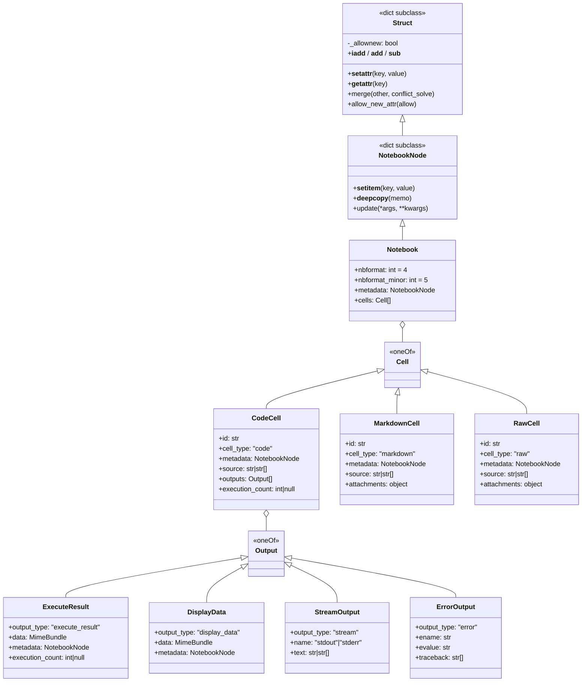

# nbformat 架构洞察

## Notebook 文档节点结构

---

## 洞察一：NotebookNode 的 JavaScript 风格属性访问设计是一个精心权衡的"便利陷阱"

### 陈述
NotebookNode 通过继承 dict 的 Struct 基类，同时支持 `nb["cells"]` 字典风格和 `nb.cells` 属性风格访问。`__setattr__` 还保护了 dict 原生方法不被覆盖，`__setitem__` 自动将嵌套 dict 递归转换为 NotebookNode。

### 证据
- F-016: NotebookNode 继承自 Struct
- F-018: __setitem__ 自动将 Mapping 值递归转换为 NotebookNode
- F-028: __setattr__ 保护类成员（keys/items/get 等）不被属性赋值覆盖
- F-029: __getattr__ 将 KeyError 转换为 AttributeError，实现 JS 风格点访问
- F-024-F-025: Struct 继承 dict[Any, Any]，_allownew 默认 True
- F-027: _allownew=False 时禁止创建新键，可用于捕获拼写错误

### 反常识
表面上看这是一个"JavaScript 爱好者把 Python dict 改成 JS 对象"的随意设计，但实际上 Struct 类实现了一整套防御机制：
1. 不是简单的 `__getattr__ = __getitem__`，而是刻意保护了 `keys()`、`items()`、`get()` 等 dict 方法不被数据字段覆盖
2. `_allownew` 开关提供了"只读/防拼写错误"模式，但默认关闭（这本身是权衡）
3. NotebookNode 的 `__deepcopy__` 做了专门优化（F-020），因为文档验证和写入会频繁 deepcopy——这暴露了属性访问便利与序列化性能之间的张力
4. 列表内的普通 dict 不会被自动转换（F-023），保持了边界可控

**关键反常识**：NotebookNode 的自动转换发生在 `__setitem__` 而非构造函数中，意味着 `NotebookNode({"a": {"b": 1}})` 不会自动转换嵌套 dict，必须通过 `from_dict()` 函数（F-022）。这是一个容易踩坑的设计。

### 行动建议
1. **构造 NotebookNode 始终使用 `from_dict()`** 或 `new_notebook()`/`new_code_cell()` 等工厂函数，避免直接传嵌套 dict 给构造函数
2. **遍历 cells 时优先使用 `nb["cells"]` 而非 `nb.cells`**，因为属性访问在键不存在时抛 AttributeError 而非 KeyError，可能掩盖 bug
3. **在需要严格校验的场景调用 `allow_new_attr(False)`**，利用 Struct 的防拼写功能
4. **性能敏感路径避免频繁 deepcopy**：NotebookNode 的 deepcopy 虽然优化过，但对于大型 notebook（数百 cells）仍有开销——考虑在写入/验证前一次性 deepcopy

---

## 洞察二：版本迁移机制是"单步链式升级 + 未来兼容"的双轨设计

### 陈述
nbformat 支持 v1→v2→v3→v4 的逐步链式转换，每次只走一个版本号（converter.py 递归调用），同时通过 JSON Schema 的 relax 机制实现对"未来版本"notebook 的前向兼容。

### 证据
- F-035: versions 字典映射主版本号 1-4 到对应模块
- F-091: convert 函数递归单步转换，升级用新版本.upgrade，降级用旧版本.downgrade
- F-092-F-094: v4.upgrade 支持 v3→v4（展平 worksheets、重命名字段）和 v4 小版本升级（v4.4→v4.5 添加 cell id）
- F-061-F-063: 当 notebook minor 版本 > 当前 schema minor 版本时，自动 relax additionalProperties 并添加 unrecognized_cell/unrecognized_output 定义
- F-093: 升级时在 metadata 中保留 orig_nbformat 记录原始版本
- F-040: v4.5 schema 要求 nbformat_minor >= 5，cell id 成为强制字段
- F-095-F-098: v3→v4 涉及字段重命名（input→source, prompt_number→execution_count, pyout→execute_result）和结构重组（数据移入 data 子字典）

### 反常识
**反常识一**：v4 没有 v5，但 v4 内部有 5 个 minor 版本（4.0-4.5），minor 版本升级不是简单的 schema 替换，而是包含数据迁移逻辑（如 F-092：v4.4→v4.5 时为缺少 id 的 cell 自动生成 id）。这意味着 minor 版本之间也可能存在**数据不兼容**，而不仅仅是 schema 扩展。

**反常识二**：未来版本兼容不是通过"忽略未知字段"简单实现的。当检测到版本号超前时，验证器会：
1. 递归将所有 `additionalProperties: false` 改为 `true`（F-061）
2. 在 oneOf 中添加"unrecognized_cell/unrecognized_output"通配类型（F-062, F-056-F-057）

这是一种**schema 级别的运行时修改**，而不是简单的 try/catch。这允许旧版本 nbformat 库读取新版本 notebook 文件而不崩溃。

**反常识三**：降级是有损的。downgrade 会移除 id 和 attachments（F-096, F-161-F-162），markdown heading 检测只在"单行且以 # 开头"时转回 heading cell（F-096, F-154）——这意味着 v4 markdown cell 降级到 v3 后再升级回 v4 可能丢失信息。

### 行动建议
1. **始终显式指定 `as_version`**：使用 `nbformat.read(fp, as_version=4)` 而非 NO_CONVERT，确保获得规范化的 v4.5 格式
2. **不要依赖 roundtrip 降级/升级的幂等性**：v4→v3→v4 会丢失 cell id、attachments 等信息
3. **处理来自外部的 notebook 文件时始终检查版本**：使用 `get_version(nb)` 获取版本后再决定是否需要转换
4. **v4.5 的 cell id 是强制字段**：创建新 cell 时使用 `new_code_cell()` 等工厂函数自动生成 id，避免 MissingIDFieldWarning（F-069）
5. **NO_CONVERT 模式下验证错误仅记录日志**（F-087），生产环境应捕获 capture_validation_error 字典

---

## 洞察三：JSON Schema 验证采用"双后端 + 容错归一化 + 错误美化"的三层策略

### 陈述
nbformat 的验证体系不是简单的 schema 校验，而是三层架构：(1) fastjsonschema 做快速首次验证；(2) 验证失败时回退到 jsonschema 获取详细错误树；(3) normalize 阶段自动修复可修复问题（缺失/重复 cell id），并提供 better_validation_error 将 oneOf 错误转化为人类可读的消息。

### 证据
- F-073-F-076: 同时支持 fastjsonschema（编译后速度快）和 jsonschema（错误信息详细）两个后端
- F-072: _get_errors 先用当前验证器（默认 fastjsonschema）获取第一个错误，若有错误且当前不是 jsonschema，则回退到 jsonschema 获取完整错误
- F-068-F-070: normalize 函数在验证前自动修复缺失 cell id（生成随机 id）和重复 cell id（重新生成）
- F-066-F-067: NotebookValidationError 截断大对象输出（16项/64字符限制），better_validation_error 在 oneOf 失败时按 cell_type/output_type 精确定位子 schema 错误
- F-064: isvalid 函数 deepcopy 后验证，确保不修改原对象
- F-071: strip_invalid_metadata 通过 error_tree 定位并剥离不合法的 metadata 键
- F-076: 默认验证器由 NBFORMAT_VALIDATOR 环境变量控制，默认为 fastjsonschema

### 反常识
**反常识一**：默认情况下 `validate()` 是**有副作用的**！它内部调用 `_normalize()`（F-469-F-476），会：
- 为缺失 id 的 cell 自动生成 id（F-356-F-358）
- 修复重复的 cell id（F-368-F-376）
这些操作会**修改传入的 nbdict 对象**。这与 `isvalid()` 形成对比——isvalid 明确 deepcopy 后验证（F-121），保证不修改原对象。注释中也承认"理想情况下 validate() 不应调用 _normalize()"（F-332-F-336）。

**反常识二**：验证不是全有或全无。`iter_validate()` 是生成器（F-072, F-589-F-649），可以逐个获取错误而非一次性抛出。但公共 API `validate()` 只抛出第一个错误。

**反常识三**：fastjsonschema 不支持 error_tree（F-094-F-095），所以 `strip_invalid_metadata` 功能强制回退到 jsonschema。这意味着选择 fastjsonschema 作为默认后端是速度与功能的权衡——它快但不能做 metadata 智能修复。

### 行动建议
1. **如果需要不修改原对象的验证，使用 `isvalid()` 或先 `deepcopy()`**：公共 `validate()` 会 mutate 参数（自动修复 id），这在签名验证场景下会导致签名失效
2. **不要依赖自动修复的长期稳定性**：MissingIDFieldWarning 和 DuplicateCellId 都是 FutureWarning（F-125），未来版本可能变为硬错误
3. **调试验证错误时显式设置验证器为 jsonschema**：设置环境变量 `NBFORMAT_VALIDATOR=jsonschema` 获取更详细的错误信息
4. **使用 `normalize()` 显式归一化**而非依赖 validate 的隐式修复，使代码意图更清晰
5. **验证大 notebook 时注意 NotebookValidationError 的截断**：错误信息中 cells 和 outputs 列表会被替换为 "...N cells..." 摘要

---

## 洞察四：签名（Trust）机制是 HMAC 本地信任模型而非数字签名，安全边界在"输出"而非"代码"

### 陈述
nbformat 的签名机制不是对 notebook 作者身份的认证，而是一种"本机信任标记"：用户在自己机器上执行 `jupyter trust` 后，NotebookNotary 用本地密钥计算 HMAC 并存入 SQLite 数据库。Frontend 根据签名决定是否信任 HTML/JS 输出的安全执行。签名只保护 code cell 的输出不被篡改，不保护源代码。

### 证据
- F-114-F-115: NotebookNotary 使用 HMAC（非数字签名），密钥是本地生成的 1024 字节随机数据
- F-109-F-110: 签名存储在本地 SQLite（nbsignatures.db），默认 cache_size=65535，LRU 淘汰
- F-113: signature_removed 上下文管理器在计算签名时排除 metadata.signature 字段自身
- F-111: yield_everything 递归遍历整个 notebook（按键排序），将所有内容喂给 HMAC
- F-117-F-118: mark_cells/check_cells 在 code cell metadata 上设置 trusted 标志，安全判定基于输出类型白名单
- F-119: TrustNotebookApp CLI 提供 `jupyter trust` 命令和 `--reset` 选项
- F-085: strip_transient 在读写时都移除 signature 字段，签名不写入文件
- F-116: check_signature 只检查签名是否在本地 store 中，不签名 notebook 本身

### 反常识
**反常识一**：签名**不保存在 .ipynb 文件中**。F-085 明确 strip_transient 在写入时移除 metadata.signature。签名存储在用户本地的 SQLite 数据库中，以 HMAC digest 为键。这意味着 .ipynb 文件本身不携带任何信任信息——复制到另一台机器后信任状态丢失。metadata.signature 字段只是计算过程中的临时字段。

**反常识二**：信任的对象是**输出（output）**，不是代码。F-099-F-113 的 `_check_cell` 逻辑：
- 如果 cell 有 `execute_result` 或 `display_data` 输出且包含非白名单键，则不信任
- 如果只有 stream 输出或空输出，则始终信任
- `trusted` 标志是显式覆盖
这意味着即使你信任 notebook 的代码，任何富输出（HTML/JS 等 MIME 类型）都需要签名才会被 frontend 渲染。安全模型假设：代码本身不可怕，可怕的是嵌入在 output 中的恶意 HTML/JS 在用户信任的上下文中执行。

**反常识三**：HMAC 的输入是**整个 notebook 内容**（按键排序遍历），但 code cell 执行后 output 改变会导致签名失效。这是有意设计——任何 output 篡改都会使签名不匹配，从而 frontend 不渲染富输出。但这也意味着重新执行任何 code cell 后需要重新签名。

**反常识四**：v3 之前的 notebook 格式完全不支持信任（F-115, F-126: nbformat < 3 时 check_signature 返回 False）。

### 行动建议
1. **不要将 .ipynb 签名当作文件完整性校验**：签名存储在本地数据库，不随文件分发，不能用于验证文件来源
2. **自动化处理 notebook 时注意签名失效**：任何修改 cells/outputs 的操作都会使签名失效，需重新 sign
3. **NotebookNotary 应作为上下文管理器使用**：F-472-F-479 实现了 `__enter__/__exit__` 自动关闭数据库连接
4. **CI/CD 环境中使用 `:memory:` 存储**：设置 db_file 为 `:memory:` 避免写入文件系统
5. **前端渲染前务必检查信任状态**：未签名 notebook 的富输出应被沙箱化或不渲染，遵循 Jupyter 的安全模型
6. **密钥文件权限为 0o600**（F-509）：确保 notebook_secret 文件不被其他用户读取

---

## 核心模式提炼

| 模式 | 实现位置 | 核心思想 |
|------|---------|---------|
| **Dict+Attr 双访问** | _struct.py:13-367 | dict 子类通过 __getattr__/__setattr__ 提供 JS 风格点访问，同时保护 dict 原生方法 |
| **递归自转换** | notebooknode.py:17-21 | __setitem__ 拦截赋值，自动将嵌套 dict 升级为 NotebookNode |
| **链式版本迁移** | converter.py:12-68 | 版本间单步转换 + 递归调用，避免 N×M 转换矩阵 |
| **Schema 运行时松弛** | validator.py:36-53 | 遇到未来版本时动态修改 schema（additionalProperties→true + 通配类型） |
| **双后端验证** | json_compat.py:27-95 | fastjsonschema 快速判定 + jsonschema 详细错误，按场景切换 |
| **容错归一化** | validator.py:319-385 | 验证前自动修复可修复问题（缺 id、重复 id），渐进式迁移 |
| **HMAC 本地信任** | sign.py:369-633 | 本机 HMAC + SQLite 存储，信任 output 而非 code，签名不嵌入文件 |
| **VCS 友好序列化** | rwbase.py:69-92 | split_lines 将多行字符串拆为行列表写入，rejoin_lines 读取时合并 |
| **Transient 字段剥离** | rwbase.py:95-105 | 读写时统一移除运行时临时字段（orig_nbformat、signature、trusted） |
