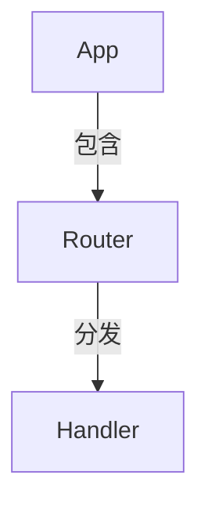

# CombineTutorial

`CombineTutorial` 是流水线的最后一个节点，负责将所有分析结果组装为最终的教程文档集——包含一个 `index.md` 首页（含 Mermaid 关系图）和多个章节 Markdown 文件，然后写入输出目录。它继承自 PocketFlow 的 `Node` 类，无重试配置（纯本地文件操作，不需要重试）。

## 类定义

```python
class CombineTutorial(Node):
```

源码位置：[nodes.py#L753-L880](file:///d:/spaces/SpecWeave/external/libs/ai/ThePocket/PocketFlow-Tutorial-Codebase-Knowledge/nodes.py#L753-L880)

## 生命周期方法

### prep(shared)

从 `shared` 读取所有上游节点的产出，组装完整的教程内容。

**读取的 shared 键**：
- `project_name` (str)：项目名称
- `output_dir` (str)：输出基础目录，默认 `"output"`
- `repo_url` (str|None)：GitHub 仓库 URL
- `relationships` (dict)：关系数据（含 `summary` 和 `details`）
- `chapter_order` (list[int])：章节顺序
- `abstractions` (list[dict])：抽象列表
- `chapters` (list[str])：章节 Markdown 内容列表

**内部逻辑**：

**1. 生成 Mermaid 关系图**

构建 `flowchart TD` 类型的 Mermaid 图：
- 为每个抽象创建节点：`A{i}["{name}"]`
- 为每个关系创建边：`A{from} -- "{label}" --> A{to}`
- 对名称中的双引号进行转义，标签超过30字符截断并加省略号

**2. 生成 index.md 内容**

首页结构：
- 标题：`# Tutorial: {project_name}`
- 项目摘要（来自 relationships.summary）
- 源仓库链接
- Mermaid 关系图代码块
- 章节列表（带 Markdown 链接）
- 页脚归属信息

**3. 处理章节文件**

对每个章节：
- 生成安全文件名（与 WriteChapters 中相同的规则）
- 在章节内容末尾追加分隔线和归属行
- 打包为 `{"filename": str, "content": str}` 字典

**返回值** (dict)：
```python
{
    "output_path": str,           # 完整输出路径（output_dir/project_name）
    "index_content": str,         # index.md 完整内容
    "chapter_files": [            # 章节文件列表
        {"filename": str, "content": str},
        ...
    ]
}
```

### exec(prep_res)

执行文件写入操作。

**步骤**：
1. 使用 `os.makedirs(output_path, exist_ok=True)` 创建输出目录
2. 写入 `index.md` 文件
3. 遍历 chapter_files，逐一写入章节 Markdown 文件
4. 打印每个写入的文件路径

**返回值** (str)：最终输出目录路径 `output_path`。

### post(shared, prep_res, exec_res)

将最终输出路径写入 `shared["final_output_dir"]`，并打印完成信息。

**写入的 shared 键**：
- `final_output_dir`：最终输出目录路径

## 输出目录结构

```
{output_dir}/{project_name}/
├── index.md                    # 教程首页（含摘要、关系图、章节目录）
├── 01_{chapter1_name}.md       # 第一章
├── 02_{chapter2_name}.md       # 第二章
└── ...
```

## Mermaid 图生成示例

对于抽象 ["App", "Router", "Handler"] 和关系 [App→Router("包含"), Router→Handler("分发")]：



## 固定字符串说明

CombineTutorial 中的固定英文短语（如 "**Source Repository:**"、"## Chapters"、"Generated by [AI Codebase Knowledge Builder]"）不随 language 参数翻译，因为它们属于页面结构/归属信息，而非教程内容。教程正文中的章节标题、描述、关系标签等由 LLM 生成的内容则会根据 language 参数翻译。

## 源码位置

[nodes.py#L753-L880](file:///d:/spaces/SpecWeave/external/libs/ai/ThePocket/PocketFlow-Tutorial-Codebase-Knowledge/nodes.py#L753-L880)
