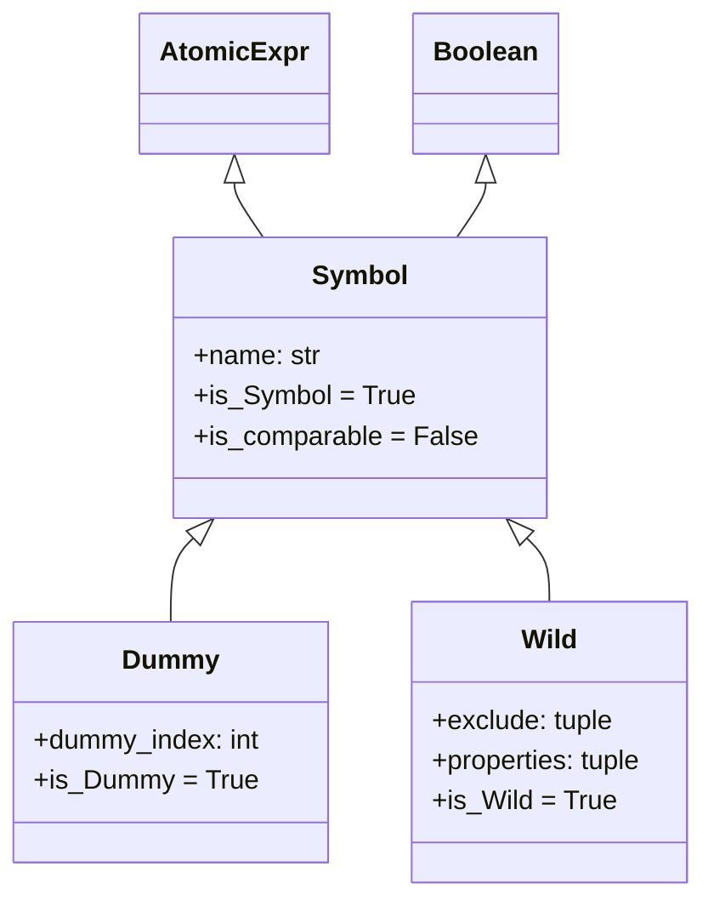
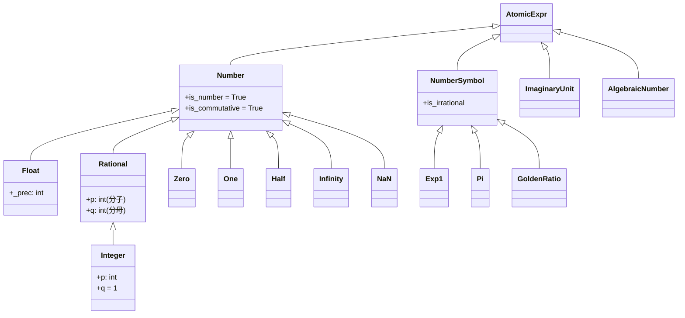

# 符号与数值系统

SymPy 表达式树的叶子节点由两类对象构成：**符号（Symbol）** 代表数学变量，**数值（Number）** 代表精确常量。符号类层次提供命名变量（Symbol）、唯一匿名变量（Dummy）和模式匹配通配符（Wild）；数字类层次提供整数（Integer）、有理数（Rational）、浮点数（Float）的精确表示；`S` 单例注册表统一管理所有常量实例；`abc` 模块提供便捷的预定义符号。[^F-073]

## 符号类层次



继承链：`AtomicExpr → Symbol → Dummy/Wild`。所有符号都是叶子节点（`is_Atom = True`），`args` 为空元组。[^F-024]

### Symbol：命名符号

`Symbol` 是最常用的符号类型，表示一个命名的数学变量。创建方式：

```python
>>> from sympy import Symbol, symbols
>>> x = Symbol('x')            # 单个符号
>>> x.name
'x'
>>> x.is_Symbol
True
>>> x.args                     # 叶子节点无参数
()
```

**同名但不同假设的符号不相等**。Symbol 的相等性基于名称和假设信息：

```python
>>> x_real = Symbol('x', real=True)
>>> x_pos = Symbol('x', positive=True)
>>> x_plain = Symbol('x')
>>> x_real == x_plain
False
>>> x_real == x_pos
False
```

### Dummy：唯一匿名符号

`Dummy` 继承自 `Symbol`，用于生成**唯一的匿名符号（gensym）**。每个 Dummy 实例拥有独特的 `dummy_index`，即使同名也互不相等：[^F-025]

```python
>>> from sympy import Dummy
>>> d1 = Dummy('x')
>>> d2 = Dummy('x')
>>> d1 == d2                   # 同名但 dummy_index 不同，不相等
False
>>> d1.name                    # 打印名称相同
'x'
>>> d1.dummy_index != d2.dummy_index
True
```

**典型用途**：
- 内部临时变量（避免与用户变量命名冲突）
- 积分/求和中的绑定变量
- 替换操作中的中间变量
- 模式匹配中的占位符

```python
>>> from sympy import Integral, Dummy, symbols
>>> x = symbols('x')
>>> # SymPy 内部使用 Dummy 表示积分变量
>>> i = Integral(x, x)
>>> i.variables[0].is_Dummy    # 积分变量可能是 Dummy
True
```

### Wild：模式匹配通配符

`Wild` 继承自 `Symbol`，专用于表达式模式匹配，类似正则表达式中的通配符。[^F-026]

```python
>>> from sympy import Wild, symbols, sin
>>> x = symbols('x')
>>> a = Wild('a', exclude=[x])     # a 不匹配 x
>>> b = Wild('b')
>>> (2*x + 3).match(a*x + b)
{a_: 2, b_: 3}
```

关键参数：

| 参数 | 类型 | 说明 |
|------|------|------|
| `exclude` | 可迭代对象 | 不匹配的表达式集合（如排除特定符号或类型） |
| `properties` | 函数列表 | 每个函数接受表达式返回布尔值，匹配项必须满足所有性质 |

```python
>>> from sympy import Wild
>>> # 只匹配整数
>>> w = Wild('w', properties=[lambda t: t.is_integer])
>>> (5).match(w)
{w_: 5}
>>> (x).match(w)               # x 未标记 integer，不匹配
```

## 符号创建函数

### symbols()：批量创建

`symbols()` 是最常用的符号创建函数，从字符串一次性创建一个或多个符号：[^F-027]

```python
>>> from sympy import symbols
>>> x, y, z = symbols('x y z')         # 空格分隔
>>> a, b, c = symbols('a, b, c')       # 逗号分隔
>>> # 带下标序列
>>> x0, x1, x2 = symbols('x0:3')
>>> x0, x1, x2
(x0, x1, x2)
>>> # 带下标序列（更多维）
>>> a12, a13, a22, a23 = symbols('a1:3 2:4')
```

| 参数 | 说明 |
|------|------|
| `cls` | 符号类，默认为 `Symbol`，可传入 `Dummy`/`Wild` |
| `seq=True` | 无论单个还是多个符号，均返回元组 |
| `**args` | 传递给符号构造函数的假设参数（positive=True 等） |

```python
>>> # 创建带假设的符号
>>> p, q = symbols('p q', positive=True)
>>> p.is_positive
True
>>> # seq=True 强制返回元组
>>> symbols('x', seq=True)
(x,)
```

### var()：命名空间注入

`var()` 功能与 `symbols()` 相同，但将创建的符号**注入调用者的全局命名空间**，适合交互式使用：[^F-027]

```python
>>> from sympy import var
>>> var('a b c')
(a, b, c)
>>> a + b + c                  # a, b, c 已自动注入当前命名空间
a + b + c
```

> **注意**：在脚本/模块中推荐使用 `symbols()`，避免命名空间污染；`var()` 适合 REPL/Jupyter 快速探索。

## 数字类型层次

SymPy 的数字系统提供任意精度的精确数值表示，避免浮点误差：[^F-029][^F-030]



### Number：分派构造

`Number.__new__()` 根据输入类型自动分派到具体子类：[^F-029]

| 输入类型 | 分派目标 |
|----------|----------|
| `Number` 实例 | 原样返回 |
| Python `int` | `Integer` |
| 二元组 `(p, q)` | `Rational(p, q)` |
| Python `float` | `Float` |
| 字符串 `'inf'`/`'nan'` | 对应单例常量 |

```python
>>> from sympy import Number
>>> Number(5)
5
>>> Number((3, 4))
3/4
>>> Number(0.5)
0.500000000000000
>>> type(Number(5))
<class 'sympy.core.numbers.Integer'>
```

### Integer：任意精度整数

`Integer` 继承自 `Rational`，分母恒为 1，基于 Python 任意精度整数实现：[^F-030]

```python
>>> from sympy import Integer
>>> Integer(10)
10
>>> Integer(10**100)            # 超大整数无精度损失
10000000000000000000000000000000000000000000000000000000000000000000000000000000000000000000000000000
>>> Integer(5).p                # 分子
5
>>> Integer(5).q                # 分母恒为 1
1
```

### Rational：精确有理数

`Rational` 表示精确分数 p/q，构造时自动约分为最简分数：[^F-030]

```python
>>> from sympy import Rational
>>> Rational(3, 6)              # 自动约分
1/2
>>> Rational(3, 6).p
1
>>> Rational(3, 6).q
2
>>> Rational(1.5)               # 从 float 构造
3/2
>>> Rational("1/3")             # 从字符串构造
1/3
>>> Rational(1, 2).numerator    # 分子
1
>>> Rational(1, 2).denominator  # 分母
2
```

**使用 Rational 避免浮点陷阱**：

```python
>>> from sympy import S
>>> x = symbols('x')
>>> x + 1/2                     # Python 1/2 先算为 float 0.5
x + 0.5
>>> x + S(1)/2                  # S(1) → Integer(1), 除法 → Rational(1,2)
x + 1/2
>>> x + Rational(1, 2)          # 显式构造
x + 1/2
```

### Float：任意精度浮点数

`Float` 基于 mpmath 的 `mpf` 类型实现任意精度浮点数：[^F-030]

```python
>>> from sympy import Float
>>> Float(0.1, 30)              # 30位十进制精度
0.100000000000000000000000000000
>>> Float(0.1, 2)               # 2位精度
0.10
>>> Float('1e-10', 20)          # 从字符串构造（避免 Python float 误差）
1.0000000000000000000e-10
```

`RealNumber` 是 `Float` 的别名（保持向后兼容）。

> **注意**：Python 原生 `float` 是双精度（约15-17位有效数字），直接传入 `Float(0.1)` 会携带浮点表示误差。使用字符串 `Float('0.1')` 或 `Rational` 可获得精确表示。

## S 单例常量

`S` 是 `SingletonRegistry` 的全局唯一实例，统一管理所有单例常量。单例类使用 `Singleton` 元类，确保每个类全局仅有一个实例，节省内存且支持 `is` 快速比较：[^F-065][^F-031]

```python
>>> from sympy import S, Integer
>>> Integer(0) is S.Zero        # 身份比较
True
```

### 数字单例

| 属性 | 类型 | 数学含义 | 快捷名 |
|------|------|----------|--------|
| `S.Zero` | `Integer(0)` | 零 | — |
| `S.One` | `Integer(1)` | 一 | — |
| `S.NegativeOne` | `Integer(-1)` | 负一 | — |
| `S.Half` | `Rational(1,2)` | 二分之一 | — |
| `S.Infinity` | `∞` | 正无穷 | `oo` |
| `S.NegativeInfinity` | `-∞` | 负无穷 | `-oo` |
| `S.NaN` | NaN | 非数 | `nan` |
| `S.ComplexInfinity` | `zoo` | 复无穷（无方向） | `zoo` |

```python
>>> from sympy import oo, nan, zoo
>>> oo + 1
oo
>>> oo * 0
nan
>>> 1/zoo
0
```

### 数学常量（NumberSymbol）

`NumberSymbol` 子类表示具有特殊数学意义的常量符号，它们是单例但继承自 `AtomicExpr`（非 `Number`），因为其精确值无法用有限数位表示：[^F-033]

| 属性 | 类型 | 数学含义 | 快捷名 | 近似值 |
|------|------|----------|--------|--------|
| `S.Exp1` | `Exp1` | 自然对数底 e | `E` | ≈ 2.71828... |
| `S.Pi` | `Pi` | 圆周率 π | `pi` | ≈ 3.14159... |
| `S.GoldenRatio` | `GoldenRatio` | 黄金分割比 φ | — | ≈ 1.61803... |
| `S.EulerGamma` | `EulerGamma` | 欧拉常数 γ | — | ≈ 0.57721... |
| `S.Catalan` | `Catalan` | Catalan 常数 G | — | ≈ 0.91596... |
| `S.TribonacciConstant` | `TribonacciConstant` | Tribonacci 常数 | — | ≈ 1.83928... |
| `S.ImaginaryUnit` | `ImaginaryUnit` | 虚数单位 i | `I` | i² = -1 |

```python
>>> from sympy import I, E, pi, exp
>>> I**2
-1
>>> exp(I*pi)                   # 欧拉恒等式
-1
>>> pi.evalf(10)
3.141592654
>>> E.evalf(10)
2.718281828
```

### 单例机制原理

`Singleton` 元类在类定义时完成以下操作：[^F-065]

```python
class Singleton(type):
    def __init__(cls, *args, **kwargs):
        cls._instance = obj = Basic.__new__(cls)
        cls.__new__ = lambda cls: obj     # 拦截构造，返回唯一实例
        cls.__getnewargs__ = lambda obj: ()
        S.register(cls)                   # 注册到 S 注册表
```

- 实例创建**延迟**到首次属性访问（`S.__getattr__`）
- 通过替换 `__new__` 确保 `cls() is cls()` 恒为 `True`
- 支持 `is` 身份比较，比 `==` 更快

## 自动化简规则

SymPy 在构造表达式时自动执行基本的数学化简，这是通过 `Add.flatten()`、`Mul.flatten()`、`Pow.__new__()` 等方法实现的：

```python
>>> from sympy import symbols
>>> x = symbols('x')
>>> x + x                       # 自动合并同类项
2*x
>>> 2*x + 3*x                   # 系数合并
5*x
>>> x * x                       # 自动转幂
x**2
>>> x**1                        # 一次幂简化为 x
x
>>> x**0                        # 零次幂简化为 1
1
>>> x + 0                       # 加零简化
x
>>> 0 * x                       # 乘零简化
0
>>> 1 * x                       # 乘一简化
x
```

## 符号假设系统

创建 Symbol 时可以指定数学假设，这些假设决定了 `is_*` 属性的值并影响化简行为：

```python
>>> from sympy import Symbol
>>> # 常用假设关键字
>>> x = Symbol('x', positive=True)
>>> x.is_positive
True
>>> x.is_real                  # positive 蕴含 real
True
>>> n = Symbol('n', integer=True)
>>> n.is_integer
True
>>> n.is_rational              # integer 蕴含 rational
True
```

| 假设关键字 | 含义 | 蕴含 |
|-----------|------|------|
| `positive` / `negative` | 正/负 | real |
| `nonnegative` / `nonpositive` | 非负/非正 | real |
| `real` / `imaginary` / `complex` | 实数/虚数/复数 | complex |
| `integer` / `rational` / `irrational` | 整数/有理数/无理数 | real, rational |
| `even` / `odd` | 偶/奇 | integer |
| `prime` | 素数 | integer, positive |
| `finite` / `infinite` | 有限/无穷 | — |
| `commutative` | 交换性（默认True） | — |

假设使用三值逻辑：`True`（确定成立）、`False`（确定不成立）、`None`（不确定）：

```python
>>> x = Symbol('x')            # 无假设
>>> x.is_positive              # 不确定
>>> x = Symbol('x', positive=True)
>>> x.is_positive
True
>>> x.is_negative
False
```

## abc 预定义符号模块

`sympy.abc` 模块预定义了所有拉丁字母和希腊字母符号，可直接导入使用：[^F-067]

### 拉丁字母

```python
>>> from sympy.abc import a, b, c, x, y, z
>>> from sympy.abc import A, B, C, X, Y, Z
>>> a*x**2 + b*x + c
a*x**2 + b*x + c
```

### 希腊字母

```python
>>> from sympy.abc import alpha, beta, gamma, delta, epsilon, theta
>>> from sympy.abc import phi, psi, omega, mu, sigma, lamda
>>> alpha + beta + gamma
alpha + beta + gamma
```

> **注意**：Lambda 的希腊字母名使用 `lamda`（单 m），避免与 Python 关键字 `lambda` 冲突。[^F-067]

### 名称冲突处理

`O`、`S`、`I`、`N`、`E`、`Q` 这六个单字母名与 SymPy 顶层对象冲突（分别对应 Order、SingletonRegistry、ImaginaryUnit、数值求值N、Exp1、假设键Q）。同时从 `sympy` 和 `sympy.abc` 使用星号导入会产生冲突，后导入者覆盖前者。[^F-067][^F-068]

abc 模块提供了三个冲突诊断字典：

| 字典 | 内容 | 用途 |
|------|------|------|
| `_clash1` | 单字母冲突（O, S, I, N, E, Q） | 解析时映射为 Symbol |
| `_clash2` | 多字母冲突（gamma, pi 等希腊字母名） | 同上 |
| `_clash` | 全部冲突名 | `_clash1 ∪ _clash2` |

```python
>>> from sympy import S
>>> from sympy.abc import _clash
>>> S('pi(x)', locals=_clash)  # pi 解析为 Symbol 而非 S.Pi
pi(x)
```

### abc 使用注意事项

1. abc 中的符号均为**默认假设**（commutative=True），若需 positive/real 等假设，需用 `Symbol()` 或 `symbols()` 创建
2. abc **不支持按需定义**：`from sympy.abc import foo` 会报错，需使用 `Symbol('foo')`
3. 脚本/大型项目中推荐使用 `symbols()` 显式创建，避免命名空间混淆

## 数字工具函数

SymPy 提供了一些整数与数值工具函数：[^F-036]

| 函数 | 功能 |
|------|------|
| `igcd(a, b)` | 整数最大公约数 |
| `ilcm(a, b)` | 整数最小公倍数 |
| `mod_inverse(a, m)` | 模逆元 |
| `integer_nthroot(y, n)` | 整数 n 次根 |
| `integer_log(n, b)` | 整数对数 |
| `num_digits(n, b)` | 数字位数 |
| `comp(a, b, tol)` | 近似相等比较 |

```python
>>> from sympy import igcd, ilcm, mod_inverse
>>> igcd(12, 18)
6
>>> ilcm(4, 6)
12
>>> mod_inverse(3, 7)           # 3*5 ≡ 1 (mod 7)
5
```

## 自动与手动：常见陷阱

### 陷阱 1：Python 除法产生 float

```python
>>> from sympy import S
>>> x = symbols('x')
>>> x + 1/2                     # 错误：1/2 先被 Python 算为 0.5
x + 0.5
>>> x + S(1)/2                  # 正确：产生 Rational(1,2)
x + 1/2
>>> x + Rational(1, 2)          # 也正确
x + 1/2
```

### 陷阱 2：float 传染

```python
>>> from sympy import sin
>>> sin(0.1)                    # float 参数 → float 结果
0.0998334166468282
>>> sin(S(0.1))                 # SymPy Float → 符号计算
0.0998334166468282
```

### 陷阱 3：符号相等性

```python
>>> from sympy import Symbol
>>> x1 = Symbol('x')
>>> x2 = Symbol('x')
>>> x1 == x2                    # 同名同假设 → 相等
True
>>> x1 is x2                    # 但不是同一对象（Symbol 非单例）
False
```

## 延伸阅读

- 前置概念：[表达式树模型](01-expression-tree.md) 了解叶子节点在树中的角色
- 源码信源：[numbers-symbols-source](/references/numbers-symbols-source.md) 提供符号与数字类的完整 API 参考
- 后续概念：[sympify与类型转换](03-sympify-basics.md) 了解如何将 Python 对象转换为 SymPy 符号/数字

[^F-024]: facts.md F-024 — Symbol 类定义、继承与属性
[^F-025]: facts.md F-025 — Dummy 类与唯一索引
[^F-026]: facts.md F-026 — Wild 类与模式匹配参数
[^F-027]: facts.md F-027 — symbols() 与 var() 函数
[^F-029]: facts.md F-029 — Number 类定义与分派构造
[^F-030]: facts.md F-030 — 数字继承层次（Float/Rational/Integer）
[^F-031]: facts.md F-031 — 单例数字常量
[^F-033]: facts.md F-033 — NumberSymbol 子类
[^F-036]: facts.md F-036 — AlgebraicNumber、RealNumber 别名与工具函数
[^F-065]: facts.md F-065 — SingletonRegistry 与 S 单例对象
[^F-067]: facts.md F-067 — abc 模块预定义符号
[^F-068]: facts.md F-068 — abc 冲突诊断字典
[^F-073]: facts.md F-073 — 原子类型继承链汇总
