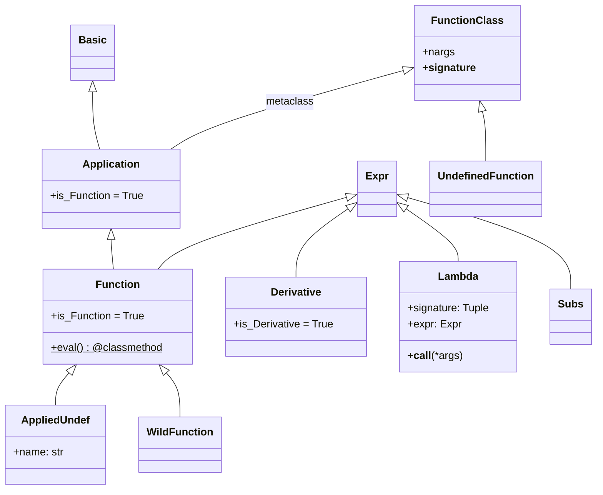

# sympify 与类型转换

SymPy 表达式树的入口点是 `sympify()` 函数——它将任意 Python 对象转换为 SymPy 内部类型，是所有外部数据进入符号计算体系的唯一网关。与 `sympify()` 密切相关的能力包括：`parse_expr()` 解析字符串表达式、`Function` 类体系创建函数应用、`evalf()`/`N()` 执行数值求值、`Relational` 类表示数学关系。[^F-045]

## sympify()：类型转换入口

`sympify(a, locals=None, convert_xor=True, strict=False, rational=False, evaluate=None)` 是 SymPy 的类型转换函数，负责将 Python 对象转换为 SymPy 的 `Basic` 子类实例。[^F-045]

### 参数说明

| 参数 | 类型 | 默认值 | 说明 |
|------|------|--------|------|
| `a` | Any | — | 待转换的 Python 对象 |
| `locals` | dict | `None` | 字符串解析时的局部命名空间 |
| `convert_xor` | bool | `True` | 是否将 `^` 转换为 `Xor`（幂运算用 `**`） |
| `strict` | bool | `False` | 严格模式：仅接受已 sympify 的类型 |
| `rational` | bool | `False` | 是否将浮点数转换为精确 `Rational` |
| `evaluate` | bool | `None` | 是否自动求值 |

### 转换规则

| Python 输入类型 | SymPy 输出类型 | 示例 |
|----------------|---------------|------|
| `int` | `Integer` | `sympify(42) → 42` |
| `float` | `Float`（`rational=True` 时为 `Rational`） | `sympify(3.14) → 3.14` |
| `str` | 解析为表达式 | `sympify("x**2+1") → x**2+1` |
| `Basic` 子类 | 原样返回 | `sympify(Symbol('x')) → x` |
| 自定义类型 | 查 `converter` 字典 | 注册后支持扩展 |

```python
>>> from sympy import sympify, Integer, Rational, Float

# 基本类型转换
>>> sympify(42)                 # Python int → Integer
42
>>> type(sympify(42))
<class 'sympy.core.numbers.Integer'>

>>> sympify(3.14)               # Python float → Float
3.14000000000000

>>> sympify("x**2 + 1")         # 字符串解析
x**2 + 1
```

### rational 参数：浮点数转精确分数

`rational=True` 将浮点数转换为精确有理数，避免浮点误差：

```python
>>> sympify(0.1)                # 默认：Float
0.100000000000000
>>> sympify(0.1, rational=True) # 精确分数
1/10
>>> sympify(0.5, rational=True)
1/2
>>> sympify(1.5, rational=True)
3/2
```

### strict 参数：严格模式

`strict=True` 时仅接受已 sympify 的 SymPy 对象，不自动转换 Python 原生类型：

```python
>>> from sympy import SympifyError
>>> sympify(Integer(1), strict=True)    # 已是 SymPy 对象
1
>>> try:
...     sympify(1, strict=True)          # Python int → 抛出异常
... except SympifyError:
...     print("SympifyError: 严格模式下不接受 Python int")
SympifyError: 严格模式下不接受 Python int
```

### evaluate 参数：控制自动求值

`evaluate=False` 阻止自动化简，保持表达式的原始结构：

```python
>>> from sympy import Add, Mul
>>> sympify("x + x", evaluate=False)   # 不自动合并
x + x
>>> sympify("x + x", evaluate=True)    # 默认：自动化简
2*x
```

### converter 字典：扩展自定义类型

`converter` 是全局字典（`dict[type, Callable]`），注册自定义类型到 SymPy 类型的转换函数，支持扩展以适配第三方库类型：[^F-046]

```python
>>> from sympy.core.sympify import converter
>>> class MyType:
...     def __init__(self, val):
...         self.val = val
>>> converter[MyType] = lambda obj: Integer(obj.val)
>>> sympify(MyType(42))
42
```

### S()：sympify 的快捷方式

`S`（`SingletonRegistry`）的 `__call__` 方法直接委托给 `sympify()`，使得 `S(1)` 等价于 `sympify(1)`，常用于快速构造精确有理数：[^F-065]

```python
>>> from sympy import S
>>> S(1)/3                      # S(1) → Integer(1), 除法 → Rational(1,3)
1/3
>>> 1/3                         # Python 除法 → float
0.3333333333333333
```

## parse_expr()：字符串解析

`parse_expr()` 定义于 `sympy.parsing.sympy_parser`，将字符串解析为 SymPy 表达式，支持隐式乘法、阶乘等扩展语法：[^F-045]

```python
from sympy.parsing.sympy_parser import (
    parse_expr, standard_transformations,
    implicit_multiplication_application
)
```

### 基本用法

```python
>>> from sympy.parsing.sympy_parser import parse_expr
>>> parse_expr("x**2 + 2*x + 1")
x**2 + 2*x + 1
>>> parse_expr("1/2")
1/2
>>> type(parse_expr("1/2"))
<class 'sympy.core.numbers.Half'>
```

### 隐式乘法

通过 `implicit_multiplication_application` 转换支持 `2x` 等数学记号：

```python
>>> from sympy.parsing.sympy_parser import (
...     parse_expr, standard_transformations,
...     implicit_multiplication_application
... )
>>> t = standard_transformations + (implicit_multiplication_application,)
>>> parse_expr("2x + 3y", transformations=t)
2*x + 3*y
>>> parse_expr("(x+1)(x-1)", transformations=t)
(x - 1)*(x + 1)
```

### evaluate=False：保持原始结构

```python
>>> parse_expr("2**3", evaluate=False)
2**3
>>> parse_expr("1 + x", evaluate=False).args
(1, x)
```

### local_dict：提供命名空间

```python
>>> from sympy import symbols, Function
>>> x = symbols('x')
>>> f = Function('f')
>>> parse_expr("f(x) + 1", local_dict={"f": f, "x": x})
f(x) + 1
```

## Function 类与函数应用

SymPy 中存在三类函数：已定义函数（`sin`、`exp` 等）、未定义函数（`Function('f')` 创建）、匿名函数（`Lambda`）。函数类使用元类 `FunctionClass` 驱动构造。[^F-048][^F-050]

### 函数类继承体系



### Function：双重身份

`Function` 类有双重角色：[^F-050]

1. **基类**：所有数学函数（`sin`、`cos`、`exp` 等）的基类
2. **构造器**：`Function('f')` 创建未定义函数类

```python
>>> from sympy import Function
>>> from sympy.abc import x, y

# 构造器：创建未定义函数
>>> f = Function('f')          # → UndefinedFunction 类对象
>>> f(x)                       # → AppliedUndef 实例 f(x)
>>> type(f(x))
<class 'sympy.core.function.AppliedUndef'>
>>> f(x).func                  # f 是 func（类）
f
>>> f(x).args                  # (x,) 是参数
(x,)
>>> f(x).name                  # 函数名
'f'

# nargs 约束
>>> g = Function('g', nargs=2)
>>> g(x, y)                    # 正确参数数
g(x, y)
>>> # g(x)                     # TypeError: 参数数不匹配
```

### 已定义函数 vs 未定义函数

| 特性 | 已定义函数（sin, cos, exp） | 未定义函数（f=Function('f')） |
|------|---------------------------|-------------------------------|
| 类型 | `DefinedFunction` 子类 | `UndefinedFunction`（元类实例） |
| eval 方法 | 有，处理特殊值求值 | 无，保持符号形式 |
| 数值计算 | 可直接 `evalf()` | `evalf()` 返回自身 |
| 导数 | 有已知求导规则 | 返回 `Derivative(f(x), x)` |
| 用途 | 表示已知数学函数 | 表示任意/未知函数 |

```python
>>> from sympy import sin, Function, diff
>>> from sympy.abc import x
>>> f = Function('f')

# 已定义函数：自动求值
>>> sin(0)
0
>>> sin(x).diff(x)             # 已知导数
cos(x)

# 未定义函数：保持符号形式
>>> f(0)                       # 不求值
f(0)
>>> f(x).diff(x)               # 未知导数，返回 Derivative
Derivative(f(x), x)
```

### Derivative：未求值导数

`Derivative` 类表示未求值的导数，是 `diff()` 在无法求出闭式结果时的返回形式：[^F-054]

```python
>>> from sympy import Derivative, Function, diff
>>> from sympy.abc import x, y
>>> f = Function('f')

>>> Derivative(x**2, x)                    # 不求值
Derivative(x**2, x)
>>> Derivative(x**2, x, evaluate=True)     # 立即求值
2*x

# 高阶导数
>>> Derivative(f(x), x, x)                 # 二阶导
Derivative(f(x), (x, 2))

# 链式法则
>>> f(x+1).diff(x)
Derivative(f(x + 1), x + 1)
```

### Lambda：匿名函数

`Lambda` 表示符号匿名函数，类似于 Python 的 `lambda`，但用于符号表达式：[^F-055]

```python
>>> from sympy import Lambda
>>> from sympy.abc import x, y, z

# 单变量
>>> f = Lambda(x, x**2)
>>> f
Lambda(x, x**2)
>>> f(4)                       # 调用 → 替换 x 为 4
16
>>> f.expr                     # 函数体
x**2
>>> f.variables                # 参数
(x,)

# 多变量
>>> g = Lambda((x, y), x + y)
>>> g(1, 2)
3

# 柯里化
>>> Lambda((x, y), x + y).curry()
Lambda(x, Lambda(y, x + y))
```

### Subs：未求值替换

`Subs` 表示表达式在特定点的替换结果，常用于表示在某点求值的导数：[^F-056]

```python
>>> from sympy import Subs, Function
>>> from sympy.abc import x
>>> f = Function('f')
>>> f(x).diff(x).subs(x, 0)
Subs(Derivative(f(x), x), x, 0)
>>> _.doit()                   # 知道具体函数后求值
Subs(Derivative(f(x), x), x, 0)
```

## evalf/N 数值求值体系

### evalf() 方法

`evalf(n=15, subs=None, maxn=100, chop=False, strict=False)` 是 `EvalfMixin` 提供的数值求值方法，对所有 `Expr` 对象可用：[^F-058]

| 参数 | 类型 | 默认值 | 说明 |
|------|------|--------|------|
| `n` | int | `15` | 十进制精度位数 |
| `subs` | dict | `None` | 精确替换字典（避免浮点误差） |
| `chop` | bool/number | `False` | 截断微小量为零 |
| `strict` | bool | `False` | 精度耗尽时抛异常 |

```python
>>> from sympy import pi, sqrt, sin, Sum, oo
>>> from sympy.abc import x

# 基础数值求值
>>> pi.evalf()                 # 默认 15 位精度
3.14159265358979
>>> pi.evalf(50)               # 50 位精度
3.1415926535897932384626433832795028841971693993751

# .n 属性是 evalf 的别名
>>> pi.n(30)
3.14159265358979323846264338328

# 复杂表达式
>>> sqrt(2).evalf(30)
1.41421356237309504880168872421
```

### subs 参数：精确替换

直接使用 `subs()` 替换浮点数可能引入误差，`evalf(subs=...)` 在高精度环境下完成替换，更精确：

```python
>>> from sympy.abc import x, y, z
>>> values = {x: 1e16, y: 1, z: 1e16}
>>> (x + y - z).subs(values)          # 浮点相消误差
0
>>> (x + y - z).evalf(subs=values)    # 精确替换
1.00000000000000
```

### N() 函数

`N(x, n=15, **options)` 是模块级便捷函数，等价于 `sympify(x, rational=True).evalf(n, **options)`：[^F-059]

```python
>>> from sympy import N, pi, Sum, oo
>>> from sympy.abc import k
>>> N(pi, 4)
3.142
>>> N(Sum(1/k**k, (k, 1, oo)), 4)     # 无限求和数值计算
1.291
```

### PrecisionExhausted 异常

`strict=True` 时，如果无法在指定精度内完成求值，抛出 `PrecisionExhausted`：

```python
>>> from sympy import PrecisionExhausted
>>> # 某些无法数值计算的表达式会触发此异常
```

## Relational 关系运算

`Relational` 类层次表示数学关系（等式、不等式），继承自 `Boolean` 和 `EvalfMixin`，支持六类比较运算。[^F-061][^F-062]

### 关系运算符与类

| 运算符 | 类名 | 短别名 | 符号 |
|--------|------|--------|------|
| `==` | `Equality` | `Eq` | 相等 |
| `!=` | `Unequality` | `Ne` | 不等 |
| `>=` | `GreaterThan` | `Ge` | 大于等于 |
| `<=` | `LessThan` | `Le` | 小于等于 |
| `>` | `StrictGreaterThan` | `Gt` | 严格大于 |
| `<` | `StrictLessThan` | `Lt` | 严格小于 |

> **重要**：在 SymPy 中，Python 的 `==` 运算符创建符号等式 `Eq` 对象，**不是**布尔比较。要判断数学等价性使用 `.equals()` 方法或 `simplify(a-b)==0`。

```python
>>> from sympy import Eq, Ne, Ge, Le, Gt, Lt
>>> from sympy.abc import x, y

# 创建关系
>>> Eq(x, y)                   # x == y
Eq(x, y)
>>> Ne(x, 0)                   # x != 0
Ne(x, 0)
>>> x > 0                      # 使用 Python 运算符
x > 0
>>> x < y
x < y
>>> x >= 0
x >= 0
>>> x <= 1
x <= 1
```

### lhs 与 rhs 属性

每个关系对象都有 `lhs`（左操作数）和 `rhs`（右操作数）属性：

```python
>>> eq = Eq(x, 1)
>>> eq.lhs
x
>>> eq.rhs
1
```

### canonical 与 reversed

`canonical` 属性返回规范化形式（统一方向），`reversed` 属性返回反向关系：

```python
>>> (x < y).canonical           # 规范化：变量在前？
y > x
>>> (x >= y).reversed           # 反向
y <= x
```

### 数值求值

关系运算继承 `EvalfMixin`，可对数值关系求值：

```python
>>> from sympy import pi
>>> Eq(pi, 3.14).evalf()
False
>>> Eq(pi, pi.n()).evalf()
True
```

### 链式比较

SymPy 支持 Python 风格的链式比较，但生成 `And` 组合：

```python
>>> from sympy import And
>>> 0 < x < 1                  # 等价于 And(0 < x, x < 1)
(0 < x) & (x < 1)
```

## 类型转换最佳实践

### 避免 float 传染

Python float 进入 SymPy 表达式后会传染为 Float 类型，丢失精确性：

```python
>>> from sympy import sin, S
>>> sin(0.1)                    # float 参数 → Float 结果
0.0998334166468282
>>> sin(S(0.1))                 # SymPy Float → 符号计算
0.0998334166468282
>>> sin(Rational(1, 10))        # 精确有理数 → 精确符号
sin(1/10)
```

### 字符串解析优先用 parse_expr

虽然 `sympify("x**2")` 可以解析字符串，但 `parse_expr()` 提供更多控制选项（变换、命名空间等）：

```python
>>> from sympy import sympify
>>> from sympy.parsing.sympy_parser import parse_expr
>>> # sympify 内部也调用 parse_expr，但默认转换较少
>>> sympify("2x")               # 报错：Python 语法不支持 2x
>>> parse_expr("2x", transformations=t)  # 支持隐式乘法
2*x
```

### 使用 S() 快速构造有理数

这是最常见的 SymPy 用法模式之一：

```python
>>> from sympy import S
>>> x = S('x')                  # S('x') 等价于 Symbol('x')
x
>>> expr = x + S(1)/2           # 始终产生精确表达式
x + 1/2
```

## 延伸阅读

- 前置概念：[表达式树模型](01-expression-tree.md) 了解表达式树结构
- 前置概念：[符号与数值系统](02-symbols-numbers.md) 了解符号和数字类型
- 后续概念：[函数体系](04-function-basics.md) 深入初等函数和特殊函数
- 源码信源：[sympify-function-source](/references/sympify-function-source.md) 提供 sympify/Function/evalf/Relational 的完整 API 参考

[^F-045]: facts.md F-045 — sympify 函数签名与转换规则
[^F-046]: facts.md F-046 — converter 字典与自定义类型转换
[^F-048]: facts.md F-048 — FunctionClass 元类
[^F-050]: facts.md F-050 — Function 基类
[^F-054]: facts.md F-054 — Derivative 类
[^F-055]: facts.md F-055 — Lambda 类
[^F-056]: facts.md F-056 — Subs 类
[^F-058]: facts.md F-058 — EvalfMixin 数值求值
[^F-059]: facts.md F-059 — N() 函数
[^F-061]: facts.md F-061 — Relational 类层次
[^F-062]: facts.md F-062 — 关系运算符与别名
[^F-065]: facts.md F-065 — SingletonRegistry 与 S 单例对象
