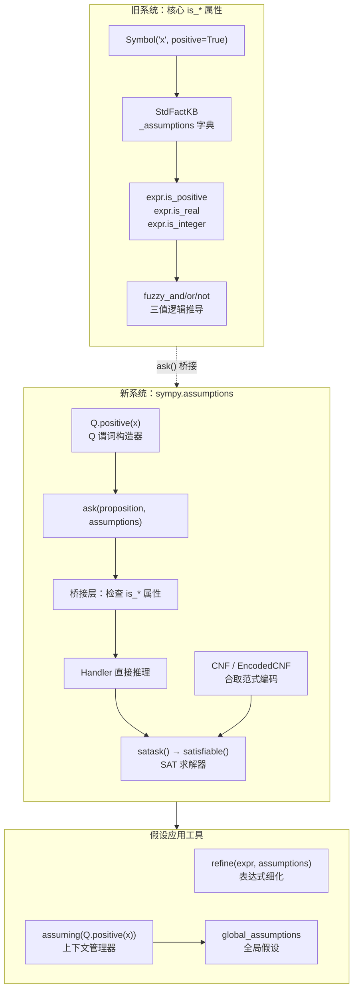

# 假设推理系统

SymPy 拥有两套并行的假设系统：核心层 `is_*` 属性系统（构造时确定，快速但有限）和 `sympy.assumptions` 新假设系统（基于 SAT 求解，灵活但较慢）。两套系统通过桥接机制协同工作：`ask()` 函数在查询时会首先检查 `is_*` 属性，再调用 SAT 推理。`Q` 对象提供谓词构造器，`refine()` 利用假设条件化简表达式，`assuming()` 提供临时假设上下文。[^F-076][^F-077][^F-078]

## 系统架构



## 一、新旧假设系统双轨设计

SymPy 的假设推理采用"双轨制"设计，两套系统各司其职：[^F-012][^F-077]

| 特性 | 旧系统（核心 is_* 属性） | 新系统（sympy.assumptions） |
|------|--------------------------|----------------------------|
| 存储位置 | `Basic._assumptions`（`StdFactKB` 类型） | 独立模块 `sympy.assumptions` |
| 确定时机 | 对象构造时通过关键字参数设置 | 运行时通过 `ask()` 动态查询 |
| 查询方式 | `expr.is_positive`、`expr.is_real` 等属性 | `ask(Q.positive(x), assumptions)` |
| 返回值 | `True`/`False`/`None`（三值逻辑） | `True`/`False`/`None`（三值逻辑） |
| 推理能力 | 基于蕴含规则的直接推导（有限） | 基于 SAT 求解器的通用逻辑推理（强大） |
| 性能 | 快速（属性访问，O(1) 查表） | 较慢（SAT 求解开销） |
| 扩展性 | 需在类上定义 `_eval_is_*` 方法 | 通过注册 handler 扩展谓词 |
| 适用场景 | 简单判断、代码内部快速检查 | 复杂假设组合、条件化简 |

### 1.1 旧系统：is_* 属性

`Basic` 类声明了一组 `is_*` 属性，初始值为 `False` 或 `None`，子类在构造时通过关键字参数初始化假设。这些属性通过三值模糊逻辑（fuzzy logic）自动推导蕴含关系。[^F-012]

```python
>>> from sympy import Symbol, Integer, pi, symbols
>>>
>>> # 构造时设置假设
>>> x = Symbol('x', positive=True)
>>> x.is_positive       # True
True
>>> x.is_real           # True（positive 蕴含 real）
True
>>> x.is_complex        # True（real 蕴含 complex）
True
>>> x.is_negative       # False
False
>>>
>>> # 常量的 is_* 属性
>>> Integer(5).is_integer
True
>>> pi.is_positive
True
>>> pi.is_transcendental
True
>>>
>>> # 无假设时返回 None
>>> y = Symbol('y')
>>> y.is_positive       # None（无法确定）
```

### 1.2 何时使用 is_* vs ask()

| 场景 | 推荐方式 | 原因 |
|------|---------|------|
| 符号创建时就已知的全局属性 | `Symbol('x', positive=True)` + `is_*` | 快速，O(1) 查表 |
| 代码内部快速检查（如 if 分支） | `expr.is_positive` | 无需构造 Q 谓词 |
| 需要临时附加假设进行查询 | `ask(Q.positive(x), Q.rational(x))` | 不修改对象本身 |
| 复杂组合假设推理 | `ask()` + SAT | is_* 无法处理复合条件 |
| 在假设下化简表达式 | `refine()` + `ask()` | 精确控制化简条件 |

---

## 二、ask() 查询函数

`ask()` 是新假设系统的核心查询入口，定义于 `assumptions/ask.py`。它在给定假设下查询命题的真值，采用多层推理策略：先检查 `is_*` 属性（新旧桥接），再调用 Handler 直接推理，最后使用 SAT 求解器处理复杂情况。[^F-077]

### 函数签名

```python
def ask(proposition, assumptions=True, context=global_assumptions):
```

| 参数 | 类型 | 默认值 | 说明 |
|------|------|--------|------|
| `proposition` | Boolean | — | 待查询的命题（`Q.xxx(expr)` 形式） |
| `assumptions` | Boolean | `True` | 已知假设条件（`Q.xxx(expr)` 或 `And(...)` 组合） |
| `context` | AssumptionsContext | `global_assumptions` | 全局假设上下文 |

返回值：`True`（命题成立）、`False`（命题不成立）、`None`（无法确定）。

```python
>>> from sympy import ask, Q, And, Not
>>> from sympy.abc import x
>>>
>>> # 基本蕴含推理
>>> ask(Q.real(x), Q.positive(x))       # positive → real
True
>>> ask(Q.positive(x), Q.real(x))       # real 不蕴含 positive
>>> ask(Q.complex(x), Q.real(x))        # real → complex
True
>>> ask(Q.nonzero(x), Q.positive(x))    # positive → nonzero
True
>>>
>>> # 直接查询常量
>>> ask(Q.positive(1))
True
>>> ask(Q.prime(7))
True
>>> ask(Q.even(3))
False
>>>
>>> # 组合假设推理（SAT 求解）
>>> ask(Q.positive(x),
...     And(Q.real(x), Q.nonzero(x), Not(Q.negative(x))))
True
>>>
>>> # 数论推理：既是素数又是偶数 → 必为2（正数）
>>> ask(Q.positive(x), And(Q.integer(x), Q.prime(x), Q.even(x)))
True
```

---

## 三、Q 谓词对象

`Q` 是 `AssumptionKeys` 类的单例实例，通过属性访问返回对应的 `Predicate` 实例，用于构造 `AppliedPredicate` 命题。SymPy 内置了丰富的谓词，涵盖集合论、序关系、数论、微积分、矩阵等多个领域。[^F-078]

### 3.1 集合论谓词

| 谓词 | 含义 | 蕴含关系 |
|------|------|----------|
| `Q.complex` | 复数 | → `Q.commutative` |
| `Q.real` | 实数 | → `Q.complex`、`Q.hermitian` |
| `Q.imaginary` | 纯虚数 | → `Q.complex`、`Q.antihermitian` |
| `Q.rational` | 有理数 | → `Q.real`、`Q.algebraic` |
| `Q.irrational` | 无理数 | → `Q.real` |
| `Q.integer` | 整数 | → `Q.rational` |
| `Q.algebraic` | 代数数 | → `Q.complex` |
| `Q.transcendental` | 超越数 | → `Q.complex` |
| `Q.extended_real` | 扩充实数（含 ±∞） | — |

### 3.2 序关系谓词

| 谓词 | 含义 | 蕴含关系 |
|------|------|----------|
| `Q.positive` | 正数（>0） | → `Q.nonzero`、`Q.real` |
| `Q.negative` | 负数（<0） | → `Q.nonzero`、`Q.real` |
| `Q.zero` | 零 | → `Q.real`、`Q.even`、`Q.nonnegative`、`Q.nonpositive` |
| `Q.nonzero` | 非零 | — |
| `Q.nonpositive` | 非正数（≤0） | → `Q.real` |
| `Q.nonnegative` | 非负数（≥0） | → `Q.real` |

### 3.3 数论与微积分类谓词

| 谓词 | 含义 | 蕴含关系 |
|------|------|----------|
| `Q.even` | 偶数 | → `Q.integer` |
| `Q.odd` | 奇数 | → `Q.integer` |
| `Q.prime` | 素数 | → `Q.integer`、`Q.positive` |
| `Q.composite` | 合数 | → `Q.integer`、`Q.positive` |
| `Q.finite` | 有限 | — |
| `Q.infinite` | 无穷 | — |

### 3.4 矩阵谓词

| 谓词 | 含义 | 谓词 | 含义 |
|------|------|------|------|
| `Q.symmetric` | 对称矩阵 | `Q.invertible` | 可逆矩阵 |
| `Q.orthogonal` | 正交矩阵 | `Q.unitary` | 酉矩阵 |
| `Q.positive_definite` | 正定矩阵 | `Q.diagonal` | 对角矩阵 |
| `Q.upper_triangular` | 上三角 | `Q.lower_triangular` | 下三角 |
| `Q.fullrank` | 满秩 | `Q.square` | 方阵 |
| `Q.singular` | 奇异矩阵 | `Q.normal` | 正规矩阵 |

```python
>>> from sympy import ask, Q, pi, I, Rational, sqrt, Integer, S
>>>
>>> # 集合论谓词
>>> ask(Q.integer(Integer(5)))
True
>>> ask(Q.rational(S.Half))
True
>>> ask(Q.transcendental(pi))
True
>>> ask(Q.algebraic(sqrt(2)))        # √2 是代数数
True
>>> ask(Q.imaginary(I))
True
>>>
>>> # 序关系谓词
>>> ask(Q.positive(pi))
True
>>> ask(Q.zero(0))
True
>>> ask(Q.nonzero(1))
True
>>>
>>> # 数论谓词
>>> ask(Q.prime(7))
True
>>> ask(Q.prime(4))
False
>>> ask(Q.composite(4))
True
>>> ask(Q.even(2))
True
```

### 3.5 常用蕴含推理链

SymPy 假设系统内置了谓词间的蕴含关系（存储在 `sympy.assumptions.facts` 中），构成有向无环图，推理引擎沿这些链进行推导：

```
integer → rational → real → complex → commutative
integer → rational → algebraic → complex
positive → nonzero ∧ real → complex
negative → nonzero ∧ real → complex
zero → real ∧ even ∧ nonnegative ∧ nonpositive
even → integer
odd → integer
prime → integer ∧ positive
composite → integer ∧ positive
```

---

## 四、SAT 推理与 CNF 编码

当 `is_*` 属性和 Handler 直接推理都无法确定结果时，`ask()` 会调用 `satask()`，将命题和假设编码为 CNF（合取范式），再交给 SAT 求解器 `satisfiable()` 判定可满足性。[^F-080][^F-081][^F-082]

### 推理流程

1. **编码**：将命题取反、与假设和已知事实合并，转换为 CNF
2. **CNF 转换**：通过 `CNF.to_CNF(expr)` 将布尔表达式转换为子句集合
3. **整数编码**：`EncodedCNF` 将每个布尔变量映射为整数（DIMACS 格式）
4. **SAT 求解**：调用 `satisfiable()` 检测是否存在满足赋值
5. **结果判定**：若不可满足则命题为 `True`（反例不存在）；若命题否定可满足则为 `False`；否则为 `None`

```python
>>> from sympy import ask, Q, And, Not, satisfiable
>>> from sympy.abc import x
>>> from sympy.logic.boolalg import Or
>>>
>>> # SAT 组合推理演示
>>> # 已知：x 是实数且非零且不是负数 → x 必为正
>>> ask(Q.positive(x),
...     And(Q.real(x), Q.nonzero(x), Not(Q.negative(x))))
True
>>>
>>> # 底层 satisfiable() 演示
>>> A, B, C = symbols('A B C')
>>> satisfiable(And(A, Or(B, C), Not(And(A, B))))
{A: True, B: False, C: True}
>>> satisfiable(And(A, Not(A)))               # 矛盾式 → 不可满足
False
```

---

## 五、refine() 表达式细化

`refine()` 利用假设条件对表达式进行等价化简。与 `simplify()` 的启发式"盲目化简"不同，`refine()` 仅在给定假设下进行安全的等价变换——例如在已知 `x > 0` 时将 `Abs(x)` 化简为 `x`。[^F-079]

### 函数签名

```python
def refine(expr, assumptions=True):
```

| 参数 | 类型 | 默认值 | 说明 |
|------|------|--------|------|
| `expr` | Expr/Basic | — | 待化简表达式 |
| `assumptions` | Boolean/bool | `True` | 假设条件 |

### 典型化简规则

| 表达式 | 假设 | 结果 |
|--------|------|------|
| `Abs(x)` | `Q.positive(x)` | `x` |
| `Abs(x)` | `Q.negative(x)` | `-x` |
| `sqrt(x**2)` | `Q.positive(x)` | `x` |
| `sqrt(x**2)` | `Q.real(x)` | `Abs(x)` |
| `sign(x)` | `Q.positive(x)` | `1` |
| `sign(x)` | `Q.negative(x)` | `-1` |

```python
>>> from sympy import refine, sqrt, Abs, sign, Q, symbols
>>> from sympy.abc import x, y
>>>
>>> # Abs 化简
>>> refine(Abs(x), Q.positive(x))
x
>>> refine(Abs(x), Q.negative(x))
-x
>>>
>>> # sqrt 化简
>>> refine(sqrt(x**2), Q.positive(x))
x
>>> refine(sqrt(x**2), Q.real(x))
Abs(x)
>>>
>>> # sign 化简
>>> refine(sign(x), Q.positive(x))
1
>>> refine(sign(x), Q.negative(x))
-1
>>>
>>> # 复合假设
>>> refine(Abs(x - y), Q.positive(x - y))
x - y
```

`refine()` 内部通过 `Basic._eval_refine(assumptions)` 钩子方法递归调用各类型的细化规则。`Abs`、`sign`、`sqrt`、`re`、`im`、`conjugate` 等类都定义了各自的 `_eval_refine`。

---

## 六、假设上下文管理

### assuming() 上下文管理器

`assuming()` 允许在代码块内临时添加全局假设，退出上下文后自动恢复。这对于需要在一段代码中反复使用相同假设的场景非常方便：

```python
>>> from sympy import assuming, Q, ask, refine, Abs, symbols
>>> x = symbols('x')
>>>
>>> with assuming(Q.positive(x)):
...     print(ask(Q.positive(x)))      # 上下文内有效
...     print(ask(Q.real(x)))          # 推导：positive → real
...     print(refine(Abs(x)))          # refine 也使用全局假设
True
True
x
>>>
>>> print(ask(Q.positive(x)))          # 退出后失效
```

### global_assumptions

`global_assumptions` 是 `AssumptionsContext` 的全局单例，存储全局有效的假设条件。`ask()` 默认将其纳入推理上下文，`assuming()` 实际上是对其的压栈/弹栈操作。

```python
>>> from sympy import global_assumptions, Q, ask, symbols
>>> x = symbols('x')
>>>
>>> # 手动添加全局假设
>>> global_assumptions.add(Q.positive(x))
>>> ask(Q.real(x))
True
>>>
>>> # 移除全局假设
>>> global_assumptions.remove(Q.positive(x))
>>> ask(Q.real(x))
```

---

## 七、新旧系统协同

两套系统并非互斥，而是通过桥接机制协同工作：

1. **构造时假设进入旧系统**：`Symbol('x', positive=True)` 设置的假设存储在 `_assumptions` 中
2. **新系统可读取旧假设**：`ask(Q.positive(x))` 能看到符号创建时指定的假设
3. **临时假设不修改对象**：`ask(Q.positive(y), Q.positive(y))` 的临时假设不会改变 `y.is_positive`

```python
>>> from sympy import Symbol, ask, Q
>>>
>>> # 构造时假设进入旧系统
>>> x = Symbol('x', positive=True, integer=True)
>>> x.is_positive               # 旧系统直接访问
True
>>> x.is_integer
True
>>> ask(Q.positive(x))          # 新系统也能看到
True
>>>
>>> # 新系统支持灵活的临时假设
>>> y = Symbol('y')
>>> y.is_positive               # 无假设
>>> ask(Q.real(y), Q.positive(y))  # 临时假设下推导
True
>>> y.is_positive               # 临时假设未修改对象
```

## 延伸阅读

- 前置概念：[符号与数字](02-symbols-numbers.md) 了解 Symbol 构造时的假设参数
- 前置概念：[表达式树模型](01-expression-tree.md) 了解 Basic 基类的 _assumptions 机制
- 后续概念：[表达式化简](06-simplification.md) 了解 simplify 与 refine 的区别
- 源码信源：[assumptions-source](/references/assumptions-source.md) 提供 ask/Q/CNF/SAT/refine 的完整 API 参考

[^F-003]: facts.md F-003 — __init_subclass__ 类假设初始化
[^F-011]: facts.md F-011 — _eval_refine 钩子方法
[^F-012]: facts.md F-012 — 新旧假设系统双轨设计
[^F-076]: facts.md F-076 — assumptions 模块导出清单
[^F-077]: facts.md F-077 — ask() 查询函数与推理机制
[^F-078]: facts.md F-078 — Q 谓词对象与谓词分类
[^F-079]: facts.md F-079 — refine() 表达式细化
[^F-080]: facts.md F-080 — CNF/EncodedCNF 合取范式编码
[^F-081]: facts.md F-081 — Literal 类
[^F-082]: facts.md F-082 — satask() SAT 推理函数
