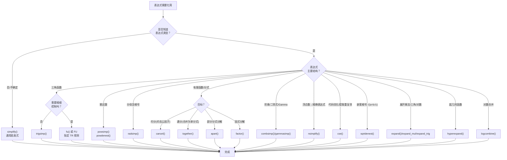

# 表达式化简

SymPy 的 `simplify` 模块提供了丰富的数学表达式化简策略：从通用的 `simplify()`（启发式尝试多种策略）到面向特定结构的专用化简函数（`trigsimp` 三角、`powsimp` 幂、`radsimp` 根式、`ratsimp` 有理函数、`combsimp` 组合式、`gammasimp` Gamma 函数、`fu` FU 算法三角化简等），以及 `cse()` 公共子表达式消除（代码优化）和 `nsimplify()` 浮点数转精确表达式。选择正确的化简函数是高效使用 SymPy 的关键。[^F-101]

## 化简策略选择流程图



---

## 一、simplify() — 通用启发式化简

`simplify()` 是最常用的化简入口，它内部依次尝试多种策略（cancel、expand、trigsimp、powsimp 等），以 `measure` 函数（默认 `count_ops`，即操作数计数）衡量复杂度。若结果复杂度与输入复杂度之比超过 `ratio`（默认 1.7），则保留原表达式。[^F-102]

### 函数签名

```python
simplify(expr, ratio=1.7, measure=count_ops, rational=False, inverse=False, doit=True, **kwargs)
```

| 参数 | 默认值 | 说明 |
|------|--------|------|
| `ratio` | 1.7 | 复杂度接受比；`ratio=1` 要求结果不比输入长；`ratio=oo` 强制化简 |
| `measure` | `count_ops` | 复杂度度量函数 |
| `rational` | `False` | 将 Floats 转为 Rational 后化简 |
| `inverse` | `False` | 允许 `1/(x+1/x) → x/(x²+1)` 类化简 |

```python
>>> from sympy import simplify, cos, sin, exp, count_ops, oo, sqrt, symbols
>>> x, y = symbols('x y')
>>>
>>> # 经典示例：利用 sin²+cos²=1 化简
>>> a = (x + x**2)/(x*sin(y)**2 + x*cos(y)**2)
>>> simplify(a)
x + 1
>>>
>>> # ratio 控制：有理化后表达式更长，默认不化简
>>> root = 1/(sqrt(2)+3)
>>> simplify(root, ratio=1) == root        # ratio=1：不接受更长结果
True
>>> simplify(root, ratio=oo)                # ratio=oo：强制化简
3/7 - sqrt(2)/7
>>>
>>> # rational 参数：浮点转有理
>>> simplify(0.1 + 0.2, rational=True)
3/10
>>>
>>> # inverse 参数
>>> simplify(1/(1 + 1/x))
1/(1 + 1/x)
>>> simplify(1/(1 + 1/x), inverse=True)
x/(x + 1)
```

> ⚠️ **重要提示**：`simplify()` 是启发式的，没有严格的"最简"定义。如果算法依赖特定化简结果，应直接调用专用函数（如 `trigsimp()`、`powsimp()`）以获得可预测的行为。

---

## 二、expand 展开函数族

展开函数族虽然定义在 `core/function.py` 中，但与化简密切相关（化简与展开是互逆操作）。`expand()` 是统一入口，也可以单独使用各专用展开函数。[^F-057]

| 函数 | hint 名 | 效果 |
|------|---------|------|
| `expand()` | 全部 | 默认展开所有 hint |
| `expand_mul` | `mul` | 展开乘法 `(x+y)(x-y) → x²-y²` |
| `expand_multinomial` | `multinomial` | 展开 `(x+y)ⁿ` |
| `expand_log` | `log` | 展开对数 `log(ab) → log a+log b` |
| `expand_power_exp` | `power_exp` | 展开 `a^{b+c} → aᵇ·aᶜ` |
| `expand_power_base` | `power_base` | 展开 `(ab)ˣ → aˣ·bˣ` |
| `expand_trig` | `trig` | 展开三角 `sin(2x) → 2sin x cos x` |
| `expand_func` | `func` | 展开函数（角加法公式等） |
| `expand_complex` | `complex` | 分离实部虚部 |

```python
>>> from sympy import (expand, expand_mul, expand_log, expand_trig,
...                    expand_power_exp, expand_power_base,
...                    sin, cos, exp, log, symbols)
>>> x, y = symbols('x y')
>>> a, b = symbols('a b', positive=True)
>>>
>>> # expand() 统一入口
>>> expand((x + y)*(x - y))
x**2 - y**2
>>> expand(sin(x + y))
sin(x)*cos(y) + sin(y)*cos(x)
>>> expand(log(a*b))
log(a) + log(b)
>>> expand(exp(x + y))
exp(x)*exp(y)
>>>
>>> # 单个 hint 控制
>>> expand(log(a*b), log=False)         # 不展开对数
log(a*b)
>>>
>>> # 独立函数调用
>>> expand_mul((x + 1)*(y + 2))
x*y + 2*x + y + 2
>>> expand_trig(sin(2*x))
2*sin(x)*cos(x)
>>> expand_log(log(a**b), force=True)
b*log(a)
```

---

## 三、多项式与有理函数操作

`cancel()`、`factor()`、`together()`、`apart()` 主要定义在 `polys/` 模块，但作为顶层函数和 Expr 方法广泛用于化简场景。[^F-119][^F-121]

### 3.1 factor() — 多项式因式分解

```python
>>> from sympy import factor, symbols
>>> x = symbols('x')
>>>
>>> factor(x**3 - 1)
(x - 1)*(x**2 + x + 1)
>>> factor(x**2 - 2*x - 3)
(x - 3)*(x + 1)
>>> factor(x**4 - 16)
(x - 2)*(x + 2)*(x**2 + 4)
```

### 3.2 cancel() — 有理函数约分

`cancel()` 约去有理函数（分式）中分子分母的公因子：

```python
>>> from sympy import cancel, symbols
>>> x = symbols('x')
>>>
>>> cancel((x**2 - 1)/(x - 1))
x + 1
>>> cancel((x**2 + 2*x + 1)/(x + 1))
x + 1
>>> cancel(1/(x**2 - 1) - 1/(x - 1))
1/((x - 1)*(x + 1))
```

### 3.3 collect() — 同类项收集

`collect()` 将表达式按指定变量或因子收集同类项：

```python
>>> from sympy import collect, symbols
>>> x, y, z = symbols('x y z')
>>>
>>> expr = x*y + x - 3 + 2*x**2 - z*x**2 + x**3
>>> collect(expr, x)
x**3 + x**2*(2 - z) + x*(y + 1) - 3
```

### 3.4 together() 与 apart() — 通分与部分分式

```python
>>> from sympy import together, apart, symbols
>>> x = symbols('x')
>>>
>>> # together: 通分（合并为单一分式）
>>> together(1/x + 1/(x + 1))
(2*x + 1)/(x*(x + 1))
>>>
>>> # apart: 部分分式分解
>>> apart(1/(x**2 + 2*x - 3))
1/(4*(x - 1)) - 1/(4*(x + 3))
>>> apart(x/(x**2 + 2*x + 1))
1/(x + 1) - 1/(x + 1)**2
```

---

## 四、三角化简

### 4.1 trigsimp() — 三角恒等式化简

`trigsimp()` 使用三角恒等式化简表达式，支持多种算法方法：[^F-103]

| method 参数 | 算法 | 特点 |
|-------------|------|------|
| `'matching'`（默认） | 模式匹配 | 快速，适用于大多数情况 |
| `'groebner'` | Gröbner 基 | 更强但可能较慢 |
| `'combined'` | 先 matching 后 groebner | 兼顾速度和能力 |
| `'fu'` | FU 算法 | 运行完整 FU 变换链 |

```python
>>> from sympy import trigsimp, sin, cos, tan, cot, sec, symbols
>>> x, y = symbols('x y')
>>>
>>> # 基本恒等式
>>> trigsimp(sin(x)**2 + cos(x)**2)
1
>>> trigsimp(tan(x)**2 + 1)
sec(x)**2
>>> trigsimp(1/cot(x), inverse=True)
tan(x)
>>>
>>> # 复杂三角式
>>> trigsimp(2*sin(x)**2 + 2*cos(x)**2)
2
>>> trigsimp(sin(x + y) - sin(x)*cos(y) - cos(x)*sin(y))
0
```

### 4.2 fu() — FU 三角化简算法

`fu()` 实现了 Fu 等人提出的基于规则的三角化简算法，通过一组命名为 TR0-TR22 的变换规则，利用贪心策略搜索最简形式。`FU` 对象提供对各条变换规则的直接访问。[^F-106]

| 规则 | 功能 | 核心变换 |
|------|------|---------|
| TR0 | 有理多项式化简 | `normal().factor().expand()` |
| TR1 | sec/csc → 1/cos, 1/sin | 基本恒等式转换 |
| TR2 | tan/cot → sin/cos 比 | tan→sin/cos, cot→cos/sin |
| TR2i | sin/cos 比 → tan/cot | 逆向转换 |
| TR3 | 倍角展开 | sin(2x)→2sin·cos 等 |
| TR4 | 和差化积/积化和差 | 和差恒等式 |
| TR5 | 幂次化倍角（降幂） | sin²→(1-cos2x)/2 等 |
| TR6 | 倍角降幂（升幂） | cos2x→2cos²-1 等 |
| TR7 | 辅助角变换 | a·sin+b·cos 合项 |
| TR8 | 正切半角代换 | tan(x/2) 万能代换 |
| TR9/10/11 | 和角公式 | cos/sin/tan(A+B) 展开 |
| TR13 | 切比雪夫多项式 | cos(nx) 用 cos x 表示 |
| TR15/16/22 | 幂次统一 | 统一为 sin/cos/tan |

```python
>>> from sympy import fu, FU, TR1, TR2, TR3, TR5, sin, cos, tan, symbols
>>> x = symbols('x')
>>>
>>> # 直接使用 fu() 化简
>>> fu(sin(x)**2 + cos(x)**2)
1
>>> fu(tan(x))
sin(x)/cos(x)
>>>
>>> # 单独调用某条变换规则
>>> TR2(tan(x))
sin(x)/cos(x)
>>> TR3(sin(2*x))
2*sin(x)*cos(x)
>>> TR5(sin(x)**2)
1/2 - cos(2*x)/2
```

---

## 五、幂与根式化简

### 5.1 powsimp() — 幂运算合并

`powsimp()` 合并相似底数和指数的幂表达式：[^F-104]

```python
>>> from sympy import powsimp, powdenest, exp, symbols
>>> x, y, n = symbols('x y n')
>>> a, b = symbols('a b', positive=True)
>>>
>>> # 同底数合并：xᵃ·xᵇ → x^{a+b}
>>> powsimp(x**a * x**b)
x**(a + b)
>>>
>>> # 同指数合并：aⁿ·bⁿ → (ab)ⁿ
>>> powsimp(a**n * b**n)
(a*b)**n
>>>
>>> # force=True：不假设变量为正，强制合并
>>> powsimp(x**n * y**n)
x**n*y**n
>>> powsimp(x**n * y**n, force=True)
(x*y)**n
>>>
>>> # deep 参数：深入表达式内部
>>> powsimp(exp(x)*exp(y), deep=True)
exp(x + y)
```

`powdenest()` 处理幂的嵌套：

```python
>>> powdenest((x**a)**b, force=True)
x**(a*b)
```

### 5.2 radsimp() — 根式有理化

`radsimp()` 对分母含根式的表达式进行有理化：[^F-105]

```python
>>> from sympy import radsimp, sqrt, symbols
>>> x = symbols('x')
>>>
>>> radsimp(1/(sqrt(2) + 1))
sqrt(2) - 1
>>> radsimp(1/(sqrt(x) + 1))
(sqrt(x) - 1)/(x - 1)
```

### 5.3 ratsimp() — 有理函数化简

`ratsimp()` 对有理函数执行通分和约分化简：

```python
>>> from sympy import ratsimp, symbols
>>> x = symbols('x')
>>>
>>> ratsimp(1/x + 1/(x + 1))
(2*x + 1)/(x*(x + 1))
```

---

## 六、专用化简工具

### 6.1 combsimp() — 组合式化简

`combsimp()` 化简含阶乘、二项式系数、Gamma 函数的组合表达式：

```python
>>> from sympy import combsimp, factorial, binomial, gamma, symbols
>>> n, k = symbols('n k', integer=True, positive=True)
>>>
>>> combsimp(factorial(n)/factorial(n-2))
n*(n - 1)
>>> combsimp(binomial(n, k) + binomial(n, k-1))
binomial(n + 1, k)
>>> combsimp(gamma(n+1)/gamma(n))
n
```

### 6.2 gammasimp() — Gamma 函数化简

```python
>>> from sympy import gammasimp, gamma, Rational, sqrt, pi, symbols
>>> n = symbols('n', positive=True)
>>> gammasimp(gamma(Rational(1,2)))
sqrt(pi)
```

### 6.3 nsimplify() — 浮点数转精确表达式

`nsimplify()` 寻找浮点数的精确符号表示，是处理数值精度问题的利器：[^F-NS]

```python
>>> from sympy import nsimplify, pi, sqrt, GoldenRatio, E
>>>
>>> nsimplify(0.70710678118)           # → √2/2
sqrt(2)/2
>>> nsimplify(3.1415926535)            # → π
pi
>>> nsimplify(1.6180339887)            # → 黄金分割比
GoldenRatio
>>> nsimplify(0.1 + 0.2)              # → 3/10
3/10
>>> nsimplify(2.718281828)             # → e
E
>>>
>>> # 指定允许的常量
>>> nsimplify(0.8660254, [sqrt(3)])
sqrt(3)/2
```

### 6.4 cse() — 公共子表达式消除

`cse()` 提取表达式中重复出现的子表达式，用临时变量替换，是代码生成和大表达式优化的关键工具：[^F-CSE]

```python
>>> from sympy import cse, sin, cos, sqrt, numbered_symbols, symbols
>>> x, y, z = symbols('x y z')
>>>
>>> # 基本用法
>>> expr = sin(x)*cos(x) + sin(x)*cos(x)**2
>>> repl, red = cse(expr)
>>> repl         # 替换列表 [(临时变量, 子表达式)]
[(x0, sin(x)*cos(x))]
>>> red          # 化简后的表达式
[x0**2 + x0]
>>>
>>> # 多表达式共享子表达式
>>> exprs = [x**2 + x**3, x**2 - x**3]
>>> repl, red = cse(exprs)
>>> repl
[(x0, x**2), (x1, x**3)]
>>> red
[x0 + x1, x0 - x1]
>>>
>>> # 自定义临时变量命名
>>> repl, red = cse(expr, symbols=numbered_symbols('tmp'))
```

`cse()` 返回 `(replacements, reduced_exprs)`：`replacements` 是 `(Symbol, expression)` 对列表（拓扑排序），`reduced_exprs` 是替换后的表达式列表。

### 6.5 其他专用化简函数

| 函数 | 用途 | 示例 |
|------|------|------|
| `logcombine()` | 对数合并 | `log(x)+log(y) → log(xy)` |
| `sqrtdenest()` | 去嵌套根号 | `√(5+2√6) → √2+√3` |
| `separatevars()` | 变量分离 | `exp(x+y) → exp(x)*exp(y)` |
| `besselsimp()` | Bessel 函数化简 | `besselj(0,x).diff(x) → -besselj(1,x)` |
| `signsimp()` | 符号化简 | `-(-x) → x` |

```python
>>> from sympy import logcombine, sqrtdenest, sqrt, log, symbols
>>> x, y = symbols('x y', positive=True)
>>>
>>> logcombine(log(x) + log(y))
log(x*y)
>>> sqrtdenest(sqrt(5 + 2*sqrt(6)))
sqrt(2) + sqrt(3)
```

---

## 七、化简函数选择速查表

| 你想做什么 | 应该用 | 不要用/注意 |
|-----------|--------|------------|
| 日常化简，不确定表达式结构 | `simplify()` | 启发式，结果不可预测 |
| sin²+cos²=1 类三角化简 | `trigsimp()` 或 `fu()` | `simplify()` 可能不够强 |
| xᵃ·xᵇ→x^{a+b} 幂合并 | `powsimp()` | `simplify()` 不保证幂合并 |
| 分母有理化 | `radsimp()` | `simplify()` 的 ratio 可能阻止化简 |
| (x²-1)/(x-1)→x+1 约分 | `cancel()` | `simplify()` 可能更慢 |
| 多项式因式分解 | `factor()` | — |
| 通分合并 | `together()` | — |
| 部分分式分解 | `apart()` | — |
| 收集同类项 | `collect()` | — |
| 提取重复子表达式（代码优化） | `cse()` | — |
| 0.333...→1/3 | `nsimplify()` | 配合 `rational=True` |
| 展开 sin(x+y) 或 (a+b)ⁿ | `expand_trig()` / `expand()` | `simplify()` 做相反操作（化简） |
| 阶乘/二项式/Gamma 化简 | `combsimp()` / `gammasimp()` | `simplify()` 可能不识别 |
| 精细控制三角变换 | `fu()` + TR 规则 | `trigsimp()` 自动选择方法 |

## 延伸阅读

- 前置概念：[假设推理系统](05-assumptions.md) 了解 refine() 与 simplify() 的区别
- 前置概念：[函数体系](04-function-basics.md) 了解 expand_func/rewrite 等函数变换机制
- 后续概念：[微积分](07-calculus.md) 了解微分积分运算中化简的作用
- 源码信源：[simplify-source](/references/simplify-source.md) 提供各化简函数的完整 API 与参数参考

[^F-057]: facts.md F-057 — expand 系列函数定义，参见 core/function.py
[^F-101]: facts.md F-101 — simplify 模块导出清单
[^F-102]: facts.md F-102 — simplify 主函数签名与 ratio/measure 参数
[^F-103]: facts.md F-103 — trigsimp 函数与 method 参数
[^F-104]: facts.md F-104 — powsimp 函数与 combine/force 参数
[^F-105]: facts.md F-105 — radsimp 根式有理化
[^F-106]: facts.md F-106 — fu/FU 三角化简算法与 TR 规则
[^F-119]: facts.md F-119 — cancel/factor 多项式函数
[^F-121]: facts.md F-121 — together/apart 有理函数工具
[^F-NS]: facts.md F-NS — nsimplify 数值转精确表达式
[^F-CSE]: facts.md F-CSE — cse 公共子表达式消除
