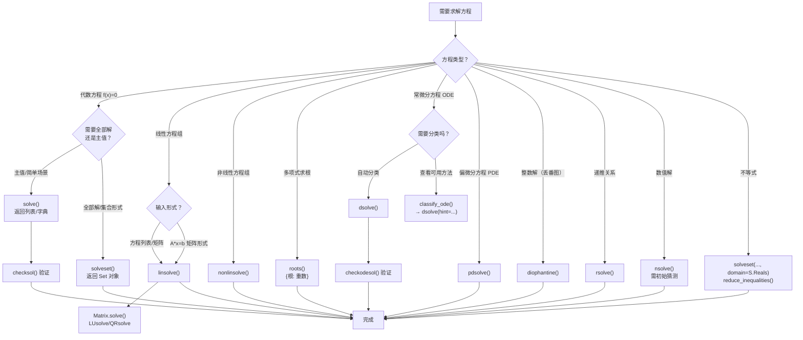

# 方程求解

SymPy 的 `solvers` 模块提供了全面的方程求解能力：`solve()` 是经典代数求解器，返回解的列表；`solveset()` 是现代集合化求解器，以集合对象（FiniteSet、Interval、ImageSet 等）返回全部解；`linsolve()` 求解线性方程组，`nonlinsolve()` 求解非线性方程组；`roots()` 返回多项式根及其重数；`dsolve()` 求解常微分方程（ODE），`pdsolve()` 求解偏微分方程（PDE）；`diophantine()` 求整数解，`rsolve()` 解递推关系；`nsolve()` 提供数值求解；此外还有不等式求解工具（`reduce_inequalities`）和解验证工具（`checksol`/`checkodesol`）。[^F-111]

## 求解器选择指南



---

## 一、solve() — 代数方程求解

`solve()` 是 SymPy 最经典的方程求解函数，求解 `f(x) = 0`（或 `Eq(f, g)`），返回解的列表或字典。[^F-SOLVE]

### 基本用法

```python
>>> from sympy import solve, Eq, sin, exp, sqrt, I, symbols
>>> x, y, z = symbols('x y z')
>>>
>>> # 单变量方程：f(x) = 0
>>> solve(x**2 - 4, x)
[-2, 2]
>>> solve(x**2 + 1, x)
[-I, I]
>>>
>>> # 使用 Eq 形式
>>> solve(Eq(x**2, 4), x)
[-2, 2]
>>>
>>> # 三角函数（返回主解）
>>> solve(sin(x) - 1, x)
[pi/2]
>>>
>>> # 带增根的方程（自动验证）
>>> solve(sqrt(x+2) - x, x)        # 自动排除增根
[2]
```

### 返回格式控制

```python
>>> # dict=True：返回字典列表
>>> solve(x**2 - 4, x, dict=True)
[{x: -2}, {x: 2}]
>>>
>>> # set=True：返回解集元组
>>> solve(x**2 - 4, x, set=True)
([x], {(-2,), (2,)})
>>>
>>> # 符号参数求解
>>> a, b, c = symbols('a b c')
>>> solve(a*x**2 + b*x + c, x)
[(-b + sqrt(-4*a*c + b**2))/(2*a), -(b + sqrt(-4*a*c + b**2))/(2*a)]
```

### 方程组求解

```python
>>> # 线性方程组
>>> solve([x + y - 3, x - y - 1], [x, y])
{x: 2, y: 1}
>>>
>>> # 非线性方程组
>>> solve([x**2 + y**2 - 1, x - y], [x, y])
[(-sqrt(2)/2, -sqrt(2)/2), (sqrt(2)/2, sqrt(2)/2)]
```

---

## 二、solveset() — 集合化求解

`solveset()` 是 solve 的现代替代品，以**集合**形式返回方程的全部解。默认在复数域 `S.Complexes` 上求解，可指定实数域 `S.Reals`、整数域等。返回 `FiniteSet`、`Interval`、`ImageSet`、`ConditionSet`、`Union` 等集合对象，能优雅表示无限多解。[^F-112]

### 函数签名

```python
solveset(f, symbol=None, domain=S.Complexes)
```

| 参数 | 默认值 | 说明 |
|------|--------|------|
| `f` | — | 方程（Expr 或 Eq） |
| `symbol` | 自动推断 | 求解变量 |
| `domain` | `S.Complexes` | 求解域 |

### 基本用法

```python
>>> from sympy import solveset, S, Interval, sin, oo, ConditionSet, symbols, pi
>>> x = symbols('x')
>>>
>>> # 多项式方程
>>> solveset(x**2 - 4, x)
{-2, 2}
>>> solveset(x**2 + 1, x, S.Reals)      # 实数域无解
EmptySet
>>>
>>> # 三角方程：返回全部解（含周期推广）
>>> solveset(sin(x), x, S.Reals)
Union(ImageSet(Lambda(_n, 2*_n*pi), Integers),
      ImageSet(Lambda(_n, 2*_n*pi + pi), Integers))
>>>
>>> # 不等式（原生支持）
>>> solveset(x**2 - 4 < 0, x, S.Reals)
Interval.open(-2, 2)
>>>
>>> # 恒成立/矛盾
>>> solveset(x - x, x)                  # 恒成立
Complexes
>>> solveset(x - x - 1, x)              # 矛盾
EmptySet
```

### solve() vs solveset() 对比

| 特性 | `solve()` | `solveset()` |
|------|-----------|-------------|
| 返回类型 | list / dict | Set 对象 |
| 三角方程 | 返回主值（有限列表） | 返回全部解（含 ImageSet 周期解） |
| 无限解 | 不返回或只返回部分 | 用 ConditionSet/ImageSet 表示 |
| 定义域 | 默认复数域 | 通过 domain 参数指定 |
| 不等式 | 不直接支持 | 原生支持 |
| 发展状态 | 维护模式 | **推荐使用** |

```python
>>> from sympy import solve, solveset, sin, S, pi
>>>
>>> solve(sin(x), x)                   # 仅主值范围
[0, pi]
>>> solveset(sin(x), x, S.Reals)       # 全部解
Union(ImageSet(Lambda(_n, 2*_n*pi), Integers),
      ImageSet(Lambda(_n, 2*_n*pi + pi), Integers))
```

---

## 三、线性与非线性方程组

### 3.1 linsolve() — 线性方程组

`linsolve()` 求解 N 个变量 M 个线性方程的方程组，支持三种输入形式：方程列表、增广矩阵、AX=b 形式。[^F-112]

```python
>>> from sympy import linsolve, linear_eq_to_matrix, Matrix, symbols
>>> x, y, z = symbols('x y z')
>>>
>>> # 方程列表形式
>>> linsolve([x + y + z - 1, x + y + 2*z - 3], (x, y, z))
{(-y - 1, y, 2)}
>>>
>>> # 增广矩阵形式
>>> M = Matrix([[1, 2, 3, 1], [4, 5, 6, 2], [7, 8, 10, 3]])
>>> linsolve(M, x, y, z)
{(0, -1, 1)}
>>>
>>> # AX=b 形式
>>> A = Matrix([[1, 1], [1, -1]])
>>> b = Matrix([3, 1])
>>> linsolve((A, b), x, y)
{(2, 1)}
>>>
>>> # linear_eq_to_matrix：将方程列表转为矩阵
>>> eqs = [x + y - 3, x - y - 1]
>>> A, b = linear_eq_to_matrix(eqs, [x, y])
>>> A
Matrix([
[1,  1],
[1, -1]])
>>> b
Matrix([
[3],
[1]])
```

### 3.2 nonlinsolve() — 非线性方程组

`nonlinsolve()` 使用代入消元和 Gröbner 基等方法求解非线性方程组：

```python
>>> from sympy import nonlinsolve, sqrt, symbols
>>> x, y = symbols('x y')
>>>
>>> # 圆与直线交点
>>> nonlinsolve([x**2 + y**2 - 1, x - y], [x, y])
{(-sqrt(2)/2, -sqrt(2)/2), (sqrt(2)/2, sqrt(2)/2)}
>>>
>>> # 含超越函数
>>> nonlinsolve([x*y - 1, x - 2], [x, y])
{(2, 1/2)}
```

---

## 四、roots() — 多项式求根

`roots()` 返回多项式根及其重数的字典 `{root: multiplicity}`：

```python
>>> from sympy import roots, symbols
>>> x = symbols('x')
>>>
>>> roots(x**3 - 6*x**2 + 11*x - 6, x)
{1: 1, 2: 1, 3: 1}
>>>
>>> # 三重根
>>> roots(x**3 - 3*x**2 + 3*x - 1, x)
{1: 3}
>>>
>>> # 复根
>>> roots(x**2 + 1, x)
{-I: 1, I: 1}
```

---

## 五、nsolve() — 数值求解

`nsolve()` 使用数值方法（二分法、牛顿法等）求方程的数值根。`x0` 可以是初始猜测值或搜索区间：

```python
>>> from sympy import nsolve, cos, sin, Matrix, symbols
>>> x, y = symbols('x y')
>>>
>>> # 单初始猜测（牛顿法）
>>> nsolve(cos(x) - x, x, 1)         # Dottie 数
0.739085133215161
>>>
>>> # 区间搜索（二分法）
>>> nsolve(sin(x), x, (3, 4))        # 搜索 [3,4] 区间
3.14159265358979
>>>
>>> # 方程组数值解
>>> nsolve((x**2 + y**2 - 1, x - y), (x, y), (1, 1))
Matrix([
[0.707106781186548],
[0.707106781186548]])
```

---

## 六、dsolve() — 常微分方程

`dsolve()` 求解常微分方程（组），使用 hint 系统分类 ODE 类型并选择求解方法。`classify_ode()` 返回所有可用的求解 hint。[^F-DSOLVE]

### 常用 ODE hint 类型

| hint | 方程类型 |
|------|---------|
| `separable` | 可分离变量 |
| `1st_exact` | 恰当方程 |
| `1st_linear` | 一阶线性 |
| `Bernoulli` | Bernoulli 方程 |
| `homogeneous` | 齐次方程 |
| `nth_linear_constant_coeff_homogeneous` | n 阶常系数齐次 |
| `nth_linear_constant_coeff_undetermined_coefficients` | 待定系数法 |
| `nth_linear_constant_coeff_variation_of_parameters` | 参数变易法 |
| `Liouville` | Liouville 型 |
| `all` | 尝试所有方法 |

### 基本用法

```python
>>> from sympy import (dsolve, classify_ode, Function, Symbol,
...                    Derivative, Eq, sin, cos, exp, checkodesol)
>>> x = Symbol('x')
>>> f = Function('f')
>>> y = f(x)
>>>
>>> # 一阶 ODE: f'(x) = f(x)（指数增长）
>>> eq = Derivative(y, x) - y
>>> dsolve(eq, y)
Eq(f(x), C1*exp(x))
>>>
>>> # 二阶常系数齐次 ODE: f'' + f = 0（简谐振动）
>>> eq2 = Derivative(y, x, 2) + y
>>> dsolve(eq2, y)
Eq(f(x), C1*sin(x) + C2*cos(x))
>>>
>>> # 带初值条件
>>> eq3 = Derivative(y, x) - y
>>> dsolve(eq3, y, ics={f(0): 1})
Eq(f(x), exp(x))
>>>
>>> # 分类 ODE 类型
>>> classify_ode(Derivative(y, x) - y, y)[:4]
('separable', '1st_exact', '1st_linear', 'Bernoulli')
>>>
>>> # 验证解
>>> sol = dsolve(eq, y)
>>> checkodesol(eq, sol)
(True, 0)
```

---

## 七、其他求解器

### 7.1 pdsolve() — 偏微分方程

`pdsolve()` 求解偏微分方程，`classify_pde()` 分类 PDE 类型：

```python
>>> from sympy import pdsolve, Function, Derivative, symbols
>>> x, t = symbols('x t')
>>> f = Function('f')
>>> u = f(x, t)
>>>
>>> # 简单对流方程：∂u/∂x + ∂u/∂t = 0
>>> eq = Derivative(u, x) + Derivative(u, t)
>>> pdsolve(eq, u)
Eq(f(x, t), F(x - t))
```

### 7.2 diophantine() — 丢番图方程

`diophantine()` 求解整系数不定方程，返回整数解的参数化表示：

```python
>>> from sympy import diophantine, symbols
>>> x, y = symbols('x y', integer=True)
>>>
>>> # 线性丢番图方程：2x + 3y = 5
>>> diophantine(2*x + 3*y - 5)
{(3*t_0 - 5, 5 - 2*t_0)}
```

### 7.3 rsolve() — 递推关系

`rsolve()` 求解递推关系（差分方程），支持多项式系数、有理系数和超几何系数：

```python
>>> from sympy import rsolve, Function, symbols, sqrt
>>> n = symbols('n', integer=True, nonnegative=True)
>>> y = Function('y')
>>>
>>> # Fibonacci 递推：y(n+2) = y(n+1) + y(n), y(0)=0, y(1)=1
>>> f = y(n+2) - y(n+1) - y(n)
>>> rsolve(f, y(n), {y(0): 0, y(1): 1})
sqrt(5)*(1/2 + sqrt(5)/2)**n/5 - sqrt(5)*(1/2 - sqrt(5)/2)**n/5
```

### 7.4 不等式求解

`solveset()` 是推荐的不等式求解方式（指定 `domain=S.Reals`），此外 `reduce_inequalities()` 也可用于化简单变量/多变量不等式组：

```python
>>> from sympy import reduce_inequalities, solveset, S, symbols
>>> x = symbols('x')
>>>
>>> # 单不等式
>>> reduce_inequalities(x**2 - 4 < 0, x)
(-2 < x) & (x < 2)
>>>
>>> # 不等式组
>>> reduce_inequalities([x > 0, x**2 < 4], x)
(0 < x) & (x < 2)
>>>
>>> # solveset 解不等式（推荐）
>>> solveset(x**2 - 4 < 0, x, S.Reals)
Interval.open(-2, 2)
```

### 7.5 解验证工具

| 函数 | 用途 |
|------|------|
| `checksol(expr, symbol, sol)` | 验证代数方程解，返回 `True`/`False` |
| `checkodesol(ode, sol)` | 验证 ODE 解，返回 `(True/False, 残差)` |

```python
>>> from sympy import checksol, symbols
>>> x = symbols('x')
>>> checksol(x**2 - 4, x, 2)
True
>>> checksol(x**2 - 4, x, 3)
False
```

---

## 八、求解器速查表

| 方程类型 | 推荐函数 | 返回类型 |
|---------|---------|---------|
| 单变量代数方程（简单） | `solve()` | list / dict |
| 单变量代数方程（全部解） | `solveset()` | Set |
| 三角方程 | `solveset(..., S.Reals)` | ImageSet（周期解） |
| 不等式 | `solveset(..., domain=S.Reals)` | Interval / Union |
| 线性方程组 | `linsolve()` | FiniteSet |
| 非线性方程组 | `nonlinsolve()` | FiniteSet |
| 多项式求根（含重数） | `roots()` | dict {根: 重数} |
| 常微分方程（ODE） | `dsolve()` | Eq（含常数 C1,C2...） |
| 偏微分方程（PDE） | `pdsolve()` | Eq（含任意函数 F） |
| 整数解方程 | `diophantine()` | 参数化元组 |
| 递推关系 | `rsolve()` | 闭式表达式 |
| 数值求根 | `nsolve()` | Float / Matrix |
| 线性规划 | `linprog()` | — |

## 延伸阅读

- 前置概念：[微积分](07-calculus.md) 了解 Derivative/Integral 惰性对象在 dsolve 中的使用
- 前置概念：[矩阵运算](09-matrices.md) 了解 linsolve 与矩阵求解的关系
- 源码信源：[series-solvers-source](/references/series-solvers-source.md) 提供求解器模块完整 API 与导出清单

[^F-111]: facts.md F-111 — solvers 模块导出清单
[^F-112]: facts.md F-112 — solveset/linsolve/nonlinsolve 集合化求解
[^F-SOLVE]: facts.md F-SOLVE — solve() 代数方程求解函数
[^F-DSOLVE]: facts.md F-DSOLVE — dsolve() 常微分方程求解与 hint 分类系统
[^F-107]: facts.md F-107 — series 模块导出（含级数工具）
