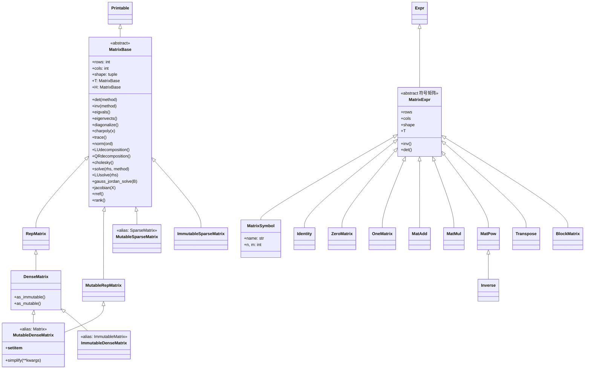

# 矩阵运算

SymPy 的矩阵系统位于 `sympy.matrices` 包，分为两大体系：**显式矩阵**（dense/sparse，存储具体元素值）和**符号矩阵表达式**（MatrixExpr，保持符号形式不求值）。显式矩阵以 `MatrixBase` 为抽象基类，`Matrix`（= `MutableDenseMatrix`）是最常用的可变稠密矩阵类，`ImmutableDenseMatrix` 提供不可变版本，`SparseMatrix` 使用 DOK 格式存储稀疏矩阵。矩阵系统支持完整的线性代数运算：算术运算（加减乘幂）、转置/共轭转置、行列式、逆、秩、迹、范数、特征值/特征向量、对角化、Jordan 标准形、LU/QR/Cholesky/SVD 分解、线性方程组求解等。符号矩阵表达式通过 `MatrixSymbol`、`Identity`、`ZeroMatrix` 等类提供代数层面的矩阵操作。[^matrices-init][^dense-source][^matrixbase-source]

## 矩阵类层次



**别名链**：`Matrix = MutableMatrix = MutableDenseMatrix`，`SparseMatrix = MutableSparseMatrix`，`ImmutableMatrix = ImmutableDenseMatrix`。

---

## 一、矩阵创建

### 1.1 基本构造

```python
>>> from sympy import Matrix, ImmutableMatrix, symbols, eye, zeros, ones, diag
>>> x, y = symbols('x y')
>>>
>>> # 嵌套列表构造
>>> Matrix([[1, 2], [3, 4]])
Matrix([
[1, 2],
[3, 4]])
>>>
>>> # 平面列表 + 形状
>>> Matrix(2, 3, [1, 2, 3, 4, 5, 6])
Matrix([
[1, 2, 3],
[4, 5, 6]])
>>>
>>> # 符号矩阵
>>> Matrix([[x, y], [y, x]])
Matrix([
[x, y],
[y, x]])
>>>
>>> # 列向量
>>> Matrix([1, 2, 3])
Matrix([
[1],
[2],
[3]])
```

### 1.2 工厂函数

```python
>>> from sympy import eye, zeros, ones, diag
>>>
>>> # 单位矩阵
>>> eye(3)
Matrix([
[1, 0, 0],
[0, 1, 0],
[0, 0, 1]])
>>>
>>> # 零矩阵 / 全一矩阵
>>> zeros(2, 3)
Matrix([
[0, 0, 0],
[0, 0, 0]])
>>> ones(2)
Matrix([
[1],
[1]])
>>>
>>> # 对角矩阵
>>> diag(1, 2, 3)
Matrix([
[1, 0, 0],
[0, 2, 0],
[0, 0, 3]])
>>>
>>> # diag 也接受矩阵作为分块对角
>>> diag(Matrix([[1,2],[3,4]]), 5)
Matrix([
[1, 2, 0],
[3, 4, 0],
[0, 0, 5]])
```

### 1.3 可变性：Mutable vs Immutable

`Matrix`（MutableDenseMatrix）支持原地修改（`__setitem__`），`ImmutableMatrix` 创建后不可修改。使用 `as_mutable()` / `as_immutable()` 转换：

```python
>>> from sympy import Matrix, ImmutableMatrix
>>>
>>> X = ImmutableMatrix([[1, 2], [3, 4]])
>>> Y = X.as_mutable()
>>> Y[1, 1] = 5            # 原地修改可变矩阵
>>> Y
Matrix([
[1, 2],
[3, 5]])
>>>
>>> # 注意：MutableDenseMatrix.simplify() 原地操作返回 None
```

---

## 二、基本运算

### 2.1 算术运算

```python
>>> from sympy import Matrix, symbols, I
>>> x = symbols('x')
>>>
>>> M = Matrix([[1, 2], [3, 4]])
>>> N = Matrix([[5, 6], [7, 8]])
>>>
>>> # 加法
>>> M + N
Matrix([
[ 6,  8],
[10, 12]])
>>>
>>> # 标量乘法
>>> 2*M
Matrix([
[2, 4],
[6, 8]])
>>>
>>> # 矩阵乘法
>>> M*N
Matrix([
[19, 22],
[43, 50]])
>>>
>>> # 矩阵幂
>>> M**2
Matrix([
[ 7, 10],
[15, 22]])
>>>
>>> # 元素访问
>>> M[0, 0]
1
>>> M[1, :]           # 第二行
Matrix([[3, 4]])
>>> M[:, 0]           # 第一列
Matrix([
[1],
[3]])
```

### 2.2 转置与共轭转置

```python
>>> M = Matrix([[1, 2+I], [3, 4]])
>>> M.T               # 转置
Matrix([
[    1, 3],
[2 + I, 4]])
>>> M.H               # 共轭转置（Hermite 转置）
Matrix([
[    1,      3],
[2 - I,      4]])
>>>
>>> M.shape           # (rows, cols)
(2, 2)
```

---

## 三、行列式、逆与秩

### 3.1 行列式与逆

```python
>>> from sympy import Matrix
>>> M = Matrix([[1, 2], [3, 4]])
>>>
>>> M.det()           # 行列式（默认 Bareiss 算法）
-2
>>> M.inv()           # 逆矩阵
Matrix([
[ -2,    1],
[3/2, -1/2]])
>>>
>>> # 验证：M * M^{-1} = I
>>> M * M.inv()
Matrix([
[1, 0],
[0, 1]])
>>>
>>> # 特征多项式
>>> M.charpoly()
PurePoly(lambda**2 - 5*lambda - 2, lambda, domain='ZZ')
```

### 3.2 秩与迹与范数

```python
>>> from sympy import Matrix
>>> M = Matrix([[1, 2], [3, 4]])
>>>
>>> M.trace()         # 迹（对角线元素之和）
5
>>> M.rank()          # 秩
2
>>> M.norm()          # 默认 2-范数（谱范数）
sqrt(30)
>>> M.norm(1)         # 1-范数（列和最大）
6
>>> from sympy import sqrt
>>> M.norm('fro')     # Frobenius 范数
sqrt(30)
```

### 3.3 行最简形（RREF）

```python
>>> M = Matrix([[1, 2, 3], [4, 5, 6], [7, 8, 10]])
>>> M.rref()          # 行最简形（返回矩阵+主元列）
(Matrix([
[1, 0, 0],
[0, 1, 0],
[0, 0, 1]]), (0, 1, 2))
```

---

## 四、特征值、特征向量与对角化

### 4.1 特征值与特征向量

```python
>>> from sympy import Matrix
>>> M = Matrix([[1, 0], [0, 2]])
>>>
>>> M.eigvals()       # {特征值: 代数重数}
{1: 1, 2: 1}
>>>
>>> M.eigenvects()    # [(特征值, 重数, [特征向量列表])]
[(1, 1, [Matrix([
[1],
[0]])]),
 (2, 1, [Matrix([
[0],
[1]])])]
```

### 4.2 对角化

`diagonalize()` 返回 `(P, D)` 使得 `M = P·D·P^{-1}`，其中 D 是对角矩阵：

```python
>>> from sympy import Matrix
>>> M = Matrix([[1, 0], [0, 2]])
>>> P, D = M.diagonalize()
>>> P
Matrix([
[1, 0],
[0, 1]])
>>> D
Matrix([
[1, 0],
[0, 2]])
>>>
>>> # 验证：P*D*P^{-1} = M
>>> P*D*P.inv()
Matrix([
[1, 0],
[0, 2]])
>>>
>>> # 不可对角化矩阵的 Jordan 标准形
>>> N = Matrix([[2, 1], [0, 2]])
>>> P, J = N.jordan_form()
>>> J
Matrix([
[2, 1],
[0, 2]])
```

---

## 五、矩阵分解

### 5.1 LU 分解

```python
>>> from sympy import Matrix
>>> M = Matrix([[4, 3], [6, 3]])
>>> L, U, perm = M.LUdecomposition()
>>> L
Matrix([
[  1, 0],
[3/2, 1]])
>>> U
Matrix([
[4,   3],
[0, -3/2]])
>>> # perm 是行交换索引列表
>>> L*U            # 验证 L*U = M（经行交换后）
Matrix([
[4, 3],
[6, 3]])
```

### 5.2 QR 分解

```python
>>> Q, R = M.QRdecomposition()
>>> Q
Matrix([
[ 2*sqrt(13)/13,  3*sqrt(13)/13],
[ 3*sqrt(13)/13, -2*sqrt(13)/13]])
>>> R
Matrix([
[2*sqrt(13), 15*sqrt(13)/13],
[        0,   3*sqrt(13)/13]])
>>> Q*R
Matrix([
[4, 3],
[6, 3]])
```

### 5.3 Cholesky 分解

```python
>>> from sympy import Matrix
>>> M = Matrix([[4, 2], [2, 5]])       # 对称正定矩阵
>>> L = M.cholesky()
>>> L
Matrix([
[2,   0],
[1,   2]])
>>> L * L.T
Matrix([
[4, 2],
[2, 5]])
```

### 5.4 奇异值分解（SVD）

```python
>>> from sympy import Matrix
>>> M = Matrix([[1, 2], [3, 4]])
>>> M.singular_values()
[sqrt(2*sqrt(221)/5 + 29/5), sqrt(29/5 - 2*sqrt(221)/5)]
```

---

## 六、线性方程组求解

矩阵提供了多种求解 Ax=b 的方法：

| 方法 | 说明 |
|------|------|
| `A.solve(b)` | 默认 Gauss-Jordan 消元 |
| `A.LUsolve(b)` | LU 分解求解 |
| `A.QRsolve(b)` | QR 分解求解 |
| `A.gauss_jordan_solve(B)` | Gauss-Jordan 消元（返回解+自由变量） |
| `A.pinv_solve(B)` | 伪逆求解（Moore-Penrose） |

```python
>>> from sympy import Matrix
>>> A = Matrix([[1, 2], [3, 4]])
>>> b = Matrix([5, 6])
>>>
>>> A.solve(b)
Matrix([
[-4],
[9/2]])
>>>
>>> A.LUsolve(b)
Matrix([
[-4],
[9/2]])
>>>
>>> # 验证：A*x = b
>>> A * A.solve(b)
Matrix([
[5],
[6]])
>>>
>>> # Gauss-Jordan 处理欠定系统
>>> A2 = Matrix([[1, 2, 3], [4, 5, 6]])
>>> b2 = Matrix([1, 2])
>>> sol, param = A2.gauss_jordan_solve(b2)
>>> sol
Matrix([
[    -1 + tau0],
[2 - 2*tau0],
[       tau0]])
```

> **提示**：对于纯线性方程组，[linsolve()](08-solvers.md#31-linsolve--线性方程组) 提供更方便的高层接口，支持方程列表、增广矩阵、AX=b 三种输入形式。

---

## 七、稀疏矩阵 SparseMatrix

`SparseMatrix`（= `MutableSparseMatrix`）使用 **DOK（Dictionary of Keys）格式** 存储，仅存储非零元素 `{(i, j): value}`，适合大型稀疏矩阵：

```python
>>> from sympy import SparseMatrix
>>> S = SparseMatrix([[1, 0, 0], [0, 2, 0], [0, 0, 3]])
>>> S
Matrix([
[1, 0, 0],
[0, 2, 0],
[0, 0, 3]])
>>> S.todok()           # 查看 DOK 内部存储
{(0, 0): 1, (1, 1): 2, (2, 2): 3}
>>>
>>> # 稀疏矩阵运算
>>> S.det()
6
>>> S.inv()
Matrix([
[1,   0,   0],
[0, 1/2,   0],
[0,   0, 1/3]])
```

稀疏矩阵也支持 `solve()`（默认 LDL 方法）、`cholesky()`、`LDLdecomposition()` 等运算。

---

## 八、特殊矩阵构造

| 函数 | 用途 | 说明 |
|------|------|------|
| `GramSchmidt(vlist, orthonormal=False)` | Gram-Schmidt 正交化 | 将向量组正交化 |
| `wronskian(functions, var)` | Wronskian 行列式 | 判断函数线性相关性 |
| `hessian(f, varlist)` | Hessian 矩阵 | 二阶偏导数矩阵 |
| `casoratian(seqs, n)` | Casoratian | 离散 Wronskian |
| `jordan_cell(eigenval, n)` | Jordan 块 | n×n Jordan 块矩阵 |

```python
>>> from sympy import (GramSchmidt, wronskian, hessian,
...                    Matrix, Function, symbols)
>>> x, y = symbols('x y')
>>> f = Function('f')
>>> g = Function('g')
>>>
>>> # Hessian 矩阵
>>> hessian(x**2 + x*y + y**2, [x, y])
Matrix([
[2, 1],
[1, 2]])
>>>
>>> # Wronskian 行列式
>>> wronskian([f(x), g(x)], x)
f(x)*Derivative(g(x), x) - g(x)*Derivative(f(x), x)
>>>
>>> # Gram-Schmidt 正交化
>>> v1 = Matrix([1, 2, 3])
>>> v2 = Matrix([2, 1, 0])
>>> GramSchmidt([v1, v2], orthonormal=True)
[Matrix([
[sqrt(14)/14],
[sqrt(14)/7],
[3*sqrt(14)/14]]),
 Matrix([
[3*sqrt(21)/21],
[ sqrt(21)/42],
[-sqrt(21)/21]])]
```

### Jacobian 矩阵

`jacobian(X)` 方法计算向量值函数对变量列表的 Jacobian 矩阵：

```python
>>> from sympy import Matrix, symbols
>>> x, y = symbols('x y')
>>> F = Matrix([x**2 + y, y**2 + x])
>>> F.jacobian([x, y])
Matrix([
[2*x,   1],
[  1, 2*y]])
```

---

## 九、符号矩阵表达式

`matrices.expressions` 子模块提供保持符号形式的矩阵表达式体系，基类 `MatrixExpr` 继承自 `Expr`，不在构造时求值，支持符号矩阵运算——适合推导矩阵恒等式或处理未知维度的矩阵。

### 核心类

| 类 | 说明 | 示例 |
|----|------|------|
| `MatrixSymbol('A', n, m)` | 具名符号矩阵 | n×m 矩阵 A |
| `Identity(n)` | 单位矩阵（符号） | I_n |
| `ZeroMatrix(n, m)` | 零矩阵（符号） | 0_{n×m} |
| `OneMatrix(n, m)` | 全一矩阵（符号） | 1_{n×m} |
| `MatAdd(A, B)` | 矩阵加法 | A + B |
| `MatMul(A, B)` | 矩阵乘法 | A*B |
| `MatPow(A, n)` | 矩阵幂 | A^n |
| `Transpose(A)` | 转置 | A.T |
| `Inverse(A)` | 逆（= A^{-1}） | A.inv() |
| `BlockMatrix(...)` | 分块矩阵 | [[A,B],[C,D]] |
| `HadamardProduct(A, B)` | Hadamard 逐元素积 | A⊙B |
| `KroneckerProduct(A, B)` | Kronecker 积 | A⊗B |
| `Trace(A)` | 迹 | Tr(A) |
| `Determinant(A)` | 行列式 | det(A) |

```python
>>> from sympy import (MatrixSymbol, Identity, ZeroMatrix,
...                    det, trace, symbols)
>>> n = symbols('n', integer=True)
>>> A = MatrixSymbol('A', n, n)
>>> B = MatrixSymbol('B', n, n)
>>>
>>> A + B
A + B
>>> A * B
A*B
>>> A.T
A.T
>>> A.inv()
A**(-1)
>>>
>>> # 恒等与零矩阵的代数化简
>>> I = Identity(n)
>>> A * I
A
>>> Z = ZeroMatrix(n, n)
>>> A + Z
A
>>>
>>> # 符号行列式/迹（通过 doit() 求值）
>>> det(A)
Determinant(A)
>>> trace(A)
Trace(A)
```

---

## 十、异常类

| 异常 | 触发场景 |
|------|---------|
| `ShapeError` | 矩阵维度不匹配（如乘法要求 A.cols == B.rows） |
| `NonSquareMatrixError` | 对非方阵执行仅适用于方阵的操作（det/inv/eigvals） |

```python
>>> from sympy import Matrix, ShapeError
>>> M = Matrix([[1, 2, 3], [4, 5, 6]])    # 2×3 非方阵
>>> try:
...     M.det()
... except Exception as e:
...     print(type(e).__name__)
NonSquareMatrixError
```

## 延伸阅读

- 前置概念：[方程求解](08-solvers.md) 了解 linsolve() 与矩阵求解的关系
- 前置概念：[sympify与类型转换](03-sympify-basics.md) 了解 Matrix 在表达式系统中的桥接
- 源码信源：[matrices-source](/references/matrices-source.md) 提供 MatrixBase API 与类层次完整参考

[^matrices-init]: matrices/__init__.py — 模块入口与全部公开导出
[^dense-source]: matrices/dense.py — DenseMatrix/MutableDenseMatrix/工厂函数源码
[^matrixbase-source]: matrices/matrixbase.py — MatrixBase 公共 API 基类（det/inv/eigen/decomp/solve 等）
