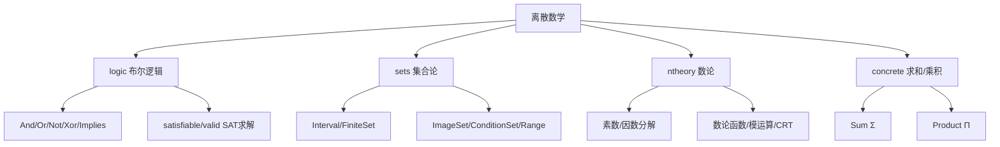

# 离散数学（逻辑/集合/数论/求和）

SymPy 的离散数学基础由四个核心模块组成：`sympy.logic`（布尔逻辑与 SAT 求解）、`sympy.sets`（集合论）、`sympy.ntheory`（数论）、`sympy.concrete`（求和/乘积符号）。这些模块为代数化简、假设推理、定理证明和组合数学提供底层支撑。[^logic-sets-source]

## 离散数学模块概览



---

## 一、布尔逻辑

### 1.1 布尔常量与运算符

布尔常量为 `S.true`/`S.false`（简写 `true`/`false`）。所有布尔运算符继承自 `BooleanFunction`（Expr 子类）：

| 运算 | 类 | 运算符 | 语义 |
|------|-----|--------|------|
| 与 | `And` | `&` | ∧，幂等/交换/结合 |
| 或 | `Or` | `\|` | ∨，幂等/交换/结合 |
| 非 | `Not` | `~` | ¬ |
| 异或 | `Xor` | `^` | ⊕ |
| 与非/或非 | `Nand`/`Nor` | — | ¬(A∧B) / ¬(A∨B) |
| 蕴含 | `Implies` | `>>` | A→B ≡ ¬A∨B |
| 等价 | `Equivalent` | — | ↔ |
| 条件 | `ITE` | — | if-then-else |

```python
>>> from sympy import And, Or, Not, Xor, Implies, Equivalent, true, false
>>> from sympy.abc import A, B
>>>
>>> A & B              # And(A, B)
A & B
>>> A | B              # Or(A, B)
A | B
>>> ~A                 # Not(A)
~A
>>> A >> B             # Implies(A, B)
Implies(A, B)
>>>
>>> And(A, A, B)       # 幂等律
A & B
>>> And(A, false)      # 吸收律
False
```

`And`/`Or` 使用 `frozenset` 存储参数，天然满足幂等律和交换律。

### 1.2 范式转换与化简

| 函数 | 说明 |
|------|------|
| `to_cnf(expr)` | 合取范式（CNF） |
| `to_dnf(expr)` | 析取范式（DNF） |
| `simplify_logic(expr)` | 布尔化简 |

```python
>>> from sympy import to_cnf, to_dnf, simplify_logic
>>> from sympy.abc import A, B, C
>>>
>>> to_cnf(A >> B)
~A | B
>>> to_dnf(A & (B | C))
(A & B) | (A & C)
>>> simplify_logic(A & (A | B))
A
```

### 1.3 SAT 求解器

`satisfiable(expr)` 实现 DPLL 算法：可满足返回赋值字典，不可满足返回 `False`。`valid(expr)` 检测永真式。

```python
>>> from sympy import satisfiable, And, Or, Not
>>> from sympy.abc import A, B
>>>
>>> satisfiable(And(A, Or(B, Not(B))))
{A: True}
>>> satisfiable(And(A, Not(A)))
False
>>>
>>> from sympy.logic.inference import valid
>>> valid(A | Not(A))
True
```

---

## 二、集合论

### 2.1 基本集合类

| 类 | 说明 | 示例 |
|----|------|------|
| `Interval(a,b)` | 实数区间 | `Interval(0,1)` |
| `FiniteSet(*elts)` | 有限集合 | `FiniteSet(1,2,3)` |
| `Union(*sets)` | 并集 | `A ∪ B` |
| `Intersection(*sets)` | 交集 | `A ∩ B` |
| `Complement(U,A)` | 补集/差集 | `U\A` |
| `SymmetricDifference(A,B)` | 对称差 | (A\B)∪(B\A) |
| `ProductSet(*sets)` | 笛卡儿积 | A×B |
| `Range(start,stop,step)` | 整数范围 | `Range(0,10)` |
| `ImageSet(lam, base)` | 映射的像 | {2x: x∈ℤ} |
| `ConditionSet(sym,cond,base)` | 条件集合 | {x∈ℝ: x>0} |
| `EmptySet`/`UniversalSet` | 空集/全集 | `S.EmptySet` |

### 2.2 集合运算

| 运算 | 运算符 | 方法 |
|------|--------|------|
| 并集 | `A \| B` | `A.union(B)` |
| 交集 | `A & B` | `A.intersect(B)` |
| 差集 | `A - B` | — |
| 对称差 | `A ^ B` | — |
| 笛卡儿积 | `A * B` | — |
| 包含 | — | `A.contains(x)` |
| 子集 | — | `A.is_subset(B)` |

```python
>>> from sympy import Interval, FiniteSet, ProductSet, oo, S
>>>
>>> A = FiniteSet(1,2,3)
>>> B = FiniteSet(2,3,4)
>>> A | B
{1, 2, 3, 4}
>>> A & B
{2, 3}
>>> A - B
{1}
>>> A.is_subset(FiniteSet(1,2,3,4))
True
>>>
>>> Interval(0, 1).contains(0.5)
True
>>>
>>> list(ProductSet(FiniteSet(1,2), FiniteSet('a','b')))
[(1, a), (1, b), (2, a), (2, b)]
```

### 2.3 标准集合单例

| 集合 | 访问 | 含义 |
|------|------|------|
| 自然数 | `S.Naturals` | {1,2,3,...} |
| 非负整数 | `S.Naturals0` | {0,1,2,...} |
| 整数 | `S.Integers` | ℤ |
| 有理数 | `S.Rationals` | ℚ |
| 实数 | `S.Reals` | ℝ |
| 复数 | `S.Complexes` | ℂ |

```python
>>> from sympy import ImageSet, ConditionSet, S, Lambda, Range
>>> from sympy.abc import x
>>>
>>> ImageSet(Lambda(x, 2*x), S.Integers)  # 偶数集
ImageSet(Lambda(x, 2*x), Integers)
>>> ConditionSet(x, x > 0, S.Reals)       # 正实数
ConditionSet(x, x > 0, Reals)
>>> list(Range(5))
[0, 1, 2, 3, 4]
```

---

## 三、数论

### 3.1 素数

| 函数 | 说明 |
|------|------|
| `isprime(n)` | 素性检测 |
| `nextprime(n)`/`prevprime(n)` | 下一/上一素数 |
| `primerange(a,b)` | [a,b) 内素数生成器 |
| `primepi(n)` | π(n)：n 以内素数个数 |
| `sieve[n]` | 第 n 个素数（全局筛法单例） |

```python
>>> from sympy import isprime, nextprime, primerange, primepi, sieve
>>>
>>> isprime(97)
True
>>> nextprime(100)
101
>>> list(primerange(10, 30))
[11, 13, 17, 19, 23, 29]
>>> primepi(100)
25
```

### 3.2 因数分解

| 函数 | 说明 |
|------|------|
| `factorint(n)` | 整数分解，返回 `{prime: exp}` |
| `primefactors(n)` | 不同素因子列表 |
| `divisors(n)` | 所有正因子列表 |
| `divisor_count(n)` | 正因子个数 |
| `perfect_power(n)` | 判断幂次，返回 (base, exp) |

```python
>>> from sympy import factorint, primefactors, divisors
>>>
>>> factorint(360)
{2: 3, 3: 2, 5: 1}
>>> primefactors(360)
[2, 3, 5]
>>> divisors(360)
[1, 2, 3, 4, 5, 6, 8, 9, 10, 12, 15, 18, 20, 24, 30, 36, 40, 45, 60, 72, 90, 120, 180, 360]
```

### 3.3 数论函数

| 函数 | 说明 |
|------|------|
| `totient(n)` | 欧拉函数 φ(n) |
| `mobius(n)` | 莫比乌斯函数 μ(n) |
| `divisor_sigma(n,k)` | 因子和 σ_k(n) |

```python
>>> from sympy import totient, mobius
>>>
>>> totient(12)         # φ(12) = |{1,5,7,11}|
4
>>> mobius(12)          # μ(12)=0（有平方因子）
0
>>> mobius(30)          # μ(2·3·5) = (-1)^3
-1
```

### 3.4 组合数与数列

```python
>>> from sympy import binomial, factorial, fibonacci, npartitions
>>>
>>> binomial(5, 2)
10
>>> factorial(5)
120
>>> fibonacci(10)
55
>>> [fibonacci(i) for i in range(10)]
[0, 1, 1, 2, 3, 5, 8, 13, 21, 34]
>>> npartitions(5)      # 5 的分拆数
7
```

### 3.5 模运算与中国剩余定理

| 函数 | 说明 |
|------|------|
| `mod_inverse(a,m)` | 模逆元 |
| `crt(moduli, remainders)` | 中国剩余定理，返回 (solution, lcm) |
| `n_order(a,m)` | a 模 m 的乘法阶 |

```python
>>> from sympy.ntheory.modular import crt
>>> from sympy import mod_inverse
>>>
>>> crt([3,5,7], [2,3,2])   # x≡2(mod3), x≡3(mod5), x≡2(mod7)
(23, 105)
>>> mod_inverse(3, 7)         # 3·5 ≡ 1(mod7)
5
```

---

## 四、求和与乘积

### 4.1 Sum 与 summation

`Sum` 表示未求值的求和符号（Σ），`summation()`（或 `Sum.doit()`）求值：

```python
>>> from sympy import Sum, summation, oo, factorial, symbols
>>> n, k = symbols('n k', integer=True)
>>>
>>> s = Sum(k, (k, 1, n))
>>> s
Sum(k, (k, 1, n))
>>> s.doit()
n**2/2 + n/2
>>>
>>> summation(k**2, (k, 1, n))
n**3/3 + n**2/2 + n/6
>>> Sum(1/factorial(k), (k, 0, oo)).doit()
E
```

### 4.2 Product 与 product

`Product` 表示未求值的乘积符号（Π），`product()` 求值：

```python
>>> from sympy import Product, product
>>>
>>> product(k, (k, 1, 5))
120
```

### 4.3 Gosper 求和

`gosper_sum` 用 Gosper 算法求不定和的闭式：

```python
>>> from sympy.concrete.gosper import gosper_sum
>>> from sympy.abc import k
>>>
>>> gosper_sum(k, (k, 0, n))
n**2/2 + n/2
```

---

## 模块协同

布尔逻辑是假设系统（ask/Q）和简化系统（simplify）的推理基础；集合论为 `solveset` 提供解的结构表示（`ConditionSet`/`ImageSet`）；数论支撑多项式因式分解和有限域运算；求和/乘积与微积分的积分/极限统一为绑定符号的操作。

## 延伸阅读

- 前置概念：[函数基础](04-function-basics.md) 了解 BooleanFunction 类层次
- 前置概念：[假设系统](05-assumptions.md) 了解 ask/Q 如何依赖布尔逻辑
- 关联概念：[简化系统](06-simplification.md) 了解 simplify 如何利用逻辑推理
- 关联概念：[方程求解](08-solvers.md) 了解 solveset 如何使用集合表示解
- 源码信源：[logic-sets-source](/references/logic-sets-source.md) 提供完整 API 参考

[^logic-sets-source]: logic/__init__.py、logic/boolalg.py、sets/__init__.py、ntheory/__init__.py、concrete/__init__.py
