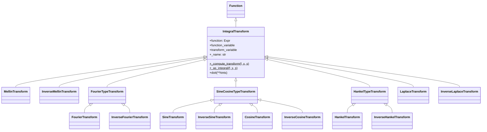

# 微积分与积分系统源码信源

SymPy 的微积分系统以 `Derivative` 表示未求值微分、`Integral` 表示未求值积分、`Limit` 表示未求值极限，通过 `doit()` 触发实际计算。`integrate()` 是顶层积分入口，内部按策略链依次尝试 manualintegrate、meijerint、heurisch、risch、ratint 等算法。积分变换模块提供 Laplace、Fourier、Mellin、Hankel、Sine、Cosine 变换。calculus 模块提供有限差分、奇点分析、欧拉-拉格朗日方程、函数性质判断（单调性、凸性、极值）等工具。[^F-054][^F-095][^F-096][^F-083]

## Derivative 微分

`Derivative` 类定义于 [core/function.py:1050](file:///d:/spaces/SpecWeave/external/libs/python/sympy/sympy/sympy/core/function.py#L1050)，继承自 `Expr`，`is_Derivative = True`，表示未求值的导数。其详细用法已在 [sympify-function-source.md](sympify-function-source.md) 中描述，本节聚焦微积分视角。[^F-054]

### 求导入口

| 入口 | 定义位置 | 说明 |
|------|----------|------|
| `diff(f, *symbols, **kwargs)` | [function.py:2495](file:///d:/spaces/SpecWeave/external/libs/python/sympy/sympy/sympy/core/function.py#L2495) | 模块级函数，统一入口 |
| `Expr.diff(*symbols, **assumptions)` | [expr.py:3627](file:///d:/spaces/SpecWeave/external/libs/python/sympy/sympy/sympy/core/expr.py#L3627) | 表达式方法 |
| `Derivative(expr, *variables, **kwargs)` | [function.py:1264](file:///d:/spaces/SpecWeave/external/libs/python/sympy/sympy/sympy/core/function.py#L1264) | 未求值导数类 |

```python
from sympy import diff, Derivative, Function, sin, cos, sqrt, symbols
from sympy.abc import x, y, z
f, g = symbols('f g', cls=Function)

# 一阶求导
diff(sin(x), x)           # cos(x)
sin(x).diff(x)            # cos(x)

# 高阶求导
diff(x**4, x, 3)          # 24*x
diff(sin(x), x, 4)        # sin(x)（四阶导回到自身）

# 混合偏导
diff(sin(x)*cos(y), x, y) # -sin(y)*cos(x)

# 未求值形式
Derivative(sin(x), x)     # Derivative(sin(x), x)
diff(sin(x), x, evaluate=False)  # Derivative(sin(x), x)

# 链式法则（未定义函数）
f(g(x)).diff(x)
# Derivative(f(g(x)), g(x))*Derivative(g(x), x)

# 高阶导数自动化简
expr = sqrt((x + 1)**2 + x)
diff(expr, (x, 5), simplify=True).count_ops()   # 30（化简后）
diff(expr, (x, 5), simplify=False).count_ops()  # 136（原始）

# 对未定义函数求导（变分法）
Derivative(f(x)**2, f(x), evaluate=True)  # 2*f(x)
```

## Integral 与 integrate() 积分

### Integral 类

`Integral` 定义于 [integrals/integrals.py:41](file:///d:/spaces/SpecWeave/external/libs/python/sympy/sympy/sympy/integrals/integrals.py#L41)，继承自 `AddWithLimits`，`__slots__ = ()`，表示未求值的积分。[^F-096]

```python
class Integral(AddWithLimits):
    """Represents unevaluated integral."""
```

积分限的解释：

| 形式 | 含义 |
|------|------|
| `Integral(f, x)` 或 `Integral(f, (x,))` | 不定积分 |
| `Integral(f, (x, a))` | 抽象原函数，结果中 `x` 替换为 `a` |
| `Integral(f, (x, a, b))` | 定积分，从 `a` 到 `b` |

```python
from sympy import Integral, integrate, sin, cos, exp, oo, symbols, Rational
from sympy.abc import x, y

# 不定积分
Integral(x**2, x)         # Integral(x**2, x)
Integral(sin(x), x).doit()  # -cos(x)

# 定积分
Integral(x**2, (x, 0, 1))       # Integral(x**2, (x, 0, 1))
Integral(x**2, (x, 0, 1)).doit() # 1/3

# 单自由变量自动推断
Integral(x**2)             # Integral(x**2, x)（自动选 x）

# 多重积分
Integral(x*y, (x, 0, 1), (y, 0, 1)).doit()  # 1/4

# as_dummy 查看绑定变量
i = Integral(x, (x, x))
i.as_dummy()               # Integral(_0, (_0, x))
```

### integrate() 函数

`integrate()` 定义于 [integrals/integrals.py:1412](file:///d:/spaces/SpecWeave/external/libs/python/sympy/sympy/sympy/integrals/integrals.py#L1412)，是顶层积分入口函数。[^F-096]

```python
def integrate(function, *symbols, meijerg=None, conds='piecewise',
              risch=None, heurisch=None, manual=None, **kwargs):
```

| 参数 | 类型 | 默认值 | 说明 |
|------|------|--------|------|
| `function` | Expr | — | 被积函数 |
| `*symbols` | 变量/元组 | — | 积分变量及上下限 |
| `meijerg` | bool/None | `None` | 是否启用 Meijer G 函数方法（`None`=自动） |
| `conds` | str | `'piecewise'` | 收敛条件处理：`'piecewise'`/`'separate'`/`'none'` |
| `risch` | bool/None | `None` | 是否仅使用 Risch 算法 |
| `heurisch` | bool/None | `None` | 是否仅使用启发式 Risch 算法 |
| `manual` | bool/None | `None` | 是否使用手动积分（类人步骤） |

```python
from sympy import integrate, sin, cos, exp, log, oo, Rational, sqrt, pi, E
from sympy.abc import x, y, a, b

# 不定积分
integrate(x**2, x)                  # x**3/3
integrate(sin(x), x)                # -cos(x)
integrate(1/x, x)                   # log(x)
integrate(exp(-x**2), x)            # sqrt(pi)*erf(x)/2（特殊函数）

# 定积分
integrate(x**2, (x, 0, 1))          # 1/3
integrate(sin(x), (x, 0, pi))       # 2
integrate(exp(-x), (x, 0, oo))      # 1（反常积分）
integrate(1/(1 + x**2), (x, -oo, oo))  # pi

# 带参数积分
integrate(a*x + b, x)               # a*x**2/2 + b*x
integrate(x**a, x)                  # Piecewise((x**(a+1)/(a+1), Ne(a, -1)), ...)

# 多重积分
integrate(x*y, (x, 0, 1), (y, 0, 1))  # 1/4

# 不可积情况：返回未求值 Integral
integrate(x**x, x)                  # Integral(x**x, x)
```

### 积分算法策略链

`integrate()` 内部 `_eval_integral` 方法按以下顺序尝试积分方法（顺序可因版本略有差异）：

| 方法 | 模块 | 适用场景 | 特点 |
|------|------|----------|------|
| `manualintegrate` | `.manualintegrate` | 初等函数 | 类人步骤，教学友好[^F-100] |
| `meijerint_indefinite` / `meijerint_definite` | `.meijerint` | 特殊函数、无穷积分 | Meijer G 函数，可处理 Bessel/Airy 等[^F-099] |
| `heurisch` | `.heurisch` | 初等超越函数 | 启发式 Risch 算法，成功率高[^F-097] |
| `risch_integrate` | `.risch` | 初等函数判定 | 可证明不可积，决策过程[^F-098] |
| `ratint` | `.rationaltools` | 有理函数 | 部分分式分解，确定性 |
| `trigintegrate` | `.trigonometry` | 三角函数幂积 | 三角恒等变换 |
| `singularityintegrate` | `.singularityfunctions` | 含奇异函数 | DiracDelta/Heaviside 处理 |

可以通过关键字参数强制使用特定算法：
```python
from sympy import integrate, exp, sin, log
from sympy.abc import x

# 强制使用 Risch 算法
integrate(exp(-x**2), x, risch=True)  # 非初等积分，返回 NonElementaryIntegral

# 强制手动积分
integrate(x*sin(x), x, manual=True)   # -x*cos(x) + sin(x)
```

## 积分算法详解

### heurisch：启发式 Risch 算法

`heurisch()` 定义于 [integrals/heurisch.py:296](file:///d:/spaces/SpecWeave/external/libs/python/sympy/sympy/sympy/integrals/heurisch.py#L296)，实现启发式 Risch-Norman 积分算法。[^F-097]

```python
def heurisch(f, x, rewrite=False, hints=None, mappings=None, retries=3,
             degree_offset=0, ...):
```

核心思想：将积分问题转化为求解未知系数的线性方程组。假设被积函数的原函数是一组基函数（由被积函数的超越部分通过导数/除法生成）的线性组合，通过待定系数法求解。`heurisch_wrapper`（[L110](file:///d:/spaces/SpecWeave/external/libs/python/sympy/sympy/sympy/integrals/heurisch.py#L110)）是外层包装，处理分段结果和特殊情况。

```python
from sympy.integrals.heurisch import heurisch
from sympy import sin, exp
from sympy.abc import x

heurisch(sin(x)*exp(x), x)  # exp(x)*sin(x)/2 - exp(x)*cos(x)/2
```

### Risch 算法

`risch_integrate()` 定义于 [integrals/risch.py:1807](file:///d:/spaces/SpecWeave/external/libs/python/sympy/sympy/sympy/integrals/risch.py#L1807)，实现 Risch 算法——初等函数积分的**判定过程**（decision procedure）。[^F-098]

```python
def risch_integrate(f, x, extension=None, handle_first='log',
                    separate_integral=False, rewrite_complex=None,
                    conds='piecewise'):
```

Risch 算法的关键特性：
- **完备性**：对于初等函数，要么找到初等原函数，要么**证明**不存在初等原函数
- **非初等证明**：当返回 `NonElementaryIntegral` 时，表示算法已证明该积分无初等闭式
- **扩展处理**：按先对数（`handle_first='log'`）后指数的顺序处理超越扩展
- **局限性**：当前实现尚未覆盖 Risch 算法的全部情况（如部分代数扩展）

```python
from sympy.integrals.risch import risch_integrate
from sympy import exp, log
from sympy.abc import x

risch_integrate(exp(x), x)        # exp(x)
risch_integrate(exp(-x**2), x)    # NonElementaryIntegral（证明无初等原函数）
risch_integrate(x*exp(x), x)      # (x - 1)*exp(x)
```

### Meijer G 函数积分

Meijer G 积分模块定义了三个核心函数（[meijerint.py](file:///d:/spaces/SpecWeave/external/libs/python/sympy/sympy/sympy/integrals/meijerint.py)）：[^F-099]

| 函数 | 定义位置 | 说明 |
|------|----------|------|
| `meijerint_indefinite(f, x)` | [L1653](file:///d:/spaces/SpecWeave/external/libs/python/sympy/sympy/sympy/integrals/meijerint.py#L1653) | 不定积分（G 函数形式） |
| `meijerint_definite(f, x, a, b)` | [L1781](file:///d:/spaces/SpecWeave/external/libs/python/sympy/sympy/sympy/integrals/meijerint.py#L1781) | 定积分（从 a 到 b） |
| `meijerint_inversion(f, x, t)` | [L2081](file:///d:/spaces/SpecWeave/external/libs/python/sympy/sympy/sympy/integrals/meijerint.py#L2081) | 逆 Laplace 变换（Mellin 反演） |

Meijer G 函数方法的核心思路：将被积函数表示为 Meijer G 函数（`meijerg`），利用 G 函数的卷积定理和积分公式计算积分。特别擅长：
- 零到无穷的定积分（Laplace/Mellin 变换类型）
- 特殊函数乘积的积分（Bessel、Airy 等）
- 含幂函数、指数函数、三角函数乘积的积分

```python
from sympy.integrals.meijerint import meijerint_definite, meijerint_indefinite
from sympy import exp, sin, sqrt, oo
from sympy.abc import x

# 0 到无穷的 Gauss 积分
meijerint_definite(exp(-x**2), x, 0, oo)  # (sqrt(pi)/2, True)

# 含特殊函数的积分
from sympy import besselj
meijerint_definite(besselj(0, x)*exp(-x), x, 0, oo)
```

### manualintegrate：手动积分

`manualintegrate` 模块（[integrals/manualintegrate.py](file:///d:/spaces/SpecWeave/external/libs/python/sympy/sympy/sympy/integrals/manualintegrate.py)）实现类人积分步骤，适用于教学场景。定义了 `IntegralInfo` NamedTuple（[L1092](file:///d:/spaces/SpecWeave/external/libs/python/sympy/sympy/sympy/integrals/manualintegrate.py#L1092)）包含 `integrand: Expr` 和 `symbol: Symbol` 字段。[^F-100]

```python
from sympy import integrate, sin
from sympy.abc import x

# manual=True 返回类人推导结果
integrate(x**2*sin(x), x, manual=True)  # -x**2*cos(x) + 2*x*sin(x) + 2*cos(x)
```

## Limit 极限

极限系统位于 `sympy.series.limits` 模块。

### limit() 函数

`limit()` 定义于 [series/limits.py:16](file:///d:/spaces/SpecWeave/external/libs/python/sympy/sympy/sympy/series/limits.py#L16)，计算函数在某点的极限。

```python
def limit(e, z, z0, dir="+"):
```

| 参数 | 类型 | 默认值 | 说明 |
|------|------|--------|------|
| `e` | Expr | — | 要求极限的表达式 |
| `z` | Symbol | — | 极限变量 |
| `z0` | Expr | — | 极限趋近值（可为 `oo`/`-oo`） |
| `dir` | str | `"+"` | 方向：`"+"`(右极限)、`"-"`(左极限)、`"+-"`(双向) |

```python
from sympy import limit, sin, cos, exp, log, oo, Symbol
from sympy.abc import x

# 经典极限
limit(sin(x)/x, x, 0)            # 1
limit((1 + 1/x)**x, x, oo)       # E
limit((cos(x) - 1)/x**2, x, 0)   # -1/2

# 单侧极限
limit(1/x, x, 0, dir="+")        # oo
limit(1/x, x, 0, dir="-")        # -oo
limit(1/x, x, 0, dir="+-")       # zoo（ComplexInfinity）

# 无穷远处极限
limit(exp(-x), x, oo)            # 0
limit(1/x, x, oo)                # 0
limit(x/log(x), x, oo)           # oo

# Expr.limit() 方法
sin(x).limit(x, 0)               # 0
```

### Limit 类

`Limit` 定义于 [series/limits.py:130](file:///d:/spaces/SpecWeave/external/libs/python/sympy/sympy/sympy/series/limits.py#L130)，继承自 `Expr`，表示未求值的极限。`limit(e, z, z0, dir)` 等价于 `Limit(e, z, z0, dir).doit(deep=False)`。

```python
from sympy import Limit, sin
from sympy.abc import x

L = Limit(sin(x)/x, x, 0)  # Limit(sin(x)/x, x, 0)
L.doit()                   # 1
```

### Gruntz 算法

SymPy 极限计算优先尝试快速启发式（简单情况如 `x`、`1/x`、`x**2`），复杂情况使用 **Gruntz 算法**（`gruntz()` 函数）。Gruntz 算法基于级数展开，是计算趋向无穷极限的可靠方法，核心思想是通过最速下降项确定渐近行为。

## 积分变换

积分变换模块 [integrals/transforms.py](file:///d:/spaces/SpecWeave/external/libs/python/sympy/sympy/sympy/integrals/transforms.py) 提供多种积分变换及其逆变换。基类 `IntegralTransform`（[L61](file:///d:/spaces/SpecWeave/external/libs/python/sympy/sympy/sympy/integrals/transforms.py#L61)）继承自 `Function`，所有具体变换类均由此派生。[^F-095][^F-100]

### 变换类层次



### 变换函数一览

| 变换对 | 正向函数 | 逆变换函数 | 定义 |
|--------|----------|------------|------|
| Laplace 变换 | `laplace_transform(f, t, s)` | `inverse_laplace_transform(F, s, t)` | F(s) = ∫₀^∞ f(t)e^{-st} dt |
| Fourier 变换 | `fourier_transform(f, x, k)` | `inverse_fourier_transform(F, k, x)` | F(k) = ∫ f(x)e^{-2πikx} dx |
| Mellin 变换 | `mellin_transform(f, x, s)` | `inverse_mellin_transform(F, s, x, strip)` | F(s) = ∫₀^∞ f(x)x^{s-1} dx |
| Hankel 变换 | `hankel_transform(f, r, k, nu)` | `inverse_hankel_transform(F, k, r, nu)` | F(k) = ∫₀^∞ r f(r) J_ν(kr) dr |
| Sine 变换 | `sine_transform(f, x, k)` | `inverse_sine_transform(F, k, x)` | F(k) = ∫₀^∞ f(x)sin(kx) dx |
| Cosine 变换 | `cosine_transform(f, x, k)` | `inverse_cosine_transform(F, k, x)` | F(k) = ∫₀^∞ f(x)cos(kx) dx |

每个变换都有对应的类（未求值形式），如 `LaplaceTransform`、`FourierTransform`、`MellinTransform` 等，通过 `.doit()` 触发计算。

```python
from sympy import (laplace_transform, inverse_laplace_transform,
                   fourier_transform, mellin_transform,
                   sine_transform, cosine_transform,
                   exp, sin, cos, DiracDelta, Heaviside, symbols)
from sympy.abc import t, s, x, k, a

# Laplace 变换
laplace_transform(exp(-a*t), t, s)           # (1/(a + s), 0, True)
laplace_transform(Heaviside(t), t, s)        # (1/s, 0, True)
laplace_transform(DiracDelta(t), t, s)       # (1, -oo, True)

# 逆 Laplace 变换
inverse_laplace_transform(1/(s + a), s, t)   # exp(-a*t)*Heaviside(t)

# Fourier 变换
fourier_transform(exp(-x**2), x, k)          # sqrt(pi)*exp(-pi**2*k**2)

# Mellin 变换
mellin_transform(exp(-x), x, s)              # (gamma(s), (0, oo), True)

# Sine/Cosine 变换（返回三元组，可用 noconds=True 简化）
sine_transform(x*exp(-a*x), x, k, noconds=True)
cosine_transform(exp(-a*x), x, k, noconds=True)
```

### 异常与辅助工具

| 符号 | 定义位置 | 说明 |
|------|----------|------|
| `IntegralTransformError` | [transforms.py:41](file:///d:/spaces/SpecWeave/external/libs/python/sympy/sympy/sympy/integrals/transforms.py#L41) | 变换计算失败时抛出，继承 `NotImplementedError` |
| `laplace_correspondence` | `__init__.py` 导出 | Laplace 变换对应表 |
| `laplace_initial_conds` | `__init__.py` 导出 | Laplace 变换初始条件 |

变换函数默认返回三元组 `(transform_result, convergence_condition, convergence_abscissa)`，传 `noconds=True` 可只返回变换结果。

## calculus 模块工具集

[calculus/__init__.py](file:///d:/spaces/SpecWeave/external/libs/python/sympy/sympy/sympy/calculus/__init__.py) 导出微积分实用工具函数。[^F-083]

### 有限差分

| 函数 | 定义位置 | 说明 |
|------|----------|------|
| `finite_diff_weights(order, x_list, x0=S.One)` | [finite_diff.py:30](file:///d:/spaces/SpecWeave/external/libs/python/sympy/sympy/sympy/calculus/finite_diff.py#L30) | 计算 0~order 阶有限差分权重 |
| `apply_finite_diff(order, x_list, y_list, x0=S.One)` | finite_diff.py | 应用有限差分求导数近似 |
| `differentiate_finite(expr, *symbols, **kwargs)` | finite_diff.py | 用有限差分近似微分 |

```python
from sympy.calculus import finite_diff_weights, apply_finite_diff
from sympy import symbols
x, h = symbols('x h')

# 有限差分权重（一阶导数，中心差分，3点模板）
w = finite_diff_weights(1, [-1, 0, 1], 0)
# w[0] 是零阶导权重，w[1] 是一阶导权重
```

### 奇点与单调性

| 函数 | 定义位置 | 说明 |
|------|----------|------|
| `singularities(expression, symbol, domain=None)` | [singularities.py:41](file:///d:/spaces/SpecWeave/external/libs/python/sympy/sympy/sympy/calculus/singularities.py#L41) | 返回奇点集合 |
| `is_increasing(f, symbol, interval=S.Reals)` | singularities.py | 单调递增判定 |
| `is_strictly_increasing(f, symbol, interval=S.Reals)` | singularities.py | 严格递增判定 |
| `is_decreasing(f, symbol, interval=S.Reals)` | singularities.py | 单调递减判定 |
| `is_strictly_decreasing(f, symbol, interval=S.Reals)` | singularities.py | 严格递减判定 |
| `is_monotonic(f, symbol, interval=S.Reals)` | singularities.py | 单调性判定 |

```python
from sympy.calculus import singularities, is_increasing, is_decreasing
from sympy import 1/(x**2 - 1), Symbol
from sympy.abc import x

singularities(1/(x**2 - 1), x)  # {-1, 1}
is_increasing(x**3, x)          # True（全局递增）
is_decreasing(-x**2, x)         # None（先增后减）
```

### 函数分析（calculus/util.py）

| 函数 | 定义位置 | 说明 |
|------|----------|------|
| `continuous_domain(f, symbol, domain)` | [util.py:31](file:///d:/spaces/SpecWeave/external/libs/python/sympy/sympy/sympy/calculus/util.py#L31) | 返回连续域 |
| `periodicity(f, symbol, check=False)` | [util.py:401](file:///d:/spaces/SpecWeave/external/libs/python/sympy/sympy/sympy/calculus/util.py#L401) | 返回周期（非周期返回 `None`） |
| `not_empty_in(finset_intersection, *syms)` | [util.py:289](file:///d:/spaces/SpecWeave/external/libs/python/sympy/sympy/sympy/calculus/util.py#L289) | 检查集合交集非空 |
| `is_convex(f, *syms, domain=S.Reals)` | [util.py:680](file:///d:/spaces/SpecWeave/external/libs/python/sympy/sympy/sympy/calculus/util.py#L680) | 凸性判定 |
| `stationary_points(f, symbol, domain=S.Reals)` | [util.py:753](file:///d:/spaces/SpecWeave/external/libs/python/sympy/sympy/sympy/calculus/util.py#L753) | 驻点（临界点） |
| `maximum(f, symbol, domain=S.Reals)` | [util.py:805](file:///d:/spaces/SpecWeave/external/libs/python/sympy/sympy/sympy/calculus/util.py#L805) | 最大值 |
| `minimum(f, symbol, domain=S.Reals)` | [util.py:852](file:///d:/spaces/SpecWeave/external/libs/python/sympy/sympy/sympy/calculus/util.py#L852) | 最小值 |

> **注意**：`continuous_domain` 未在 `calculus/__init__.py` 中导出，需通过 `sympy.calculus.util.continuous_domain` 访问。

```python
from sympy.calculus.util import (continuous_domain, periodicity,
                                  is_convex, stationary_points,
                                  maximum, minimum)
from sympy import sin, cos, exp, log, pi, Interval, S
from sympy.abc import x

# 连续域
continuous_domain(1/x, x, S.Reals)  # Union(Interval.open(-oo, 0), Interval.open(0, oo))

# 周期性
periodicity(sin(x), x)              # 2*pi
periodicity(exp(x), x)              # None（非周期）

# 驻点与极值
stationary_points(x**3 - 3*x, x, S.Reals)  # {-1, 1}
minimum(x**2, x, S.Reals)                  # 0
maximum(-x**2 + 4, x, S.Reals)             # 4

# 凸性
is_convex(x**2, x)                # True
is_convex(-x**2, x)               # False
```

### 欧拉-拉格朗日方程

`euler_equations(L, funcs=(), vars=())` 定义于 [calculus/euler.py:15](file:///d:/spaces/SpecWeave/external/libs/python/sympy/sympy/sympy/calculus/euler.py#L15)，用于变分法中求解欧拉-拉格朗日方程。[^F-086]

```python
from sympy.calculus import euler_equations
from sympy import Function, diff, sqrt, symbols
from sympy.abc import x, t

# 最短路径问题：L = sqrt(1 + (f')^2)
f = Function('f')
L = sqrt(1 + f(x).diff(x)**2)
euler_equations(L, f(x), x)
# [Eq(Derivative(f(x), (x, 2))/(Derivative(f(x), x)**2 + 1)**(3/2), 0)]
# 解为直线（二阶导为零）
```

### AccumBounds：累积极限界

`AccumulationBounds`（别名 `AccumBounds`）定义于 [calculus/accumulationbounds.py:15](file:///d:/spaces/SpecWeave/external/libs/python/sympy/sympy/sympy/calculus/accumulationbounds.py#L15)，继承自 `Expr`，表示表达式在极限过程中的累积极限界。[^F-087]

当极限不存在但表达式在区间内振荡时，返回 `AccumBounds` 而非具体值：

```python
from sympy import limit, sin, AccumBounds, oo
from sympy.abc import x

# sin(x) 在 x→∞ 时振荡于 [-1, 1]
limit(sin(x), x, oo)  # AccumBounds(-1, 1)

# AccumBounds 运算
AccumBounds(-1, 1) + AccumBounds(0, 2)  # AccumBounds(-1, 3)
```

## 模块导出汇总

### integrals 模块导出

[integrals/__init__.py](file:///d:/spaces/SpecWeave/external/libs/python/sympy/sympy/sympy/integrals/__init__.py) 导出：[^F-095]

| 类别 | 符号 |
|------|------|
| 核心积分 | `integrate`、`Integral`、`line_integrate` |
| Mellin 变换 | `mellin_transform`、`inverse_mellin_transform`、`MellinTransform`、`InverseMellinTransform` |
| Laplace 变换 | `laplace_transform`、`inverse_laplace_transform`、`LaplaceTransform`、`InverseLaplaceTransform`、`laplace_correspondence`、`laplace_initial_conds` |
| Fourier 变换 | `fourier_transform`、`inverse_fourier_transform`、`FourierTransform`、`InverseFourierTransform` |
| Sine 变换 | `sine_transform`、`inverse_sine_transform`、`SineTransform`、`InverseSineTransform` |
| Cosine 变换 | `cosine_transform`、`inverse_cosine_transform`、`CosineTransform`、`InverseCosineTransform` |
| Hankel 变换 | `hankel_transform`、`inverse_hankel_transform`、`HankelTransform`、`InverseHankelTransform` |
| 奇异积分 | `singularityintegrate` |

### calculus 模块导出

[calculus/__init__.py](file:///d:/spaces/SpecWeave/external/libs/python/sympy/sympy/sympy/calculus/__init__.py) 导出：[^F-083]

| 类别 | 符号 |
|------|------|
| 变分法 | `euler_equations` |
| 奇点/单调性 | `singularities`、`is_increasing`、`is_strictly_increasing`、`is_decreasing`、`is_strictly_decreasing`、`is_monotonic` |
| 有限差分 | `finite_diff_weights`、`apply_finite_diff`、`differentiate_finite` |
| 函数分析 | `periodicity`、`not_empty_in`、`is_convex`、`stationary_points`、`minimum`、`maximum` |
| 累积极限界 | `AccumBounds` |

## 综合示例

```python
from sympy import (diff, integrate, limit, laplace_transform,
                   sin, cos, exp, log, sqrt, pi, oo, E,
                   Function, symbols, Symbol, Rational, S,
                   Heaviside, DiracDelta, Abs)
from sympy.abc import x, y, t, s, a, b

# === 微分 ===
f = Function('f')
diff(sin(x)*exp(-x), x)
# exp(-x)*cos(x) - exp(-x)*sin(x)
diff(x**2*f(x), x)
# 2*x*f(x) + x**2*Derivative(f(x), x)

# === 积分（定积分与不定积分）===
# 不定积分
integrate(x**3 + 2*x + 1, x)        # x**4/4 + x**2 + x
integrate(sin(x)*cos(x), x)         # sin(x)**2/2
integrate(log(x), x)                # x*log(x) - x

# 定积分
integrate(sqrt(1 - x**2), (x, -1, 1))  # pi/2（半圆面积）
integrate(x*exp(-x), (x, 0, oo))    # 1
integrate(1/(x**2 + 1), (x, -oo, oo))  # pi

# 反常积分（带收敛条件）
integrate(x**a, (x, 0, 1))         # Piecewise 结果

# === 极限 ===
limit((1 - cos(x))/x**2, x, 0)     # 1/2
limit((sin(x) - x)/x**3, x, 0)     # -1/6
limit(x**a*exp(-x), x, oo)         # 0（对任意a）

# === Laplace 变换 ===
laplace_transform(t**2, t, s, noconds=True)     # 2/s**3
laplace_transform(exp(-a*t)*sin(b*t), t, s, noconds=True)
# b/((a + s)**2 + b**2)
```
