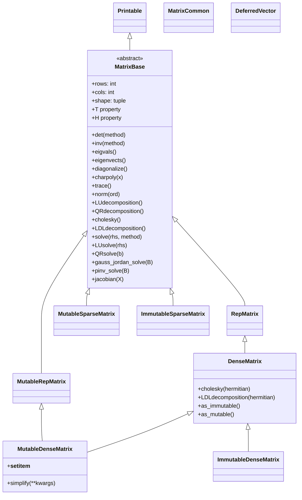
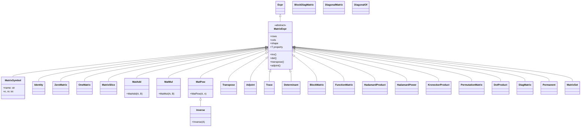

# 矩阵系统源码信源

SymPy 的矩阵系统位于 `sympy.matrices` 包，分为**显式矩阵**（dense/sparse 存储具体元素）和**符号矩阵表达式**（MatrixExpr 保持符号形式不求值）两大体系。[^matrices-init] 显式矩阵通过 `MatrixBase` 抽象基类统一 API，使用 `DomainMatrix` 作为内部表示；符号矩阵通过 `MatrixExpr` 继承体系提供代数操作。

## 模块导出总览

[matrices/__init__.py](file:///d:/spaces/SpecWeave/external/libs/python/sympy/sympy/sympy/matrices/__init__.py) 导出的公开 API 分为五类：[^matrices-init]

| 类别 | 导出符号 |
|---|---|
| 异常类 | `ShapeError`, `NonSquareMatrixError` |
| 稠密矩阵 | `MutableDenseMatrix`, `Matrix`(=mutable), `MutableMatrix`(=alias), `ImmutableDenseMatrix`, `ImmutableMatrix`(=alias) |
| 稀疏矩阵 | `MutableSparseMatrix`, `SparseMatrix`(=mutable alias), `ImmutableSparseMatrix` |
| 工厂函数 | `eye`, `zeros`, `ones`, `diag`, `randMatrix`, `GramSchmidt`, `wronskian`, `hessian`, `casoratian`, `jordan_cell`, `banded`, `symarray`, `matrix_multiply_elementwise` |
| 符号矩阵表达式 | `MatrixExpr`, `MatrixSymbol`, `Identity`, `ZeroMatrix`, `OneMatrix`, `MatAdd`, `MatMul`, `MatPow`, `BlockMatrix`, `BlockDiagMatrix`, `Transpose`, `Inverse`, `Adjoint`, `Trace`, `Determinant`, `HadamardProduct`, `HadamardPower`, `DotProduct`, `KroneckerProduct`, `PermutationMatrix`, `FunctionMatrix`, `MatrixSlice`, `DiagMatrix`, `DiagonalMatrix`, `DiagonalOf` |
| 工具函数 | `det()`, `trace()`, `per()`, `hadamard_product()`, `kronecker_product()`, `block_collapse()`, `blockcut()`, `matrix_symbols()`, `diagonalize_vector()`, `dotprodsimp()`, `matrix2numpy()`, `list2numpy()` |

[^matrices-init]

## 类继承层次



**别名链**：`Matrix = MutableMatrix = MutableDenseMatrix`（[dense.py:143-144](file:///d:/spaces/SpecWeave/external/libs/python/sympy/sympy/sympy/matrices/dense.py#L143)），`SparseMatrix = MutableSparseMatrix`（[__init__.py:26](file:///d:/spaces/SpecWeave/external/libs/python/sympy/sympy/sympy/matrices/__init__.py#L26)），`ImmutableMatrix = ImmutableDenseMatrix`（[__init__.py:25](file:///d:/spaces/SpecWeave/external/libs/python/sympy/sympy/sympy/matrices/__init__.py#L25)）。[^matrices-init][^dense-source]

## Matrix 类（MutableDenseMatrix）

`MutableDenseMatrix` 定义于 [dense.py:123](file:///d:/spaces/SpecWeave/external/libs/python/sympy/sympy/sympy/matrices/dense.py#L123)，多重继承自 `DenseMatrix` 和 `MutableRepMatrix`。`Matrix` 是其别名，是用户最常使用的矩阵类。[^dense-source]

### 构造方式

```python
>>> from sympy import Matrix, symbols
>>> # 嵌套列表构造
>>> Matrix([[1, 2], [3, 4]])
Matrix([
[1, 2],
[3, 4]])
>>> # 平面列表 + 形状
>>> Matrix(2, 3, [1, 2, 3, 4, 5, 6])
Matrix([
[1, 2, 3],
[4, 5, 6]])
>>> # 符号矩阵
>>> x, y = symbols('x y')
>>> Matrix([[x, y], [y, x]])
Matrix([
[x, y],
[y, x]])
>>> # 工厂函数
>>> from sympy import eye, zeros, ones, diag
>>> eye(3)
Matrix([
[1, 0, 0],
[0, 1, 0],
[0, 0, 1]])
>>> zeros(2, 3)
Matrix([
[0, 0, 0],
[0, 0, 0]])
>>> ones(2)
Matrix([
[1],
[1]])
>>> diag(1, 2, 3)
Matrix([
[1, 0, 0],
[0, 2, 0],
[0, 0, 3]])
```

### 可变性

`MutableDenseMatrix` 支持原地修改（`__setitem__`），`ImmutableDenseMatrix` 创建后不可修改。可通过 `as_mutable()` / `as_immutable()` 转换：[^dense-source]

```python
>>> from sympy import ImmutableMatrix
>>> X = ImmutableMatrix([[1, 2], [3, 4]])
>>> Y = X.as_mutable()
>>> Y[1, 1] = 5
>>> Y
Matrix([
[1, 2],
[3, 5]])
```

`simplify()` 方法在 `MutableDenseMatrix` 上为原地操作（返回 `None`），与不可变矩阵的化简返回新矩阵行为不同。（[dense.py:128](file:///d:/spaces/SpecWeave/external/libs/python/sympy/sympy/sympy/matrices/dense.py#L128)）[^dense-source]

## MatrixBase 公共基类

`MatrixBase` 定义于 [matrixbase.py:127](file:///d:/spaces/SpecWeave/external/libs/python/sympy/sympy/sympy/matrices/matrixbase.py#L127)，继承自 `Printable`，是所有显式矩阵类的抽象基类，定义了完整的矩阵运算 API。[^matrixbase-source]

### 基本属性

| 属性/方法 | 行号 | 说明 |
|---|---|---|
| `rows` | - | 行数 |
| `cols` | - | 列数 |
| `shape` | - | `(rows, cols)` 元组 |
| `T` | L2792 | 转置矩阵（属性） |
| `H` | L2398 | 共轭转置（Hermite 转置） |
| `is_square` | - | 是否方阵 |

[^matrixbase-source]

```python
>>> from sympy import Matrix, I
>>> M = Matrix([[1, 2+I], [3, 4]])
>>> M.T
Matrix([
[1,     3],
[2 + I, 4]])
>>> M.H
Matrix([
[    1,      3],
[2 - I,      4]])
>>> M.shape
(2, 2)
```

### 行列式与逆

| 方法 | 行号 | 签名 | 说明 |
|---|---|---|---|
| `det` | L3357 | `det(method="bareiss", iszerofunc=None)` | 行列式，默认 Bareiss 算法 |
| `inv` | L5546 | `inv(method=None, iszerofunc=None, ...)` | 矩阵求逆 |
| `charpoly` | L3348 | `charpoly(x='lambda', simplify=...)` | 特征多项式，返回 `Poly` |

[^matrixbase-source]

```python
>>> from sympy import Matrix
>>> M = Matrix([[1, 2], [3, 4]])
>>> M.det()
-2
>>> M.inv()
Matrix([
[ -2,    1],
[3/2, -1/2]])
>>> M.charpoly()  # 特征多项式 λ^2 - 5λ - 2
PurePoly(lambda**2 - 5*lambda - 2, lambda, domain='ZZ')
```

### 特征值与特征向量

| 方法 | 行号 | 说明 |
|---|---|---|
| `eigvals()` | - | 返回特征值字典 `{eigenvalue: multiplicity}` |
| `eigenvects()` | L3676 | 返回 `(eigenvalue, multiplicity, [eigenvectors])` 列表 |
| `diagonalize()` | L3688 | 返回 `(P, D)` 使得 `M = P*D*P^-1` |

[^matrixbase-source]

```python
>>> from sympy import Matrix
>>> M = Matrix([[1, 0], [0, 2]])
>>> M.eigvals()
{1: 1, 2: 1}
>>> M.eigenvects()
[(1, 1, [Matrix([[1], [0]])]), (2, 1, [Matrix([[0], [1]])])]
>>> P, D = M.diagonalize()
>>> P
Matrix([
[1, 0],
[0, 1]])
>>> D
Matrix([
[1, 0],
[0, 2]])
```

### 迹与范数

| 方法 | 行号 | 说明 |
|---|---|---|
| `trace()` | L2738 | 矩阵迹（对角线元素之和） |
| `norm(ord=2)` | L5206 | 矩阵/向量范数，支持 ord=1/2/oo/'fro' |

[^matrixbase-source]

```python
>>> from sympy import Matrix
>>> M = Matrix([[1, 2], [3, 4]])
>>> M.trace()
5
>>> M.norm()  # 默认 2-范数
sqrt(30)
>>> M.norm(1)  # 1-范数（列和最大）
6
```

## 矩阵分解

`MatrixBase` 提供多种矩阵分解方法：[^matrixbase-source]

| 分解方法 | 行号 | 返回值 | 说明 |
|---|---|---|---|
| `LUdecomposition()` | L5449 | `(L, U, perm)` | LU 分解（带行交换） |
| `QRdecomposition()` | L5470 | `(Q, R)` | QR 分解 |
| `cholesky(hermitian=True)` | L5442 | `L` | Cholesky 分解（返回下三角矩阵 L，A = L*L.H） |
| `LDLdecomposition(hermitian=True)` | L5446 | `(L, D)` | LDL 分解 |
| `Hessenberg` | - | - | Hessenberg 形式（通过 `M.hessenberg_form()` 等） |

注：SVD 分解可通过 `M.singular_values()` 方法获得。[^dense-source][^matrixbase-source]

```python
>>> from sympy import Matrix
>>> M = Matrix([[4, 3], [6, 3]])
>>> L, U, _ = M.LUdecomposition()
>>> L
Matrix([
[  1, 0],
[3/2, 1]])
>>> U
Matrix([
[4,   3],
[0, -3/2]])
>>> Q, R = M.QRdecomposition()
>>> Q
Matrix([
[ 2/13*sqrt(13), 3/13*sqrt(13)],
[ 3/13*sqrt(13), -2/13*sqrt(13)]])
```

## 线性求解器

| 方法 | 行号 | 说明 |
|---|---|---|
| `solve(rhs, method='GJ')` | L5516 | 求解 Ax=b，默认 Gauss-Jordan 消元 |
| `LUsolve(rhs, iszerofunc=...)` | L5493 | LU 分解求解 |
| `QRsolve(b)` | L5496 | QR 分解求解 |
| `Cholesky_solve` | - | Cholesky 求解（通过 cholesky 分解后上下三角求解） |
| `gauss_jordan_solve(B, freevar=False)` | L5506 | Gauss-Jordan 消元求解 |
| `pinv_solve(B, arbitrary_matrix=None)` | L5510 | 伪逆求解（Moore-Penrose） |

[^matrixbase-source]

```python
>>> from sympy import Matrix
>>> A = Matrix([[1, 2], [3, 4]])
>>> b = Matrix([5, 6])
>>> A.solve(b)
Matrix([
[-4],
[9/2]])
>>> A.LUsolve(b)
Matrix([
[-4],
[9/2]])
>>> A.gauss_jordan_solve(b)
(Matrix([
[-4],
[9/2]]), Matrix(0, 1, []))
```

### Jacobian 矩阵

`jacobian(X)` 方法（[matrixbase.py:3823](file:///d:/spaces/SpecWeave/external/libs/python/sympy/sympy/sympy/matrices/matrixbase.py#L3823)）计算向量值函数对变量列表的 Jacobian 矩阵：[^matrixbase-source]

```python
>>> from sympy import Matrix, symbols
>>> x, y = symbols('x y')
>>> F = Matrix([x**2 + y, y**2 + x])
>>> F.jacobian([x, y])
Matrix([
[2*x,   1],
[  1, 2*y]])
```

## 稀疏矩阵 SparseMatrix

`MutableSparseMatrix` 从 `matrices/sparse.py` 导入，使用 **DOK（Dictionary of Keys）格式** 存储稀疏矩阵，仅存储非零元素 `{(i, j): value}`。`SparseMatrix` 是其别名。[^matrices-init]

```python
>>> from sympy import SparseMatrix
>>> S = SparseMatrix([[1, 0, 0], [0, 2, 0], [0, 0, 3]])
>>> S
Matrix([
[1, 0, 0],
[0, 2, 0],
[0, 0, 3]])
>>> S.todok()  # 查看 DOK 格式
{(0, 0): 1, (1, 1): 2, (2, 2): 3}
```

稀疏矩阵也支持 `solve()`（默认 LDL 方法，[sparse.py:420](file:///d:/spaces/SpecWeave/external/libs/python/sympy/sympy/sympy/matrices/sparse.py#L420)）、`cholesky()`、`LDLdecomposition()` 等运算。

## 矩阵创建函数

| 函数 | 行号 | 说明 |
|---|---|---|
| `eye(rows, cols=None)` | dense.py:759 | 单位矩阵 |
| `zeros(rows, cols=None)` | dense.py:1092 | 零矩阵 |
| `ones(rows, cols=None)` | dense.py:967 | 全一矩阵 |
| `diag(*values, strict=True, unpack=False)` | dense.py:773 | 对角/分块对角矩阵 |
| `randMatrix(r, c=None, min=0, max=99, ...)` | dense.py:985 | 随机元素矩阵 |
| `GramSchmidt(vlist, orthonormal=False)` | dense.py:810 | Gram-Schmidt 正交化 |
| `wronskian(functions, var, method='bareiss')` | dense.py:1061 | Wronskian 行列式 |
| `hessian(f, varlist, constraints=())` | dense.py:851 | Hessian 矩阵 |
| `casoratian(seqs, n, zero=True)` | dense.py:716 | Casoratian（离散 Wronskian） |
| `jordan_cell(eigenval, n)` | - | Jordan 块矩阵 |

[^dense-source]

```python
>>> from sympy import symbols, hessian, wronskian, GramSchmidt, Matrix
>>> x, y = symbols('x y')
>>> f = x**2 + x*y + y**2
>>> hessian(f, [x, y])
Matrix([
[2, 1],
[1, 2]])
>>> from sympy import Function
>>> fx = Function('f')(x)
>>> gx = Function('g')(x)
>>> wronskian([fx, gx], x)
f(x)*Derivative(g(x), x) - g(x)*Derivative(f(x), x)
>>> v1 = Matrix([1, 2, 3])
>>> v2 = Matrix([2, 1, 0])
>>> GramSchmidt([v1, v2], orthonormal=True)
[Matrix([[sqrt(14)/14], [sqrt(14)/7], [3*sqrt(14)/14]]),
 Matrix([[3*sqrt(21)/21], [sqrt(21)/42], [-sqrt(21)/21]])]
```

## 符号矩阵表达式（matrices.expressions）

`matrices.expressions` 子模块提供保持符号形式的矩阵表达式体系，基类 `MatrixExpr` 继承自 `Expr`，不在构造时求值，支持符号矩阵运算。[^matrices-init]

### 继承层次



核心类定义位置：[^matrices-init]

| 类 | 文件 | 行号 | 说明 |
|---|---|---|---|
| `MatrixExpr` | expressions/matexpr.py | L40 | 符号矩阵表达式基类，继承 Expr |
| `MatrixSymbol` | expressions/matexpr.py | L669 | 具名符号矩阵，`MatrixSymbol('A', n, m)` |
| `Identity` | expressions/special.py | L110 | 单位矩阵（符号） |
| `ZeroMatrix` | expressions/special.py | L11 | 零矩阵（符号） |
| `OneMatrix` | expressions/special.py | L224 | 全一矩阵（符号） |
| `MatAdd` | expressions/matadd.py | L20 | 矩阵加法（同时继承 Add） |
| `MatMul` | expressions/matmul.py | L25 | 矩阵乘法（同时继承 Mul） |
| `MatPow` | expressions/matpow.py | L12 | 矩阵幂 |
| `Transpose` | expressions/transpose.py | L6 | 转置 |
| `Inverse` | expressions/inverse.py | L9 | 逆矩阵（继承 MatPow，即 A^-1） |
| `BlockMatrix` | expressions/blockmatrix.py | L25 | 分块矩阵 |
| `HadamardProduct` | expressions/hadamard.py | L42 | Hadamard 逐元素乘积 |

### 使用示例

```python
>>> from sympy import MatrixSymbol, Identity, ZeroMatrix, symbols
>>> n = symbols('n', integer=True)
>>> A = MatrixSymbol('A', n, n)
>>> B = MatrixSymbol('B', n, n)
>>> A + B
A + B
>>> A * B
A*B
>>> A.T
A.T
>>> A.inv()
A**(-1)
>>> I = Identity(n)
>>> A * I
A
>>> Z = ZeroMatrix(n, n)
>>> A + Z
A
>>> from sympy import BlockMatrix, Matrix
>>> BlockMatrix([[Matrix([[1]]), Matrix([[2]])],
...               [Matrix([[3]]), Matrix([[4]])]])
Matrix([
[Matrix([[1]]), Matrix([[2]])],
[Matrix([[3]]), Matrix([[4]])]])
```

### 符号矩阵函数

| 函数 | 说明 |
|---|---|
| `det(M)` | 符号行列式（返回 Determinant 对象，可通过 `doit()` 求值） |
| `trace(M)` | 符号迹 |
| `per(M)` | 符号积和式（Permanent） |
| `hadamard_product(A, B)` | Hadamard 逐元素积 |
| `kronecker_product(A, B)` | Kronecker 积 |
| `block_collapse(expr)` | 化简分块矩阵表达式 |
| `matrix_symbols(n, rows, cols)` | 批量创建 MatrixSymbol |
| `diagonalize_vector(v)` | 将向量构造为对角矩阵 |

```python
>>> from sympy import MatrixSymbol, det, trace
>>> A = MatrixSymbol('A', 2, 2)
>>> det(A)
Determinant(A)
>>> trace(A)
Trace(A)
```

## N 维数组（tensor.array）

SymPy 的 N 维数组系统位于 `sympy.tensor.array` 子模块（通过 `sympy.tensor` 导出），提供 `NDimArray` 及其子类，支持任意维度的稠密/稀疏数组。该模块不是 matrices 包的一部分，但常与矩阵协同使用。

| 类 | 说明 |
|---|---|
| `NDimArray` | N 维数组抽象基类 |
| `DenseNDimArray` | 稠密 N 维数组 |
| `SparseNDimArray` | 稀疏 N 维数组（DOK 格式） |
| `MutableDenseNDimArray` | 可变稠密 N 维数组 |
| `ImmutableDenseNDimArray` | 不可变稠密 N 维数组（`Array` 别名） |
| `MutableSparseNDimArray` | 可变稀疏 N 维数组 |
| `ImmutableSparseNDimArray` | 不可变稀疏 N 维数组 |

`Array` 是 `ImmutableDenseNDimArray` 的别名。数组运算包括 `tensorproduct()`、`tensorcontraction()`、`tensordiagonal()`、`derive_by_array()`、`permutedims()` 等。

```python
>>> from sympy import Array, tensorproduct, tensorcontraction
>>> A = Array([[1, 2], [3, 4]])
>>> A.shape
(2, 2)
>>> B = Array([x, y])
>>> from sympy.abc import x, y
>>> B = Array([x, y])
>>> tensorproduct(A, B)
[[[x, y], [2*x, 2*y]], [[3*x, 3*y], [4*x, 4*y]]]
```

## DeferredVector

`DeferredVector` 定义于 `matrices/matrixbase.py`，从 `matrices/__init__.py` 导出，用于表示一个延迟求值的向量，常见于代码生成场景中表示未知维度的向量参数。[^matrices-init]

## 异常类

| 异常 | 说明 |
|---|---|
| `ShapeError` | 矩阵维度不匹配 |
| `NonSquareMatrixError` | 对非方阵执行仅适用于方阵的操作（如 det/inv） |

## 与表达式系统的桥接

矩阵通过 `Basic._constructor_postprocessor_mapping` 机制（见 core/basic.py:2193）实现与 SymPy 表达式系统的桥接：当 SymPy 表达式中嵌套 Matrix 对象时，构造后处理器确保 Matrix 被正确包装而非被错误地 sympify 为非矩阵对象。[^matrixbase-source]

[^matrices-init]: matrices/__init__.py — 模块入口与全部公开导出
[^dense-source]: matrices/dense.py — DenseMatrix/MutableDenseMatrix/工厂函数源码
[^matrixbase-source]: matrices/matrixbase.py — MatrixBase 公共 API 基类
