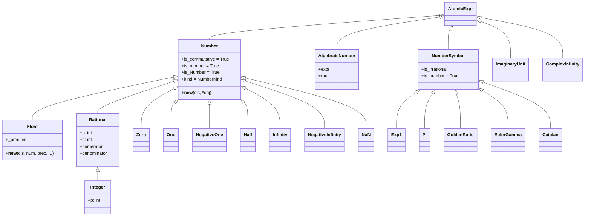

# 数字类型与符号系统源码信源

SymPy 的符号系统与数字类型构成表达式树的叶子节点层。`Symbol`/`Dummy`/`Wild` 提供符号变量能力，`Number` 层次提供精确数值表示，`S` 单例注册表统一管理常量实例，`abc` 模块提供便捷的预定义符号。[^F-073]

## Str 字符串常量

`Str` 类定义于 `core/symbol.py` 第31行，继承自 `Atom`，用于在表达式树中表示字符串常量。[^F-028] `Str` 是一个叶子节点类型，不参与数值运算。

```python
>>> from sympy.core.symbol import Str
>>> Str('hello')
hello
>>> type(Str('hello'))
<class 'sympy.core.symbol.Str'>
```

## Symbol 符号类

`Symbol` 类定义于 `core/symbol.py` 第226行，多重继承自 `AtomicExpr` 和 `Boolean`，是命名符号变量的核心类型。[^F-024]

```python
class Symbol(AtomicExpr, Boolean):
    is_Symbol = True
    is_symbol = True
    is_comparable = False
    __slots__ = ('name', '_assumptions_orig', '_assumptions0')
```

### 核心属性

| 属性 | 类型 | 说明 |
|---|---|---|
| `name` | `str` | 符号的打印名称，符号的唯一标识之一 |
| `is_Symbol` | `bool` | 类标记，恒为 `True` |
| `is_symbol` | `bool` | 实例标记，恒为 `True` |
| `is_comparable` | `bool` | 恒为 `False`（符号不参与数值比较） |

[^F-024]

### 假设参数

`Symbol.__new__` 接受关键字参数指定数学假设，这些假设决定 `is_*` 属性的值并影响化简行为：

```python
>>> from sympy import Symbol
>>> x = Symbol('x')
>>> x.is_real  # 无假设时不确定

>>> y = Symbol('y', positive=True, real=True)
>>> y.is_positive
True
>>> y.is_real
True
>>> y.is_complex
True
```

常用假设关键字：`positive`、`negative`、`nonnegative`、`nonpositive`、`real`、`integer`、`rational`、`even`、`odd`、`prime`、`finite`、`infinite`、`commutative`、`complex`、`imaginary` 等。

`Symbol._hashable_content()` 返回包含 `name` 和假设信息的元组，使得同名但假设不同的 `Symbol` 互不相等：

```python
>>> x1 = Symbol('x', real=True)
>>> x2 = Symbol('x', positive=True)
>>> x1 == x2
False
```

## Dummy 唯一匿名符号

`Dummy` 类定义于 `core/symbol.py` 第475行，继承自 `Symbol`，用于生成唯一的匿名符号（gensym）。[^F-025]

```python
class Dummy(Symbol):
    is_Dummy = True
    __slots__ = ('dummy_index',)
```

关键机制：[^F-025]

- 使用类变量 `_count` 和 `_base_dummy_index` 生成唯一递增索引
- 每个 `Dummy` 实例拥有独特的 `dummy_index` 属性
- **同名 `Dummy` 实例互不相等**（通过重写 `_hashable_content()` 在哈希内容中加入 `dummy_index`）
- 主要用于内部变量（如积分变量、替换临时变量），避免命名冲突

```python
>>> from sympy import Dummy
>>> d1 = Dummy('x')
>>> d2 = Dummy('x')
>>> d1 == d2  # 同名但不同dummy_index，不相等
False
>>> d1.dummy_index != d2.dummy_index
True
>>> d1.name
'x'
```

## Wild 模式匹配通配符

`Wild` 类定义于 `core/symbol.py` 第545行，继承自 `Symbol`，专用于表达式模式匹配。[^F-026]

```python
class Wild(Symbol):
    is_Wild = True
```

`Wild.__new__` 接受两个特殊参数：[^F-026]

| 参数 | 类型 | 说明 |
|---|---|---|
| `exclude` | 可迭代对象 | 指定不匹配的表达式集合（如排除数字、排除特定类型） |
| `properties` | 函数列表 | 每个函数接受一个表达式并返回布尔值，匹配的子表达式必须满足所有性质 |

```python
>>> from sympy import Wild, symbols, sin, cos
>>> x = symbols('x')
>>> a = Wild('a', exclude=[x])
>>> b = Wild('b')
>>> (2*x + 3).match(a*x + b)
{a_: 2, b_: 3}
>>> w = Wild('w', properties=[lambda t: t.is_integer])
>>> (5).match(w)
{w_: 5}
>>> (x).match(w)  # x 未标记 integer，不匹配
```

## symbols() 批量创建函数

`symbols(names, *, cls=Symbol, **args)` 函数定义于 `core/symbol.py` 第689行，从字符串一次性创建一个或多个符号。[^F-027]

**分隔符规则**：
- 逗号分隔：`symbols('x, y, z')`
- 空格分隔：`symbols('x y z')`
- 逗号或空格均可，混合使用也可

**关键参数**：
- `cls`：符号类，默认为 `Symbol`，可传入 `Dummy`、`Wild` 等
- `seq=True`：无论单个还是多个符号，均返回元组
- `**args`：传递给符号构造函数的假设参数

```python
>>> from sympy import symbols
>>> x, y, z = symbols('x y z')
>>> a, b, c = symbols('a, b, c')
>>> symbols('x', seq=True)
(x,)
>>> # 带下标的序列符号
>>> x0, x1, x2 = symbols('x0:3')
>>> x0, x1, x2
(x0, x1, x2)
>>> # 带假设
>>> p, q = symbols('p q', positive=True)
>>> p.is_positive
True
```

## var() 命名空间注入函数

`var(names, **args)` 函数定义于 `core/symbol.py` 第902行，功能与 `symbols()` 相同，但额外将创建的符号**注入调用者的全局命名空间**，适合交互式使用。[^F-027]

```python
>>> from sympy import var
>>> var('a b c')
(a, b, c)
>>> a + b + c  # a, b, c 已自动注入当前命名空间
a + b + c
```

## 数字类型层次

`Number` 类定义于 `core/numbers.py` 第313行，继承自 `AtomicExpr`，是所有原子数值类型的基类。[^F-029]



### Number 分派构造

`Number.__new__(cls, *obj)` 根据输入类型自动分派到具体子类：[^F-029]

| 输入类型 | 分派目标 |
|---|---|
| `Number` 实例 | 直接返回该实例 |
| Python `int`（SYMPY_INTS） | `Integer(obj)` |
| 二元组 `(numerator, denominator)` | `Rational(*obj)` |
| `float` / `mpf` / `decimal.Decimal` | `Float(obj)` |
| 字符串 `'nan'`/`'inf'`/`'+inf'`/`'-inf'` | 返回对应单例常量 |
| 其他字符串 | 尝试 `sympify(obj)` 后检查是否为 Number |

```python
>>> from sympy import Number, Integer, Rational, Float, S
>>> Number(5)
5
>>> Number((3, 4))
3/4
>>> Number(0.5)
0.500000000000000
>>> Number('inf')
oo
>>> type(Number(5))
<class 'sympy.core.numbers.Integer'>
```

### Float 浮点数

`Float` 类定义于 `core/numbers.py` 第596行，继承自 `Number`，表示任意精度浮点数，基于 mpmath 的 `mpf` 类型实现。[^F-030]

- `_prec` 属性存储二进制精度
- 构造时可指定精度：`Float(0.1, 30)` 创建30位十进制精度的浮点数
- `RealNumber` 是 `Float` 的别名（L1201：`RealNumber = Float`）[^F-036]

```python
>>> from sympy import Float
>>> Float(0.1, 30)
0.100000000000000000000000000000
>>> Float(0.1, 2)
0.10
>>> Float('1e-10', 20)
1.0000000000000000000e-10
```

### Rational 有理数

`Rational` 类定义于 `core/numbers.py` 第1204行，继承自 `Number`，表示精确有理数 p/q。[^F-030]

- `p` 属性：分子（整数）
- `q` 属性：分母（正整数）
- `numerator` 属性：分子
- `denominator` 属性：分母
- 构造时自动约分为最简分数

```python
>>> from sympy import Rational
>>> Rational(3, 6)
1/2
>>> Rational(3, 6).p
1
>>> Rational(3, 6).q
2
>>> Rational(1.5)
3/2
>>> Rational("1/3")
1/3
```

### Integer 整数

`Integer` 类定义于 `core/numbers.py` 第1792行，继承自 `Rational`，表示任意精度整数（分母恒为1）。[^F-030]

- `p` 属性：整数值
- `q` 属性：恒为1
- 基于 Python 的任意精度整数实现

```python
>>> from sympy import Integer
>>> Integer(10)
10
>>> Integer(10**100)
10000000000000000000000000000000000000000000000000000000000000000000000000000000000000000000000000000
>>> Integer(5).p
5
>>> Integer(5).q
1
```

### AlgebraicNumber 代数数

`AlgebraicNumber` 类定义于 `core/numbers.py` 第2263行，继承自 `Expr`（非 `Number`），表示代数数（即整系数多项式的根，如 √2、∛3 等）。[^F-036]

## 单例数字常量

以下常量类均使用 `metaclass=Singleton`，每个类全局仅有一个实例，通过 `S` 注册表访问：[^F-031]

| 类名 | 行号 | S 访问方式 | 值 | 快捷名 |
|---|---|---|---|---|
| `Zero` | L2803 | `S.Zero` | 0 | — |
| `One` | L2871 | `S.One` | 1 | — |
| `NegativeOne` | L2922 | `S.NegativeOne` | -1 | — |
| `Half` | L2986 | `S.Half` | 1/2 | — |
| `Infinity` | L3018 | `S.Infinity` | +∞ | `oo` |
| `NegativeInfinity` | L3203 | `S.NegativeInfinity` | -∞ | `-oo` |
| `NaN` | L3365 | `S.NaN` | 非数 | `nan` |

快捷变量定义：[^F-035]
- `oo = S.Infinity`（L3200）
- `nan = S.NaN`（L3474）

### ComplexInfinity 复无穷

`ComplexInfinity` 类定义于 `core/numbers.py` 第3481行，继承自 `AtomicExpr`（注意：**不继承 Number**），使用 `metaclass=Singleton`，表示复平面上的无方向无穷大。[^F-032] 快捷访问：`zoo = S.ComplexInfinity`（L3558）。[^F-035]

```python
>>> from sympy import oo, nan, zoo, S
>>> oo + 1
oo
>>> oo*0
nan
>>> 1/zoo
0
>>> zoo**2
zoo
```

## NumberSymbol 数学常量符号

`NumberSymbol` 类定义于 `core/numbers.py` 第3561行，继承自 `AtomicExpr`，其子类均为单例，表示具有特殊数学意义的常量符号。[^F-033]

| 类名 | 行号 | S 访问方式 | 常量 | 快捷名 |
|---|---|---|---|---|
| `Exp1` | L3618 | `S.Exp1` | 自然对数底 e | `E` |
| `Pi` | L3773 | `S.Pi` | 圆周率 π | `pi` |
| `GoldenRatio` | L3841 | `S.GoldenRatio` | 黄金分割比 φ | — |
| `TribonacciConstant` | L3904 | `S.TribonacciConstant` | Tribonacci 常数 | — |
| `EulerGamma` | L3977 | `S.EulerGamma` | 欧拉-马歇罗尼常数 γ | — |
| `Catalan` | L4036 | `S.Catalan` | Catalan 常数 G | — |

快捷变量定义：[^F-035]
- `E = S.Exp1`（L3770）
- `pi = S.Pi`（L3838）

### ImaginaryUnit 虚数单位

`ImaginaryUnit` 类定义于 `core/numbers.py` 第4099行，继承自 `AtomicExpr`，使用 `metaclass=Singleton`，表示虚数单位 i = √(-1)。[^F-034] 快捷访问：`I = S.ImaginaryUnit`（L4183）。[^F-035]

```python
>>> from sympy import I, E, pi, exp
>>> I**2
-1
>>> exp(I*pi)
-1
```

## 单例机制详解

`Singleton` 元类定义于 `core/singleton.py` 第200行，其核心逻辑在 `__init__` 方法中：[^F-065]

```python
class Singleton(type):
    def __init__(cls, *args, **kwargs):
        cls._instance = obj = Basic.__new__(cls)
        cls.__new__ = lambda cls: obj      # 拦截构造，返回唯一实例
        cls.__getnewargs__ = lambda obj: ()
        cls.__getstate__ = lambda obj: None
        S.register(cls)                    # 注册到 S 注册表
```

关键特性：
- 实例创建**延迟**到首次属性访问时（`SingletonRegistry.__getattr__`），避免导入循环
- 通过替换 `__new__` 为返回唯一实例的 lambda，确保 `cls() is cls() == True`
- 通过 `S.register(cls)` 注册类名，首次 `S.ClassName` 访问时创建实例并缓存

## 数字工具函数

`core/numbers.py` 和 `core/intfunc.py` 导出了以下整数与数值工具函数（均从顶层 `sympy` 命名空间可访问）：[^F-036]

| 函数 | 来源 | 功能 |
|---|---|---|
| `igcd(a, b)` | numbers.py | 整数最大公约数 |
| `ilcm(a, b)` | numbers.py | 整数最小公倍数 |
| `seterr(divide, invalid)` | numbers.py | 设置浮点运算错误处理 |
| `comp(a, b, tol)` | numbers.py | 比较两个数的近似相等 |
| `mod_inverse(a, m)` | numbers.py | 模逆元 |
| `integer_nthroot(y, n)` | intfunc.py | 整数 n 次根 |
| `integer_log(n, b)` | intfunc.py | 整数对数 |
| `num_digits(n, b)` | intfunc.py | 数字位数 |
| `trailing(n)` | intfunc.py | 尾部零位计数 |
| `prod(iterable)` | mul.py | 可迭代对象乘积 |

```python
>>> from sympy import igcd, ilcm, mod_inverse
>>> igcd(12, 18)
6
>>> ilcm(4, 6)
12
>>> mod_inverse(3, 7)
5
```

## abc 预定义符号模块

`abc.py` 模块通过 `symbols()` 函数预定义了常用拉丁字母和希腊字母符号，可直接导入使用，无需每次调用 `symbols()`。[^F-067]

### 拉丁字母

小写字母 `a`-`z`：

```python
from sympy.abc import a, b, c, d, e, f, g, h, i, j
from sympy.abc import k, l, m, n, o, p, q, r, s, t
from sympy.abc import u, v, w, x, y, z
```

大写字母 `A`-`Z`：

```python
from sympy.abc import A, B, C, D, E, F, G, H, I, J
from sympy.abc import K, L, M, N, O, P, Q, R, S, T
from sympy.abc import U, V, W, X, Y, Z
```

实际定义（abc.py 第67-73行）：
```python
a, b, c, d, e, f, g, h, i, j = symbols('a, b, c, d, e, f, g, h, i, j', seq=True)
k, l, m, n, o, p, q, r, s, t = symbols('k, l, m, n, o, p, q, r, s, t', seq=True)
u, v, w, x, y, z = symbols('u, v, w, x, y, z', seq=True)
A, B, C, D, E, F, G, H, I, J = symbols('A, B, C, D, E, F, G, H, I, J', seq=True)
K, L, M, N, O, P, Q, R, S, T = symbols('K, L, M, N, O, P, Q, R, S, T', seq=True)
U, V, W, X, Y, Z = symbols('U, V, W, X, Y, Z', seq=True)
```

### 希腊字母

```python
from sympy.abc import alpha, beta, gamma, delta
from sympy.abc import epsilon, zeta, eta, theta
from sympy.abc import iota, kappa, lamda, mu
from sympy.abc import nu, xi, omicron, pi
from sympy.abc import rho, sigma, tau, upsilon
from sympy.abc import phi, chi, psi, omega
```

**注意**：Lambda 的希腊字母拼写使用 `lamda`（单字 m），而非 Python 关键字 `lambda`。[^F-067]

实际定义（abc.py 第75-80行）：
```python
alpha, beta, gamma, delta = symbols('alpha, beta, gamma, delta', seq=True)
epsilon, zeta, eta, theta = symbols('epsilon, zeta, eta, theta', seq=True)
iota, kappa, lamda, mu = symbols('iota, kappa, lamda, mu', seq=True)
nu, xi, omicron, pi = symbols('nu, xi, omicron, pi', seq=True)
rho, sigma, tau, upsilon = symbols('rho, sigma, tau, upsilon', seq=True)
phi, chi, psi, omega = symbols('phi, chi, psi, omega', seq=True)
```

### 名称冲突与诊断

abc 模块定义了三个冲突诊断字典，用于 `sympify` 时区分 Symbol 和 SymPy 同名对象：[^F-068]

| 字典 | 内容 | 用途 |
|---|---|---|
| `_clash1` | 单字母冲突名（如 O, S, I, N, E, Q） | 映射到 `null`，使这些名解析为 Symbol 而非 SymPy 对象 |
| `_clash2` | 多字母冲突名（如 gamma, pi, zeta） | 同上，针对希腊字母名 |
| `_clash` | `_clash1 ∪ _clash2` | 全部冲突名 |

这些字典通过 `exec('from sympy import *', ns)` 动态检测，将与 SymPy 顶层命名空间冲突的名称映射到 `sympy.parsing.sympy_parser.null`，可在 `S("expr", locals=_clash)` 中作为 `locals` 参数传入，使得字符串解析时冲突名被解析为 Symbol 而非 SymPy 内置对象。[^F-068]

```python
>>> from sympy import S
>>> from sympy.abc import _clash1, _clash2, _clash
>>> S("Q & C", locals=_clash1)
C & Q
>>> S('pi(x)', locals=_clash2)
pi(x)
>>> S('pi(C, Q)', locals=_clash)
pi(C, Q)
```

### 使用注意事项

1. **`O`、`S`、`I`、`N`、`E`、`Q`** 是与 SymPy 顶层对象冲突的单字母名（分别对应 Order、SingletonRegistry、ImaginaryUnit、数值求值N、Exp1、假设键Q），同时从 `sympy` 和 `sympy.abc` 使用星号导入会产生冲突，后导入者覆盖前者。[^F-067]
2. `abc` 模块**不支持按需定义**符号名——`from sympy.abc import foo` 会报错，需使用 `Symbol('foo')` 或 `symbols('foo')`。[^F-067]
3. `abc` 中的符号均为默认假设（`commutative=True`），若需正数/实数等假设，需通过 `Symbol('x', positive=True)` 手动创建。

```python
>>> from sympy import symbols
>>> from sympy.abc import x
>>> # abc 中的 x 无额外假设
>>> x.is_real is None
True
>>> # 创建带假设的符号
>>> y = symbols('y', real=True)
>>> y.is_real
True
```

[^F-024]: facts.md F-024 — Symbol 类定义、继承与属性
[^F-025]: facts.md F-025 — Dummy 类与唯一索引
[^F-026]: facts.md F-026 — Wild 类与模式匹配参数
[^F-027]: facts.md F-027 — symbols() 与 var() 函数
[^F-028]: facts.md F-028 — Str 类
[^F-029]: facts.md F-029 — Number 类定义与分派构造
[^F-030]: facts.md F-030 — 数字继承层次（Float/Rational/Integer）
[^F-031]: facts.md F-031 — 单例数字常量（Zero/One/Half/Infinity/NaN 等）
[^F-032]: facts.md F-032 — ComplexInfinity 类
[^F-033]: facts.md F-033 — NumberSymbol 子类（Exp1/Pi/GoldenRatio/EulerGamma/Catalan）
[^F-034]: facts.md F-034 — ImaginaryUnit 类
[^F-035]: facts.md F-035 — 模块级快捷常量（oo/nan/E/pi/I/zoo）
[^F-036]: facts.md F-036 — AlgebraicNumber、RealNumber 别名与工具函数
[^F-065]: facts.md F-065 — SingletonRegistry 与 S 单例对象
[^F-067]: facts.md F-067 — abc 模块预定义符号
[^F-068]: facts.md F-068 — abc 冲突诊断字典
[^F-073]: facts.md F-073 — 原子类型继承链汇总
