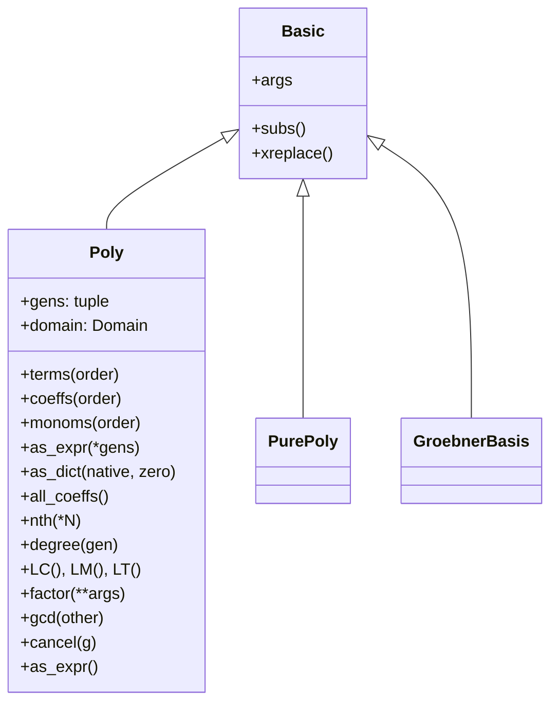

# 多项式代数系统源码信源

SymPy 的多项式系统位于 `sympy.polys` 包，是符号代数计算的核心引擎。`Poly` 类将表达式编译为带有**显式生成元**（generators）和**系数域**（domain）的规范多项式表示，在此基础上提供因式分解、GCD、Groebner 基、结式、判别式等高效算法。[^polys-init]

## 模块导出总览

[polys/__init__.py](file:///d:/spaces/SpecWeave/external/libs/python/sympy/sympy/sympy/polys/__init__.py) 导出的公开 API 分为以下类别：[^polys-init]

| 类别 | 导出符号 |
|---|---|
| 核心类 | `Poly`, `PurePoly` |
| 构造函数 | `poly_from_expr()`, `parallel_poly_from_expr()`, `poly` |
| 基本运算 | `degree`, `total_degree`, `degree_list`, `LC`, `LM`, `LT` |
| 除法 | `div`, `rem`, `quo`, `exquo`, `pdiv`, `prem`, `pquo`, `pexquo` |
| GCD 相关 | `gcd`, `lcm`, `gcdex`, `half_gcdex`, `cofactors`, `gcd_list`, `lcm_list`, `terms_gcd`, `invert`, `subresultants` |
| 因式分解 | `factor`, `factor_list`, `sqf`, `sqf_list`, `sqf_part`, `sqf_norm`, `gff`, `gff_list` |
| 结式/判别式 | `resultant`, `discriminant` |
| Groebner 基 | `groebner`, `GroebnerBasis`, `is_zero_dimensional`, `reduced` |
| 域/环 | `ZZ`, `QQ`, `GF`, `FF`, `RR`, `CC`, `EX`, `ZZ_I`, `QQ_I`, `Domain`, `PolynomialRing`, `FractionField`, `AlgebraicField`, `FiniteField`, `CyclotomicField`, `IntegerRing`, `RationalField`, `RealField`, `ComplexField`, `ExpressionDomain` |
| 有理函数 | `cancel`, `together`, `apart`, `apart_list`, `assemble_partfrac_list` |
| 根 | `roots`, `real_roots`, `nroots`, `ground_roots`, `count_roots`, `all_roots`, `RootOf`, `CRootOf`, `ComplexRootOf`, `rootof`, `RootSum` |
| 特殊多项式 | `cyclotomic_poly`, `swinnerton_dyer_poly`, `symmetric_poly`, `interpolating_poly`, `random_poly`, `chebyshevt_poly`, `chebyshevu_poly`, `legendre_poly`, `hermite_poly`, `hermite_prob_poly`, `laguerre_poly`, `jacobi_poly`, `bernoulli_poly`, `euler_poly`, `genocchi_poly` |
| 单项式序 | `lex`, `grlex`, `grevlex`, `ilex`, `igrlex`, `igrevlex` |
| 插值 | `interpolate`, `rational_interpolate`, `horner`, `symmetrize`, `viete` |
| 数域 | `minpoly`, `minimal_polynomial`, `primitive_element`, `field_isomorphism`, `to_number_field`, `galois_group` |
| 异常 | `PolynomialError`, `GeneratorsNeeded`, `GeneratorsError`, `DomainError`, `CoercionFailed`, `NotInvertible`, `HeuristicGCDFailed`, 等 |
| 构造器 | `construct_domain` |
| Ring/Field API | `ring`, `xring`, `vring`, `sring`, `field`, `xfield`, `vfield`, `sfield` |
| 稳定性 | `hurwitz_conditions`, `schur_conditions` |
| 单项式 | `itermonomials`, `Monomial` |

[^polys-init]

## Poly 类体系

### 类继承



`Poly` 定义于 [polytools.py:110](file:///d:/spaces/SpecWeave/external/libs/python/sympy/sympy/sympy/polys/polytools.py#L110)，继承自 `Basic`，`is_Poly = True`。[^polytools-source]

### 构造 Poly

```python
>>> from sympy import Poly, symbols
>>> x, y = symbols('x y')
>>> # 指定生成元
>>> p = Poly(x**2 + 2*x + 1, x)
>>> p
Poly(x**2 + 2*x + 1, x, domain='ZZ')
>>> p.gens
(x,)
>>> p.domain
ZZ
>>> # 多变量
>>> Poly(x**2 + x*y + y**2, x, y)
Poly(x**2 + x*y + y**2, x, y, domain='ZZ')
>>> # 指定域
>>> Poly(x**2 + y, x, domain='QQ[y]')
Poly(x**2 + y, x, domain='QQ[y]')
```

### poly_from_expr 构造器

`poly_from_expr()` 函数将任意 SymPy 表达式转换为 `Poly` 对象，是 `Poly()` 构造器的底层实现，支持自动推断生成元和域：[^polytools-source]

```python
>>> from sympy.polys import poly_from_expr
>>> from sympy import sin
>>> poly_from_expr(x**2 + 1, x)
(Poly(x**2 + 1, x, domain='ZZ'), {'gens': (x,)})
```

### parallel_poly_from_expr

`parallel_poly_from_expr()` 批量构造多个多项式，确保它们共享相同的生成元和域。

## Poly 方法

### 结构查询方法

| 方法 | 行号 | 返回值 | 说明 |
|---|---|---|---|
| `terms(order=None)` | L939 | 迭代器 | 按指定序返回 `(monom, coeff)` 对 |
| `coeffs(order=None)` | L897 | list | 返回系数列表 |
| `monoms(order=None)` | L919 | list | 返回单项式幂次列表 |
| `all_coeffs()` | L959 | list | 返回所有系数（含零系数） |
| `as_dict(native=False, zero=False)` | L1064 | dict | 返回 `{monom: coeff}` 字典 |
| `as_expr(*gens)` | L1090 | Expr | 转换回普通 SymPy 表达式 |
| `nth(*N)` | L2125 | Expr | 获取指定幂次项的系数 |
| `degree(gen=0)` | - | int | 多项式次数 |
| `LC()`, `LM()`, `LT()` | - | - | 首项系数/首项单项式/首项 |

[^polytools-source]

```python
>>> from sympy import Poly
>>> from sympy.abc import x
>>> p = Poly(x**3 + 2*x**2 + 3*x + 4, x)
>>> p.terms()
[((3,), 1), ((2,), 2), ((1,), 3), ((0,), 4)]
>>> p.coeffs()
[1, 2, 3, 4]
>>> p.monoms()
[(3,), (2,), (1,), (0,)]
>>> p.all_coeffs()
[1, 2, 3, 4]
>>> p.as_dict()
{(0,): 4, (1,): 3, (2,): 2, (3,): 1}
>>> p.as_expr()
x**3 + 2*x**2 + 3*x + 4
>>> p.nth(2)  # x^2 的系数
2
>>> p.degree()
3
>>> p.LC()
1
```

### GCD 与有理函数运算

| 函数/方法 | 说明 |
|---|---|
| `gcd(f, g)` | 最大公因式 |
| `lcm(f, g)` | 最小公倍式 |
| `gcdex(a, b)` | 扩展欧几里得算法 |
| `cancel(f, g)` | 约分有理函数 |
| `together(expr)` | 合并分式 |
| `apart(expr, x)` | 部分分式分解 |

```python
>>> from sympy import gcd, lcm, cancel, together, apart, Poly
>>> from sympy.abc import x
>>> f = Poly(x**2 - 1, x)
>>> g = Poly(x**2 - 2*x + 1, x)
>>> gcd(f, g)
Poly(x - 1, x, domain='ZZ')
>>> lcm(f, g)
Poly(x**3 - x**2 - x + 1, x, domain='ZZ')
>>> cancel((x**2 - 1)/(x**2 - 2*x + 1))
(x + 1)/(x - 1)
>>> together(1/x + 1/y)
(x + y)/(x*y)
>>> apart(1/(x**2 + 2*x - 3), x)
-1/(4*(x + 3)) + 1/(4*(x - 1))
```

### 因式分解

`factor()` 函数对多项式执行因式分解，支持整数域、有理数域、有限域、代数扩域上的分解：[^polys-init][^polytools-source]

```python
>>> from sympy import factor, expand
>>> from sympy.abc import x, y
>>> factor(x**2 - 1)
(x - 1)*(x + 1)
>>> factor(x**3 - x**2 + x - 1)
(x - 1)*(x**2 + 1)
>>> expand((x + y)**3)
x**3 + 3*x**2*y + 3*x*y**2 + y**3
>>> factor(x**2 + 2*x + 1)
(x + 1)**2
>>> # 有限域上的分解
>>> factor(x**2 + 1, modulus=5)
(x - 2)*(x - 3)
```

`expand()` 是 Expr 的方法（见 core/expr.py），展开多项式乘法；`factor()` 在 polys 模块中提供，进行因式分解。两者互为逆运算。

### 结式与判别式

| 函数 | 说明 |
|---|---|
| `resultant(f, g, x)` | 两个多项式关于 x 的结式 |
| `discriminant(f, x)` | 多项式的判别式 |

```python
>>> from sympy import resultant, discriminant
>>> from sympy.abc import x, a, b, c
>>> resultant(x**2 - 1, x**2 - 4, x)
9
>>> discriminant(a*x**2 + b*x + c, x)
-4*a*c + b**2
```

### 无平方分解

无平方分解（Square-Free Factorization）将多项式分解为无平方因子部分的乘积：

```python
>>> from sympy import sqf, sqf_list
>>> sqf(x*(x+1)**2*(x+2)**3, x)
x*(x + 1)**2*(x + 2)**3
>>> sqf_list(x**5 - x**4 - x + 1, x)
(1, [(x - 1, 2), (x**2 + x + 1, 1)])
```

## Groebner 基

`groebner()` 函数和 `GroebnerBasis` 类提供多项式理想的 Groebner 基计算，支持多种单项式序：[^polys-init]

| 单项式序 | 说明 |
|---|---|
| `lex` | 字典序（lexicographic） |
| `grlex` | 分次字典序（graded lex） |
| `grevlex` | 分次逆字典序（graded reverse lex） |
| `ilex` | 反字典序 |
| `igrlex` | 反分次字典序 |
| `igrevlex` | 反分次逆字典序 |

```python
>>> from sympy import groebner
>>> from sympy.abc import x, y
>>> G = groebner([x**2 + y - 1, x*y - x], x, y, order='lex')
>>> G
GroebnerBasis([x**2 + y - 1, x*y - x, y**2 - 2*y + 1], x, y, domain='ZZ', order='lex')
```

`reduced()` 函数将多项式对 Groebner 基约化；`is_zero_dimensional()` 判断理想是否零维。

## 域系统（Domains）

多项式系统在**域**（Domain）上运算，域决定了系数的类型和可用运算。

```mermaid
graph TD
    Domain[Domain<br/>抽象域]
    ZZ[ZZ<br/>整数环]
    QQ[QQ<br/>有理数域]
    GF[GF(p)<br/>有限域]
    RR[RR<br/>实数域]
    CC[CC<br/>复数域]
    EX[EX<br/>表达式域]
    ZZ_I[ZZ_I<br/>高斯整数环]
    QQ_I[QQ_I<br/>高斯有理数域]
    AF[AlgebraicField<br/>代数扩域 QQ(α)]
    PR[PolynomialRing<br/>多项式环]
    FF[FractionField<br/>有理函数域]
    CF[CyclotomicField<br/>分圆域]
    IF[IntegerRing<br/>Python/GMPY]
    RF[RationalField<br/>Python/GMPY]
    ReF[RealField]
    CoF[ComplexField]
    ED[ExpressionDomain]
    FinF[FiniteField]

    Domain --> ZZ
    Domain --> QQ
    Domain --> GF
    Domain --> RR
    Domain --> CC
    Domain --> EX
    Domain --> ZZ_I
    Domain --> QQ_I
    Domain --> AF
    Domain --> PR
    Domain --> FF
    Domain --> CF
    IF --> ZZ
    RF --> QQ
    ReF --> RR
    CoF --> CC
    FinF --> GF
    ED --> EX
```

核心域的用途与特性：[^polys-init]

| 域 | 构造 | 用途 |
|---|---|---|
| `ZZ` | `ZZ` | 整数系数多项式，默认整数环 |
| `QQ` | `QQ` | 有理数系数多项式，支持除法 |
| `GF(p)` | `GF(p)` 或 `FF(p)` | p 元有限域，p 为素数 |
| `RR` | `RR` | 实数浮点数系数 |
| `CC` | `CC` | 复数浮点数系数 |
| `EX` | `EX` | 通用 SymPy 表达式域（无算法保证） |
| `ZZ_I` | `ZZ_I` | 高斯整数环 ZZ[i] |
| `QQ_I` | `QQ_I` | 高斯有理数域 QQ(i) |
| `QQ.algebraic_field(alpha)` | `QQ.algebraic_field(sqrt(2))` | 代数扩域 QQ(α) |
| `QQ[x]` | `QQ[x]` 或 `PolynomialRing(QQ, x)` | 有理数域上的多项式环 |
| `QQ(x)` | `FractionField(QQ, x)` | 有理函数域 |

```python
>>> from sympy import Poly, sqrt
>>> from sympy.abc import x
>>> # 整数域（默认）
>>> Poly(x**2 + 2*x + 1, x).domain
ZZ
>>> # 有理数域
>>> Poly(x/2 + 1, x).domain
QQ
>>> # 有限域 GF(5)
>>> Poly(x**2 + 1, x, modulus=5).domain
GF(5)
>>> # 代数扩域 QQ(√2)
>>> p = Poly(x**2 - 2, x, domain=QQ.algebraic_field(sqrt(2)))
>>> p.factor()
(x - sqrt(2))*(x + sqrt(2))
```

### construct_domain

`construct_domain()` 函数（constructor.py）从给定的表达式集合自动推断合适的系数域，是 `Poly()` 自动选域的底层逻辑。[^constructor-source]

```python
>>> from sympy.polys.constructor import construct_domain
>>> construct_domain([1, 2, 3])
(ZZ, {1: 1, 2: 2, 3: 3})
>>> construct_domain([1, 2, 3.0])
(RR, {1: 1.0, 2: 2.0, 3: 3.0})
```

## 多项式环与有理函数域

polys 模块通过 `ring()`、`xring()`、`vring()`、`sring()` 和 `field()`、`xfield()`、`vfield()`、`sfield()` 函数提供声明式 API，直接在多项式环/有理函数域上运算，绕过 SymPy 表达式层获得更高性能：[^polys-init]

```python
>>> from sympy.polys import ring, field, ZZ, QQ
>>> R, x, y = ring("x,y", ZZ)
>>> (x + y)**2
x**2 + 2*x*y + y**2
>>> type((x + y)**2)
<class 'sympy.polys.rings.PolyElement'>
>>> F, a, b = field("a,b", QQ)
>>> (a + b)**3
a**3 + 3*a**2*b + 3*a*b**2 + b**3
```

## RootOf 与多项式根

### RootOf 类

`RootOf`（别名 `CRootOf`、`ComplexRootOf`）表示不可约多项式的根，通过索引号精确引用：[^polys-init]

```python
>>> from sympy import RootOf
>>> from sympy.abc import x
>>> r = RootOf(x**5 - x + 1, 0)
>>> r
       5
RootOf (x  - x + 1, 0)
>>> r.evalf(10)
-1.167303978
```

### roots 函数

`roots()` 计算多项式的精确根，返回 `{root: multiplicity}` 字典：

```python
>>> from sympy import roots
>>> from sympy.abc import x
>>> roots(x**2 - 1, x)
{-1: 1, 1: 1}
>>> roots(x**3 - x, x)
{0: 1, -1: 1, 1: 1}
```

| 根函数 | 说明 |
|---|---|
| `roots(f, x)` | 精确根（解析公式） |
| `real_roots(f, x)` | 实根（数值隔离） |
| `nroots(f, x, n=15)` | 数值根（所有复根的数值近似） |
| `ground_roots(f, x)` | 系数域中的根 |
| `count_roots(f, x)` | 实根个数（Sturm 定理） |
| `RootSum` | 所有根的符号和 |

## 特殊多项式与正交多项式

polys 模块内置大量经典多项式生成函数：[^polys-init]

| 类别 | 函数 | 说明 |
|---|---|---|
| 数论多项式 | `cyclotomic_poly(n, x)` | 分圆多项式 Φ_n(x) |
| 数论多项式 | `swinnerton_dyer_poly(n, x)` | Swinnerton-Dyer 多项式 |
| 对称多项式 | `symmetric_poly(elem, n, x)` | 初等/幂和对称多项式 |
| 插值 | `interpolating_poly(n, x, X, Y)` | Lagrange 插值多项式 |
| 正交多项式 | `chebyshevt_poly(n, x)` | 第一类 Chebyshev 多项式 T_n(x) |
| 正交多项式 | `chebyshevu_poly(n, x)` | 第二类 Chebyshev 多项式 U_n(x) |
| 正交多项式 | `legendre_poly(n, x)` | Legendre 多项式 P_n(x) |
| 正交多项式 | `hermite_poly(n, x)` | Hermite 多项式 H_n(x)（物理学家版） |
| 正交多项式 | `hermite_prob_poly(n, x)` | Hermite 多项式 He_n(x)（概率学家版） |
| 正交多项式 | `laguerre_poly(n, x)` | Laguerre 多项式 L_n(x) |
| 正交多项式 | `jacobi_poly(n, a, b, x)` | Jacobi 多项式 P_n^(a,b)(x) |
| Appell 序列 | `bernoulli_poly(n, x)` | Bernoulli 多项式 |
| Appell 序列 | `euler_poly(n, x)` | Euler 多项式 |
| Appell 序列 | `genocchi_poly(n, x)` | Genocchi 多项式 |

```python
>>> from sympy.polys import legendre_poly, chebyshevt_poly, cyclotomic_poly
>>> from sympy.abc import x
>>> legendre_poly(3, x)
5*x**3/2 - 3*x/2
>>> chebyshevt_poly(4, x)
8*x**4 - 8*x**2 + 1
>>> cyclotomic_poly(6, x)
x**2 - x + 1
```

注意：`functions.special` 中也导出了同名的**函数形式**（`legendre`, `chebyshevt`, `hermite` 等），它们返回的是 SymPy 函数对象（Expr 子类），而非 Poly 对象。

## 插值与多项式工具

| 函数 | 说明 |
|---|---|
| `interpolate(data, x)` | Lagrange 插值 |
| `rational_interpolate(p, q, X, Y)` | 有理插值 |
| `horner(f)` | Horner 形式（高效求值） |
| `symmetrize(f)` | 对称化表示 |
| `viete(f, roots)` | Vieta 公式（根与系数关系） |
| `compose(f, g)` | 多项式复合 f(g(x)) |
| `decompose(f)` | 多项式分解 |
| `sturm(f)` | Sturm 序列 |
| `monic(f)` | 首一化（首项系数为1） |
| `content(f)` | 系数内容（所有系数的 GCD） |
| `primitive(f)` | 本原部分（f = content * primitive） |
| `trunc(f, p)` | 模 p 截断 |

```python
>>> from sympy import interpolate, horner
>>> from sympy.abc import x
>>> interpolate([(0, 1), (1, 2), (2, 4)], x)
x**2/2 + x/2 + 1
>>> horner(x**3 + 3*x**2 + 3*x + 1)
x*(x*(x + 3) + 3) + 1
```

## 数域（Number Fields）

polys 模块提供数论代数的高级功能：[^polys-init]

| 函数 | 说明 |
|---|---|
| `minpoly(ex, x, **args)` | 计算代数数的极小多项式 |
| `minimal_polynomial(ex, x)` | 极小多项式（别名） |
| `primitive_element(ext)` | 本原元 |
| `to_number_field(ex, theta)` | 嵌入到数域 |
| `field_isomorphism(a, b)` | 域同构 |
| `galois_group(f, x)` | Galois 群计算 |
| `isolate(p, n)` | 实根区间隔离 |
| `prime_decomp(p, alpha)` | 素理想分解 |

```python
>>> from sympy import minpoly, sqrt
>>> from sympy.abc import x
>>> minpoly(sqrt(2) + sqrt(3), x)
x**4 - 10*x**2 + 1
```

## 异常类

polys 模块定义了完整的异常层次：[^polys-init]

| 异常 | 基类 | 说明 |
|---|---|---|
| `PolynomialError` | `GeneratorsError` | 多项式通用错误 |
| `GeneratorsNeeded` | `GeneratorsError` | 需要指定生成元（如将纯数字转为 Poly 时） |
| `GeneratorsError` | `PolynomialError` | 生成元相关错误 |
| `DomainError` | `PolynomialError` | 域相关错误 |
| `CoercionFailed` | `DomainError` | 域强制转换失败 |
| `NotInvertible` | `DomainError` | 元素不可逆 |
| `HeuristicGCDFailed` | `PolynomialError` | 启发式 GCD 失败 |
| `ExactQuotientFailed` | `PolynomialError` | 精确除法失败 |
| `PolynomialDivisionFailed` | `PolynomialError` | 多项式除法失败 |
| `NotAlgebraic` | `PolynomialError` | 非代数数 |
| `OptionError` / `FlagError` | - | 选项/标志错误 |
| `ComputationFailed` | `PolynomialError` | 计算失败 |
| `PolificationFailed` | `PolynomialError` | 多项式化失败 |
| `UnificationFailed` | `PolynomialError` | 域统一失败 |
| `EvaluationFailed` | `PolynomialError` | 求值失败 |
| `RefinementFailed` | `PolynomialError` | 根区间细化失败 |
| `MultivariatePolynomialError` / `UnivariatePolynomialError` | `PolynomialError` | 多/单变量多项式错误 |

```python
>>> from sympy import Poly
>>> from sympy.polys.polyerrors import GeneratorsNeeded
>>> try:
...     Poly(1)
... except GeneratorsNeeded:
...     print("需要指定生成元")
需要指定生成元
```

## 单项式枚举

`itermonomials(variables, max_degrees, min_degrees=None)` 枚举给定变量和次数范围内的所有单项式；`Monomial` 类提供单项式排序和操作工具。[^polys-init]

```python
>>> from sympy.polys.monomials import itermonomials
>>> from sympy.abc import x, y
>>> sorted(itermonomials([x, y], 2), key=str)
[1, x, x**2, y, x*y, y**2]
```

[^polys-init]: polys/__init__.py — 模块入口与全部公开导出
[^polytools-source]: polys/polytools.py — Poly 类定义与多项式运算函数
[^constructor-source]: polys/constructor.py — 域自动推断与 Poly 构造逻辑
