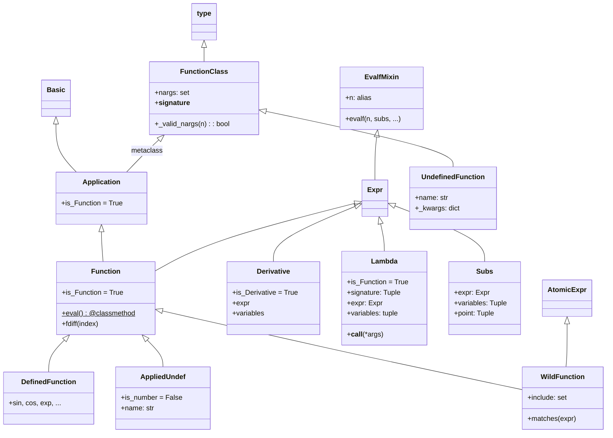
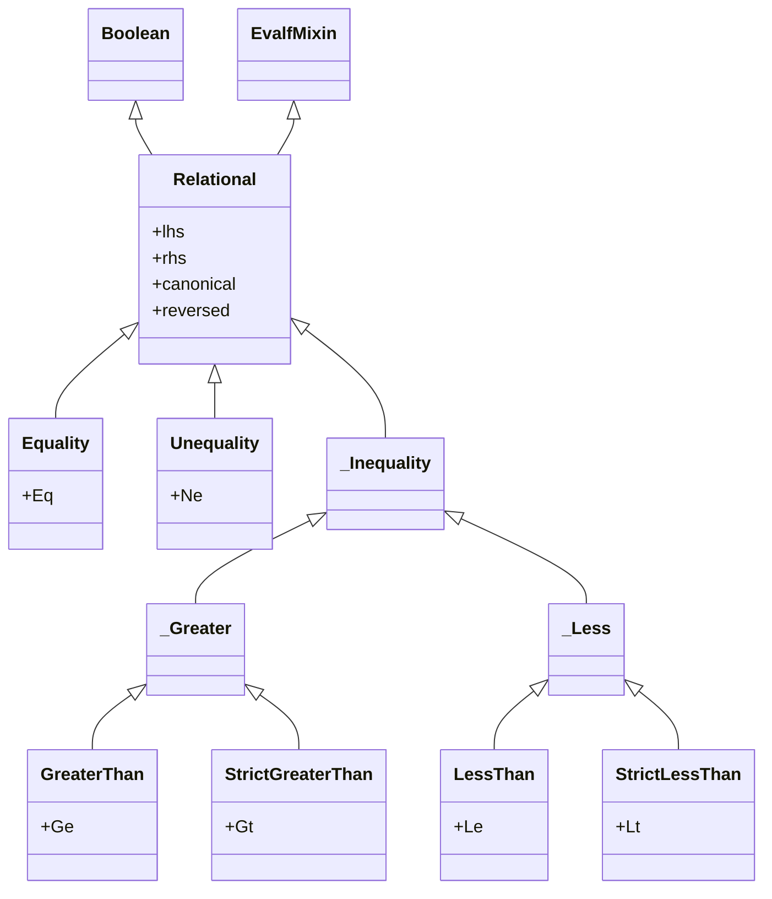

# sympify转换与Function函数体系源码信源

SymPy 中所有对象通过 `sympify()` 进入符号体系，函数类以元类 `FunctionClass` 驱动构造，数值求值由 `EvalfMixin` 提供 `evalf()`/`n()`/`N()` 统一接口，关系运算通过 `Relational` 类层次实现 `==`、`!=`、`<`、`>`、`<=`、`>=` 六类比较。[^F-045][^F-048][^F-058][^F-061]

## sympify() 类型转换函数

`sympify()` 定义于 [core/sympify.py:124](file:///d:/spaces/SpecWeave/external/libs/python/sympy/sympy/sympy/core/sympify.py#L124)，是 SymPy 的类型入口，将任意 Python 对象转换为 SymPy 内部类型。[^F-045]

### 函数签名

```python
def sympify(a, locals=None, convert_xor=True, strict=False, rational=False,
            evaluate=None):
```

| 参数 | 类型 | 默认值 | 说明 |
|------|------|--------|------|
| `a` | Any | — | 待转换的 Python 对象 |
| `locals` | dict | `None` | 字符串解析时的局部命名空间 |
| `convert_xor` | bool | `True` | 是否将 `^` 转换为 `Xor`（幂运算用 `**`） |
| `strict` | bool | `False` | 严格模式：仅接受已 sympify 的类型，否则抛 `SympifyError` |
| `rational` | bool | `False` | 是否将浮点数转换为 `Rational`（分数精确表示） |
| `evaluate` | bool | `None` | 是否自动求值（`None` 沿用全局 `global_parameters.evaluate`） |

### 转换规则

| Python 类型 | SymPy 类型 | 说明 |
|-------------|-----------|------|
| `int` | `Integer` | Python 整数 → SymPy 任意精度整数 |
| `float` | `Float` | Python 浮点数 → SymPy 浮点数（`rational=True` 时转为 `Rational`） |
| `str` | 经解析转换 | 通过 `parse_expr` 机制解析字符串表达式 |
| `Basic` 子类 | 原样返回 | 已是 SymPy 对象则直接返回 |
| 自定义类型 | 查 `converter` 字典 | 通过注册的转换函数转换 |

**converter 字典**定义于 [core/sympify.py:41](file:///d:/spaces/SpecWeave/external/libs/python/sympy/sympy/sympy/core/sympify.py#L41)，类型为 `dict[type[Any], Callable[[Any], Basic]]`，用户可注册自定义类型转换。`_sympy_converter` 是内部转换器，`_external_converter` 是 `converter` 的别名。[^F-046]

```python
from sympy import sympify, Integer, Rational, Float
from sympy.core.sympify import converter

# 基本类型转换
sympify(1)           # Integer(1)
sympify(3.14)        # Float(3.14)
sympify("x**2 + 1")  # x**2 + 1（字符串解析）

# rational=True：浮点数转为精确分数
sympify(0.1, rational=True)   # 1/10
sympify(0.5, rational=True)   # 1/2

# strict=True：严格模式，不自动转换非SymPy类型
sympify(Integer(1), strict=True)  # 1
try:
    sympify(1, strict=True)       # 抛出 SympifyError
except SympifyError:
    pass

# 注册自定义转换器
class MyType:
    def __init__(self, val):
        self.val = val
converter[MyType] = lambda obj: Integer(obj.val)
sympify(MyType(42))  # Integer(42)
```

### 异常类

| 异常类 | 基类 | 定义位置 | 说明 |
|--------|------|----------|------|
| `SympifyError` | `ValueError` | [sympify.py:27](file:///d:/spaces/SpecWeave/external/libs/python/sympy/sympy/sympy/core/sympify.py#L27) | 转换失败时抛出 |
| `CantSympify` | — | [sympify.py:49](file:///d:/spaces/SpecWeave/external/libs/python/sympy/sympy/sympy/core/sympify.py#L49) | 混入类，禁止其实例被 sympify |

`_sympify(a)` 函数（[sympify.py:514](file:///d:/spaces/SpecWeave/external/libs/python/sympy/sympy/sympy/core/sympify.py#L514)）是严格版本的内部 sympify，失败时抛出 `TypeError`。[^F-047]

## parse_expr() 字符串解析

`parse_expr()` 定义于 [parsing/sympy_parser.py:913](file:///d:/spaces/SpecWeave/external/libs/python/sympy/sympy/sympy/parsing/sympy_parser.py#L913)，将字符串解析为 SymPy 表达式，支持隐式乘法、阶乘等扩展语法。

```python
def parse_expr(s: str, local_dict=None,
               transformations=standard_transformations,
               global_dict=None, evaluate=True):
```

| 参数 | 说明 |
|------|------|
| `s` | 待解析的字符串 |
| `local_dict` | 局部命名空间字典 |
| `global_dict` | 全局命名空间字典（默认 `from sympy import *`） |
| `transformations` | 词法转换函数元组，`"all"` 启用全部转换 |
| `evaluate` | 是否自动求值（`False` 保留原始参数顺序） |

```python
from sympy.parsing.sympy_parser import (
    parse_expr, standard_transformations,
    implicit_multiplication_application
)

# 基础解析
parse_expr("1/2")                    # 1/2 (Rational)
parse_expr("x**2 + 2*x + 1")        # x**2 + 2*x + 1

# 隐式乘法
t = standard_transformations + (implicit_multiplication_application,)
parse_expr("2x + 3y", transformations=t)  # 2*x + 3*y

# evaluate=False：保留原始结构
parse_expr("2**3", evaluate=False)   # 2**3（不求值为8）
parse_expr("1 + x", evaluate=False).args  # (1, x)

# 使用 local_dict
from sympy import Function
f = Function('f')
parse_expr("f(x)", local_dict={"f": f, "x": Symbol('x')})  # f(x)
```

## 函数类继承体系

SymPy 中存在三类函数：已定义函数（如 `sin`、`exp`）、未定义函数（`Function('f')` 创建）、匿名函数（`Lambda`）。[^F-048][^F-049][^F-050]



函数类继承链：`type → FunctionClass(metaclass)`，`Basic → Application(metaclass=FunctionClass) → Function → DefinedFunction/AppliedUndef`；`Derivative`/`Lambda`/`Subs` 直接继承 `Expr`。[^F-074]

### FunctionClass 元类

`FunctionClass` 定义于 [core/function.py:156](file:///d:/spaces/SpecWeave/external/libs/python/sympy/sympy/sympy/core/function.py#L156)，继承自 `type`，是所有函数类的元类。[^F-048]

核心职责：
- **nargs 规范化**：`__init__` 中处理 `nargs` 参数，支持整数、元组、`None`（任意参数数），最终存为 `_nargs` 元组
- **nargs 属性**（[L228](file:///d:/spaces/SpecWeave/external/libs/python/sympy/sympy/sympy/core/function.py#L228)）：返回 `FiniteSet` 或 `S.Naturals0`（任意数量）
- **eval 校验**：子类若定义 `eval` 必须标记为 `@classmethod`，否则抛出 `TypeError`
- **__repr__**：返回类名

### Application 类

`Application` 定义于 [core/function.py:282](file:///d:/spaces/SpecWeave/external/libs/python/sympy/sympy/sympy/core/function.py#L282)，继承自 `Basic`，使用 `metaclass=FunctionClass`，是已应用函数（即带参数的函数调用如 `f(x)`）的基类，设置 `is_Function = True`。[^F-049]

### Function 类

`Function` 定义于 [core/function.py:383](file:///d:/spaces/SpecWeave/external/libs/python/sympy/sympy/sympy/core/function.py#L383)，继承自 `Application` 和 `Expr`，`is_Function = True`。它有双重身份：[^F-050]

1. **基类**：所有数学函数（`sin`、`cos`、`exp` 等）的基类
2. **构造器**：`Function('f')` 创建未定义函数类

```python
from sympy import Function, Symbol, sin, cos
from sympy.abc import x, y

# 双重身份：基类和构造器
f = Function('f')       # → UndefinedFunction 实例（类对象）
f(x)                    # → AppliedUndef 实例 f(x)

# 子类化定义函数
class MyFunc(Function):
    @classmethod
    def eval(cls, x):
        if x.is_zero:
            return S.One

# nargs 约束
g = Function('g', nargs=2)
g.nargs          # {2}
g(x, y)          # g(x, y)
try:
    g(x)        # TypeError: takes exactly 2 arguments (1 given)
except TypeError:
    pass

# 带假设的函数
f_real = Function('f', real=True)
f_real(x).is_real  # True
```

**__new__ 中的 eval 模式**：`Function.__new__`（[L446](file:///d:/spaces/SpecWeave/external/libs/python/sympy/sympy/sympy/core/function.py#L446)）处理逻辑：
- 若 `cls is Function`，委托给 `UndefinedFunction(*args, **options)` 创建未定义函数类
- 否则调用 `cls._new_(*args, **options)` 进行常规构造
- `_new_` 方法验证 `nargs`，若参数全为浮点数则自动 `evalf()`

### DefinedFunction 类

`DefinedFunction` 定义于 [core/function.py:823](file:///d:/spaces/SpecWeave/external/libs/python/sympy/sympy/sympy/core/function.py#L823)，继承自 `Function`，是 `sin`、`cos`、`exp` 等已定义函数的基类，重写 `__new__` 直接调用 `_new_`，不经过 `UndefinedFunction` 分支。

### AppliedUndef 类

`AppliedUndef` 定义于 [core/function.py:831](file:///d:/spaces/SpecWeave/external/libs/python/sympy/sympy/sympy/core/function.py#L831)，继承自 `Function`，表示未定义函数的应用实例（如 `f(x)`）。[^F-051]

核心属性：
- `is_number = False`：未定义函数应用不是数值
- `name: str`：函数名属性
- `_diff_wrt = True`：允许对未定义函数求导（变分法场景）
- 参数必须是表达式，不能是 `UndefinedFunction` 类本身

```python
from sympy import Function
from sympy.abc import x
f = Function('f')
expr = f(x)           # f(x) — AppliedUndef 实例
type(expr)            # <class 'sympy.core.function.AppliedUndef'>
expr.func             # f (UndefinedFunction 类)
expr.args             # (x,)
expr.name             # 'f'
expr.is_number        # False
```

### UndefinedFunction 类

`UndefinedFunction` 定义于 [core/function.py:887](file:///d:/spaces/SpecWeave/external/libs/python/sympy/sympy/sympy/core/function.py#L887)，继承自 `FunctionClass`（注意：是元类！），是 `Function('f')` 返回值的实际类型。[^F-052]

核心机制：
- `__new__(mcl, name, bases=(AppliedUndef,), __dict__=None, **kwargs)`：动态创建以 `AppliedUndef` 为基类的新类
- 支持假设参数：`Function('f', real=True)` 将 `is_real=True` 注入类字典
- 支持传入 `Symbol`：`Function(Symbol('f', real=True))` 继承 Symbol 的假设
- 通过 `copyreg.pickle` 注册序列化支持
- `__eq__` 和 `__hash__` 基于名称和假设比较

### WildFunction 类

`WildFunction` 定义于 [core/function.py:971](file:///d:/spaces/SpecWeave/external/libs/python/sympy/sympy/sympy/core/function.py#L971)，继承自 `Function` 和 `AtomicExpr`，用于模式匹配中的函数通配符。[^F-053]

```python
from sympy import WildFunction, Function, cos, symbols
from sympy.abc import x, y
F = WildFunction('F')
f = Function('f')

F.nargs              # Naturals0（匹配任意参数数）
cos(x).match(F)      # {F_: cos(x)}
f(x).match(F)        # {F_: f(x)}
f(x, y).match(F)     # {F_: f(x, y)}

# 限制参数数量
F2 = WildFunction('F', nargs=2)
F2.nargs             # {2}
f(x).match(F2)       # None（参数数不匹配）
f(x, y).match(F2)    # {F_: f(x, y)}
```

## Derivative 类

`Derivative` 定义于 [core/function.py:1050](file:///d:/spaces/SpecWeave/external/libs/python/sympy/sympy/sympy/core/function.py#L1050)，继承自 `Expr`，`is_Derivative = True`，表示未求值的导数。[^F-054]

```python
from sympy import Derivative, Function, diff, symbols, sin
from sympy.abc import x, y
f, g = symbols('f g', cls=Function)

# 构造未求值导数
Derivative(x**2, x)                # Derivative(x**2, x)
Derivative(x**2, x, evaluate=True) # 2*x（立即求值）

# 高阶导数
Derivative(f(x), x, x, y)          # Derivative(f(x), (x, 2), y)
Derivative(f(x), (x, 3))           # Derivative(f(x), (x, 3))

# 链式法则：f(g(x)).diff(x) 保留链式结构
f(g(x)).diff(x)
# Derivative(f(g(x)), g(x))*Derivative(g(x), x)

# 对未定义函数求导
Derivative(f(x)**2, f(x), evaluate=True)  # 2*f(x)
```

### diff() 函数

`diff()` 定义于 [core/function.py:2495](file:///d:/spaces/SpecWeave/external/libs/python/sympy/sympy/sympy/core/function.py#L2495)，是统一的求导入口：若对象有 `.diff()` 方法则调用它，否则委托给 `_derivative_dispatch` 创建 `Derivative` 对象（或 `ArrayDerivative` 用于数组/矩阵）。[^F-057]

```python
from sympy import diff, sin, cos, Function
from sympy.abc import x, y

diff(sin(x), x)           # cos(x)
diff(sin(x), x, 2)        # -sin(x)（二阶导）
diff(sin(x)*cos(y), x, 2, y, 2)  # sin(x)*cos(y)（混合偏导）
diff(sin(x), x, evaluate=False)  # Derivative(sin(x), x)（不求值）
```

## Lambda 匿名函数

`Lambda` 定义于 [core/function.py:1953](file:///d:/spaces/SpecWeave/external/libs/python/sympy/sympy/sympy/core/function.py#L1953)，继承自 `Expr`，`is_Function = True`，表示匿名函数。[^F-055]

```python
class Lambda(Expr):
    def __new__(cls, signature, expr):
        ...
```

| 属性/方法 | 说明 |
|-----------|------|
| `signature` | 变量签名（`Tuple` 类型），单个符号或符号元组 |
| `expr` | 函数体表达式 |
| `variables` | 签名中所有符号的展平元组 |
| `nargs` | 返回 `FiniteSet` 包含参数个数 |
| `bound_symbols` | `variables` 的别名 |
| `free_symbols` | `expr.free_symbols - set(self.variables)` |
| `__call__(*args)` | 调用函数，执行变量替换 |
| `curry()` | 柯里化，多变量 Lambda 转为嵌套单变量 Lambda |
| `is_identity` | 是否恒等函数 |

```python
from sympy import Lambda
from sympy.abc import x, y, z, t

# 单变量
f = Lambda(x, x**2)
f(4)           # 16
f.expr         # x**2
f.signature    # (x,)
f.variables    # (x,)

# 多变量
f2 = Lambda((x, y, z, t), x + y**z + t**z)
f2(1, 2, 3, 4) # 73

# 嵌套元组签名（模式匹配）
f3 = Lambda(((x, y), z), x + y + z)
f3((1, 2), 3)  # 6

# 快捷方式
p = x, y, z
f4 = Lambda(p, x + y*z)
f4(*p)         # x + y*z

# 柯里化
Lambda((x, y), x + y).curry()
# Lambda(x, Lambda(y, x + y))
```

异常类：`BadSignatureError`（签名无效）和 `BadArgumentsError`（参数数不匹配）分别定义于 [function.py:114](file:///d:/spaces/SpecWeave/external/libs/python/sympy/sympy/sympy/core/function.py#L114) 和 [L119](file:///d:/spaces/SpecWeave/external/libs/python/sympy/sympy/sympy/core/function.py#L119)。

## Subs 类

`Subs` 定义于 [core/function.py:2150](file:///d:/spaces/SpecWeave/external/libs/python/sympy/sympy/sympy/core/function.py#L2150)，继承自 `Expr`，表示表达式中未求值的替换。[^F-056]

构造签名：`Subs(expr, variables, point)`，其中 `variables` 是变量或变量元组，`point` 是对应求值点。

```python
from sympy import Subs, Function, sin, cos
from sympy.abc import x, y, z
f = Function('f')

# 导数在某点求值：自动生成 Subs
f(x).diff(x).subs(x, 0)
# Subs(Derivative(f(x), x), x, 0)

# 多变量替换
Subs(f(x)*sin(y) + z, (x, y), (0, 1))
# Subs(z + f(x)*sin(y), (x, y), (0, 1))
_.doit()
# z + f(0)*sin(1)

# 知道具体函数后求值
_.subs(f, sin).doit() == cos(0)  # True
```

`Subs` 常用于表示在非符号点求值的导数，例如 `f(2*x+3).diff(x)` 内部使用 `Subs` 表示链式法则结果。

## evalf 数值计算体系

### EvalfMixin 类

`EvalfMixin` 定义于 [core/evalf.py:1564](file:///d:/spaces/SpecWeave/external/libs/python/sympy/sympy/sympy/core/evalf.py#L1564)，是混入类，为 `Expr` 和 `Relational` 提供数值求值能力。[^F-058]

```python
class EvalfMixin:
    def evalf(self, n=15, subs=None, maxn=100, chop=False,
             strict=False, quad=None, verbose=False):
```

| 参数 | 类型 | 默认值 | 说明 |
|------|------|--------|------|
| `n` | int | `15` | 十进制精度位数 |
| `subs` | dict | `None` | 数值替换字典（精确方式，避免浮点替换误差） |
| `maxn` | int | `100` | 最大临时工作精度（十进制位） |
| `chop` | bool/number | `False` | 截断微小实部/虚部为零（`True` 使用标准精度阈值） |
| `strict` | bool | `False` | 精度耗尽时抛出 `PrecisionExhausted` |
| `quad` | str | `None` | 数值积分算法：默认 tanh-sinh，`'osc'` 用于振荡积分 |
| `verbose` | bool | `False` | 打印调试信息 |

`n` 属性是 `evalf` 的别名：`expr.n()` 等价于 `expr.evalf()`。[^F-058]

```python
from sympy import pi, sin, N, Sum, oo
from sympy.abc import x, y, z

# 基础数值求值
pi.evalf()           # 3.14159265358979（默认15位）
pi.evalf(50)         # 50位精度
pi.n(30)             # .n() 是别名

# N() 函数：先 sympify 再 evalf
N(pi, 4)             # 3.142
N(Sum(1/k**k, (k, 1, oo)), 4)  # 1.291

# subs 参数：精确替换（避免浮点误差）
values = {x: 1e16, y: 1, z: 1e16}
(x + y - z).subs(values)        # 0（浮点误差！）
(x + y - z).evalf(subs=values)  # 1.00000000000000（精确）

# chop 参数：截断微小量
N(1e-4, chop=True)    # 0.000100000000000000
N(1e-4, chop=1e-4)    # 0

# 复数结果
(1 + I).evalf()       # 1.0 + 1.0*I
```

### N() 模块级函数

`N(x, n=15, **options)` 定义于 [core/evalf.py:1737](file:///d:/spaces/SpecWeave/external/libs/python/sympy/sympy/sympy/core/evalf.py#L1737)，等价于 `sympify(x, rational=True).evalf(n, **options)`。[^F-059]

### 底层 evalf() 引擎

模块级函数 `evalf(x, prec, options)` 定义于 [core/evalf.py:1459](file:///d:/spaces/SpecWeave/external/libs/python/sympy/sympy/sympy/core/evalf.py#L1459)，是底层数值求值引擎，接受**二进制**精度 `prec`（而非十进制位数 `n`）。`_create_evalf_table()` 在模块导入时注册各类表达式的 evalf 处理函数。[^F-060]

异常类 `PrecisionExhausted` 定义于 [evalf.py:64](file:///d:/spaces/SpecWeave/external/libs/python/sympy/sympy/sympy/core/evalf.py#L64)，继承自 `ArithmeticError`，在 `strict=True` 且精度不足时抛出。

## Relational 关系运算

### 类继承层次

`Relational` 定义于 [core/relational.py:74](file:///d:/spaces/SpecWeave/external/libs/python/sympy/sympy/sympy/core/relational.py#L74)，继承自 `Boolean` 和 `EvalfMixin`，`is_Relational = True`，是所有关系运算的基类。[^F-061][^F-062]



### 关系运算符与别名

| 运算符 | 类名 | 别名 | 符号 | 定义位置 |
|--------|------|------|------|----------|
| `==` | `Equality` | `Eq` | `==` | [relational.py:558](file:///d:/spaces/SpecWeave/external/libs/python/sympy/sympy/sympy/core/relational.py#L558) |
| `!=` | `Unequality` | `Ne` | `!=` | [relational.py:761](file:///d:/spaces/SpecWeave/external/libs/python/sympy/sympy/sympy/core/relational.py#L761) |
| `>=` | `GreaterThan` | `Ge` | `>=` | [relational.py:940](file:///d:/spaces/SpecWeave/external/libs/python/sympy/sympy/sympy/core/relational.py#L940) |
| `<=` | `LessThan` | `Le` | `<=` | [relational.py:1181](file:///d:/spaces/SpecWeave/external/libs/python/sympy/sympy/sympy/core/relational.py#L1181) |
| `>` | `StrictGreaterThan` | `Gt` | `>` | [relational.py:1198](file:///d:/spaces/SpecWeave/external/libs/python/sympy/sympy/sympy/core/relational.py#L1198) |
| `<` | `StrictLessThan` | `Lt` | `<` | [relational.py:1216](file:///d:/spaces/SpecWeave/external/libs/python/sympy/sympy/sympy/core/relational.py#L1216) |

`Rel` 是 `Relational` 的别名（[relational.py:555](file:///d:/spaces/SpecWeave/external/libs/python/sympy/sympy/sympy/core/relational.py#L555)）。注意：Python 的 `==` 运算符在 SymPy 中创建 `Eq` 对象（结构性相等比较使用 `.equals()` 方法或 `is`）。[^F-062]

### 构造与分派

`Relational.__new__(cls, lhs, rhs, rop=None, **assumptions)` 通过 `rop` 参数字符串分派到具体子类：

```python
from sympy import Rel, Eq, Ne, Ge, Le, Gt, Lt
from sympy.abc import x, y

# 通过 rop 参数分派
Rel(y, x**2 + x, '==')   # Eq(y, x**2 + x)
Rel(x, 0, '>=')           # x >= 0

# 直接使用运算符
Eq(x, y)                  # x == y
Ne(x, 0)                  # x != 0
x > 0                     # x > 0 (Gt)
x < y                     # x < y (Lt)
x >= 0                    # x >= 0 (Ge)
x <= 1                    # x <= 1 (Le)

# 关系运算继承 EvalfMixin，可数值求值
Eq(pi, 3.14).evalf()      # False（注意：数值比较）
Eq(pi, pi.n()).evalf()    # True

# canonical 属性：规范化形式
(x < y).canonical         # y > x
(x >= y).reversed         # y <= x

# lhs / rhs 属性
eq = Eq(x, 1)
eq.lhs                    # x
eq.rhs                    # 1
```

### 模块导出

`__all__`（[relational.py:28-32](file:///d:/spaces/SpecWeave/external/libs/python/sympy/sympy/sympy/core/relational.py#L28-L32)）导出：`Rel`、`Eq`、`Ne`、`Lt`、`Le`、`Gt`、`Ge`（短别名）和 `Relational`、`Equality`、`Unequality`、`StrictLessThan`、`LessThan`、`StrictGreaterThan`、`GreaterThan`（全称类名）。

## 其他公开函数

`core/function.py` 模块还导出以下公开函数（[^F-057]）：

| 函数 | 定义位置 | 说明 |
|------|----------|------|
| `arity(cls)` | [L125](file:///d:/spaces/SpecWeave/external/libs/python/sympy/sympy/sympy/core/function.py#L125) | 返回函数的元数（参数个数） |
| `expand(e, ...)` | [L2565](file:///d:/spaces/SpecWeave/external/libs/python/sympy/sympy/sympy/core/function.py#L2565) | 通用展开函数，支持多种 hint |
| `expand_mul(expr, deep)` | [L2915](file:///d:/spaces/SpecWeave/external/libs/python/sympy/sympy/sympy/core/function.py#L2915) | 乘法展开 |
| `expand_multinomial(expr, deep)` | [L2933](file:///d:/spaces/SpecWeave/external/libs/python/sympy/sympy/sympy/core/function.py#L2933) | 多项式展开 |
| `expand_log(expr, deep, force, factor)` | [L2951](file:///d:/spaces/SpecWeave/external/libs/python/sympy/sympy/sympy/core/function.py#L2951) | 对数展开 |
| `expand_func(expr, deep)` | [L2996](file:///d:/spaces/SpecWeave/external/libs/python/sympy/sympy/sympy/core/function.py#L2996) | 函数展开 |
| `expand_trig(expr, deep)` | [L3014](file:///d:/spaces/SpecWeave/external/libs/python/sympy/sympy/sympy/core/function.py#L3014) | 三角展开 |
| `expand_complex(expr, deep)` | [L3032](file:///d:/spaces/SpecWeave/external/libs/python/sympy/sympy/sympy/core/function.py#L3032) | 复数分离展开 |
| `expand_power_base(expr, deep, force)` | [L3056](file:///d:/spaces/SpecWeave/external/libs/python/sympy/sympy/sympy/core/function.py#L3056) | 幂底数展开 |
| `expand_power_exp(expr, deep)` | [L3141](file:///d:/spaces/SpecWeave/external/libs/python/sympy/sympy/sympy/core/function.py#L3141) | 幂指数展开 |
| `count_ops(expr, visual)` | [L3168](file:///d:/spaces/SpecWeave/external/libs/python/sympy/sympy/sympy/core/function.py#L3168) | 计数操作数 |
| `nfloat(expr, n, exponent, dkeys)` | [L3384](file:///d:/spaces/SpecWeave/external/libs/python/sympy/sympy/sympy/core/function.py#L3384) | 将数值系数转为 Float |

异常类汇总：`PoleError`（[L104](file:///d:/spaces/SpecWeave/external/libs/python/sympy/sympy/sympy/core/function.py#L104)）、`ArgumentIndexError`（[L108](file:///d:/spaces/SpecWeave/external/libs/python/sympy/sympy/sympy/core/function.py#L108)）、`BadSignatureError`（[L114](file:///d:/spaces/SpecWeave/external/libs/python/sympy/sympy/sympy/core/function.py#L114)）、`BadArgumentsError`（[L119](file:///d:/spaces/SpecWeave/external/libs/python/sympy/sympy/sympy/core/function.py#L119)）。

```python
from sympy import (expand, expand_mul, expand_log, expand_trig,
                   expand_func, expand_power_base, count_ops, nfloat)
from sympy.abc import x, y

# 展开示例
expand((x + y)**3)                  # x**3 + 3*x**2*y + 3*x*y**2 + y**3
expand_log(log(x*y), force=True)    # log(x) + log(y)
expand_trig(sin(x + y))             # sin(x)*cos(y) + sin(y)*cos(x)
expand_mul(x*(y + 1))               # x*y + x
expand_power_base((x*y)**2, force=True)  # x**2*y**2

# 计数操作数
count_ops(x**2 + 2*x + 1)           # 4
count_ops(x**2 + 2*x + 1, visual=True)  # 3*ADD + DIV + 2*MUL + 2*POW

# 系数浮点化
nfloat(x**2 + Rational(1,3)*x + Rational(1,2))  # x**2 + 0.333333333333333*x + 0.5
```
