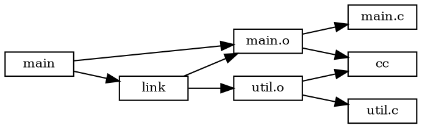

# 子命令与工具

Ninja 提供了丰富的辅助工具，通过 `-t <tool>` 参数访问。这些工具用于查询构建状态、生成编译数据库、可视化依赖图、清理产物等。此外，`-d` 选项提供调试功能。

## -t 子命令总览

通过 `-t` 调用 Ninja 内置工具：

```bash
ninja -t <tool> [options...] [targets...]
```

可用的工具：

| 工具 | 用途 |
|------|------|
| `clean` | 清理构建产物 |
| `compdb` | 生成 `compile_commands.json` |
| `graph` | 输出 GraphViz DOT 格式依赖图 |
| `targets` | 列出所有构建目标 |
| `commands` | 列出所有命令 |
| `query` | 查询目标的依赖/被依赖关系 |
| `deps` | 查看缓存的头依赖 |
| `inputs` | 列出目标的输入文件 |
| `rules` | 列出所有规则 |
| `recompact` | 压缩日志文件 |
| `restat` | 更新所有 mtime（不执行命令） |
| `missingdeps` | 扫描缺失的依赖 |
| `browse` | 启动 HTTP 浏览服务器 |
| `clean dead` | 清理死文件（不再被任何构建边引用的文件） |
| `cleandead` | 同 `clean dead`（旧版别名） |
| `urtle` | （部分版本）URTLE 格式输出 |

## -t clean：清理构建产物

`clean` 工具移除构建产生的文件：

```bash
# 清理所有构建产物
ninja -t clean

# 清理特定目标的产物
ninja -t clean main.o util.o

# 清理死文件（在 build.ninja 中不再被引用的产物文件）
ninja -t clean dead
# 或
ninja -t cleandead
```

### clean 工作原理

Ninja 遍历构建图中所有 Edge 的 outputs_，对每个输出文件：
1. 如果文件存在，删除它
2. phony 规则的输出（虚拟目标）被跳过
3. `.ninja_log` 和 `.ninja_deps` 不被删除

`clean dead` 额外扫描构建目录中存在但不在任何 Edge 的 outputs_/implicit_outs_ 中的文件，这些通常是旧版构建规则遗留的产物。

### 清理 vs 重新构建

```bash
# 完全清理后重新构建
ninja -t clean && ninja

# 只清理特定目标及其下游
ninja -t clean main.o && ninja main

# 清理死文件（不会清理活跃产物）
ninja -t clean dead
```

## -t compdb：生成编译数据库

`compdb` 生成 `compile_commands.json`，这是 Clang 工具链（clangd、clang-tidy 等）使用的编译数据库：

```bash
# 为所有规则生成编译数据库
ninja -t compdb > compile_commands.json

# 只为特定规则生成（如 C 和 C++ 编译规则）
ninja -t compdb cc cxx > compile_commands.json
```

### 输出格式

```json
[
  {
    "directory": "/path/to/build",
    "command": "gcc -Wall -O2 -c src/main.c -o build/main.o",
    "file": "src/main.c",
    "output": "build/main.o"
  },
  ...
]
```

### 常见用法

```bash
# CMake 项目通常自动生成 compile_commands.json，但也可以手动生成
cd build
ninja -t compdb CC CXX > compile_commands.json

# 配合 clangd 使用
ln -s build/compile_commands.json compile_commands.json
```

`compdb` 只输出有命令的 Edge 的信息（排除 phony 规则）。你需要指定要包含哪些规则（如 `cc`、`cxx`），不指定则输出所有规则。

## -t graph：可视化依赖图

`graph` 以 GraphViz DOT 格式输出目标的依赖图：

```bash
# 输出 main 目标的依赖图
ninja -t graph main > graph.dot

# 使用 GraphViz 渲染为 PNG
ninja -t graph main | dot -Tpng -o graph.png

# 渲染为 SVG（更清晰）
ninja -t graph main | dot -Tsvg -o graph.svg

# 输出所有目标的依赖图（可能很大！）
ninja -t graph all > full_graph.dot
```

### 输出示例



### 实用组合

```bash
# 只看特定深度的依赖（使用 graphviz 的 depth 限制）
ninja -t graph main | dot -Tpng -Grankdir=BT -o graph.png

# 大型项目：只看直接依赖
ninja -t graph main | head -50
```

## -t targets：列出所有目标

```bash
# 列出所有目标（输出：目标名: 规则名）
ninja -t targets

# 列出所有目标（带深度信息）
ninja -t targets depth 1

# 列出所有目标（带规则和依赖信息）
ninja -t targets all
```

输出示例：

```
main: phony
main.o: cc
util.o: cc
main: link
build.ninja: RERUN_CMAKE
```

## -t commands：列出所有命令

```bash
# 列出构建特定目标需要执行的所有命令
ninja -t commands main

# 列出所有命令
ninja -t commands
```

输出是完全展开的命令行（变量已替换），每行一个命令。这对于调试或导出构建命令很有用。

## -t query：查询依赖关系

`query` 工具查询一个目标的输入依赖和反向依赖（哪些目标依赖它）：

```bash
# 查询 main.o 的依赖
ninja -t query main.o
```

输出示例：

```
main.o:
  input: main.c
  input: main.h
  input: util.h
  output: main
main:
  input: main.o
  input: util.o
```

`query` 同时显示**输入依赖**（此目标依赖什么）和**输出依赖**（什么目标依赖此目标）。这对于理解修改某个文件会影响哪些目标非常有用。

```bash
# 修改 util.h 前查看影响范围
ninja -t query util.h
```

## -t deps：查看缓存的头依赖

查看 DepsLog 中缓存的头文件依赖：

```bash
# 查看 main.o 的缓存头依赖
ninja -t deps main.o

# 查看所有目标的缓存依赖
ninja -t deps
```

输出示例：

```
main.o: #deps 5, deps mtime 1234567890
    /usr/include/stdio.h
    /usr/include/stdlib.h
    main.h
    util.h
    main.c
```

这对于验证 depfile 是否正确加载、检查发现了哪些头文件非常有用。如果输出显示 `#deps 0` 或缺少预期的头文件，说明 depfile/deps 配置有问题。

## -t inputs：列出目标的输入

```bash
# 列出构建 main 所需的所有输入文件（递归）
ninja -t inputs main
```

这会递归遍历所有依赖（包括头文件），列出所有输入文件的完整路径。

## -t rules：列出所有规则

```bash
# 列出所有规则及其属性
ninja -t rules
```

输出示例：

```
cc:
  command = gcc $cflags -c $in -o $out
  description = CC $out
  depfile = $out.d
  deps = gcc
link:
  command = gcc $in -o $out
  description = LINK $out
  pool = link_pool
phony:
```

## -t recompact：压缩日志文件

```bash
# 压缩 .ninja_log 和 .ninja_deps
ninja -t recompact
```

BuildLog 和 DepsLog 采用追加写入策略，旧记录不会立即删除。长时间使用后日志文件会变大。`recompact` 重写日志文件，只保留每个输出的最新记录：

- BuildLog：保留每个输出的最新命令记录
- DepsLog：保留每个输出的最新依赖记录
- 删除已不存在的输出的记录

通常不需要手动运行——Ninja 会在日志过大时自动 recompact。但如果手动删除了很多构建产物，可以运行此命令清理日志。

## -t restat：更新所有 mtime

```bash
# 将所有构建产物的 mtime 更新为当前时间，不执行任何命令
ninja -t restat
```

这相当于假装所有目标都是最新构建的（touch 所有输出），但不实际执行命令。用于：
- 修改了 build.ninja 但不想触发重建
- 从其他地方复制了构建产物，需要更新 mtime 使其被认为是最新的
- 调试增量构建问题

> ⚠️ **警告**：这会破坏增量构建的正确性——它让 Ninja 认为所有目标都是最新的，即使它们实际上不是。谨慎使用。

## -t missingdeps：扫描缺失依赖

```bash
# 扫描可能缺少的依赖
ninja -t missingdeps
```

此工具通过分析构建日志检测潜在的缺失依赖。如果发现某个文件在构建过程中被读取但没有出现在任何依赖列表中，它可能是一个缺失的隐式依赖。用于调试构建问题。

## -t browse：HTTP 浏览服务器

```bash
# 启动 HTTP 服务器浏览依赖图
ninja -t browse
# 默认端口：8000
# 浏览器打开 http://localhost:8000
```

`browse` 启动一个简单的 HTTP 服务器，提供 Web 界面浏览构建目标、依赖关系和构建状态。适合在大型项目中交互式探索构建图。

```bash
# 指定端口
ninja -t browse --port=8080

# 指定绑定地址
ninja -t browse --hostname=0.0.0.0
```

browse 工具的源码在 `src/browse.py`（一个 Python 脚本），在 Windows 上可能需要 Python 环境。

## -d 调试选项

`-d` 选项启用调试模式：

```bash
ninja -d <debug_option>
```

| 选项 | 说明 |
|------|------|
| `-d explain` | 解释每个目标为什么被重建（调试增量构建） |
| `-d stats` | 构建结束后打印性能统计信息 |
| `-d keeprsp` | 构建后保留 rspfile（不删除） |
| `-d keepdepfile` | 构建后保留 depfile（不删除） |

多个 `-d` 选项可以组合使用：

```bash
ninja -d explain -d stats
```

### -d explain 详解

这是最常用的调试选项，解释 Ninja 做出每个构建决策的原因：

```bash
$ ninja -d explain
ninja: explain: output main.o of edge CC main.o is dirty
ninja: explain:   depfile dependency main.h is newer than main.o
ninja: explain: output main of edge LINK main is dirty
ninja: explain:   input main.o is dirty
[1/2] CC main.o
[2/2] LINK main
```

常见原因：

| 原因 | 含义 |
|------|------|
| `output doesn't exist` | 输出文件不存在 |
| `command line changed` | 命令行哈希与 BuildLog 记录不同 |
| `depfile dependency is newer than output` | 缓存的头依赖中某文件比输出新 |
| `input is dirty` | 显式输入脏了 |
| `implicit input is dirty` | 隐式依赖脏了 |
| `output is older than most recent input` | mtime 比较发现输入更新 |
| `dyndep pending` | dyndep 文件尚未加载 |

### -d stats 详解

输出构建过程的性能指标：

```bash
$ ninja -d stats
metric                  count   avg/us
stat                    150     25.3
launch child            20      1500.2
...
```

Metric 包括：
- `stat`：stat() 系统调用次数和平均耗时
- `launch child`：启动子进程次数和平均耗时
- `parse manifest`：解析 manifest 耗时
- `load build log`：加载 BuildLog 耗时
- `load deps log`：加载 DepsLog 耗时
- `start edge`：StartEdge 调用次数
- `finish edge`：FinishEdge 调用次数

这对于性能分析和瓶颈定位很有用。

## 实用命令组合

### 调试构建问题

```bash
# 1. 先 dry run 看看要执行什么
ninja -n -v

# 2. 解释为什么重建
ninja -d explain main.o

# 3. 查看头依赖
ninja -t deps main.o

# 4. 查询依赖关系
ninja -t query main.o

# 5. 检查是否有缺失依赖
ninja -t missingdeps
```

### 生成开发工具所需文件

```bash
# 生成编译数据库
ninja -t compdb cc cxx > compile_commands.json

# 生成依赖图
ninja -t graph main | dot -Tpng -o dep_graph.png

# 列出所有目标
ninja -t targets > targets.txt
```

### 维护构建目录

```bash
# 清理旧产物
ninja -t clean dead

# 压缩日志
ninja -t recompact

# 清理全部并重建
ninja -t clean && ninja
```

### CI/CD 集成

```bash
# dry run 检查构建是否为 no-op（验证增量构建正确性）
if ! ninja -n | grep -q .; then
  echo "Incremental build verified: no work to do"
fi

# 详细构建日志
ninja -v -j$(nproc)
```

## 相关概念

- [快速开始](01-getting-started.md) — 基本命令行用法
- [增量构建机制](06-incremental-build.md) — -d explain 解释的脏状态原因
- [并行执行与并发控制](07-parallel-execution.md) — -j 参数和并行调度
- [Ninja 内部实现](09-ninja-internals.md) — 日志文件格式和内部数据结构
- [主入口 API](../references/main-source.md) — 子命令在 ninja.cc 中的实现
- [日志系统 API](../references/logs-source.md) — BuildLog、DepsLog 与 recompact
