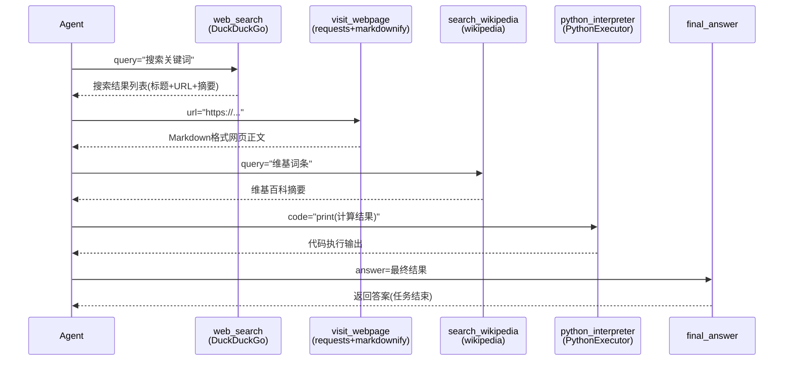

# 内置工具详解

## 概述

GodeAgents 框架提供了一组开箱即用的内置工具，覆盖了最常见的 Agent 能力需求：网页搜索、网页内容获取、维基百科查询、Python 代码执行、最终答案返回。这些工具通过 `TOOL_MAPPING` 字典统一注册，可以通过 `add_base_tools=True` 一键加载，也可以单独实例化使用。

理解内置工具的功能和依赖，是快速构建实用 Agent 的第一步。大多数场景下，你不需要从零开发工具，组合内置工具即可完成常见的信息检索、知识问答和计算推理任务。

> 事实溯源：F-120~F-125、F-018

## 核心概念

### TOOL_MAPPING 注册表

所有内置工具都注册在 `TOOL_MAPPING` 字典中，建立工具名到工具类的映射关系：

```python
TOOL_MAPPING = {
    "python_interpreter": PythonInterpreterTool,
    "web_search": DuckDuckGoSearchTool,
    "visit_webpage": VisitWebpageTool,
    "search_wikipedia": WikipediaSearchTool,
    "final_answer": FinalAnswerTool,
}
```

框架通过这个映射表在 `add_base_tools=True` 时自动创建工具实例。

> 事实溯源：F-125

### add_base_tools 自动加载

当 Agent 构造时设置 `add_base_tools=True`，框架自动将 `TOOL_MAPPING` 中的工具添加到 Agent 的工具列表中，但有一个重要区分：

- **ToolCallingAgent**：添加所有工具，**保留** `python_interpreter`
- **CodeAgent**：添加除 `python_interpreter` 外的所有工具（因为 CodeAgent 通过执行器内置 Python 能力）

这是通过 `TOOL_MAPPING` 加载时排除 `python_interpreter` 实现的，ToolCallingAgent 单独保留它。

> 事实溯源：F-018

### final_answer 的特殊地位

`final_answer` 工具始终存在于 Agent 的工具字典中，无需手动添加。框架在 `_setup_tools()` 中通过 `self.tools.setdefault("final_answer", FinalAnswerTool())` 确保它一定存在——即使用户传入空工具列表，final_answer 也会被自动注入。它是 Agent 结束任务、返回最终答案的唯一出口。

## API 要点

### FinalAnswerTool

```python
class FinalAnswerTool(Tool):
    name = "final_answer"
    description = "提供任务的最终答案，一旦调用此工具任务即结束"
    inputs = {
        "answer": {
            "type": "any",
            "description": "最终答案的内容，可以是任意类型",
        }
    }
    output_type = "any"

    def forward(self, answer: Any) -> Any:
        return answer
```

**关键特性**：
- **始终自动注入**：通过 `setdefault` 保证存在，不需要手动添加
- **终止循环**：ToolCallingAgent 中调用此工具直接返回答案；CodeAgent 中对应的 `final_answer()` 函数抛出 `FinalAnswerException` 终止执行
- **参数类型为 any**：接受字符串、数字、字典、列表等任意类型作为答案

> 事实溯源：F-121、F-115

### PythonInterpreterTool

```python
class PythonInterpreterTool(Tool):
    name = "python_interpreter"
    description = "执行Python代码并返回结果"
    inputs = {
        "code": {
            "type": "string",
            "description": "要执行的Python代码字符串",
        }
    }
    output_type = "string"

    def forward(self, code: str) -> str:
        # 调用 python_executor 执行代码
        ...
```

**关键特性**：
- **仅 ToolCallingAgent 默认包含**：CodeAgent 不添加此工具（通过执行器直接执行代码）
- **独立执行环境**：每次调用是独立的代码执行，不像 CodeAgent 的执行器保持跨步骤状态
- **forward 调用 python_executor**：底层依赖 LocalPythonExecutor 等执行器
- **依赖**: 需要 `e2b_code_interpreter` 或本地 Python 环境

> 事实溯源：F-120

### DuckDuckGoSearchTool

```python
class DuckDuckGoSearchTool(Tool):
    name = "web_search"
    description = "使用DuckDuckGo搜索引擎搜索网页，返回搜索结果摘要"
    inputs = {
        "query": {
            "type": "string",
            "description": "搜索关键词",
        }
    }
    output_type = "string"

    def forward(self, query: str) -> str:
        from duckduckgo_search import DDGS
        # 使用DDGS执行搜索，返回结果文本
        ...
```

**关键特性**：
- **功能**：通过 DuckDuckGo 搜索引擎搜索网页，返回结果标题、URL 和摘要
- **外部依赖**：`duckduckgo_search` Python 包（`pip install duckduckgo-search`）
- **网络要求**：需要能访问 DuckDuckGo 搜索服务
- **适用场景**：事实查询、最新信息检索、网页发现

> 事实溯源：F-122

### VisitWebpageTool

```python
class VisitWebpageTool(Tool):
    name = "visit_webpage"
    description = "访问指定URL的网页，提取正文内容并转换为Markdown格式"
    inputs = {
        "url": {
            "type": "string",
            "description": "要访问的网页URL",
        }
    }
    output_type = "string"

    def forward(self, url: str) -> str:
        import requests
        from markdownify import markdownify
        # 用requests获取页面，markdownify转Markdown
        ...
```

**关键特性**：
- **功能**：访问网页URL，提取正文并转换为 Markdown 格式返回
- **外部依赖**：`requests`（HTTP请求）、`markdownify`（HTML转Markdown）
- **输出格式**：Markdown 文本，保留标题、段落、链接等结构
- **典型组合**：先 `web_search` 搜索→获取URL→再 `visit_webpage` 阅读内容
- **注意**：返回的是页面的 Markdown 转换结果，不是原始 HTML；某些动态页面（JavaScript渲染）可能无法正确获取

> 事实溯源：F-123

### WikipediaSearchTool

```python
class WikipediaSearchTool(Tool):
    name = "search_wikipedia"
    description = "在维基百科中搜索条目，返回条目摘要内容"
    inputs = {
        "query": {
            "type": "string",
            "description": "要搜索的词条或关键词",
        }
    }
    output_type = "string"

    def forward(self, query: str) -> str:
        import wikipedia
        # 使用wikipedia库搜索并获取摘要
        ...
```

**关键特性**：
- **功能**：搜索维基百科条目，返回条目的摘要内容
- **外部依赖**：`wikipedia` Python 包（`pip install wikipedia`）
- **网络要求**：需要能访问 Wikipedia API
- **适用场景**：百科知识查询、概念定义、人物/事件/地点概述
- **注意**：搜索结果可能返回消歧义页面，需要结合 `web_search` 精确定位

> 事实溯源：F-124

### CodeAgent 中的 final_answer 特殊机制

在 CodeAgent 中，`final_answer` 不是作为工具被调用，而是作为 Python 执行器命名空间中的一个特殊函数。调用 `final_answer(result)` 会抛出 `FinalAnswerException`，执行器捕获此异常后设置 `is_final_answer=True`，将 `result` 作为最终答案返回。

`fix_final_answer_code()` 函数处理模型可能输出的 `final_answer = xxx`（赋值）错误，将其修正为 `final_answer_variable = xxx` 或正确的函数调用形式，确保代码执行不会出错。

> 事实溯源：F-109、F-115、F-118

## 代码示例

### add_base_tools=True 一键加载默认工具

```python
from codified_smolagents import ToolCallingAgent, HfApiModel

model = HfApiModel()

# add_base_tools=True 自动加载 web_search, visit_webpage, search_wikipedia, python_interpreter, final_answer
agent = ToolCallingAgent(
    tools=[],  # 空列表，基础工具自动添加
    model=model,
    add_base_tools=True,
    max_steps=10,
)

# Agent自动拥有搜索、访问网页、维基百科、Python解释器能力
result = agent.run("""
搜索"Python 3.12 new features"，
访问第一个结果页面，
总结Python 3.12的3个最重要新特性
""")
print(result)
```

### CodeAgent 使用 add_base_tools

```python
from codified_smolagents import CodeAgent, HfApiModel

model = HfApiModel()

# CodeAgent的add_base_tools不包含python_interpreter
# 自动加载: web_search, visit_webpage, search_wikipedia, final_answer
agent = CodeAgent(
    tools=[],
    model=model,
    add_base_tools=True,
    additional_authorized_imports=['math', 'json'],
    max_steps=15,
)

# 模型可以在代码中直接调用工具函数
# result = web_search("...")
# content = visit_webpage("...")
# summary = search_wikipedia("...")
# final_answer(summary)
result = agent.run("""
搜索维基百科中"Transformer (machine learning)"条目，
提取其中提到的关键概念数量，
用Python统计并返回结果
""")
print(result)
```

### 单独使用内置工具

```python
from codified_smolagents import DuckDuckGoSearchTool, VisitWebpageTool, WikipediaSearchTool

# 单独实例化搜索工具
search = DuckDuckGoSearchTool()
results = search(query="GodeAgents framework")
print("=== 搜索结果 ===")
print(results[:500])

# 单独实例化网页访问工具
web = VisitWebpageTool()
# 假设搜索得到了URL，访问它
# content = web(url="https://example.com/article")
# print(content[:1000])

# 单独实例化维基百科工具
wiki = WikipediaSearchTool()
entry = wiki(query="Large language model")
print("\n=== 维基百科摘要 ===")
print(entry[:500])
```

### 手动组合内置工具

```python
from codified_smolagents import (
    CodeAgent,
    DuckDuckGoSearchTool,
    VisitWebpageTool,
    HfApiModel,
)

model = HfApiModel()

# 只加载搜索和网页访问，不需要维基百科
agent = CodeAgent(
    tools=[
        DuckDuckGoSearchTool(),
        VisitWebpageTool(),
    ],
    model=model,
    additional_authorized_imports=['json', 're', 'textwrap'],
    max_steps=15,
)

# Agent可以先搜索，再访问页面，再提取信息
result = agent.run("""
搜索"2024 Nobel Prize in Physics winners"，
访问相关页面获取获奖者姓名和获奖原因，
以JSON格式返回结果
""")
print(result)
```

### 工具与自定义工具组合

```python
from codified_smolagents import ToolCallingAgent, DuckDuckGoSearchTool, tool, HfApiModel

@tool
def format_citation(title: str, url: str, authors: str = "Unknown") -> str:
    """将网页信息格式化为学术引用格式。

    Args:
        title: 文章标题
        url: 文章URL
        authors: 作者信息，默认Unknown

    Returns:
        格式化的引用字符串
    """
    return f"{authors}. \"{title}.\" {url}."

model = HfApiModel()

# 组合内置搜索工具和自定义格式化工具
agent = ToolCallingAgent(
    tools=[
        DuckDuckGoSearchTool(),
        format_citation,
    ],
    model=model,
    max_steps=8,
)

result = agent.run("搜索'GodeAgents github'，找到官方仓库后格式化为引用")
print(result)
```

### 查看已加载的工具

```python
from codified_smolagents import CodeAgent, HfApiModel

model = HfApiModel()
agent = CodeAgent(tools=[], model=model, add_base_tools=True)

# 查看Agent拥有的所有工具
print("=== 已加载工具 ===")
for name, tool in agent.tools.items():
    print(f"  {name}: {tool.description[:60]}...")

print(f"\n工具总数: {len(agent.tools)}")
print(f"包含python_interpreter: {'python_interpreter' in agent.tools}")  # False for CodeAgent
print(f"包含final_answer: {'final_answer' in agent.tools}")               # True
```

> 事实溯源：F-120~F-125、F-018

### 内置工具协作流程图



## 常见问题/注意事项

### 外部依赖需要单独安装

内置工具中，除了 `FinalAnswerTool` 外，其他工具都依赖额外的 Python 包：

| 工具 | 依赖包 | 安装命令 |
|------|--------|----------|
| DuckDuckGoSearchTool | duckduckgo_search | `pip install duckduckgo-search` |
| VisitWebpageTool | requests, markdownify | `pip install requests markdownify` |
| WikipediaSearchTool | wikipedia | `pip install wikipedia` |
| PythonInterpreterTool | 执行器依赖 | 默认已包含 |

未安装依赖包时调用对应工具会抛出 `ImportError`。

### web_search 返回的是摘要不是完整页面

`DuckDuckGoSearchTool` 返回的是搜索结果列表（标题、URL、简短摘要），不是网页全文。要获取完整内容，需要将 URL 传给 `visit_webpage` 工具。典型的"搜索→阅读"模式是：先用 `web_search` 找到相关 URL，再用 `visit_webpage` 获取正文。

### visit_webpage 对动态页面有限制

`VisitWebpageTool` 使用 `requests.get()` 获取页面 HTML，然后用 `markdownify` 转换。这意味着：
- **纯服务端渲染页面**：能正确获取内容
- **JavaScript 渲染页面（SPA）**：只能获取空壳 HTML，无法获取动态内容
- **需要登录/付费墙的页面**：无法访问

对于需要 JavaScript 渲染的页面，需要自行开发基于 Playwright/Selenium 的自定义工具。

### python_interpreter 的状态不连续

在 ToolCallingAgent 中使用 `python_interpreter` 工具时，每次调用都是独立的执行——第一步定义的变量在第二步不可用。如果需要跨步骤保持计算状态，应使用 CodeAgent（其执行器的 state 字典在步骤间保持）。

### final_answer 不需要参数校验

`FinalAnswerTool` 的 `answer` 参数类型是 `"any"`，接受任意类型。ToolCallingAgent 解析到 `final_answer` 工具调用时，直接将 arguments 中的 answer 值作为结果返回，不再执行其他工具调用。

### 工具命名冲突

Agent 在 `_setup_tools()` 中会检查 `tools` 和 `managed_agents` 是否有同名项，如果有重名会抛出错误。内置工具名（`web_search`、`visit_webpage`、`search_wikipedia`、`python_interpreter`、`final_answer`）是保留名，自定义工具应避免使用这些名称。

### 搜索结果质量取决于查询表述

DuckDuckGo 搜索的质量很大程度上取决于查询词的选择。在提示模板中，框架会指导模型构造有效的搜索查询，但对于专业领域或模糊需求，可能需要多次搜索才能找到相关结果。使用 `planning_interval` 可以帮助 Agent 在搜索前制定策略。

## 相关链接

- [工具系统：@tool装饰器与Tool基类](07-tool-system.md) — 开发自定义工具的方法
- [ToolCallingAgent：函数调用范式](05-tool-calling-agent.md) — 内置工具在ToolCallingAgent中的使用
- [CodeAgent：代码执行范式](06-code-agent.md) — 内置工具在CodeAgent命名空间中的使用
- [Tools API 参考](../references/tools-api.md) — 内置工具完整API
