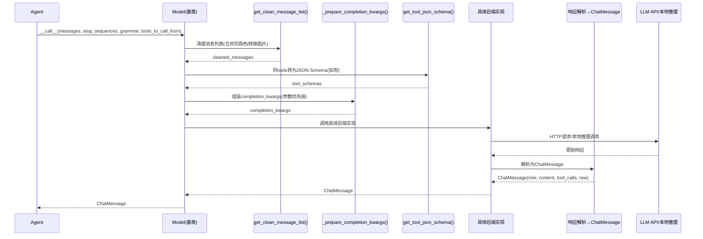

# 模型抽象层与多后端

## 概述

模型抽象层是 GodeAgents 框架对接不同 LLM 提供商和推理后端的统一接口。框架定义了 `Model` 基类，约定了所有模型必须实现的 `__call__` 方法签名和消息格式，同时提供了 8 种开箱即用的模型后端实现，覆盖云端 API（HuggingFace、LiteLLM、OpenAI、Azure、AWS Bedrock）和本地推理（Transformers、vLLM、MLX）。

无论使用哪种后端，Agent 的代码完全不变——只需切换 Model 实例即可。这种统一抽象使得在不同模型之间切换成本极低，开发调试用云端 API，生产部署切换到本地高性能推理，无需修改 Agent 逻辑。

> 事实溯源：F-061~F-081

## 核心概念

### Model 基类统一接口

所有模型后端都继承自 `Model` 基类，核心是一个统一的 `__call__` 方法：

```python
class Model:
    def __call__(
        self,
        messages: List[Dict[str, Any]],
        stop_sequences: Optional[List[str]] = None,
        grammar: Optional[Dict[str, str]] = None,
        tools_to_call_from: Optional[List[Tool]] = None,
        **kwargs,
    ) -> ChatMessage:
        ...
```

这个方法接收消息列表和可选参数，返回一个 `ChatMessage` 对象。子类（具体后端）负责将统一格式的请求转换为各自 API 的格式，并将响应统一转换为 `ChatMessage` 返回。

> 事实溯源：F-063

### ChatMessage 统一响应格式

模型的输出统一为 `ChatMessage` 数据类：

```python
@dataclass
class ChatMessage:
    role: MessageRole           # 消息角色
    content: Optional[str] = None           # 文本内容
    tool_calls: Optional[List[ChatMessageToolCall]] = None  # 工具调用列表
    raw: Optional[Any] = None               # 原始响应对象（后端特有）
    usage_logs: Optional[Any] = None        # Token使用日志
```

其中 `ChatMessageToolCall` 结构为：
```python
@dataclass
class ChatMessageToolCall:
    function: ChatMessageToolCallDefinition  # name + arguments
    id: str                                   # 调用ID
```

```python
@dataclass
class ChatMessageToolCallDefinition:
    name: str           # 工具名
    arguments: Any      # 工具参数（通常是JSON字符串或字典）
```

> 事实溯源：F-062

### MessageRole 枚举

```python
class MessageRole(Enum):
    USER = "user"
    ASSISTANT = "assistant"
    SYSTEM = "system"
    TOOL_CALL = "tool-call"
    TOOL_RESPONSE = "tool-response"
```

这五种角色覆盖了 Agent 与模型交互的全部消息类型：系统提示、用户输入、模型回复、工具调用请求、工具执行结果。

> 事实溯源：F-061

### 消息预处理管道

Model 基类提供了两个关键的消息处理方法：

1. **`_prepare_completion_kwargs`**：处理消息清理、工具 JSON Schema 转换、参数优先级
2. **`get_clean_message_list`**：合并连续同角色消息、转换图片格式（多模态）
3. **`get_tool_call_from_text`**：从纯文本响应中解析工具调用（兼容不原生支持 function calling 的模型）

> 事实溯源：F-065、F-080、F-081

## API 要点

### Model 基类属性

| 属性 | 类型 | 说明 |
|------|------|------|
| `last_input_token_count` | int | 最近一次调用的输入 Token 数 |
| `last_output_token_count` | int | 最近一次调用的输出 Token 数 |
| `flatten_messages_as_text` | bool | 是否将消息展开为纯文本格式 |
| `tool_name_key` | str | 工具调用中工具名的键名（适配不同API格式） |
| `tool_arguments_key` | str | 工具调用中参数的键名 |

> 事实溯源：F-064

### get_token_counts()

```python
def get_token_counts(self) -> Dict[str, int]
```

返回 Token 计数字典，包含输入和输出的累计 Token 消耗量，用于成本追踪和用量监控。

> 事实溯源：F-066

### 8 种模型后端对比

| 后端 | 默认模型 | 适用场景 | 依赖 | 云端/本地 |
|------|----------|----------|------|-----------|
| **HfApiModel** | Qwen/Qwen2.5-Coder-32B-Instruct | HF Inference API 快速开始 | huggingface_hub | 云端 |
| **LiteLLMModel** | anthropic/claude-3-5-sonnet-20240620 | 多 LLM 提供商统一接口 | litellm | 云端 |
| **OpenAIServerModel** | — | OpenAI 兼容 API | openai | 云端 |
| **AzureOpenAIServerModel** | — | Azure OpenAI 服务 | openai+azure | 云端 |
| **AmazonBedrockServerModel** | — | AWS Bedrock 服务 | boto3 | 云端 |
| **TransformersModel** | — | 本地 GPU 推理 | transformers+torch | 本地 |
| **VLLMModel** | — | 本地高性能推理 | vllm | 本地 |
| **MLXModel** | — | Apple Silicon 本地推理 | mlx | 本地 |

> 事实溯源：F-067~F-078

### HfApiModel

```python
HfApiModel(
    model_id: str = "Qwen/Qwen2.5-Coder-32B-Instruct",
    # 其他参数传递给 InferenceClient
)
```

- **默认模型**：`Qwen/Qwen2.5-Coder-32B-Instruct`
- **底层**：通过 `huggingface_hub.InferenceClient` 调用 HF Inference API
- **create_client()**：返回 `InferenceClient(**client_kwargs)`
- **适用**：快速原型、零配置开始（需 HF Token）

> 事实溯源：F-069~F-070

### LiteLLMModel

```python
LiteLLMModel(
    model_id: str = "anthropic/claude-3-5-sonnet-20240620",
    # 其他参数传递给 litellm.completion()
)
```

- **默认模型**：`anthropic/claude-3-5-sonnet-20240620`
- **底层**：通过 `litellm.completion()` 调用，统一 100+ LLM 提供商接口
- **自动 flatten_messages_as_text**：对 `ollama/`、`groq/`、`cerebras/` 开头的模型自动设置 `flatten_messages_as_text=True`
- **适用**：需要在不同 LLM 提供商间灵活切换、使用 Ollama 本地模型

> 事实溯源：F-071~F-072

### OpenAIServerModel

```python
OpenAIServerModel(
    model_id: str,
    api_key: Optional[str] = None,
    api_base: Optional[str] = None,
    # 其他参数传递给 OpenAI 客户端
)
```

- **底层**：使用 `openai.OpenAI` 客户端，调用 `client.chat.completions.create(**completion_kwargs)`
- **适用**：OpenAI 官方 API、自建 OpenAI 兼容服务（如 vLLM OpenAI server、LM Studio、Ollama OpenAI API）

> 事实溯源：F-073~F-074

### AzureOpenAIServerModel

```python
AzureOpenAIServerModel(
    model_id: str,
    api_version: str,
    azure_endpoint: str,
    # 继承 OpenAIServerModel 的其他参数
)
```

- **继承**：`OpenAIServerModel`
- **额外参数**：`api_version`（API版本）、`azure_endpoint`（Azure端点URL）
- **适用**：企业级 Azure OpenAI 部署

> 事实溯源：F-075

### AmazonBedrockServerModel

```python
AmazonBedrockServerModel(
    model_id: str,
    # 其他参数传递给 boto3 客户端
)
```

- **底层**：使用 `boto3` 调用 AWS Bedrock 服务
- **适用**：AWS 生态部署、企业级合规需求

> 事实溯源：F-076

### TransformersModel

```python
TransformersModel(
    model_id: str,
    device_map: Optional[str] = None,
    torch_dtype: Optional[str] = None,
    trust_remote_code: bool = False,
    **kwargs,
)
```

- **底层**：HuggingFace Transformers 库
- **模型加载策略**：先尝试 `AutoModelForImageTextToText`（多模态模型），失败则回退到 `AutoModelForCausalLM`（纯文本模型）
- **适用**：本地有 GPU、需要完全控制模型推理、离线环境

> 事实溯源：F-067~F-068

### VLLMModel

```python
VLLMModel(
    model_id: str,
    # vLLM 特有参数
)
```

- **底层**：vLLM 高性能推理引擎
- **特点**：PagedAttention、连续批处理、高吞吐推理
- **适用**：本地生产部署、需要高并发推理

> 事实溯源：F-077

### MLXModel

```python
MLXModel(
    model_id: str,
    # MLX 特有参数
)
```

- **底层**：Apple MLX 框架
- **特点**：专为 Apple Silicon（M1/M2/M3/M4）优化，利用统一内存架构
- **适用**：Mac 用户本地开发和推理

> 事实溯源：F-078

### flatten_messages_as_text 机制

某些模型/后端（如 Ollama、Groq、Cerebras 的部分模型）不支持结构化的多角色消息格式，需要将消息列表"扁平化"为单一文本字符串。LiteLLMModel 对特定前缀的模型自动启用此特性，也可手动设置。

扁平化通常将对话历史转换为类似以下的格式：
```
System: <system_prompt>
User: <user_message>
Assistant: <assistant_message>
...
```

> 事实溯源：F-072

### 正则语法约束

框架定义了两种默认正则语法（grammar），用于约束模型输出格式：
- `DEFAULT_JSONAGENT_REGEX_GRAMMAR`：约束 ToolCallingAgent 输出合法的 JSON 工具调用格式
- `DEFAULT_CODEAGENT_REGEX_GRAMMAR`：约束 CodeAgent 输出正确格式的 Python 代码块

这些 grammar 通过 `grammar` 参数传递给模型 `__call__` 方法，帮助模型遵循预期的输出格式。

> 事实溯源：F-063

### get_tool_json_schema()

```python
def get_tool_json_schema(tool: Tool) -> dict
```

将 `Tool` 实例转换为 OpenAI function calling 标准格式的 JSON Schema，供模型后端在调用 API 时作为工具定义传递。这是连接工具系统和模型层的桥梁。

> 事实溯源：F-079

### get_clean_message_list()

```python
def get_clean_message_list(messages: List[Dict], **kwargs) -> List[Dict]
```

消息预处理函数：
- 合并连续相同角色的消息（某些 API 不支持连续同角色消息）
- 转换图片格式（多模态输入适配）
- 清理消息结构中的无效字段

> 事实溯源：F-080

### get_tool_call_from_text()

```python
def get_tool_call_from_text(text: str, tools_to_call_from: List[Tool]) -> Optional[ChatMessageToolCall]
```

从纯文本响应中正则解析工具调用。当模型不原生支持 function calling（或在 fallback 场景下），从生成的文本中提取工具名和参数，使 ToolCallingAgent 也能兼容不支持结构化工具调用的模型。

> 事实溯源：F-081

## 代码示例

### 使用 HfApiModel（默认快速开始）

```python
from codified_smolagents import CodeAgent, HfApiModel

# 使用默认模型 Qwen/Qwen2.5-Coder-32B-Instruct
# 需要设置 HF_TOKEN 环境变量
model = HfApiModel()

agent = CodeAgent(
    tools=[],
    model=model,
    additional_authorized_imports=['math'],
    max_steps=5,
)

result = agent.run("计算 2**20 的值")
print(result)
```

### 使用 LiteLLMModel 切换不同提供商

```python
from codified_smolagents import CodeAgent, LiteLLMModel

# 使用 Claude 3.5 Sonnet（通过LiteLLM）
model = LiteLLMModel(
    model_id="anthropic/claude-3-5-sonnet-20240620",
    api_key="sk-ant-...",  # 也可通过ANTHROPIC_API_KEY环境变量设置
)

agent = CodeAgent(tools=[], model=model, additional_authorized_imports=['math'])
result = agent.run("计算斐波那契数列第30项")
print(result)

# 切换到 GPT-4o，只需改model_id
model_gpt = LiteLLMModel(
    model_id="gpt-4o",
    api_key="sk-...",  # OPENAI_API_KEY
)

# 切换到本地 Ollama 模型
model_ollama = LiteLLMModel(
    model_id="ollama/qwen2.5-coder:7b",
    # flatten_messages_as_text 自动启用
)
```

### 使用 OpenAIServerModel

```python
from codified_smolagents import CodeAgent, OpenAIServerModel

# 连接 OpenAI 官方 API
model = OpenAIServerModel(
    model_id="gpt-4o",
    api_key="sk-...",  # 或 OPENAI_API_KEY 环境变量
)

agent = CodeAgent(tools=[], model=model, additional_authorized_imports=['math'])
result = agent.run("计算 10! + 5**3")
print(result)

# 连接自建 OpenAI 兼容 API（如vLLM本地服务）
model_local = OpenAIServerModel(
    model_id="Qwen/Qwen2.5-Coder-7B-Instruct",
    api_base="http://localhost:8000/v1",
    api_key="not-needed",  # 本地服务通常不需要
)
```

### 使用 TransformersModel 本地推理

```python
from codified_smolagents import CodeAgent, TransformersModel

# 本地加载模型（需要GPU和足够的显存）
model = TransformersModel(
    model_id="Qwen/Qwen2.5-Coder-1.5B-Instruct",
    device_map="auto",       # 自动分配设备
    torch_dtype="bfloat16",  # 使用bf16节省显存
    trust_remote_code=True,
)

agent = CodeAgent(tools=[], model=model, additional_authorized_imports=['math'])
result = agent.run("2**10等于多少？")
print(result)
```

### 切换模型无需修改 Agent 代码

```python
from codified_smolagents import ToolCallingAgent, DuckDuckGoSearchTool
from codified_smolagents import HfApiModel, LiteLLMModel, OpenAIServerModel

# Agent定义完全不变
def create_agent(model):
    return ToolCallingAgent(
        tools=[DuckDuckGoSearchTool()],
        model=model,
        max_steps=5,
    )

# 开发环境：使用HfApiModel
dev_model = HfApiModel()
dev_agent = create_agent(dev_model)

# 生产环境：切换到GPT-4o
prod_model = OpenAIServerModel(model_id="gpt-4o")
prod_agent = create_agent(prod_model)

# 本地调试：使用Ollama
local_model = LiteLLMModel(model_id="ollama/qwen2.5-coder:7b")
local_agent = create_agent(local_model)
```

### Token 用量统计

```python
from codified_smolagents import CodeAgent, HfApiModel

model = HfApiModel()
agent = CodeAgent(tools=[], model=model, additional_authorized_imports=['math'])

result = agent.run("计算 1+2+3+...+100")

# 查看最近一次调用的Token用量
print(f"最近输入Token: {model.last_input_token_count}")
print(f"最近输出Token: {model.last_output_token_count}")

# 查看累计Token统计
token_counts = model.get_token_counts()
print(f"累计Token统计: {token_counts}")
```

### 不同后端创建对比示例

```python
from codified_smolagents import (
    HfApiModel,
    LiteLLMModel,
    OpenAIServerModel,
    AzureOpenAIServerModel,
    AmazonBedrockServerModel,
    TransformersModel,
    VLLMModel,
    MLXModel,
)

# ===== 云端API =====

# 1. HuggingFace Inference API（最简单）
hf_model = HfApiModel()

# 2. LiteLLM（支持100+提供商）
litellm_model = LiteLLMModel(model_id="anthropic/claude-3-5-sonnet-20240620")

# 3. OpenAI官方
openai_model = OpenAIServerModel(model_id="gpt-4o")

# 4. Azure OpenAI
azure_model = AzureOpenAIServerModel(
    model_id="gpt-4o",
    api_version="2024-08-01-preview",
    azure_endpoint="https://your-resource.openai.azure.com/",
)

# 5. AWS Bedrock
bedrock_model = AmazonBedrockServerModel(model_id="anthropic.claude-3-5-sonnet-20240620-v1:0")

# ===== 本地推理 =====

# 6. Transformers（GPU本地加载）
# tf_model = TransformersModel(model_id="Qwen/Qwen2.5-Coder-7B-Instruct", device_map="auto")

# 7. vLLM（高性能本地推理）
# vllm_model = VLLMModel(model_id="Qwen/Qwen2.5-Coder-7B-Instruct")

# 8. MLX（Apple Silicon）
# mlx_model = MLXModel(model_id="Qwen/Qwen2.5-Coder-7B-Instruct")
```

> 事实溯源：F-061~F-081

### 模型调用流程图



> 事实溯源：F-063~F-066、F-079~F-081

## 常见问题/注意事项

### 模型选择对 Agent 表现影响巨大

不同模型在工具调用、代码生成、推理能力上差异显著：
- **CodeAgent**：需要强代码生成能力的模型（如 Qwen2.5-Coder、Claude 3.5 Sonnet、GPT-4o）
- **ToolCallingAgent**：需要可靠的 function calling 能力（ Claude、GPT-4、Qwen 系列较好）
- 小模型（7B以下）在复杂多步推理中容易"迷失"或输出格式错误，建议增大 `max_steps` 或配合 grammar 约束

### HfApiModel 依赖网络和 HF Token

HfApiModel 使用 HuggingFace Inference API，需要：
1. 网络能访问 `huggingface.co`
2. 设置 `HF_TOKEN` 环境变量（免费注册 HF 账号即可获取）
3. 免费额度有限，高频使用可能受限

### LiteLLMModel 的 flatten_messages_as_text 自动启用

当模型 ID 以 `ollama/`、`groq/`、`cerebras/` 开头时，LiteLLMModel 自动设置 `flatten_messages_as_text=True`。这是因为这些后端的部分模型不支持结构化消息格式。如果使用其他后端但遇到格式错误，可以手动设置 `model.flatten_messages_as_text = True`。

### ToolCallingAgent 需要支持 function calling 的模型

ToolCallingAgent 通过 `tools_to_call_from` 传递工具 Schema，如果模型不支持 function calling（如某些小模型或基础模型），可能无法正确生成工具调用。此时有两种选择：
1. 使用 CodeAgent（不依赖 function calling）
2. 使用 LiteLLMModel + 支持 function calling 的模型

### 本地推理需要足够硬件资源

- **TransformersModel/VLLMModel**：需要 NVIDIA GPU，7B 模型约需 6-8GB 显存（int4量化），32B 模型约需 20-24GB
- **MLXModel**：Apple Silicon Mac，M1/M2 8GB 可跑 7B 模型，M2 Pro/Max 可跑更大模型
- 本地首次加载模型需要下载权重，耗时较长

### API Key 安全

API Key 优先通过环境变量设置（如 `OPENAI_API_KEY`、`ANTHROPIC_API_KEY`、`HF_TOKEN`），避免硬编码在代码中。所有 Model 子类都支持从环境变量读取 API Key。

### raw 字段保留后端原始响应

`ChatMessage.raw` 保留了后端返回的原始响应对象（如 OpenAI 的 ChatCompletion 对象），在需要访问后端特有字段（如 logprobs、finish_reason 等）时使用，但编写通用代码时应避免依赖此字段。

### stop_sequences 的重要性

Agent 调用模型时会传入特定的 `stop_sequences`（如 `["Observation:", "Calling tools:"]` 或 `["<end_code>", "Observation:", "Calling tools:"]`），这些停止序列确保模型在合适的位置停止生成，防止"编造"观察结果或代码之外的内容。自定义模型后端时必须正确实现 stop_sequences 支持。

## 相关链接

- [ToolCallingAgent：函数调用范式](05-tool-calling-agent.md) — 模型如何使用tools_to_call_from
- [CodeAgent：代码执行范式](06-code-agent.md) — 模型如何生成代码块
- [记忆系统：步骤序列](04-memory-system.md) — ChatMessage与记忆步骤的关系
- [Models API 参考](../references/models-api.md) — 所有Model子类完整API
- [Agents API 参考](../references/agents-api.md) — Agent构造中model参数的使用
