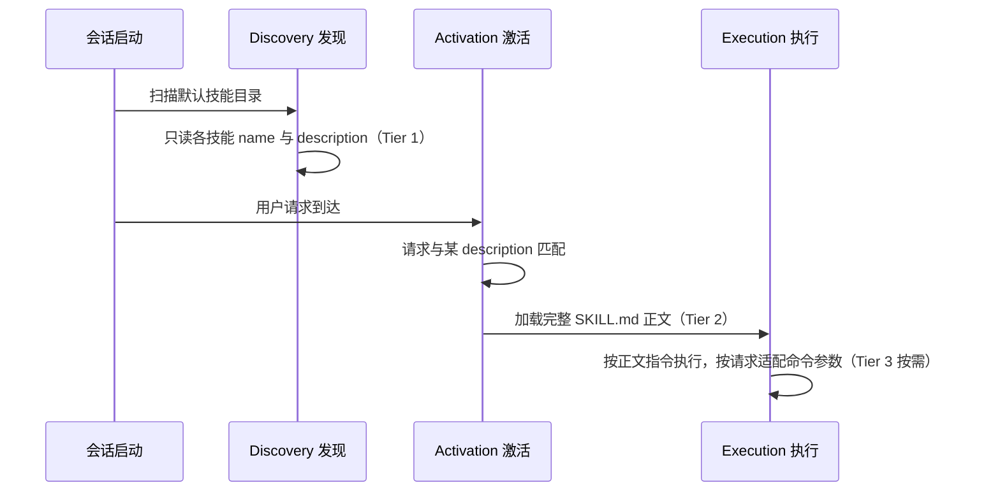

# 渐进式披露：三层加载契约与生命周期

渐进式披露（Progressive Disclosure）是 Agent Skills 的组织性原理：技能内容按"何时被需要"分层，只在需要时进入模型上下文。这解决了一个根本矛盾——智能体可能安装大量技能，但上下文窗口无法承受"每个技能都全文常驻"的成本。规范给出三阶段 token 预算（F-012），客户端实现指南给出对应的三层加载策略表（F-043），两者是同一契约的规范面与实现面。

## 三层加载契约

| 层级 | 内容 | 加载时机 | token 预算 |
|---|---|---|---|
| ① Metadata | `name` 与 `description` | 会话启动时对所有技能加载 | 每技能约 100 tokens（F-012）；客户端指南同表为约 50-100 tokens（F-043） |
| ② Instructions | 完整 `SKILL.md` 正文 | 技能被激活时 | 推荐 <5000 tokens（F-012） |
| ③ Resources | `scripts/`、`references/`、`assets/` 中的文件 | 指令引用时按需 | 开销不定（F-043） |

关键收益：装了 20 个技能的智能体不必预付 20 套完整指令的 token 成本——只付当次会话实际用到的（F-043）。

这一契约把"技能是否被使用"的决定权完全压在 Metadata 层：`description` 是唯一常驻上下文的技能表面，它写得不好，技能等于不存在（详见 [/concepts/05-description-optimization.md](/concepts/05-description-optimization.md)）。

## 技能生命周期三阶段

quickstart 文档的 "How it works" 给出运行时三步骤，并说明该过程使用 progressive disclosure（F-017）：

1. **Discovery（发现）**：会话启动时扫描默认技能目录，只读 `name` 与 `description`（F-017）。发现位置与扫描规则见 [/concepts/06-client-integration.md](/concepts/06-client-integration.md)。
2. **Activation（激活）**：用户请求与 description 匹配后，加载完整 SKILL.md 正文（F-017）。规范同面声明："the agent will load this entire file once it's decided to activate a skill"（F-010）。
3. **Execution（执行）**：按正文指令执行，按请求适配命令参数（F-017）。

## 500 行上限的由来

第二层的 5000 token 预算换算成文件体积即规范的硬性指南（F-013）：

> "Keep your main `SKILL.md` under 500 lines. Move detailed reference material to separate files."

创作指南进一步解释其目的（F-022）：主文件只放**每次运行都需要的核心指令**；详细参考材料移入 `references/` 等目录，并用"何时加载"的条件式引用衔接。过度全面的技能反而有害——智能体难以提取相关内容并可能被不适用的指令引上无产出路径（F-021）。

## 第三层的设计纪律

Resources 层的开销由作者间接控制：

- `references/` 单文件保持聚焦，"smaller files mean less use of context"（F-011）。
- 引用保持一层深，避免深层嵌套引用链（F-014）。
- 长模板或偶用模板存 `assets/` 并引用；短模板内联于 SKILL.md（F-026）。

## 常见误解

- **"description 完全匹配就一定会触发"**——错。智能体通常只在任务需要其自身知识/能力之外的东西时才查询技能；简单的单步请求（如 "read this PDF"）即使 description 完全匹配也可能不触发（F-035）。
- **"三层契约是规范强制的实现细节"**——不完全。token 预算以"推荐/约"的形式给出；规范约束的是文件格式，加载策略由客户端实现（F-043），但三层模型是全部现有实现共享的公共骨架。

## 相关概念

- [/concepts/00-skill-anatomy.md](/concepts/00-skill-anatomy.md) —— 三层各自的物理载体
- [/concepts/03-authoring-principles.md](/concepts/03-authoring-principles.md) —— 上下文经济学：在预算内决定放什么
- [/concepts/05-description-optimization.md](/concepts/05-description-optimization.md) —— 第一层唯一的文本如何优化
- [/concepts/06-client-integration.md](/concepts/06-client-integration.md) —— 三层契约的客户端实现面
- [/concepts/04-eval-driven-iteration.md](/concepts/04-eval-driven-iteration.md) —— 用评估验证预算分配是否有效
