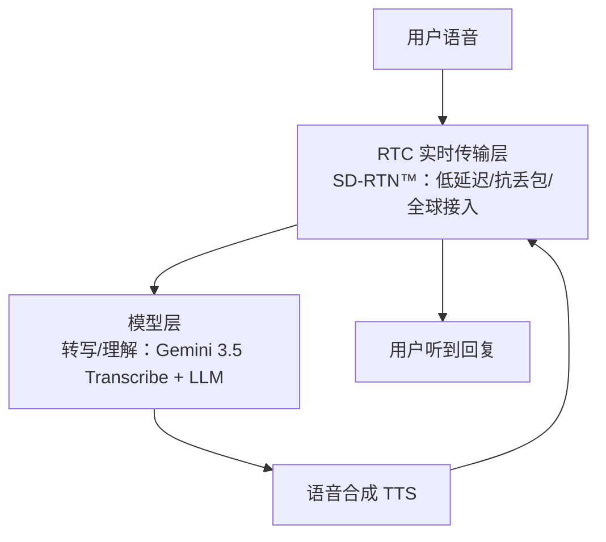

# 00 语音交互转型与 RTC 实时性门槛

> 对应事实：F-006、F-007、F-010、F-030
> 核验状态：趋势陈述✅；Agora 网络规模为厂商官方自述（背景登记）

## 从文本交互到语音交互

博文开篇给出行业判断：生成式 AI 正从**文本交互加速走向语音交互**（F-006）。文本聊天可以容忍几秒延迟、可以回看上下文、可以容忍偶发错字；语音对话则完全不同——它复刻的是人与人面对面对话的预期：对方要在你话音刚落时就听懂、接话，停顿稍长就会产生"掉线感"。

> 📝 博文观点（F-007）：模型能否在真实场景中**及时听懂用户、准确理解表达，并持续保持自然流畅的交流体验**，正成为对话式 AI 落地的关键。

## 真实场景的三道听力关

演示环境里的语音助手往往安静、标准发音、照本宣科；真实业务场景中，模型要面对的是（F-009，经核验与 Google 官方表述一致）：

1. **背景噪声**：门店、车载、工厂车间、开放办公区，人声与环境音混杂
2. **专业词汇**：行业术语、产品型号、人名地名、自定义缩写——通用词表极易听错
3. **口语停顿与表达修正**："嗯…那个…周二——不，周三吧"，人类对话充满重复、改口、语气词

这三类问题恰恰是传统 ASR（自动语音识别）的弱项：它擅长把音频逐字转成文本，却不理解"周二——不，周三"的最终意图是周三。

## 瓶颈为什么在 RTC 基础设施

即使模型足够强，语音智能体还要跨过一道工程门槛：**实时音频传输**。

- 对话式 AI 需要端到端**亚秒级**延迟链路：采集 → 传输 → 识别/理解 → 合成 → 回传播放
- 语音业务对**抖动、丢包、跨国网络质量**极度敏感——丢一个数据包可能让半个音节消失
- 全球化业务要求就近接入、跨洲传输仍保持低延迟，这不是公有云通用网络能直接保证的

博文对 Agora 一侧定位的描述是（F-010）：Agora Conversational AI 为语音智能体提供**稳定的实时音频传输、会话连接和交互基础设施**。其底座是 Agora 运营多年的 SD-RTN™（软件定义实时网络）：

| 指标 | 数值 | 来源 |
|------|------|------|
| 网络覆盖 | 200+ 国家和地区 | Agora 官方产品页（F-030，厂商自述） |
| 实时互动规模 | 约 800 亿分钟/月 | 同上 |
| 组织客户 | 1700+ | 同上 |

> ⚠️ 以上规模数字为 Agora 官方产品页自述，无第三方审计，作背景登记。

## 分层：模型负责"听懂"，RTC 负责"实时"

这篇新闻稿的隐含架构观是**能力分层**：

- **模型层**解决"听得准、理解对"（Google Gemini 3.5 Transcribe，见 [01](01-gemini-transcribe-model.md)）
- **RTC/平台层**解决"传得快、连得稳、可组合"（Agora Conversational AI，见 [02](02-agora-conversational-ai.md)）

> 📝 博文观点（F-011、F-012）：双方合作"连接了前沿模型能力与面向全球用户的实时互动体验"，让语音智能"不再停留在模型演示阶段，而是能够更快进入真实的产品与业务场景"。此为厂商叙述，但其分层逻辑与业界 Voice Agent 架构实践一致。

下一篇进入模型层：Gemini 3.5 Transcribe 到底带来了什么。
