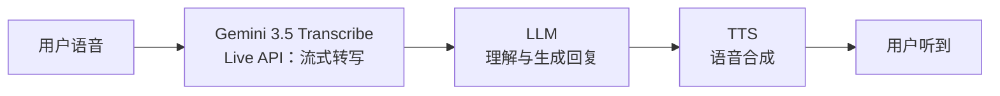

# 01 Gemini 3.5 Transcribe 模型与双 API

> 对应事实：F-008、F-009、F-019、F-020、F-025~F-028
> 核验状态：✅ 全部经 Google 官方博客/DeepMind 模型页/官方文档核验；性能数字为 Artificial Analysis 第三方测评（官方引述）

## 发布：博文前一天的 Google 新模型

Gemini 3.5 Transcribe 由 Google 于 **2026-08-26** 在官方博客发布《Intelligent transcription with Gemini 3.5 Transcribe》，CEO Pichai 在 X 上宣布，Google 称其为"迄今最精确的语音转文本模型"（F-025）。Agora 博文于次日（2026-08-27 17:35）即宣布集成——这是一篇典型的"借势发布"厂商稿。

它是 Google 上一代语音模型 **Chirp 3** 的继任者，定位为面向智能语音交互的新一代实时语音转写模型（F-008）。

## 双 API：实时流式 vs 预录音

模型提供两套 API，分别对应两类业务形态（F-026）：

| 维度 | Live API | Interactions API |
|------|----------|------------------|
| 模型 ID | `gemini-3.5-transcribe-live` | `gemini-3.5-transcribe` |
| 形态 | 双向流式，亚秒级延迟 | 预录制音频整段/分段处理 |
| 典型场景 | 实时字幕、语音输入、Voice Agent 实时对话 | 会议录音、通话录音、媒体内容转写 |
| 特色能力 | 边说边转、低延迟 | **说话人归属**（diarization）、**词级时间戳** |
| 获取方式 | Google AI Studio、Gemini Enterprise Agent Platform 公开预览 | 同左 |

> 试用入口：AI Studio Live（`aistudio.google.com/live?model=gemini-3.5-transcribe-live`）。

这一划分对集成者很关键：**Agora 语音智能体在对话回路中用 Live API；而通话结束后的质检、纪要、CRM 录入场景用 Interactions API**——后者的说话人归属和词级时间戳是结构化归档的前提。

## 性能数字（第三方测评，非厂商自宣）

| 指标 | 数值 | 来源 |
|------|------|------|
| 平均 WER（流式） | **4.0%** | Artificial Analysis（Google 官方博客引述，F-027） |
| 平均 WER（非流式） | **2.6%** | 同上 |
| FLEURS 多语言基准（流式/非流式） | 5.50% / 5.04% | Google 官方博客 |
| 最终转录延迟 | 较 Chirp 3 快 **70%** | Artificial Analysis（F-028） |
| 语言支持 | **85+ 语言**，自动检测，含方言口音 | Google 官方 |

> WER（Word Error Rate，词错误率）越低越好；4.0%/2.6% 意味着每 100 个词约 4 个/2.6 个错词，已接近人工转写水平。注意这些数字是 Google 官方博客引述的 Artificial Analysis 测评，**不是 Agora 自宣，也不是本博文提供的**——博文本身不含任何性能数字。

## 真实场景能力：抗噪、专业词、口语修正

博文称该模型"可以更好地应对背景噪声、专业词汇、口语停顿和表达修正等复杂情况"（F-009），与 Google 官方博客表述一致。对应机制包括：

- **自定义词表（custom vocabulary）**：适配专业术语/产品名/人名，最多 **1000 词**，官方建议 100 词以内效果更佳（F-028）
- **Smart Transcription**：自动清理口语现象（详见 [03](03-smart-transcription-scenarios.md)）
- **说话人归属**：预录音最多 **3 名说话人**（3+ 为实验性支持）
- **参考价格**：流式约 $0.009/分钟、非流式约 $0.005/分钟（Google 参考价）

## 与对话式 AI 的关系

需要厘清一个边界：Gemini 3.5 Transcribe 是**语音转文本（STT/ASR）模型**，不是端到端语音对话模型。在 Voice Agent 链路中它承担"耳朵"角色：

Google 另有端到端多模态模型（如 Gemini Live native audio，Agora 文档中的 `gemini-live-2.5-flash-native-audio`）走"直接音频进、音频出"路线——两种架构的取舍见 [02 Agora 开放集成架构](02-agora-conversational-ai.md)。
