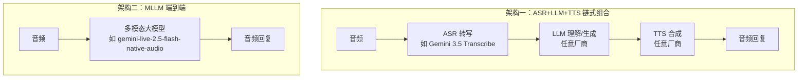

# 02 Agora Conversational AI 开放集成架构

> 对应事实：F-001~F-005、F-013~F-017、F-029~F-031
> 核验状态：✅ Agora 官方文档/新闻稿/产品页交叉佐证；P0-5"全球首个"措辞为 ⚠️

## 合作事件

2026-08-27，声网（Agora 官方中文品牌）宣布与 Google Gemini 达成合作，发布 **Gemini 3.5 Transcribe 与 Agora Conversational AI 的集成方案**（F-001、F-002），目标是帮助企业打造自然、实时、可规模化落地的语音智能体（F-003）。开发者可在 **Agora Agents SDK** 中使用 Gemini 3.5 Transcribe，并根据业务需求**灵活组合大语言模型与语音合成（TTS）服务**（F-013、F-014）。

这不是 Agora 第一次与前沿模型厂商合作：

| 时间 | 事件 |
|------|------|
| 2024-10 | OpenAI Realtime API 公测，Agora 即为语音 API 合作方 |
| 2025-09-04 | Agora 宣布对 OpenAI Realtime API 支持 GA（自动问候、混合模态、选择性注意力锁定）；Realtime API 是**首个内置进 Agora 平台的 MLLM**（F-029） |
| 2026-05-07 | Agora 官方博客发布 Gemini 3.1 Flash 语音 Agent 教程 |
| 2026-07-30 | Agora 文档上线 Google Gemini Live (Vertex AI) 集成页 |
| 2026-08-27 | 宣布集成 Gemini 3.5 Transcribe |

> ⚠️ **措辞勘误（P0-5 / F-029）**：博文称与 OpenAI 合作推出"**全球首个 Realtime API**"。合作事实真实，但 Realtime API 本身是 **OpenAI 的产品**，Agora 是首发语音合作/集成方；准确表述应为"全球首批/首发合作集成 Realtime API 的实时互动平台"。

## Agora Conversational AI 是什么

Agora Conversational AI（产品名 Conversational AI Engine）是构建在 SD-RTN™ 实时网络之上的语音 Agent 平台（F-010、F-030），核心组件：

- **Agents SDK**：多语言开发套件——Python（包名 `agora_agent`）、TypeScript（`agora-agents`）、Go（`agora-agents-go`）（F-031）
- **会话连接与音频管道**：VAD 语音活动检测（server_vad / agora_vad）、打断处理、回声消除
- **模型无关的集成层**：支持任意 LLM + ASR/TTS 组合

## 两种语音 Agent 架构

Agora 文档中的语音 Agent 支持两条技术路线（F-031）：

- **链式（ASR+LLM+TTS）**：每个环节可独立替换——本次集成的 Gemini 3.5 Transcribe 即担任 ASR 环节，LLM/TTS 自由选择。优点是可组合、可针对每环节选最优；缺点是链路延迟由三段叠加
- **MLLM 端到端**：音频直接进、音频直接出（如 Gemini Live native audio），延迟更低、语气更自然；启用 MLLM 时 Agora 会**自动禁用独立的 ASR/LLM/TTS 插件**

## 开放可组合：对两类开发者的价值

博文重点强调"开放、可组合"的定位（F-014~F-017）：

| 开发者类型 | 价值 |
|------------|------|
| 已有 AI 技术栈的团队 | 保留自有 LLM/TTS/业务逻辑，只**补齐实时交互环节**（RTC 传输+会话管道） |
| 刚进入对话式 AI 的企业 | 用 SDK 直接拼装成熟组件，更快从**原型验证走到产品上线** |

> 📝 博文观点（F-015）：开放可组合"有助于企业避免被单一技术方案绑定，并能随模型能力和业务需求变化持续迭代"。此为厂商立场陈述，但"模型无关、组件可替换"确实是 Agora 平台架构与 OpenAI/Google 双合作路线的事实特征。

## 边界提示

- Agora 公开文档目前以 **Gemini Live（Vertex AI）MLLM 集成**为主；3.5 Transcribe 作为转写组件的专属接入文档以本厂商宣布为准，公开集成页尚未见
- 博文未给出集成的可用性状态（预览/GA）、定价与 SLA 细节
- "Agents SDK 中使用 Gemini 3.5 Transcribe"的具体 API 形态需以 Agora 后续文档为准
