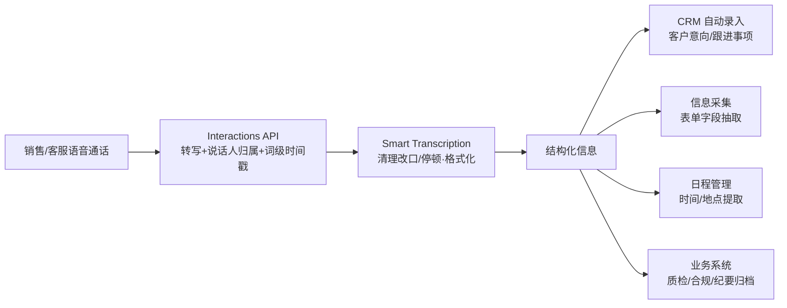

# 03 Smart Transcription 与 CRM 业务场景

> 对应事实：F-018~F-024
> 核验状态：✅ Smart Transcription 为 Google 官方已发布能力；Agora 侧为"计划支持"（未来时，措辞准确）

## 从"逐字稿"到"可直接使用的信息"

传统 ASR 输出的是**逐字稿**：把听到的每个声音都写下来，包括"嗯""啊""那个"、重复、改口。这种文本对机器和人都不友好——销售主管不想在纪要里读到"我们这个产品嗯就是说价格大概大概是三千吧"。

Gemini 3.5 Transcribe 的 **Smart Transcription** 能力（Google 官方已发布，F-019、F-020）在转写同时做语义清理：

| 原始口语 | Smart Transcription 输出 |
|----------|--------------------------|
| "嗯…那个…我们周二——不，周三开会" | "我们周三开会"（去语气词、按最终修正取意） |
| "我的电话是一三八，呃，一三零八……" | 自动归一化为数字格式 |
| 散乱的流水句 | 自动分段、日期/数字格式化 |

具体包括：自动处理**口语停顿、重复、临时改口**（自我修正，如"周二——不，周三"取周三），自动处理**数字、日期和段落格式**。Google 官方博客的例子还包括去除 ums/ahs 等填充词。

> 注意：博文表述为 Agora"**计划**进一步支持"Smart Transcription（F-018）——能力本身属于 Google 已发布能力，Agora 侧集成尚在路线图上，博文用未来时表述准确（P0-4 ✅）。

## 目标场景：CRM 与业务系统

博文点名的场景是（F-021）：为 **CRM、信息采集、日程管理和业务系统**提供"更加清晰、可直接使用的信息"。

这一组合的价值链条：

1. **转写准**（WER 2.6%~4.0% + 自定义词表适配行业术语）——见 [01](01-gemini-transcribe-model.md)
2. **转写净**（Smart Transcription 去掉口语噪声，输出规范文本）
3. **可结构化**（说话人归属区分客户/坐席，词级时间戳支持定位回放）
4. **能入系统**（Agora 管道把结果对接 CRM 等业务系统）

> 对比实时对话回路：对话中用 **Live API** 追求亚秒延迟；通话结束后的归档/分析用 **Interactions API + Smart Transcription** 追求完整准确——同一次通话，两条 API 各服务一段链路。

## 合作展望（厂商视角）

博文结尾的展望段落（📝 作者观点，F-022~F-024）：

- Agora 将继续与全球更多领先的 **AI 模型、语音服务及应用生态伙伴**深化合作——延续其"模型无关、开放集成"路线（此前 OpenAI、Google Gemini 均已合作）
- 推动对话式 AI 从"能听会说"走向**自然、实时、可靠**的智能交互
- 让 AI 成为"连接人与数字世界的新入口"

这些为厂商愿景陈述，非可核验事实；其可观察的事实基础是 Agora 已形成"RTC 网络 + Conversational AI Engine + 多模型厂商集成"的平台形态（F-029~F-031）。

## 小结：这篇新闻稿的信息内核

剥去宣传措辞，本篇的有效信息是：

1. **模型侧**：Google 2026-08-26 发布 Gemini 3.5 Transcribe，双 API、流式 WER 4.0%、85+ 语言（详见 [01](01-gemini-transcribe-model.md)）
2. **平台侧**：Agora 宣布在 Conversational AI / Agents SDK 中集成，保持 LLM/TTS 自由组合的开放架构（详见 [02](02-agora-conversational-ai.md)）
3. **场景侧**：Smart Transcription（Agora 计划支持）瞄准 CRM/信息采集等"转写结果直接入业务系统"的场景
4. **勘误**："全球首个 Realtime API"应理解为 Agora 是 OpenAI Realtime API 的首发语音合作/集成方
