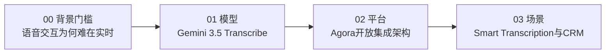

# 概念学习路径

本知识包包含 4 篇概念文档，按"背景门槛→模型能力→平台集成→场景展望"递进。

## 学习路径

| 顺序 | 文档 | 核心内容 | 预计阅读 |
|------|------|----------|----------|
| 1 | [00 语音交互转型与RTC实时性门槛](00-voice-agent-runtime.md) | 文本→语音交互转型、实时听懂三难点、RTC 基础设施与 SD-RTN™ | 5 min |
| 2 | [01 Gemini 3.5 Transcribe 模型与双 API](01-gemini-transcribe-model.md) | Live/Interactions 双 API、模型 ID、WER 4.0%/2.6%、85+语言、定价与限制 | 7 min |
| 3 | [02 Agora Conversational AI 开放集成架构](02-agora-conversational-ai.md) | Agents SDK 三语言、链式/MLLM 两架构、开放组合、OpenAI 合作时间线勘误 | 7 min |
| 4 | [03 Smart Transcription 与 CRM 场景](03-smart-transcription-scenarios.md) | 口语清理/自动排版、CRM/信息采集场景、生态合作展望 | 5 min |

## 路径图



```{toctree}
:hidden:

00-voice-agent-runtime
01-gemini-transcribe-model
02-agora-conversational-ai
03-smart-transcription-scenarios
```
