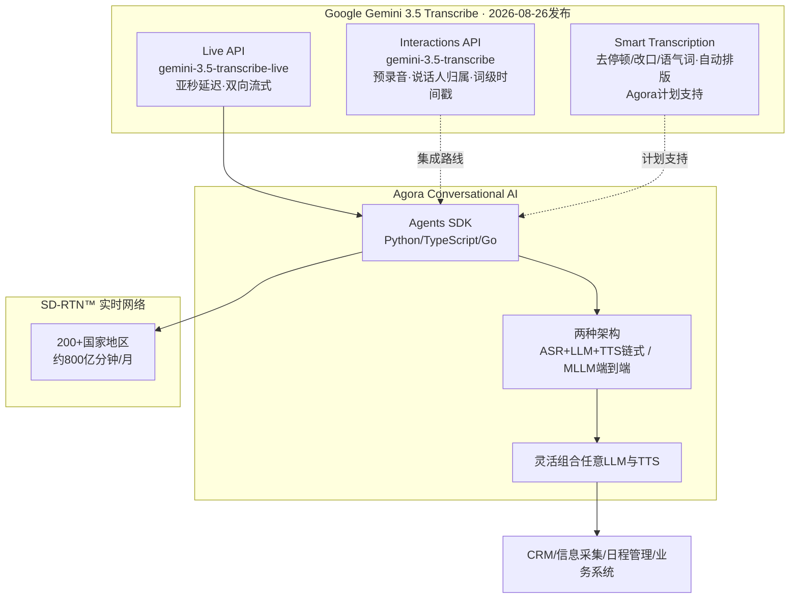

# Agora × Gemini 3.5 Transcribe

> **来源**：微信公众号"声网"（Agora 官方中文品牌，NASDAQ: API），2026-08-27 17:35 发布
> **原文**：[《Agora 携手 Google Gemini 3.5 Transcribe，共同加速对话式 AI 应用落地》](https://mp.weixin.qq.com/s/sbXT5BPvrj4CcuiyJttcgA)
> **P0核验**：6大项 5✅ 1⚠️ 0❌（详见 [verification.md](references/verification.md)）

> **⚠️ 信源性质提示**：本文为 **Agora/声网官方公众号发布的厂商自宣新闻稿**（第一人称"我们"，约千字短文），信源距离=厂商自宣。文中合作与产品声明已全部经 Google 官方博客、Agora 官方文档/新闻稿、第三方媒体三方独立佐证；博文本身**无代码、无配置步骤、无成效数字**（无"提升 X%"类自宣指标）。

> **📝 勘误（核验发现）**：博文称 Agora 与 OpenAI 合作推出"**全球首个 Realtime API**"。合作事实真实（2024-10 OpenAI Realtime API 公测时 Agora 即为语音 API 合作方，2025-09-04 GA），但 Realtime API 本身是 **OpenAI 的产品**，Agora 是首发语音合作/集成方——准确表述应为"全球首批/首发合作集成 Realtime API 的实时互动平台"。详见 F-029。

## 一句话概括

语音智能体落地的瓶颈不在"模型聪不聪明"，而在**实时性**——亚秒级听懂、抗噪、抗口语断续，以及全球范围低延迟的音频传输；Google 发布新一代转写模型 Gemini 3.5 Transcribe（流式 WER 4.0%），Agora 以 Conversational AI 平台（Agents SDK + SD-RTN™ 网络）做开放集成层，让开发者可组合任意 LLM/TTS 构建语音 Agent，并计划用 Smart Transcription 把转写结果直接喂给 CRM 等业务系统。

## 核心版图



## 知识结构

```
agora-gemini-transcribe/
├── index.md
├── concepts/
│   ├── index.md
│   ├── 00-voice-agent-runtime.md       ← 背景：语音交互转型与RTC实时性门槛
│   ├── 01-gemini-transcribe-model.md   ← 模型：Gemini 3.5 Transcribe与双API
│   ├── 02-agora-conversational-ai.md   ← 平台：Agora开放集成架构与Agents SDK
│   └── 03-smart-transcription-scenarios.md ← 场景：Smart Transcription与CRM
├── references/
│   ├── index.md
│   ├── article-source.md               ← F-001~F-032 事实登记
│   └── verification.md                 ← P0核验报告
└── log.md
```

## 分层导航

### 概念层（4篇）

1. [语音交互转型与RTC实时性门槛](concepts/00-voice-agent-runtime.md) — 文本→语音、实时听懂三难点、SD-RTN™ 网络底座
2. [Gemini 3.5 Transcribe 模型与双 API](concepts/01-gemini-transcribe-model.md) — Live/Interactions 双 API、WER 4.0%/2.6%、85+语言、定价
3. [Agora Conversational AI 开放集成架构](concepts/02-agora-conversational-ai.md) — Agents SDK 三语言、链式/MLLM 两架构、OpenAI 合作时间线勘误
4. [Smart Transcription 与 CRM 场景](concepts/03-smart-transcription-scenarios.md) — 口语清理/自动排版、CRM/信息采集场景、合作展望

### 信源层（2篇）

- [事实登记](references/article-source.md) — F-001~F-032（博文24条 + V阶段核验补充8条）
- [核验报告](references/verification.md) — 5✅1⚠️0❌ + 勘误四张清单 + 10个权威信源

## 信任与生命周期

- **事实基数**：32条（F-001~F-032，编号连续；博文事实24条含📝作者观点7条，V阶段核验补充8条）
- **P0核验**：5✅ 1⚠️ 0❌
- **status**: verified
- **stale_after**: 2026-11-30（模型与集成迭代快，3个月后复核 Agora 文档中 3.5 Transcribe 接入页是否上线、Smart Transcription 支持是否落地）

## 已知边界

1. 本文为厂商自宣新闻稿（约千字），**无代码、无配置步骤、无实测、无成效数字**，信息密度低；操作可复现性两问皆"否"，故无 examples/
2. "全球首个 Realtime API"措辞归属含糊（⚠️ P0-5）：Realtime API 为 OpenAI 产品，Agora 为 2024-10 公测时首发语音 API 合作方、2025-09 GA
3. Agora 公开文档目前以 Gemini Live（Vertex AI）MLLM 集成为主；3.5 Transcribe 作为转写组件在 Agora 侧的接入文档以厂商宣布为准，集成页面尚未见公开
4. Smart Transcription 博文用"**计划**进一步支持"未来时表述，能力本身为 Google 已发布，Agora 侧落地时间未给出
5. 模型性能数字（WER 4.0%/2.6%、快70%、85+语言）来自 Google 官方博客引述的 Artificial Analysis 第三方测评与官方基准，非 Agora 自宣；定价为 Google 参考价
6. Agora 网络规模（800亿分钟/月、200+国家地区）为厂商官方产品页自述，作背景登记

```{toctree}
:hidden:
:maxdepth: 2

concepts/index
references/index
log
```
